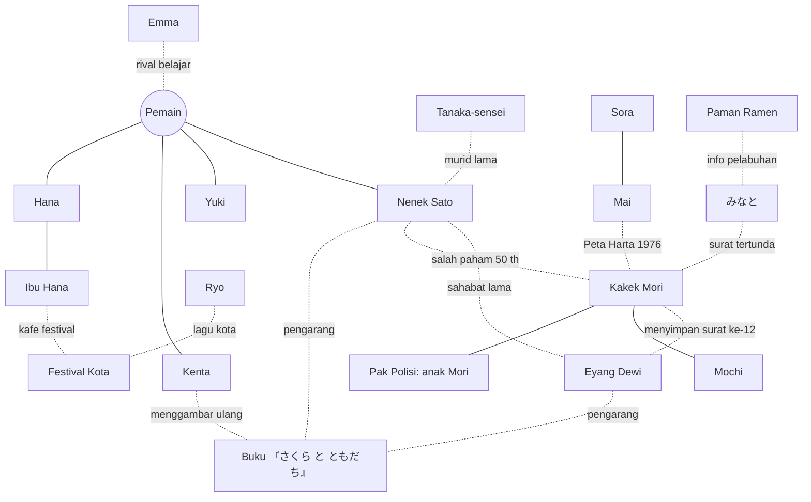

# 🌸 にほんごがっこう · Nihongo Gakkou — Dokumen Desain Lengkap v3.0

> **「さくら の てがみ」 — Surat-Surat Sakura**
> Game 3D belajar bahasa Jepang dari nol sampai **JLPT N5**, dengan satu cerita besar yang menyambungkan setiap huruf, setiap teman, dan setiap kota.

| | |
|---|---|
| **Versi dokumen** | 3.1 (desain lengkap — detail di file 02–13) |
| **Basis** | Kode v2.0 (React + TS + Three.js, Bab 1–2, 5 peta kereta) |
| **Target** | 6 bab utama + prolog + epilog ≈ **72 hari cerita**, ±15–25 menit/hari |
| **Status tiap poin** | ✅ sudah ada · 🔁 sudah ada tapi dirombak · 🆕 baru · 💡 ide jangka panjang |

> 📚 **Paket dokumen:** file ini adalah ringkasan & keputusan desain. Isi lengkap ada di:
> `02` Kanon, Prolog, Bab 1–2 · `03` Bab 3 · `04` Bab 4 · `05` Bab 5 · `06` Bab 6 · `07` Epilog · `08` Surat & Buku Bergambar · `09` Kizuna & Ending · `10` Kurikulum N5 · `11` Naskah Suara Sensei · `12` Sistem & Mini-Game · `13` Kejadian, Misi & NPC.
> Jika ada perbedaan, **file 02 (Kanon)** yang berlaku.

---

## Daftar Isi

1. [Visi & Pilar Desain](#1-visi--pilar-desain)
2. [Premis Cerita Besar](#2-premis-cerita-besar)
3. [Tokoh & Busur Cerita](#3-tokoh--busur-cerita)
4. [Peta Keterkaitan Cerita](#4-peta-keterkaitan-cerita)
5. [Struktur Bab (Prolog → Epilog)](#5-struktur-bab-prolog--epilog)
6. [Kurikulum Belajar (N5)](#6-kurikulum-belajar-n5)
7. [Dunia & Peta](#7-dunia--peta)
8. [Sistem Permainan](#8-sistem-permainan)
9. [Mini-Game](#9-mini-game)
10. [Koleksi, Hadiah & Progres](#10-koleksi-hadiah--progres)
11. [Musim, Kalender & Event](#11-musim-kalender--event)
12. [Online Bersama](#12-online-bersama)
13. [Presentasi: Visual, Musik, Suara](#13-presentasi-visual-musik-suara)
14. [Suara Asli: Sensei & Tokoh Bersuara Manusia](#14-suara-asli-sensei--tokoh-bersuara-manusia)
15. [Arsitektur Teknis & Struktur Data](#15-arsitektur-teknis--struktur-data)
16. [Roadmap Rilis](#16-roadmap-rilis)
17. [Panduan Menulis Konten](#17-panduan-menulis-konten)
18. [Ukuran Keberhasilan](#18-ukuran-keberhasilan)
19. [Lampiran](#19-lampiran)

---

## 1. Visi & Pilar Desain

### 1.1 Kalimat visi
*"Setiap huruf yang kamu pelajari membuka satu rahasia kecil di cerita, dan setiap rahasia itu mendekatkanmu pada orang-orang di Sakura-machi."*

### 1.2 Pilar
| Pilar | Artinya di dalam game | Contoh nyata |
|---|---|---|
| **Belajar = kunci cerita** | Kemampuan membaca **membuka** konten cerita, bukan sekadar syarat naik level. | Surat nenek baru bisa dibaca setelah katakana dikuasai. |
| **Semua saling berkaitan** | Tidak ada NPC "sekali pakai". Setiap tokoh sampingan punya benang ke cerita utama. | Mai (anak hilang) ternyata adik Sora; Emma muncul lagi di まち dan みなと. |
| **Salah itu aman** | Tanpa game over, tanpa hukuman. Salah = penjelasan + coba lagi. | ✅ tetap dipertahankan. |
| **Sedikit tapi sering** | 1 hari cerita = 1 sesi 15–25 menit, terasa lengkap. | ✅ tetap. |
| **Dunia yang hidup** | Musim, cuaca, rutinitas NPC, kota berubah mengikuti cerita. | Toko yang tutup di Bab 3 buka lagi di Bab 5 berkat bantuanmu. |
| **Hangat, tanpa pertarungan** | Konflik cerita berupa salah paham, kehilangan, mimpi, perpisahan — bukan musuh. | ✅ tetap. |

### 1.3 Nada cerita
Slice-of-life hangat + misteri keluarga yang lembut (setingkat *Studio Ghibli* / *Animal Crossing* / *Persona* bagian sosialnya). Ada momen haru, tetapi selalu berakhir penuh harapan.

---

## 2. Premis Cerita Besar

### 2.1 Ringkasan satu paragraf
Kamu adalah murid pindahan dari Indonesia yang tinggal bersama **Nenek Sato** di kota kecil **Sakura-machi (さくらまち)**. Di loteng rumah, kamu menemukan **kotak kayu berisi surat-surat lama** berbahasa Jepang sederhana. Surat-surat itu ditulis **nenekmu sendiri, Eyang Dewi**, untuk Sato muda, saat Dewi tinggal setahun di rumah ini (di kamarmu!) sebagai pelajar pertukaran tahun 1976. Persahabatan mereka terputus 50 tahun lalu karena satu **surat yang tidak pernah terkirim**. Sepanjang satu tahun sekolah, kamu belajar membaca, mengunjungi tempat-tempat yang disebut di surat, mengumpulkan halaman **buku bergambar 『さくら と ともだち』** yang dulu mereka buat bersama, dan akhirnya menemukan surat yang hilang itu — lalu menulis **surat balasan pertamamu dalam bahasa Jepang**.

### 2.2 Tiga lapis cerita
| Lapis | Isi | Fungsi |
|---|---|---|
| **A. Benang utama** — *Surat-Surat Sakura* | Misteri keluarga: siapa Eyang Dewi di Jepang, kenapa persahabatan terputus, di mana surat terakhir. | Tulang punggung 6 bab; alasan untuk terus maju. |
| **B. Benang teman** — *Kizuna* | Mimpi & masalah Yuki, Kenta, Hana, Sora, Emma, Ryo. | Alasan emosional untuk kembali setiap hari. |
| **C. Benang kota** — *Sakura-machi Hidup Lagi* | Kota kecil mulai sepi; festival musim panas terancam batal; pohon sakura tua di sekolah sakit. | Tujuan bersama: seluruh kota bangkit di akhir. |

Ketiga lapis **bertemu di klimaks Bab 6 & Epilog**: Surat #12 dibacakan pemain di hari Tahun Baru, telepon video ke Bandung, lalu di musim semi pohon sakura berbunga dan Eyang Dewi datang ke Sakura-machi.

### 2.3 Misteri inti (dibuka bertahap)
| # | Pertanyaan | Dijawab di |
|---|---|---|
| 1 | Siapa "Dewi" yang menandatangani surat pertama? | Akhir Bab 1 |
| 2 | Kenapa ada foto Nenek Sato & Dewi di pantai うみ? | Bab 3 |
| 3 | Kenapa Kakek Mori selalu menghindari Nenek Sato? | Bab 4 (onsen やま) |
| 4 | Apa isi buku bergambar yang halamannya tersebar? | Bab 2–6 (per halaman) |
| 5 | Kenapa surat-surat mereka tidak pernah sampai? | Bab 6 (Museum Pos & mercusuar みなと) |
| 6 | Apa arti ukiran di pohon sakura tua? | Epilog |

**Jawaban akhir (spoiler desain):** Dewi, Sato, dan Mori muda bertiga bersahabat. Maret 1977 Dewi pulang dengan kapal dari みなと; Sato demam dan tidak bisa mengantar. Mori dititipi balasan Sato (Surat #12) untuk dikirim dari kantor pos みなと, tetapi **badai salju** membuat tinta alamatnya luntur. Mori malu, berbohong "sudah kukirim", dan menyimpan surat itu 50 tahun. Sementara itu, surat Dewi dari Bandung (Surat #11) salah menulis nama prefektur dan tertahan sebagai **あてさき ふめい** di kantor pos yang kini menjadi museum. Sato mengira Dewi melupakannya; Dewi mengira Sato melupakannya. Kamu adalah jembatan yang menyambungkan mereka lagi. (Linimasa lengkap: file 02 §A.2.)

---

## 3. Tokoh & Busur Cerita

### 3.1 Tokoh utama
| Tokoh | Peran | Kepribadian | Busur cerita (arc) | Jajanan favorit | Status |
|---|---|---|---|---|---|
| **Pemain ({name})** | Murid pindahan dari Indonesia | Bisa dikustomisasi | Dari "tidak bisa baca apa pun" → menulis surat balasan dalam bahasa Jepang. | — | ✅ |
| **Nenek Sato** | Wali, tinggal serumah | Lembut, menyimpan rahasia | Belajar memaafkan masa lalu; akhirnya menelepon Eyang Dewi. | おちゃ | 🔁 |
| **Tanaka-sensei** | Wali kelas (**perempuan**, ±35 th, berkacamata) | Sabar, lucu diam-diam | Dulu murid SD Nenek Sato; menjadi guru karena beliau. Penjaga pohon sakura sekolah. | せんべい | 🔁 |
| **Yuki** | Sahabat pertama | Ceria, penakut ujian | Takut gagal ujian → berani ikut lomba pidato; bermimpi ke Indonesia. | だんご | 🔁 |
| **Kenta** | Teman sekelas | Enerjik, suka menggambar | Ingin jadi mangaka; ayahnya menolak → menang lomba manga di まち; menggambar ulang buku bergambar yang hilang. | たいやき | 🔁 |
| **Hana** | Teman (mulai Bab 2) | Pemalu, jago masak | Kafe keluarganya hampir tutup → kafe jadi pusat festival. | メロンパン | 🔁 |

### 3.2 Tokoh pendukung (semua punya benang)
| Tokoh | Sekarang | Benang baru yang menyambungkan | Bab kunci |
|---|---|---|---|
| **Kakek Mori** | Pemilik kucing Mochi | Sahabat masa muda Sato & Dewi; menyimpan surat ke-12. | 1, 4, 6 |
| **Mochi (kucing)** | Misi kucing hilang | Selalu "membawa" pemain ke petunjuk (halaman buku, kunci loteng). | Semua |
| **Sora** | Guru Kecil | Anak SD yang belajar hiragana bersamamu; kamu jadi "senpai"-nya. Kakak Mai. | 1–6 |
| **Mai** | Anak tersesat | Adik Sora; menemukan **Peta Harta 1976** (gambar Mori) terselip di buku perpustakaan. | 2, 5 |
| **Emma** | Turis tersesat | Pelajar dari Prancis, "rival belajar" yang ramah; muncul di うみ, まち, みなと. | 1, 3, 5, 6 |
| **Ryo** | Musisi jalanan | Menulis lagu tentang Sakura-machi; liriknya dilengkapi bertahap di karaoke. | 2, 4, 6 |
| **Paman Ubi** | Penjual ubi bakar | Penjaga toko lama; menyimpan foto festival 50 tahun lalu. | 4 |
| **Pak Polisi** | Patroli & dompet | Anak Kakek Mori; tahu ayahnya "menyimpan sesuatu". | 6 |
| **Ibu Hana** | Pemilik kafe | Kafe terancam tutup; pulih lewat festival. | 3 |
| **Paman Ramen** | Kedai ramen | Ketua warga; mengusulkan Pasar Pagi; mantan nelayan みなと. | 3, 6 |
| **Kak Toko Buku** | Toko buku | Menjual buku bergambar anak; di Epilog memajang buku pertama Kenta. | 2, E |
| **Nyonya Penginapan (やま)** | Onsen | Teman kecil Nenek Sato; lokasi flashback Bab 4. | 4 |
| **Biksu (てら)** | Kuil | Menyimpan ema (papan doa) bertulisan Dewi. | 5 |
| **Pak Petani (やま)** | Sawah | Mengajari panen; hadiah beras untuk festival. | 4 |
| **Koki Sushi (まち)** | Sushi putar | Juri lomba masak Hana. | 5 |

### 3.3 Tokoh baru 🆕
| Tokoh | Peran | Muncul | Fungsi |
|---|---|---|---|
| **Eyang Dewi** | Nenek pemain (Indonesia) | Surat & telepon video | Suara emosional cerita; di epilog berbicara Jepang lagi setelah 50 tahun. |
| **Sato muda / Dewi muda / Mori muda** | Kilas balik | Adegan flashback (palet sepia) | Menunjukkan persahabatan masa lalu. |
| **Ayah Kenta** | Pemilik bengkel | Bab 5 | Konflik mimpi Kenta. |
| **Pak Umi** | Kepala Museum Pos みなと | Bab 6 | Arsip surat あてさき ふめい → Surat #11. |
| **Kouhai (adik kelas)** | Murid baru di epilog | Epilog / NG+ | Kamu yang sekarang mengajari. |

### 3.4 Sistem Kizuna (keakraban) 🔁
Setiap teman punya **5 tingkat** (♥ 0 → 20). Tiap tingkat membuka 1 event pribadi; tingkat 5 membuka **ending pribadi** di epilog.

| Tingkat | ♥ | Yuki | Kenta | Hana | Sora | Emma |
|---|---|---|---|---|---|---|
| 1 | 3 | Duduk di bawah sakura ✅ | Buku sketsa ✅ | Kue kering ✅ | Belajar あいうえお bersama | Tukar tips belajar |
| 2 | 6 | Belajar untuk ujian | Tempat rahasia di atap | Resep nenek Hana | Membaca papan kota | Bertemu lagi di うみ |
| 3 | 10 | Foto bertiga ✅ | Ayah menolak | Kafe hampir tutup | Mai hilang lagi | Kangen rumah di まち |
| 4 | 15 | Lomba pidato | Lomba manga | Lomba masak | Sora mengajari Mai | Perpisahan di みなと |
| 5 | 20 | Janji ke Indonesia | Manga tentangmu | Menu "persahabatan" | Surat untuk senpai | Surat dari Prancis |

---

## 4. Peta Keterkaitan Cerita

### 4.1 Diagram hubungan


### 4.2 Benang yang menyambungkan konten yang sudah ada
| Konten lama (✅) | Disambungkan menjadi 🔁 |
|---|---|
| Misi "Kucing Hilang" (Mochi) | Saat ditemukan, Mochi membawa **kunci loteng** → awal benang surat. |
| Misi "Surat untuk Nenek" | Surat itu dari Indonesia — Eyang Dewi menanyakan kabarmu (tanpa menyebut Sato). |
| Kejadian "Anak Tersesat" (Mai) | Mai ternyata adik Sora; di Bab 2 ia memberi **Peta Harta 1976** yang menunjukkan 9 lokasi halaman buku. |
| Kejadian "Turis" (Emma) | Emma jadi tokoh berulang, teman belajar lintas peta. |
| Kejadian "Musisi" (Ryo) | Lagu Ryo = lagu karaoke yang liriknya terbuka tiap bab. |
| Kejadian "Senja di sungai" (Kakek Mori) | Mori bercerita sepotong masa lalu; petunjuk misteri #3. |
| Festival Sekolah (Hari 22) | Malamnya Surat #3 terbaca penuh & Nenek Sato mengaku soal Dewi → membuka Bab 3. |
| Peta うみ / やま / まち / てら | Setiap peta = lokasi yang disebut di satu surat + 1–2 halaman buku bergambar. |
| Buku cerita perpustakaan (6 buku) | Ditambah buku ke-7: buku bergambar yang dikumpulkan pemain. |

---

## 5. Struktur Bab (Prolog → Epilog)

### 5.0 Ringkasan
| Bab | Judul | Musim | Hari | Belajar | Peta baru | Surat | Halaman buku |
|---|---|---|---|---|---|---|---|
| 0 | Prolog: Kedatangan | Awal musim semi | 0 (tutorial) | Salam dasar (dengar) | Stasiun, rumah | — | — |
| 1 | Hiragana ✅🔁 | Musim semi 🌸 | 1–11 | 46 hiragana | Kota, sekolah, loteng | #1 | #1 |
| 2 | Katakana ✅🔁 | Akhir musim semi | 12–22 | 46 katakana | Jalan belanja, kafe | #2, #3, (#4 bonus) | #2 |
| 3 | Suara Baru & Angka 🆕 | Musim hujan ☔ | 23–34 | Dakuten, angka, harga, 14 kanji | うみ ほこら, pasar pagi | #5, #6 | #3, #4 |
| 4 | Musim Panas & Rahasia Gunung 🆕 | Musim panas 🎆 | 35–46 | Yōon, っ, bunyi panjang, posisi, 5 kanji | やま (menginap) | #7, #8 | #5, #6 |
| 5 | Karyawisata Musim Gugur 🆕 | Musim gugur 🍁 | 47–58 | Jam, hari, 〜ます, 19 kanji | てら, まち (menginap) | #9, #10 | #7, #8 |
| 6 | Pelabuhan Musim Dingin 🆕 | Musim dingin ❄️ | 59–70 | 62 kanji (total 100), pola N5 | みなと 🆕 | #11, #12 | #9, #10 |
| E | Epilog: Musim Semi Kedua 🆕 | Musim semi 🌸 | 71–72 + bebas | Ujian N5 tiruan | Semua | #13 (kamu), #14 (Emma) | Halaman 11 + sampul |

**Total: ±72 hari cerita + mode bebas.**

### 5.1 Template satu bab
Setiap bab mengikuti ritme yang sama agar mudah ditulis & diprediksi pemain:
```
Hari 1      Pembuka bab: perubahan musim, kejadian pemicu, huruf/topik baru
Hari 2–5    Pelajaran + event teman + petunjuk misteri kecil
Hari 6      ULANGAN tengah bab + kejadian lucu
Hari 7–10   Pelajaran + perjalanan ke peta bab + halaman buku
Hari 11     Persiapan event besar (festival/karyawisata/lomba)
Hari 12     UJIAN BAB + event besar + membaca surat baru (cliffhanger)
```

### 5.2 Ringkasan per bab (detail hari per hari ada di file 02–07)
| Bab | Kait pembuka | Klimaks bab | Cliffhanger |
|---|---|---|---|
| **Prolog** | Nenek Sato menatap koper batikmu: 「なつかしい」 | Makan malam pertama | Suara dari loteng terkunci |
| **1** | Sensei: "Nenek Sato dulu guruku!" | Mochi menggali **kunci**; loteng dibuka; **Surat #1** ditandatangani "Dewi" | "Dewi… itu nama Eyang?!" |
| **2** | Surat #2 penuh katakana kabur | **Peta Harta 1976** dari Mai; halaman #2 + kamera; festival sekolah | Nenek Sato: "Dewi adalah sahabatku." |
| **3** | Musim hujan; kafe Hana sepi | Kerja paruh waktu; halaman di ほこら & di balik bingkai menu kafe; **Pasar Pagi** | Surat #6: "Mori-kun mengajakku ke みなと" |
| **4** | Kata 「ちゃん」 akhirnya terbaca | Menginap di onsen; **kilas balik #1**; Sato & Mori bertengkar; Natsu Matsuri | Nenek: "Orang ketiga di foto adalah Mori-kun." |
| **5** | Lomba manga, masak, pidato diumumkan | Ema Dewi & Mori di kuil; **kapsul waktu 50 tahun** di まち; Yuki juara pidato | Surat #10: alamat Bandung + "Mori akan mengirim balasanmu" |
| **6** | Salju pertama; peta: 「白い とう」 | Museum Pos: **Surat #11**; mercusuar: **pengakuan Mori** + Surat #12; rekonsiliasi | Telepon ke Bandung: 「さと… ちゃん…？」 |
| **Epilog** | Ujian Besar N5 | Pohon sakura mekar; Eyang Dewi datang; buku lengkap | Foto berempat di うみ |

### 5.3 Surat & halaman buku
- **14 surat** (12 cerita + surat pemain + surat Emma): isi lengkap, syarat, dan token kabur di **file 08 §B–C**.
- **Buku bergambar 『さくら と ともだち』**: 10 halaman + halaman ke-11 (Kenta) + sampul, alegori tiga kelopak ハル・ミナミ・モク: **file 08 §D**.
- **Peta Harta 1976** (lokasi tiap halaman & syarat membacanya): **file 02 §A.6**.

## 6. Kurikulum Belajar (N5)

### 6.1 Peta kurikulum per bab
| Bab | Huruf | Kosakata (kumulatif) | Kanji | Tata bahasa | Percakapan |
|---|---|---|---|---|---|
| 0 | — | 10 | — | — | Salam dasar (suara saja) |
| 1 ✅ | 46 hiragana | 120 | — | 〜です, 〜は | Sapaan, perkenalan, makan |
| 2 ✅ | 46 katakana | 250 | — | 〜を ください, 〜と | Belanja, festival |
| 3 🆕 | 25 dakuten/handakuten (+katakana) | 380 | 一〜十, 百, 千, 万, 円 (14) | いくら, 〜が あります | Harga, kerja paruh waktu |
| 4 🆕 | 33 yōon + っ + ー | 500 | 上 下 中 右 左 (19) | 〜に いきます, 〜で | Arah, onsen, festival |
| 5 🆕 | — | 650 | 日 月 火 水 木 金 土 山 川 人 口 大 小 時 分 半 今 何 年 (38) | 〜ます / ません / ました | Jadwal, karyawisata |
| 6 🆕 | — | 800 | +62 → **100** | 〜たい, 〜が すき, 〜て ください, 〜から | Surat, telepon, perpisahan |
| E | — | 800+ | 100 | Ulasan penuh | Ujian N5 tiruan |

### 6.2 Metode belajar (lama & baru)
| Metode | Status | Keterangan |
|---|---|---|
| Video sensei + urutan goresan | ✅ | Dilanjutkan untuk dakuten, yōon, kanji. |
| Latihan menulis bertahap + hanko | ✅ | Ditambah mode **kanji** (radikal disorot). |
| SRS (Leitner 1-2-4-7-14) | ✅ | Diperluas ke kata & kanji, bukan hanya huruf. |
| **Membaca surat** | 🆕 | Kata yang sudah dikuasai tampil jelas; yang belum tampil kabur (blur) → motivasi visual. |
| **Latihan bicara (mikrofon)** | 🆕 | Web Speech Recognition, dengan fallback "ucapkan lalu tekan ✓". |
| **Furigana bertahap** | 🆕 | Romaji → hiragana → tanpa bantuan, otomatis sesuai penguasaan per kata. |
| **Mode dengar** | 🆕 | Dialog tanpa teks, untuk latihan choukai. |
| **Tes penempatan** | 🆕 | Lompat ke Bab 2/3 bagi yang sudah bisa kana (cerita diringkas lewat "buku harian"). |
| **Huruf rawan** | 🆕 | シ/ツ, ソ/ン, ぬ/め, わ/れ/ね → mini-latihan otomatis. |
| **Kamus bergambar** | 🆕 | Setiap kata: ilustrasi pixel, suara, contoh kalimat dari cerita. |

### 6.3 Aturan penyatuan belajar ↔ cerita
1. **Setiap surat hanya memakai materi yang sudah diajarkan** + maksimal 3 kata baru yang diberi catatan.
2. **Setiap peta baru membawa kosakata tematik** (pantai → ikan & kerang; gunung → alam & onsen; pelabuhan → kapal & pos).
3. **Papan kota berubah** mengikuti bab: di Bab 1 papan masih ada romaji kecil; di Bab 6 papan full kanji + furigana.
4. **NPC berbicara sesuai level pemain**: kalimat makin panjang seiring bab.

---

## 7. Dunia & Peta

### 7.1 Daftar peta
| Peta | Status | Dibuka | Isi utama | Peran cerita |
|---|---|---|---|---|
| Rumah Nenek Sato | ✅🔁 | Prolog | Kamar, dapur, **loteng 🆕**, taman | Markas; kotak surat |
| Sekolah SMA Sakura | ✅🔁 | Bab 1 | Kelas, atap, perpustakaan, **UKS, kantin, gym 🆕**, pohon sakura tua 🆕 | Ujian, klub, pohon |
| Sakura-machi (kota) | ✅ | Bab 1 | Konbini, taman, sungai, jalan belanja, kuil kecil | Hidup sehari-hari |
| Interior kota | ✅ | Bab 1–2 | Konbini, stasiun, kafe, ramen, toko buku, pos polisi | Adegan belajar |
| うみ (pantai) | ✅🔁 | Bab 2 akhir | Kerang, memancing, es serut | Lokasi foto sepia |
| やま (gunung) | ✅🔁 | Bab 4 | Onsen **(menginap 🆕)**, sawah, soba, jizo | Flashback musim panas |
| まち (kota besar) | ✅🔁 | Bab 5 | Penyeberangan, dept. store, sushi, karaoke, プリクラ | Lomba manga/masak |
| てら (kota kuil) | ✅🔁 | Bab 5 | Kuil, lonceng, upacara teh, rusa | Ema Dewi |
| **みなと (pelabuhan)** | 🆕 | Bab 6 | Pasar ikan, mercusuar, kantor pos tua, feri | Klimaks |
| **Kilas balik (sepia)** | 🆕 | Bab 4–6 | Versi lama kota 50 tahun lalu | Flashback |
| Rumah teman | 🆕 | Kizuna 3 | Rumah Yuki, bengkel Kenta, lantai atas kafe Hana | Event pribadi |

### 7.2 Kota yang berubah (Sakura-machi Hidup Lagi)
**Meter Kota** (0–100) naik saat pemain membantu warga. Visual kota berubah bertahap:
| Meter | Perubahan |
|---|---|
| 20 | Lampu jalan menyala lagi di jalan belanja. |
| 40 | Kafe Hana punya teras & pelanggan NPC. |
| 60 | Toko tutup di ujung jalan buka lagi (toko mainan). |
| 80 | Lentera festival terpasang permanen. |
| 100 | Seluruh kota hadir di festival Tahun Baru; lagu Ryo diputar di pengeras suara kota. |

### 7.3 Rutinitas NPC 🆕
Setiap NPC punya jadwal pagi/siang/sore/malam dan lokasi berbeda saat hujan/salju. Contoh: Kakek Mori memancing pagi, di taman siang, di sungai senja (✅ event senja).

---

## 8. Sistem Permainan

### 8.1 Alur satu hari (✅ + tambahan)
```
Pagi       Sarapan bersama Nenek → (baru) kabar misteri kecil / surat pagi
Sekolah    Sapa teman → Pelajaran 1 (video + latihan) → Makan siang → Pelajaran 2 → Klub
Sore       Bebas di kota: kejadian harian ★, misi, kerja paruh waktu 🆕, perjalanan kereta
Malam      Makan malam → (baru) membaca surat / halaman buku → Buku harian → Tidur
```

### 8.2 Sistem baru
| Sistem | Deskripsi | Terhubung ke |
|---|---|---|
| **Kotak Surat** 🆕 | Menu membaca 14 surat; kata yang belum dikuasai kabur; tombol dengar suara pengirim. | Kurikulum, cerita utama |
| **Jurnal Misteri** 🆕 | Papan petunjuk (foto, kunci, ema, cap pos) yang bisa disambungkan dengan benang merah. | Misteri inti |
| **Kerja Paruh Waktu (アルバイト)** 🆕 | Kafe Hana, konbini, pasar ikan. Menghasilkan 🌸 + Meter Kota. | Bab 3+, angka |
| **Kamar yang bisa didekorasi** 🆕 | Perabot dari toko & hadiah teman; foto kenangan di dinding. | Koleksi |
| **Kebun** 🆕 | Menanam sayur/bunga bernama Jepang; panen dipakai untuk memasak & hadiah. | Hana, festival |
| **Album Foto** 🆕 | Kamera film dari loteng; memotret momen/NPC/tempat; ada daftar "foto cerita". | Bab 2+, ending |
| **Telepon/Pesan (LINE-style)** 🆕 | Pesan singkat dari teman berbahasa Jepang sederhana; bisa dibalas dengan stempel/frasa. | Kizuna, latihan membaca |
| **Kizuna 5 tingkat** 🔁 | Lihat §3.4. | Ending |
| **Meter Kota** 🆕 | Lihat §7.2. | Benang kota |
| **Pencapaian** 🔁 | 24 → **60 lencana** (lihat §10). | Semua |

### 8.3 Kepemilikan & ekonomi
| Mata uang | Sumber | Dipakai untuk |
|---|---|---|
| 🌸 Poin sakura ✅ | Pelajaran, misi, lencana, kerja | Jajanan, hewan, baju, perabot, tiket kereta |
| 🎫 Stempel ✅ | Tempat & kegiatan | Kartu stempel → hadiah kosmetik |
| 🍥 Kupon festival 🆕 | Event musiman | Barang terbatas musiman |

Harga di game **ditulis & diucapkan dalam bahasa Jepang** (さんびゃく えん) mulai Bab 3.

---

## 9. Mini-Game

### 9.1 Daftar lengkap
| Mini-game | Status | Melatih | Muncul di |
|---|---|---|---|
| Karuta | ✅ | Mengenali huruf | Kelas, klub |
| Hujan Huruf | ✅ | Kecepatan membaca | Latihan |
| Susun Kata | ✅ | Ejaan | Klub memasak |
| Kaligrafi | ✅ | Menulis | Klub shodo |
| Belanja Konbini | ✅ | Membaca barang | Konbini |
| Benar/Salah Kilat | ✅ | Kecepatan | Latihan |
| Cari Huruf | ✅ | Pengamatan | Latihan |
| Pasangkan Kata | ✅ | Arti kata | Latihan |
| Dikte | ✅ | Mendengar | Latihan |
| Memancing | ✅ | Membaca cepat | Sungai, うみ |
| Sushi putar, lampu penyeberangan, lonceng, upacara teh, karaoke, プリクラ | ✅ | Beragam | Peta kereta |
| **Kasir Kafe** | 🆕 | Angka, kembalian | Bab 3 |
| **Taiko Ritme** | 🆕 | Membaca sesuai ketukan | Bab 4 festival |
| **Tanzaku** | 🆕 | Menulis permohonan | Bab 4 Tanabata |
| **Shiritori Kereta** | 🆕 | Kosakata berantai | Perjalanan kereta |
| **Panel Manga** | 🆕 | Menyusun dialog & urutan | Bab 5 Kenta |
| **Masak Bersama** | 🆕 | Kata kerja & urutan | Nenek, Hana |
| **Pidato** | 🆕 | Bicara (mikrofon) | Bab 5 Yuki |
| **Jadwal Kereta** | 🆕 | Jam & peron | Bab 5 まち |
| **Lelang Ikan** | 🆕 | Angka besar | Bab 6 みなと |
| **Menulis Surat** | 🆕 | Menyusun kalimat | Epilog |
| **Karuta Kanji** | 🆕 | Kanji | Bab 5–6 |

### 9.2 Aturan desain mini-game
- Maks. 60–90 detik per ronde; selalu ada tombol ✕ (✅).
- Mode santai tanpa waktu (✅) berlaku untuk semua mini-game baru.
- Setiap mini-game memberi bintang 1–3; bintang 3 di semua = lencana.

---

## 10. Koleksi, Hadiah & Progres

### 10.1 Koleksi
| Koleksi | Jumlah | Status |
|---|---|---|
| Buku Jajanan | 13 → 30 | ✅🔁 |
| Buku Makanan | 20 → 40 | ✅🔁 |
| Buku Ikan | 12 → 30 (+ ikan みなと & musiman) | ✅🔁 |
| Buku Cerita Perpustakaan | 6 → 12 + buku bergambar | ✅🔁 |
| **Surat** | 12 | 🆕 |
| **Halaman buku bergambar** | 10 + sampul | 🆕 |
| **Foto cerita** | 40 | 🆕 |
| **Kanji di kota** (papan yang dipotret) | 100 | 🆕 |
| **Omamori** | 12 (satu per bulan) | 🆕 |
| Kartu stempel | per peta | ✅ |

### 10.2 Pencapaian (24 → 60)
Kelompok baru: **Cerita** (baca tiap surat), **Kizuna** (tiap tingkat), **Kota** (Meter Kota), **Musim** (event), **Koleksi**, **Ahli** (semua bintang 3), **Rahasia** (easter egg: Mochi di 10 tempat berbeda, dll.).

### 10.3 Rapor & grafik 🆕
Grafik mingguan: huruf/kata/kanji dikuasai, ketepatan, menit belajar, hari streak; rapor bab bergaya rapor sekolah Jepang (通知表).

---

## 11. Musim, Kalender & Event

### 11.1 Kalender cerita
| Musim | Bab | Visual | Event |
|---|---|---|---|
| 🌸 Musim semi | 1–2 | Kelopak sakura (✅) | Hanami, festival sekolah (✅) |
| ☔ Tsuyu | 3 | Hujan, ajisai, siput | Pasar pagi |
| 🎆 Musim panas | 4 | Jangkrik, cahaya terik, kunang-kunang | Natsu matsuri, Tanabata, Obon |
| 🍁 Musim gugur | 5 | Momiji, bulan besar | Karyawisata, Tsukimi, lomba |
| ❄️ Musim dingin | 6 | Salju, napas beruap, kotatsu | Natal, Oomisoka, お正月 |
| 🌸 Musim semi | E | Sakura tua berbunga | Kelulusan kelas, kedatangan Dewi |

### 11.2 Event waktu nyata (live) 💡
Pasca-tamat, event mengikuti kalender asli (Tanabata 7 Juli, Tsukimi, Tahun Baru) dengan hadiah kosmetik.

---

## 12. Online Bersama

| Fitur | Status | Kaitan cerita |
|---|---|---|
| Avatar pemain lain + stempel frasa | ✅ | — |
| Emote & ojigi | ✅ | — |
| **Karuta duel 1v1** | 🆕 | Klub karuta |
| **Papan peringkat mingguan** | 🆕 | Per mini-game |
| **Tukar surat pendek** (dari frasa siap pakai) | 🆕 | Tema "surat" |
| **Festival bersama** (event server) | 💡 | Tanabata online: tanzaku semua pemain tergantung di satu pohon |
| **Kunjungan kamar** | 💡 | Dekorasi kamar |
| **Mode kelas guru** | 💡 | Guru memutar video bersama |

Keamanan tetap: tanpa teks bebas, nama disaring, rate limit (✅).

---

## 13. Presentasi: Visual, Musik, Suara

### 13.1 Visual
- ✅ HD-2D Three.js + karakter pixel.
- 🆕 **Palet per musim** (warna langit, rumput, pohon berubah).
- 🆕 **Mode kilas balik sepia** + grain film.
- 🆕 Animasi ekspresif: ojigi, melambai, menangis haru, konfeti, hati melayang.
- 🆕 Transisi kamera masuk bangunan, zoom saat dialog penting.
- 🆕 Cutscene sederhana berbasis skrip (kamera bergerak + dialog) untuk momen besar.
- 🆕 Aksesibilitas: teks besar, kontras tinggi, mode buta warna, kurangi gerakan.

### 13.2 Musik
- ✅ Musik generatif. 🆕 **Tema per tokoh** (motif pendek), **tema per musim**, dan **lagu Ryo** yang berkembang dari 1 bait → lagu penuh di klimaks.

### 13.3 Suara
- Rencana lengkap suara manusia ada di **§14**.

---

## 14. Suara Asli: Sensei & Tokoh Bersuara Manusia

> **Tujuan:** penjelasan sensei di video pelajaran dan dialog tokoh terdengar seperti **manusia sungguhan**, bukan suara TTS HP (Google/Samsung/iOS). Suara TTS perangkat tetap ada, tapi hanya sebagai **cadangan terakhir**.

### 14.1 Kondisi sekarang (hasil cek kode)
| Bagian | Cara kerja sekarang | Masalah |
|---|---|---|
| Kalimat Jepang (dialog, kana, kosakata) | `voice:export` → `voice/voice-lines.csv` (±750 baris) → rekaman MP3 di `public/audio/ja/` dipakai jika ada. | ✅ Jalur sudah ada, tapi `manifest.json` masih kosong (belum ada rekaman). |
| **Narasi sensei berbahasa Indonesia** (`narr` di `video.js`) | **Selalu** `Sound.speakLang(narr, 'id-ID')`, yaitu TTS perangkat. | ❌ Tidak ikut diekspor, jadi tidak bisa diganti rekaman. Inilah yang paling terdengar "robot". |
| Narasi dirakit acak | `pick([...])` + templat seperti `` `Ada ${n} goresan.` `` dan `Bacanya ${sayRo(ro)}` | ❌ Kalimatnya baru jadi saat video diputar, jadi tidak ada daftar kalimat tetap untuk direkam. |
| Ganti bahasa di tengah kalimat | Narasi Indonesia (suara A) → `Sound.speak(jp)` (suara B) | ❌ Suaranya berganti orang di tengah penjelasan; terdengar tidak alami. |
| Romaji dibaca TTS Indonesia | `sayRo()` mengubah "shi" → "syi" supaya TTS Indonesia bisa membaca | ❌ Pelafalannya sering meleset. |

### 14.2 Prinsip suara baru
1. **Satu sensei = satu suara manusia**, dari awal sampai akhir game, termasuk saat mengucapkan huruf Jepang di tengah kalimat Indonesia ("Huruf ini dibaca **あ**, seperti 'a' pada kata *apel*.").
2. **Direkam per potongan utuh**, bukan disambung-sambung dari potongan kecil.
3. **Diputar dari file**, bukan dibuat saat bermain → bisa offline (PWA), tanpa biaya server, dan suaranya sama di semua HP.
4. **Urutan cadangan:** rekaman manusia → suara AI yang dibuat sebelumnya (pra-render) → TTS perangkat.
5. **Naskah dulu, rekam kemudian**: semua kalimat yang diucapkan harus tertulis di file naskah, tidak dirakit acak saat bermain.

### 14.3 Tiga pilihan sumber suara
| Pilihan | Kualitas | Kelebihan | Kekurangan | Cocok untuk |
|---|---|---|---|---|
| **A. Pengisi suara manusia** ⭐ | Terbaik, paling hidup | Emosi asli, bisa diarahkan ("lebih semangat", "pelan untuk pemula"), tidak ada masalah lisensi AI | Butuh biaya & waktu; rekam ulang jika naskah berubah | Sensei, 6 tokoh utama, 12 surat, adegan klimaks |
| **B. Suara AI neural, dibuat sebelumnya** | Sangat mirip manusia (jauh di atas TTS HP) | Cepat, murah, mudah dibuat ulang saat naskah berubah, bisa jadi "suara sementara" | Emosi terbatas; wajib cek lisensi komersial; sebaiknya dicantumkan di kredit | Kalimat yang belum direkam, NPC kecil, prototipe |
| **C. TTS perangkat** ✅ | Bergantung pada HP | Gratis, sudah jalan | Terdengar robot, beda-beda tiap HP | Cadangan terakhir saja |

#### Pilihan A — tempat mencari pengisi suara manusia
| Kebutuhan | Di mana mencari |
|---|---|
| **Sensei (Indonesia + Jepang)** — idealnya **guru bahasa Jepang orang Indonesia** yang pelafalan Jepangnya bagus | Guru di LPK/lembaga kursus Jepang, dosen/alumni Sastra Jepang, pengisi suara lepas Indonesia (Fiverr, Upwork, Sribulancer, Projects.co.id), komunitas dubbing Indonesia. |
| **Tokoh Jepang** (Yuki, Kenta, Hana, Nenek Sato, Kakek Mori, dll.) | Penutur asli: Coconala / Skeb (situs Jepang), Fiverr/Upwork "Japanese native voice actor", mahasiswa Jepang di Indonesia. |
| **Eyang Dewi** | Pengisi suara Indonesia usia lanjut yang bisa bahasa Jepang sederhana. **Aksen Indonesia justru bagus untuk cerita**: ia sudah 50 tahun tidak memakai bahasa Jepang. |
| **Anak-anak (Sora, Mai)** | Pengisi suara dewasa yang biasa menyuarakan anak (lebih mudah secara izin), atau anak dengan izin tertulis orang tua. |

#### Pilihan B — layanan suara AI (dibuat sebelumnya, lalu disimpan sebagai MP3)
| Layanan | Catatan |
|---|---|
| **ElevenLabs** | Satu suara bisa berbicara bahasa Indonesia **dan** Jepang, jadi cocok untuk sensei yang mencampur dua bahasa. Bisa merancang suara baru (voice design). |
| **Microsoft Azure Neural TTS** | Suara ja-JP (mis. Nanami, Keita) dan id-ID (Gadis, Ardi); SSML untuk mengatur kecepatan, jeda, dan penekanan. |
| **VOICEVOX** | Gratis, **khusus bahasa Jepang**, banyak karakter suara anime yang cocok untuk tokoh remaja. Aturan pakai berbeda per karakter (biasanya wajib mencantumkan kredit, mis. "VOICEVOX:ずんだもん"). |
| **OpenAI TTS / lainnya** | Alternatif; kualitas bahasa Jepang dan Indonesia perlu dicoba dulu. |

> ⚠️ Harga dan aturan lisensi layanan AI sering berubah. **Cek syarat pemakaian komersial terbaru** sebelum rilis, simpan bukti lisensi di `voice/LICENSES.md`, dan tulis di layar Kredit suara mana yang manusia dan mana yang AI.
> 🚫 Jangan meniru (clone) suara orang sungguhan tanpa izin tertulis darinya.

#### Rekomendasi: gabungan (hybrid)
```
Tahap 1 (cepat) : semua narasi sensei + kana → suara AI pra-render (pilihan B) sebagai pengganti TTS HP
Tahap 2         : sensei direkam ulang oleh manusia (pilihan A); 92 kana oleh penutur asli
Tahap 3         : 6 tokoh utama + 12 surat + adegan klimaks oleh manusia
Seterusnya      : kalimat baru langsung dibuat versi AI dulu, lalu diganti rekaman manusia bertahap
```
Pemain langsung mendapat suara yang jauh lebih bagus sejak tahap 1, dan kualitasnya terus naik tanpa perlu mengubah kode.

### 14.4 Casting (daftar peran suara)
| Tokoh | Bahasa | Karakter suara | Arahan akting | Prioritas |
|---|---|---|---|---|
| **Tanaka-sensei** (perempuan) | Indonesia + Jepang | Perempuan dewasa (±35), hangat, tenang, sedikit lucu | Tempo pelan untuk pemula; senyum terdengar dalam suara; kata Jepang diucapkan jelas dengan jeda kecil sebelumnya | ⭐⭐⭐ |
| Yuki | Jepang | Remaja perempuan, ceria | Energik; gugup saat ujian | ⭐⭐⭐ |
| Kenta | Jepang | Remaja laki-laki, enerjik | Suka bercanda; serius saat bicara soal manga | ⭐⭐⭐ |
| Hana | Jepang | Remaja perempuan, pemalu | Pelan, lembut, makin percaya diri tiap bab | ⭐⭐ |
| Nenek Sato | Jepang (+ sedikit Indonesia di akhir) | Lansia, lembut | Hangat; bergetar saat membaca surat | ⭐⭐⭐ |
| Kakek Mori | Jepang | Lansia, kasar tapi baik | Pendek-pendek; menangis di mercusuar | ⭐⭐ |
| Eyang Dewi | Indonesia + Jepang beraksen | Lansia, ramah | Bahasa Jepangnya "berkarat" lalu lancar kembali | ⭐⭐ |
| Sora / Mai | Jepang | Anak-anak | Polos, semangat | ⭐ |
| Emma | Jepang beraksen asing | Remaja, percaya diri | Kadang salah kecil (membantu pemain merasa tidak sendirian) | ⭐ |
| NPC toko, stasiun, dll. | Jepang | Beragam | Ungkapan standar (いらっしゃいませ, dll.) | ⭐ |
| Suara pengumuman stasiun | Jepang | Formal | Gaya pengumuman kereta Jepang | ⭐ |

### 14.5 Mengubah narasi sensei menjadi naskah yang bisa direkam
**Masalah:** narasi sekarang dirakit acak saat video diputar. **Solusi:** narasi ditulis sebagai **naskah tetap per video** di file data.

```ts
// src/data/voice/sensei-ch1.ts  (contoh)
export const LESSON_VO: Record<string, VoLine[]> = {
  'kana_あ': [
    { id: 'sen_a_01', text: 'Huruf pertama kita hari ini: あ.', jp: 'あ' },
    { id: 'sen_a_02', text: 'Bacanya "a", seperti "a" pada kata apel. あ.' },
    { id: 'sen_a_03', text: 'Ada tiga goresan. Perhatikan urutannya, ya.' },
    { id: 'sen_a_04', text: 'Tanda salib dan lingkaran besar, seperti orang berguling sambil teriak "Aaa!"' },
    { id: 'sen_a_05', text: 'Contoh katanya: あい. Artinya "cinta".' },
  ],
};
```
- **Variasi tetap ada**, tapi ditulis semua di naskah (mis. 3 versi pembuka), lalu dipilih berdasarkan hari → semua versi bisa direkam.
- **Satu klip memuat Indonesia + Jepang sekaligus**, diucapkan oleh sensei yang sama → tidak ada lagi suara yang berganti di tengah kalimat.
- **`sayRo()` tidak dibutuhkan lagi**: manusia/AI membaca romaji dengan benar.
- ID klip tetap (`sen_a_02`), bukan hash → mengubah salah ketik di teks tidak mengharuskan rekam ulang kecuali isinya benar-benar berubah (kolom `rev` di CSV menandai klip yang perlu direkam ulang).

**Perkiraan jumlah klip narasi sensei:**
| Bagian | Hitungan kasar | Klip |
|---|---|---|
| 92 kana × ±6 klip | 552 | ±550 |
| Pembuka/penutup video × variasi | 22 hari × 3 × 2 | ±130 |
| Dakuten, yōon, angka (Bab 3–4) | — | ±300 |
| Kanji & tata bahasa (Bab 5–6) | — | ±400 |
| Pujian & semangat di kuis (すごい！, おしい！, "Hampir benar!") | — | ±60 |
| **Total sensei** | | **±1.400 klip** (±70–90 menit audio) |

### 14.6 Perubahan pipeline & kode
| Langkah | Sekarang | Baru |
|---|---|---|
| Ekspor naskah | `voice:export` → hanya kalimat Jepang | `voice:export` → **3 file CSV**: `ja-lines.csv` (dialog Jepang), `sensei-lines.csv` (narasi), `story-lines.csv` (surat & adegan) + kolom `speaker`, `emotion`, `direction` (arahan akting), `rev` |
| Folder audio | `public/audio/ja/` | `public/audio/ja/`, `public/audio/sensei/`, `public/audio/story/` + sub-folder per bab (`ch1/`, `ch2/`…) |
| Manifest | `{ files: [...] }` | `{ version, clips: { id: { file, src: 'human' \| 'ai', dur } } }` → game tahu mana rekaman manusia & berapa detik durasinya |
| Buat suara AI | — | 🆕 `npm run voice:ai` — mengambil klip yang belum punya file, membuat MP3 lewat layanan AI, menandai `src: 'ai'`. Kunci API **hanya di komputer pengembang** (`.env`, tidak ikut ke game). |
| Cek kualitas | — | 🆕 `npm run voice:check` — normalisasi volume (−16 LUFS), potong hening, laporan klip yang hilang/terlalu panjang |
| Pemutaran | `Sound.speak()` / `speakLang()` TTS | 🆕 `Voice.play(id)` → file (human > ai) → fallback TTS. Memakai Web Audio dengan cache per bab |
| Video sensei | Durasi shot tetap (`dur: 2600`) | Durasi shot **mengikuti panjang klip** (dari manifest) → subtitle & animasi kapur pas dengan suara |

**Alur kerja setelah diubah:**
```
1. Tulis/ubah naskah di src/data/voice/*.ts
2. npm run voice:export      → CSV untuk pengisi suara (+ arahan akting)
3. npm run voice:ai          → isi sementara dengan suara AI (opsional)
4. Pengisi suara merekam     → taruh file di public/audio/<folder>/
5. npm run voice:check       → rapikan volume & hening
6. npm run voice:manifest    → daftarkan; rekaman manusia otomatis menggantikan AI
7. npm run build:pages
```

### 14.7 Fitur yang membuat suara terasa hidup 🆕
| Fitur | Keterangan |
|---|---|
| **Gerak mulut (lip-flap)** | Potret/sprite sensei membuka-menutup mulut mengikuti keras-pelan suara (Web Audio `AnalyserNode`). |
| **Ekspresi mengikuti klip** | Kolom `emotion` di naskah → potret sensei tersenyum/terkejut/bangga saat klip itu diputar. |
| **Reaksi kuis bersuara** | Jawaban benar: "すごい！ Tepat sekali!"; salah: "Hampir! Coba lihat lagi, ya." — beberapa variasi agar tidak membosankan. |
| **Nama pemain** | Klip tidak menyebut nama (tidak bisa direkam untuk semua nama); tokoh memakai sapaan umum (きみ, "kamu") atau jeda alami. |
| **Kecepatan** | Tombol 0.75× / 1× di video; untuk file audio memakai `playbackRate` dengan `preservesPitch` supaya suara tidak berubah nada. |
| **Musik mengecil** | ✅ Sudah ada (duck), dipakai juga untuk file audio. |
| **Mode dengar** | Latihan mendengar memakai **rekaman manusia saja** (bukan AI/TTS) agar telinga terbiasa dengan pelafalan asli. |

### 14.8 Standar rekaman (diperbarui dari `voice/README.md`)
- **Format kerja:** WAV 48 kHz / 24-bit (disimpan di arsip, tidak ikut ke game).
- **Format game:** MP3 mono 64–96 kbps (cukup untuk suara, ukuran kecil).
- Volume rata **−16 LUFS**, puncak ≤ −1 dBTP, hening awal/akhir ±0,1 detik, tanpa gema & tanpa musik.
- Ruangan sunyi; mikrofon USB kondensor atau HP dengan mikrofon eksternal sudah cukup untuk awal.
- Rekam **3 kali tiap kalimat penting**, pilih yang terbaik.
- Bahasa Jepang: intonasi standar Tokyo (標準語), tempo sedikit lebih pelan untuk pemula.
- Bahasa Indonesia: santai tapi jelas, seperti guru les yang ramah, bukan penyiar berita.

### 14.9 Ukuran unduhan
| Bagian | Perkiraan |
|---|---|
| Narasi sensei (±1.400 klip, ±80 menit, 64 kbps) | ±35–40 MB total |
| Dialog Jepang + surat (±2.000 klip pendek) | ±25–30 MB total |

Karena itu audio **tidak diunduh sekaligus**:
- Service worker menyimpan audio **per bab** (bab yang sedang dimainkan + bab berikutnya).
- Pilihan di Pengaturan: **"Unduh semua suara untuk offline"** atau **"Hemat kuota"** (hanya kana & sensei).
- Jika file belum terunduh dan sedang offline → otomatis memakai TTS perangkat, game tidak pernah macet.

### 14.10 Prioritas rekaman
| Urutan | Isi | Alasan |
|---|---|---|
| 1 | **Narasi sensei Bab 1** (±350 klip) + 46 hiragana | Kesan pertama pemain; paling sering didengar |
| 2 | Narasi sensei Bab 2 + 46 katakana | Menyelesaikan materi yang sudah ada |
| 3 | Salam & ungkapan harian (±100 teratas di CSV) | Muncul setiap hari |
| 4 | Prolog + Surat #1–4 (dibacakan Eyang Dewi / Nenek Sato) | Momen emosional cerita |
| 5 | Dialog 6 tokoh utama Bab 1–2 | Kizuna terasa hidup |
| 6 | Bab baru (3–6) — direkam bersamaan dengan penulisan tiap bab | Mengikuti roadmap |

### 14.11 Checklist teknis suara
- [ ] Pindahkan narasi `video.js` ke naskah tetap `src/data/voice/sensei-ch1.ts` & `sensei-ch2.ts`.
- [ ] `voice:export` mengeluarkan `sensei-lines.csv` (dengan kolom `speaker`, `emotion`, `direction`, `rev`).
- [ ] Modul `Voice` baru (TypeScript): putar file → cadangan TTS; cache per bab; `preservesPitch`.
- [ ] Manifest v2 (`src`, `dur`) + durasi shot video mengikuti panjang klip.
- [ ] Skrip `voice:ai` (kunci API di `.env` pengembang) & `voice:check` (LUFS, potong hening).
- [ ] Lip-flap sensei + ekspresi per klip.
- [ ] Pengaturan: pilih "Suara asli / Suara perangkat", unduh semua suara offline.
- [ ] `voice/LICENSES.md` + daftar pengisi suara & layanan AI di layar Kredit.

---

## 15. Arsitektur Teknis & Struktur Data

### 15.1 Struktur folder yang diusulkan
```
src/
├─ main.tsx
├─ world/                 dunia 3D (✅ world3d.ts, dipecah per modul)
│  ├─ world3d.ts
│  ├─ seasons.ts          🆕 palet & partikel musim
│  └─ flashback.ts        🆕 efek sepia
├─ data/                  🆕 SEMUA konten bertipe (pindahan dari public/js/data*.js)
│  ├─ types.ts
│  ├─ characters.ts
│  ├─ kana.ts, kanji.ts, words.ts, grammar.ts
│  ├─ chapters/
│  │  ├─ ch0-prologue.ts
│  │  ├─ ch1-hiragana.ts … ch6-minato.ts
│  │  └─ epilogue.ts
│  ├─ story/
│  │  ├─ letters.ts       14 surat (file 08)
│  │  ├─ picturebook.ts   11 halaman + sampul
│  │  ├─ mysteries.ts     petunjuk & jurnal
│  │  └─ flags.ts         daftar flag cerita
│  ├─ kizuna/             event pribadi per teman
│  ├─ events.ts, quests.ts, places.ts, food.ts, fish.ts
│  ├─ achievements.ts
│  └─ voice/              🆕 naskah suara tetap (sensei-ch1.ts, …) — lihat §14.5
├─ systems/               🆕 logika murni (bisa diuji)
│  ├─ story.ts            flag, syarat, pemicu
│  ├─ voice.ts            🆕 putar file suara → cadangan TTS
│  ├─ srs.ts, kizuna.ts, townMeter.ts, calendar.ts, economy.ts
│  └─ save.ts             versi & migrasi save
├─ ui/                    komponen React
│  ├─ Friends.tsx ✅
│  ├─ LetterBox.tsx 🆕, MysteryBoard.tsx 🆕, PhotoAlbum.tsx 🆕
│  ├─ Dialog.tsx, Menu.tsx, Bag.tsx, Report.tsx (migrasi)
│  └─ minigames/…
└─ legacy.d.ts
public/audio/             🆕 ja/, sensei/, story/ per bab + manifest.json
voice/                    CSV naskah, arsip WAV (tidak ikut build), LICENSES.md
public/js/                modul lama — dipindah bertahap, lalu dihapus
server/                   server online (✅)
```

### 15.2 Tipe data inti (rancangan)
```ts
// src/data/types.ts
export type CharId = 'player' | 'obaa' | 'sensei' | 'yuki' | 'kenta' | 'hana'
  | 'ojii' | 'mochi' | 'kid' | 'mai' | 'emma' | 'ryo' | 'dewi' | string;

export type Line =
  | { n: string }                                                    // narasi
  | { w: CharId; e?: Emotion; jp: string; ro: string; id: string }   // ucapan Jepang
  | { w: CharId; e?: Emotion; t: string }                            // penjelasan
  | { q: string; o: Option[] }                                       // pilihan
  | { flag: string; value?: boolean | number }                       // 🆕 set flag
  | { cut: CutsceneStep[] };                                         // 🆕 cutscene

export interface Chapter {
  n: number; title: string; season: Season;
  days: DayDef[];
  unlocks: { maps?: MapId[]; systems?: SystemId[] };
  letters: LetterId[]; pages: PageId[];
}

export interface Letter {
  id: LetterId; from: 'dewi' | 'sato'; date: string;       // tanggal fiksi 50 th lalu
  body: Token[];                                            // token per kata → bisa dikaburkan
  requires: Requirement[];                                  // mis. { kana: 'katakana' }
  clues: ClueId[];
}

export type Requirement =
  | { kana: 'hiragana' | 'katakana' | 'dakuten' | 'youon' }
  | { kanji: string[] } | { grammar: string }
  | { flag: string } | { kizuna: [CharId, number] } | { day: number };
```

### 15.3 Sistem flag cerita
- Semua kemajuan cerita = **flag** di save (`story.flags`), bukan logika tersebar.
- Setiap event/dialog punya `requires` dan `sets`. Satu fungsi `canTrigger()` memeriksa semuanya.
- Debug menu (dev only): lompat bab, set flag, buka semua surat.

### 15.4 Save & migrasi
- `save.version` 🆕; `migrate(v2 → v3)` memetakan progres Bab 1–2 lama ke flag baru (pemain lama langsung mendapat kotak surat).
- 🆕 Ekspor/impor kode simpanan; 💡 simpan awan opsional.

### 15.5 Kualitas
- ✅ Playwright main 1 hari penuh → 🆕 tambah uji: prolog, membaca surat #1, migrasi save v2→v3.
- 🆕 Validasi konten otomatis: setiap surat hanya memakai huruf/kanji yang sudah diajarkan sebelum hari pembukaannya.
- 🆕 Budget performa: ≥ 30 FPS di HP menengah; ukuran unduhan awal < 3 MB; bab dimuat per-lazy-chunk.

---

## 16. Roadmap Rilis

| Versi | Nama | Isi | Perkiraan |
|---|---|---|---|
| **v2.5** | *Fondasi Cerita* | Migrasi data ke `src/data` bertipe, sistem flag, save v3, Prolog, benang cerita Bab 1–2 (kotak surat #1–4, loteng, halaman #1–2). **Suara tahap 1:** naskah sensei tetap + suara AI pra-render menggantikan TTS HP (§14). | Sprint 1–2 |
| **v3.0** | *Musim Hujan* | **Suara tahap 2:** sensei & 92 kana direkam manusia. Bab 3 penuh, kerja paruh waktu, Meter Kota, Jurnal Misteri, 12 lencana baru. | Sprint 3–4 |
| **v3.5** | *Musim Panas* | **Suara tahap 3:** 6 tokoh utama + surat #1–8. Bab 4, menginap onsen, flashback sepia, matsuri + Tanabata + Taiko, Kizuna tingkat 4. | Sprint 5–6 |
| **v4.0** | *Musim Gugur* | Bab 5, kanji tahap 1, latihan bicara, lomba (manga/masak/pidato), karyawisata. | Sprint 7–8 |
| **v4.5** | *Musim Dingin* | Bab 6, peta みなと, klimaks, お正月. | Sprint 9–10 |
| **v5.0** | *Musim Semi Kedua* | Epilog, ujian N5 tiruan, 6 ending, pasca-tamat, karuta duel online. | Sprint 11–12 |
| 💡 | *Tahun Kedua* | NG+ materi N4, kouhai, mode guru, aplikasi toko (TWA). | Nanti |

### 16.1 Checklist v2.5 (pekerjaan pertama)
- [ ] `src/data/types.ts` + pindahkan `CHARACTERS`, `KANA`, `WORDS`, `DAYS` Bab 1–2.
- [ ] `systems/story.ts` (flag, requires, sets) + debug menu.
- [ ] `save.version = 3` + migrasi dari v2.
- [ ] Peta loteng + objek kotak surat.
- [ ] Komponen `LetterBox.tsx` (kata kabur/jelas sesuai penguasaan).
- [ ] Tulis Prolog + surat #1–4 + halaman #1–2.
- [ ] Sambungkan misi Mochi (kunci), misi surat, Mai (peta loteng).
- [ ] Uji Playwright: prolog → hari 1 → baca surat #1 (dengan save debug).
- [ ] Suara tahap 1: lihat checklist §14.11.

---

## 17. Panduan Menulis Konten

### 17.1 Gaya bahasa
- Penjelasan: **bahasa Indonesia santai**, kalimat pendek, sapaan "kamu".
- Ucapan Jepang: selalu `jp` + `ro` + `id`. Bentuk santai untuk teman, sopan (です/ます) untuk guru & orang asing.
- Pilihan salah **selalu** punya `why` yang menjelaskan tanpa mengejek.
- Humor ringan setiap hari (Kenta & Mochi sumber utama).

### 17.2 Aturan keterkaitan (wajib dicek saat menambah konten)
1. Setiap NPC baru harus terhubung ke minimal **satu** tokoh lain atau satu benang (A/B/C).
2. Setiap peta baru harus punya **satu petunjuk misteri** atau **satu halaman buku**.
3. Setiap kejadian harian sebaiknya mengubah sesuatu kecil (♥, Meter Kota, foto, flag).
4. Surat & halaman buku hanya memakai materi yang sudah diajarkan (§6.3).

### 17.3 Template dialog
```ts
{ id: 'ch3_d28_cafe', requires: [{ flag: 'letter5_read' }], sets: ['cafe_arc_start'],
  lines: [
    { n: 'Kafe Hana sepi. Hanya bunyi jam dinding.' },
    { w: 'hana', e: 'sad', jp: 'おきゃくさん、こない ね…', ro: 'okyakusan, konai ne…', id: 'Pelanggan tidak datang, ya…' },
    { q: 'Semangati Hana!', o: [
      { jp: 'いっしょに がんばろう！', ro: 'issho ni ganbarou!', ok: true },
      { jp: 'しかたない ね。', ro: 'shikatanai ne.', why: 'しかたない = apa boleh buat. Hana butuh semangat, bukan menyerah!' },
    ]},
    { flag: 'offered_help_cafe' },
  ]}
```

---

## 18. Ukuran Keberhasilan

| Area | Metrik | Target |
|---|---|---|
| Retensi | Kembali hari ke-2 / ke-7 / ke-30 | ≥ 50% / ≥ 25% / ≥ 10% |
| Cerita | Pemain yang membaca Surat #3 (akhir Bab 2) | ≥ 40% dari yang mulai |
| Belajar | Ketepatan kuis naik per minggu; lulus N5 tiruan di epilog | ≥ 70% dari yang tamat |
| Kesenangan | Rata-rata sesi | 15–25 menit |
| Emosi | Survei akhir: "Aku peduli pada tokohnya" | ≥ 4/5 |

---

## 19. Lampiran

### 19.1 Glosarium
| Istilah | Arti |
|---|---|
| Kizuna (きずな) | Ikatan/keakraban dengan teman |
| Tsuyu (つゆ) | Musim hujan awal musim panas |
| Tanzaku (たんざく) | Kertas permohonan Tanabata |
| Ema (えま) | Papan kayu doa di kuil |
| Hatsumoude (はつもうで) | Kunjungan kuil pertama di Tahun Baru |
| Baito (バイト) | Kerja paruh waktu |
| Senpai / Kouhai | Kakak kelas / adik kelas |

### 19.2 Keputusan desain (dulu "pertanyaan terbuka")
| # | Pertanyaan | Keputusan (bisa diubah) |
|---|---|---|
| 1 | Prolog wajib? | Wajib untuk pemain baru; pemain save v2 melihat **"Kenangan"** ringkas yang bisa dilewati (file 12 §E.2). |
| 2 | Bahasa Eyang Dewi | Indonesia di telepon & surat untuk cucu; **Jepang beraksen** saat bicara dengan Sato/Mori (Bab 6 & Epilog). |
| 3 | Pemilihan ending | Otomatis dari ♥ tertinggi (≥15); jika seri, pemain memilih; semua ≥15 → 「みんな の はる」 (file 09 §C). |
| 4 | Target kanji | **100** kanji N5 (file 10 §C). |
| 5 | Peta みなと | Peta baru penuh (pasar ikan, Museum Pos, mercusuar, dermaga). |
| 6 | Gender sensei | **Perempuan** — sesuai sprite yang ada (`pixel.js`: rambut panjang, kacamata, blazer). |
| 7 | Anggaran suara | Mulai **suara AI pra-render** (tahap 1), lalu rekaman manusia bertahap (§14.3). |
| 8 | Layanan AI tahap 1 | **Belum diputuskan** — bandingkan contoh suara Indonesia + Jepang (ElevenLabs, Azure, dll.) dengan naskah `sen_d01_intro` & `sen_h_a_*` (file 11). |

### 19.3 Referensi file yang ada
| Kebutuhan | File sekarang | Rencana |
|---|---|---|
| Tokoh | `public/js/data.js`, `data3.js`, `places*.js` | `src/data/characters.ts` |
| Hari & pelajaran | `data.js`, `data2.js` | `src/data/chapters/*.ts` |
| Kejadian harian | `data3.js` | `src/data/events.ts` |
| Misi | `data2.js` (`QUESTS`) + `game.js` | `src/data/quests.ts` + `systems/story.ts` |
| Jajanan & lencana | `extras.js` | `src/data/food.ts`, `achievements.ts` |
| Alur hari | `game.js` | `systems/calendar.ts` + React |
| Dunia 3D | `src/world/world3d.ts` | dipecah + `seasons.ts`, `flashback.ts` |
