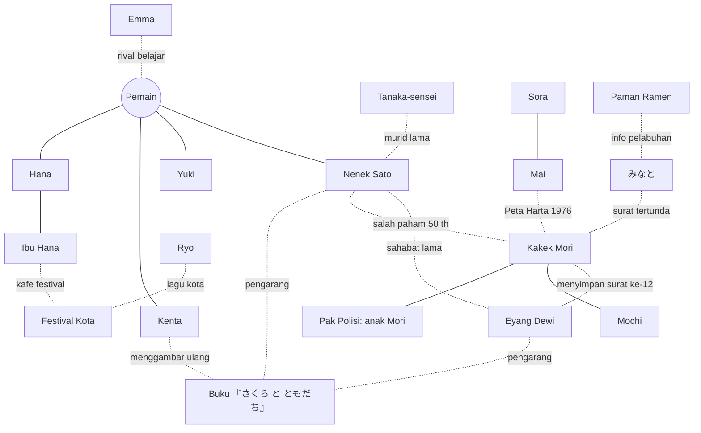

# 🌸 Nihongo Gakkou v3 — Paket Dokumen Desain 「さくら の てがみ」

Paket ini berisi desain lengkap pembaruan besar **Nihongo Gakkou**: dari game belajar hiragana/katakana (v2) menjadi perjalanan satu tahun sampai **JLPT N5**, dengan satu cerita besar yang saling berkaitan.

## Cerita dalam 5 kalimat
1. Kamu, murid pindahan dari Indonesia, tinggal bersama **Nenek Sato** di Sakura-machi — di kamar yang 50 tahun lalu dipakai **Eyang Dewi**, nenekmu sendiri.
2. Kucing **Mochi** menggali kunci loteng; di sana ada surat-surat Dewi untuk Sato yang hanya bisa kamu baca **seiring kemampuan bahasamu tumbuh**.
3. **Peta Harta 1976** dari Mai menuntunmu ke halaman-halaman buku bergambar 『さくら と ともだち』 yang disembunyikan trio **Sato, Dewi, dan Mori** di pantai, gunung, kuil, kota besar, dan pelabuhan.
4. Di pelabuhan みなと kamu menemukan kebenaran: dua surat yang tidak pernah sampai, dan **Kakek Mori** yang menyimpan rasa bersalah selama 50 tahun.
5. Di Tahun Baru kamu membacakan surat terakhir dalam bahasa Jepang, tiga sahabat berbicara lagi, dan di musim semi Eyang Dewi datang ke bawah pohon sakura yang akhirnya mekar.

## Isi paket
| File | Isi | Untuk siapa |
|---|---|---|
| `01-GAME_DESIGN.md` | Visi, pilar, ringkasan semua sistem, **suara manusia (§14)**, arsitektur, roadmap, keputusan desain | Semua |
| `02-KANON-PROLOG-BAB1-2.md` | **Kanon cerita** (linimasa 1976–77, fakta tokoh, benda kunci, Peta Harta), naskah Prolog, sisipan cerita Bab 1–2 | Penulis, desainer |
| `03-BAB3-SUARA-BARU-DAN-ANGKA.md` | Bab 3 hari per hari (Hari 23–34) | Penulis, programmer konten |
| `04-BAB4-MUSIM-PANAS.md` | Bab 4 hari per hari (Hari 35–46) | 〃 |
| `05-BAB5-KARYAWISATA-MUSIM-GUGUR.md` | Bab 5 hari per hari (Hari 47–58) | 〃 |
| `06-BAB6-PELABUHAN-MUSIM-DINGIN.md` | Bab 6 hari per hari (Hari 59–70), klimaks | 〃 |
| `07-EPILOG-DAN-PASCA-TAMAT.md` | Epilog (Hari 71–72), kredit, mode bebas, Tahun Kedua | 〃 |
| `08-SURAT-DAN-BUKU-BERGAMBAR.md` | Isi lengkap 14 surat + 11 halaman buku bergambar, aturan kata kabur | Penulis, pengisi suara |
| `09-KIZUNA-DAN-ENDING.md` | Aturan keakraban, 25 event teman, 7 ending | Penulis |
| `10-KURIKULUM-N5.md` | Kana, angka, **100 kanji**, 32 pola tata bahasa, kosakata per bab, ujian N5 tiruan, SRS | Desainer belajar |
| `11-NASKAH-SUARA-SENSEI.md` | **768 klip** naskah sensei siap rekam (Bab 1–2 lengkap, dibuat dari data game) + templat Bab 3–6 | Pengisi suara, audio |
| `12-SISTEM-DAN-MINIGAME.md` | Spesifikasi Kotak Surat, Jurnal Misteri, Peta Harta, kerja paruh waktu, Meter Kota, kamera, kebun, pesan; 16 mini-game + 7 mini-game kecil; daftar flag; save v3 | Programmer |
| `13-KEJADIAN-MISI-NPC.md` | Kejadian harian (lama & baru), misi sampingan, rutinitas NPC, dialog ambien | Penulis, programmer |
| `NIHONGO_GAKKOU_v3_FULL.md` | Semua file di atas digabung jadi satu | Membaca sekaligus |

## Angka penting
| Hal | Jumlah |
|---|---|
| Hari cerita | Prolog + 72 hari + mode bebas |
| Bab | 6 + Prolog + Epilog |
| Surat | 12 cerita + 2 bonus |
| Halaman buku bergambar | 10 + 1 (Kenta) + sampul |
| Kanji | 100 |
| Event Kizuna | 25 (5 teman × 5 tingkat) |
| Ending | 7 |
| Mini-game baru | 16 + 7 mini-game kecil (+ 16 yang sudah ada) |
| Klip suara sensei siap rekam | 768 (Bab 1–3, dipakai video di game; `npm run voice:sensei`) |

## Cara memakai dokumen
1. Mulai dari **01** untuk gambaran besar, lalu **02** untuk kanon.
2. Saat menulis/mengubah konten bab, cek **aturan keterkaitan** (01 §17.2) dan **aturan huruf kabur** (12 §A.3).
3. Setiap dialog baru → tambahkan ke naskah suara (01 §14.5) agar bisa direkam.
4. Urutan pengerjaan kode: lihat **Checklist v2.5** (01 §16.1) dan **Checklist suara** (01 §14.11).

## Konvensi
- ✅ sudah ada di kode · 🔁 sudah ada tapi diubah · 🆕 baru · 💡 ide jangka panjang
- 🎬 arahan adegan · 🚩 flag cerita · 🎁 hadiah · ❓ pilihan pemain (✅ benar / ❌ salah + penjelasan)
- Nama tempat & alamat di cerita **fiktif**.


---

# 🌸 にほんごがっこう · Nihongo Gakkou — Dokumen Desain Lengkap v3.0

> **「さくら の てがみ」 — Surat-Surat Sakura**
> Game 3D belajar bahasa Jepang dari nol sampai **JLPT N5**, dengan satu cerita besar yang menyambungkan setiap huruf, setiap teman, dan setiap kota.

| | |
|---|---|
| **Versi dokumen** | 3.1 (desain lengkap — detail di file 02–13) |
| **Basis** | Kode v2.0 (React + TS + Three.js, Bab 1–2, 5 peta kereta) |
| **Target** | 6 bab utama + prolog + epilog ≈ **72 hari cerita**, ±15–25 menit/hari |
| **Status tiap poin** | ✅ sudah ada · 🔁 sudah ada tapi dirombak · 🆕 baru · 💡 ide jangka panjang |

> 📚 **Paket dokumen:** file ini adalah ringkasan & keputusan desain. Isi lengkap ada di:
> `02` Kanon, Prolog, Bab 1–2 · `03` Bab 3 · `04` Bab 4 · `05` Bab 5 · `06` Bab 6 · `07` Epilog · `08` Surat & Buku Bergambar · `09` Kizuna & Ending · `10` Kurikulum N5 · `11` Naskah Suara Sensei · `12` Sistem & Mini-Game · `13` Kejadian, Misi & NPC.
> Jika ada perbedaan, **file 02 (Kanon)** yang berlaku.

---

## Daftar Isi

1. [Visi & Pilar Desain](#1-visi--pilar-desain)
2. [Premis Cerita Besar](#2-premis-cerita-besar)
3. [Tokoh & Busur Cerita](#3-tokoh--busur-cerita)
4. [Peta Keterkaitan Cerita](#4-peta-keterkaitan-cerita)
5. [Struktur Bab (Prolog → Epilog)](#5-struktur-bab-prolog--epilog)
6. [Kurikulum Belajar (N5)](#6-kurikulum-belajar-n5)
7. [Dunia & Peta](#7-dunia--peta)
8. [Sistem Permainan](#8-sistem-permainan)
9. [Mini-Game](#9-mini-game)
10. [Koleksi, Hadiah & Progres](#10-koleksi-hadiah--progres)
11. [Musim, Kalender & Event](#11-musim-kalender--event)
12. [Online Bersama](#12-online-bersama)
13. [Presentasi: Visual, Musik, Suara](#13-presentasi-visual-musik-suara)
14. [Suara Asli: Sensei & Tokoh Bersuara Manusia](#14-suara-asli-sensei--tokoh-bersuara-manusia)
15. [Arsitektur Teknis & Struktur Data](#15-arsitektur-teknis--struktur-data)
16. [Roadmap Rilis](#16-roadmap-rilis)
17. [Panduan Menulis Konten](#17-panduan-menulis-konten)
18. [Ukuran Keberhasilan](#18-ukuran-keberhasilan)
19. [Lampiran](#19-lampiran)

---

## 1. Visi & Pilar Desain

### 1.1 Kalimat visi
*"Setiap huruf yang kamu pelajari membuka satu rahasia kecil di cerita, dan setiap rahasia itu mendekatkanmu pada orang-orang di Sakura-machi."*

### 1.2 Pilar
| Pilar | Artinya di dalam game | Contoh nyata |
|---|---|---|
| **Belajar = kunci cerita** | Kemampuan membaca **membuka** konten cerita, bukan sekadar syarat naik level. | Surat nenek baru bisa dibaca setelah katakana dikuasai. |
| **Semua saling berkaitan** | Tidak ada NPC "sekali pakai". Setiap tokoh sampingan punya benang ke cerita utama. | Mai (anak hilang) ternyata adik Sora; Emma muncul lagi di まち dan みなと. |
| **Salah itu aman** | Tanpa game over, tanpa hukuman. Salah = penjelasan + coba lagi. | ✅ tetap dipertahankan. |
| **Sedikit tapi sering** | 1 hari cerita = 1 sesi 15–25 menit, terasa lengkap. | ✅ tetap. |
| **Dunia yang hidup** | Musim, cuaca, rutinitas NPC, kota berubah mengikuti cerita. | Toko yang tutup di Bab 3 buka lagi di Bab 5 berkat bantuanmu. |
| **Hangat, tanpa pertarungan** | Konflik cerita berupa salah paham, kehilangan, mimpi, perpisahan — bukan musuh. | ✅ tetap. |

### 1.3 Nada cerita
Slice-of-life hangat + misteri keluarga yang lembut (setingkat *Studio Ghibli* / *Animal Crossing* / *Persona* bagian sosialnya). Ada momen haru, tetapi selalu berakhir penuh harapan.

---

## 2. Premis Cerita Besar

### 2.1 Ringkasan satu paragraf
Kamu adalah murid pindahan dari Indonesia yang tinggal bersama **Nenek Sato** di kota kecil **Sakura-machi (さくらまち)**. Di loteng rumah, kamu menemukan **kotak kayu berisi surat-surat lama** berbahasa Jepang sederhana. Surat-surat itu ditulis **nenekmu sendiri, Eyang Dewi**, untuk Sato muda, saat Dewi tinggal setahun di rumah ini (di kamarmu!) sebagai pelajar pertukaran tahun 1976. Persahabatan mereka terputus 50 tahun lalu karena satu **surat yang tidak pernah terkirim**. Sepanjang satu tahun sekolah, kamu belajar membaca, mengunjungi tempat-tempat yang disebut di surat, mengumpulkan halaman **buku bergambar 『さくら と ともだち』** yang dulu mereka buat bersama, dan akhirnya menemukan surat yang hilang itu — lalu menulis **surat balasan pertamamu dalam bahasa Jepang**.

### 2.2 Tiga lapis cerita
| Lapis | Isi | Fungsi |
|---|---|---|
| **A. Benang utama** — *Surat-Surat Sakura* | Misteri keluarga: siapa Eyang Dewi di Jepang, kenapa persahabatan terputus, di mana surat terakhir. | Tulang punggung 6 bab; alasan untuk terus maju. |
| **B. Benang teman** — *Kizuna* | Mimpi & masalah Yuki, Kenta, Hana, Sora, Emma, Ryo. | Alasan emosional untuk kembali setiap hari. |
| **C. Benang kota** — *Sakura-machi Hidup Lagi* | Kota kecil mulai sepi; festival musim panas terancam batal; pohon sakura tua di sekolah sakit. | Tujuan bersama: seluruh kota bangkit di akhir. |

Ketiga lapis **bertemu di klimaks Bab 6 & Epilog**: Surat #12 dibacakan pemain di hari Tahun Baru, telepon video ke Bandung, lalu di musim semi pohon sakura berbunga dan Eyang Dewi datang ke Sakura-machi.

### 2.3 Misteri inti (dibuka bertahap)
| # | Pertanyaan | Dijawab di |
|---|---|---|
| 1 | Siapa "Dewi" yang menandatangani surat pertama? | Akhir Bab 1 |
| 2 | Kenapa ada foto Nenek Sato & Dewi di pantai うみ? | Bab 3 |
| 3 | Kenapa Kakek Mori selalu menghindari Nenek Sato? | Bab 4 (onsen やま) |
| 4 | Apa isi buku bergambar yang halamannya tersebar? | Bab 2–6 (per halaman) |
| 5 | Kenapa surat-surat mereka tidak pernah sampai? | Bab 6 (Museum Pos & mercusuar みなと) |
| 6 | Apa arti ukiran di pohon sakura tua? | Epilog |

**Jawaban akhir (spoiler desain):** Dewi, Sato, dan Mori muda bertiga bersahabat. Maret 1977 Dewi pulang dengan kapal dari みなと; Sato demam dan tidak bisa mengantar. Mori dititipi balasan Sato (Surat #12) untuk dikirim dari kantor pos みなと, tetapi **badai salju** membuat tinta alamatnya luntur. Mori malu, berbohong "sudah kukirim", dan menyimpan surat itu 50 tahun. Sementara itu, surat Dewi dari Bandung (Surat #11) salah menulis nama prefektur dan tertahan sebagai **あてさき ふめい** di kantor pos yang kini menjadi museum. Sato mengira Dewi melupakannya; Dewi mengira Sato melupakannya. Kamu adalah jembatan yang menyambungkan mereka lagi. (Linimasa lengkap: file 02 §A.2.)

---

## 3. Tokoh & Busur Cerita

### 3.1 Tokoh utama
| Tokoh | Peran | Kepribadian | Busur cerita (arc) | Jajanan favorit | Status |
|---|---|---|---|---|---|
| **Pemain ({name})** | Murid pindahan dari Indonesia | Bisa dikustomisasi | Dari "tidak bisa baca apa pun" → menulis surat balasan dalam bahasa Jepang. | — | ✅ |
| **Nenek Sato** | Wali, tinggal serumah | Lembut, menyimpan rahasia | Belajar memaafkan masa lalu; akhirnya menelepon Eyang Dewi. | おちゃ | 🔁 |
| **Tanaka-sensei** | Wali kelas (**perempuan**, ±35 th, berkacamata) | Sabar, lucu diam-diam | Dulu murid SD Nenek Sato; menjadi guru karena beliau. Penjaga pohon sakura sekolah. | せんべい | 🔁 |
| **Yuki** | Sahabat pertama | Ceria, penakut ujian | Takut gagal ujian → berani ikut lomba pidato; bermimpi ke Indonesia. | だんご | 🔁 |
| **Kenta** | Teman sekelas | Enerjik, suka menggambar | Ingin jadi mangaka; ayahnya menolak → menang lomba manga di まち; menggambar ulang buku bergambar yang hilang. | たいやき | 🔁 |
| **Hana** | Teman (mulai Bab 2) | Pemalu, jago masak | Kafe keluarganya hampir tutup → kafe jadi pusat festival. | メロンパン | 🔁 |

### 3.2 Tokoh pendukung (semua punya benang)
| Tokoh | Sekarang | Benang baru yang menyambungkan | Bab kunci |
|---|---|---|---|
| **Kakek Mori** | Pemilik kucing Mochi | Sahabat masa muda Sato & Dewi; menyimpan surat ke-12. | 1, 4, 6 |
| **Mochi (kucing)** | Misi kucing hilang | Selalu "membawa" pemain ke petunjuk (halaman buku, kunci loteng). | Semua |
| **Sora** | Guru Kecil | Anak SD yang belajar hiragana bersamamu; kamu jadi "senpai"-nya. Kakak Mai. | 1–6 |
| **Mai** | Anak tersesat | Adik Sora; menemukan **Peta Harta 1976** (gambar Mori) terselip di buku perpustakaan. | 2, 5 |
| **Emma** | Turis tersesat | Pelajar dari Prancis, "rival belajar" yang ramah; muncul di うみ, まち, みなと. | 1, 3, 5, 6 |
| **Ryo** | Musisi jalanan | Menulis lagu tentang Sakura-machi; liriknya dilengkapi bertahap di karaoke. | 2, 4, 6 |
| **Paman Ubi** | Penjual ubi bakar | Penjaga toko lama; menyimpan foto festival 50 tahun lalu. | 4 |
| **Pak Polisi** | Patroli & dompet | Anak Kakek Mori; tahu ayahnya "menyimpan sesuatu". | 6 |
| **Ibu Hana** | Pemilik kafe | Kafe terancam tutup; pulih lewat festival. | 3 |
| **Paman Ramen** | Kedai ramen | Ketua warga; mengusulkan Pasar Pagi; mantan nelayan みなと. | 3, 6 |
| **Kak Toko Buku** | Toko buku | Menjual buku bergambar anak; di Epilog memajang buku pertama Kenta. | 2, E |
| **Nyonya Penginapan (やま)** | Onsen | Teman kecil Nenek Sato; lokasi flashback Bab 4. | 4 |
| **Biksu (てら)** | Kuil | Menyimpan ema (papan doa) bertulisan Dewi. | 5 |
| **Pak Petani (やま)** | Sawah | Mengajari panen; hadiah beras untuk festival. | 4 |
| **Koki Sushi (まち)** | Sushi putar | Juri lomba masak Hana. | 5 |

### 3.3 Tokoh baru 🆕
| Tokoh | Peran | Muncul | Fungsi |
|---|---|---|---|
| **Eyang Dewi** | Nenek pemain (Indonesia) | Surat & telepon video | Suara emosional cerita; di epilog berbicara Jepang lagi setelah 50 tahun. |
| **Sato muda / Dewi muda / Mori muda** | Kilas balik | Adegan flashback (palet sepia) | Menunjukkan persahabatan masa lalu. |
| **Ayah Kenta** | Pemilik bengkel | Bab 5 | Konflik mimpi Kenta. |
| **Pak Umi** | Kepala Museum Pos みなと | Bab 6 | Arsip surat あてさき ふめい → Surat #11. |
| **Kouhai (adik kelas)** | Murid baru di epilog | Epilog / NG+ | Kamu yang sekarang mengajari. |

### 3.4 Sistem Kizuna (keakraban) 🔁
Setiap teman punya **5 tingkat** (♥ 0 → 20). Tiap tingkat membuka 1 event pribadi; tingkat 5 membuka **ending pribadi** di epilog.

| Tingkat | ♥ | Yuki | Kenta | Hana | Sora | Emma |
|---|---|---|---|---|---|---|
| 1 | 3 | Duduk di bawah sakura ✅ | Buku sketsa ✅ | Kue kering ✅ | Belajar あいうえお bersama | Tukar tips belajar |
| 2 | 6 | Belajar untuk ujian | Tempat rahasia di atap | Resep nenek Hana | Membaca papan kota | Bertemu lagi di うみ |
| 3 | 10 | Foto bertiga ✅ | Ayah menolak | Kafe hampir tutup | Mai hilang lagi | Kangen rumah di まち |
| 4 | 15 | Lomba pidato | Lomba manga | Lomba masak | Sora mengajari Mai | Perpisahan di みなと |
| 5 | 20 | Janji ke Indonesia | Manga tentangmu | Menu "persahabatan" | Surat untuk senpai | Surat dari Prancis |

---

## 4. Peta Keterkaitan Cerita

### 4.1 Diagram hubungan


### 4.2 Benang yang menyambungkan konten yang sudah ada
| Konten lama (✅) | Disambungkan menjadi 🔁 |
|---|---|
| Misi "Kucing Hilang" (Mochi) | Saat ditemukan, Mochi membawa **kunci loteng** → awal benang surat. |
| Misi "Surat untuk Nenek" | Surat itu dari Indonesia — Eyang Dewi menanyakan kabarmu (tanpa menyebut Sato). |
| Kejadian "Anak Tersesat" (Mai) | Mai ternyata adik Sora; di Bab 2 ia memberi **Peta Harta 1976** yang menunjukkan 9 lokasi halaman buku. |
| Kejadian "Turis" (Emma) | Emma jadi tokoh berulang, teman belajar lintas peta. |
| Kejadian "Musisi" (Ryo) | Lagu Ryo = lagu karaoke yang liriknya terbuka tiap bab. |
| Kejadian "Senja di sungai" (Kakek Mori) | Mori bercerita sepotong masa lalu; petunjuk misteri #3. |
| Festival Sekolah (Hari 22) | Malamnya Surat #3 terbaca penuh & Nenek Sato mengaku soal Dewi → membuka Bab 3. |
| Peta うみ / やま / まち / てら | Setiap peta = lokasi yang disebut di satu surat + 1–2 halaman buku bergambar. |
| Buku cerita perpustakaan (6 buku) | Ditambah buku ke-7: buku bergambar yang dikumpulkan pemain. |

---

## 5. Struktur Bab (Prolog → Epilog)

### 5.0 Ringkasan
| Bab | Judul | Musim | Hari | Belajar | Peta baru | Surat | Halaman buku |
|---|---|---|---|---|---|---|---|
| 0 | Prolog: Kedatangan | Awal musim semi | 0 (tutorial) | Salam dasar (dengar) | Stasiun, rumah | — | — |
| 1 | Hiragana ✅🔁 | Musim semi 🌸 | 1–11 | 46 hiragana | Kota, sekolah, loteng | #1 | #1 |
| 2 | Katakana ✅🔁 | Akhir musim semi | 12–22 | 46 katakana | Jalan belanja, kafe | #2, #3, (#4 bonus) | #2 |
| 3 | Suara Baru & Angka 🆕 | Musim hujan ☔ | 23–34 | Dakuten, angka, harga, 14 kanji | うみ ほこら, pasar pagi | #5, #6 | #3, #4 |
| 4 | Musim Panas & Rahasia Gunung 🆕 | Musim panas 🎆 | 35–46 | Yōon, っ, bunyi panjang, posisi, 5 kanji | やま (menginap) | #7, #8 | #5, #6 |
| 5 | Karyawisata Musim Gugur 🆕 | Musim gugur 🍁 | 47–58 | Jam, hari, 〜ます, 19 kanji | てら, まち (menginap) | #9, #10 | #7, #8 |
| 6 | Pelabuhan Musim Dingin 🆕 | Musim dingin ❄️ | 59–70 | 62 kanji (total 100), pola N5 | みなと 🆕 | #11, #12 | #9, #10 |
| E | Epilog: Musim Semi Kedua 🆕 | Musim semi 🌸 | 71–72 + bebas | Ujian N5 tiruan | Semua | #13 (kamu), #14 (Emma) | Halaman 11 + sampul |

**Total: ±72 hari cerita + mode bebas.**

### 5.1 Template satu bab
Setiap bab mengikuti ritme yang sama agar mudah ditulis & diprediksi pemain:
```
Hari 1      Pembuka bab: perubahan musim, kejadian pemicu, huruf/topik baru
Hari 2–5    Pelajaran + event teman + petunjuk misteri kecil
Hari 6      ULANGAN tengah bab + kejadian lucu
Hari 7–10   Pelajaran + perjalanan ke peta bab + halaman buku
Hari 11     Persiapan event besar (festival/karyawisata/lomba)
Hari 12     UJIAN BAB + event besar + membaca surat baru (cliffhanger)
```

### 5.2 Ringkasan per bab (detail hari per hari ada di file 02–07)
| Bab | Kait pembuka | Klimaks bab | Cliffhanger |
|---|---|---|---|
| **Prolog** | Nenek Sato menatap koper batikmu: 「なつかしい」 | Makan malam pertama | Suara dari loteng terkunci |
| **1** | Sensei: "Nenek Sato dulu guruku!" | Mochi menggali **kunci**; loteng dibuka; **Surat #1** ditandatangani "Dewi" | "Dewi… itu nama Eyang?!" |
| **2** | Surat #2 penuh katakana kabur | **Peta Harta 1976** dari Mai; halaman #2 + kamera; festival sekolah | Nenek Sato: "Dewi adalah sahabatku." |
| **3** | Musim hujan; kafe Hana sepi | Kerja paruh waktu; halaman di ほこら & di balik bingkai menu kafe; **Pasar Pagi** | Surat #6: "Mori-kun mengajakku ke みなと" |
| **4** | Kata 「ちゃん」 akhirnya terbaca | Menginap di onsen; **kilas balik #1**; Sato & Mori bertengkar; Natsu Matsuri | Nenek: "Orang ketiga di foto adalah Mori-kun." |
| **5** | Lomba manga, masak, pidato diumumkan | Ema Dewi & Mori di kuil; **kapsul waktu 50 tahun** di まち; Yuki juara pidato | Surat #10: alamat Bandung + "Mori akan mengirim balasanmu" |
| **6** | Salju pertama; peta: 「白い とう」 | Museum Pos: **Surat #11**; mercusuar: **pengakuan Mori** + Surat #12; rekonsiliasi | Telepon ke Bandung: 「さと… ちゃん…？」 |
| **Epilog** | Ujian Besar N5 | Pohon sakura mekar; Eyang Dewi datang; buku lengkap | Foto berempat di うみ |

### 5.3 Surat & halaman buku
- **14 surat** (12 cerita + surat pemain + surat Emma): isi lengkap, syarat, dan token kabur di **file 08 §B–C**.
- **Buku bergambar 『さくら と ともだち』**: 10 halaman + halaman ke-11 (Kenta) + sampul, alegori tiga kelopak ハル・ミナミ・モク: **file 08 §D**.
- **Peta Harta 1976** (lokasi tiap halaman & syarat membacanya): **file 02 §A.6**.

## 6. Kurikulum Belajar (N5)

### 6.1 Peta kurikulum per bab
| Bab | Huruf | Kosakata (kumulatif) | Kanji | Tata bahasa | Percakapan |
|---|---|---|---|---|---|
| 0 | — | 10 | — | — | Salam dasar (suara saja) |
| 1 ✅ | 46 hiragana | 120 | — | 〜です, 〜は | Sapaan, perkenalan, makan |
| 2 ✅ | 46 katakana | 250 | — | 〜を ください, 〜と | Belanja, festival |
| 3 🆕 | 25 dakuten/handakuten (+katakana) | 380 | 一〜十, 百, 千, 万, 円 (14) | いくら, 〜が あります | Harga, kerja paruh waktu |
| 4 🆕 | 33 yōon + っ + ー | 500 | 上 下 中 右 左 (19) | 〜に いきます, 〜で | Arah, onsen, festival |
| 5 🆕 | — | 650 | 日 月 火 水 木 金 土 山 川 人 口 大 小 時 分 半 今 何 年 (38) | 〜ます / ません / ました | Jadwal, karyawisata |
| 6 🆕 | — | 800 | +62 → **100** | 〜たい, 〜が すき, 〜て ください, 〜から | Surat, telepon, perpisahan |
| E | — | 800+ | 100 | Ulasan penuh | Ujian N5 tiruan |

### 6.2 Metode belajar (lama & baru)
| Metode | Status | Keterangan |
|---|---|---|
| Video sensei + urutan goresan | ✅ | Dilanjutkan untuk dakuten, yōon, kanji. |
| Latihan menulis bertahap + hanko | ✅ | Ditambah mode **kanji** (radikal disorot). |
| SRS (Leitner 1-2-4-7-14) | ✅ | Diperluas ke kata & kanji, bukan hanya huruf. |
| **Membaca surat** | 🆕 | Kata yang sudah dikuasai tampil jelas; yang belum tampil kabur (blur) → motivasi visual. |
| **Latihan bicara (mikrofon)** | 🆕 | Web Speech Recognition, dengan fallback "ucapkan lalu tekan ✓". |
| **Furigana bertahap** | 🆕 | Romaji → hiragana → tanpa bantuan, otomatis sesuai penguasaan per kata. |
| **Mode dengar** | 🆕 | Dialog tanpa teks, untuk latihan choukai. |
| **Tes penempatan** | 🆕 | Lompat ke Bab 2/3 bagi yang sudah bisa kana (cerita diringkas lewat "buku harian"). |
| **Huruf rawan** | 🆕 | シ/ツ, ソ/ン, ぬ/め, わ/れ/ね → mini-latihan otomatis. |
| **Kamus bergambar** | 🆕 | Setiap kata: ilustrasi pixel, suara, contoh kalimat dari cerita. |

### 6.3 Aturan penyatuan belajar ↔ cerita
1. **Setiap surat hanya memakai materi yang sudah diajarkan** + maksimal 3 kata baru yang diberi catatan.
2. **Setiap peta baru membawa kosakata tematik** (pantai → ikan & kerang; gunung → alam & onsen; pelabuhan → kapal & pos).
3. **Papan kota berubah** mengikuti bab: di Bab 1 papan masih ada romaji kecil; di Bab 6 papan full kanji + furigana.
4. **NPC berbicara sesuai level pemain**: kalimat makin panjang seiring bab.

---

## 7. Dunia & Peta

### 7.1 Daftar peta
| Peta | Status | Dibuka | Isi utama | Peran cerita |
|---|---|---|---|---|
| Rumah Nenek Sato | ✅🔁 | Prolog | Kamar, dapur, **loteng 🆕**, taman | Markas; kotak surat |
| Sekolah SMA Sakura | ✅🔁 | Bab 1 | Kelas, atap, perpustakaan, **UKS, kantin, gym 🆕**, pohon sakura tua 🆕 | Ujian, klub, pohon |
| Sakura-machi (kota) | ✅ | Bab 1 | Konbini, taman, sungai, jalan belanja, kuil kecil | Hidup sehari-hari |
| Interior kota | ✅ | Bab 1–2 | Konbini, stasiun, kafe, ramen, toko buku, pos polisi | Adegan belajar |
| うみ (pantai) | ✅🔁 | Bab 2 akhir | Kerang, memancing, es serut | Lokasi foto sepia |
| やま (gunung) | ✅🔁 | Bab 4 | Onsen **(menginap 🆕)**, sawah, soba, jizo | Flashback musim panas |
| まち (kota besar) | ✅🔁 | Bab 5 | Penyeberangan, dept. store, sushi, karaoke, プリクラ | Lomba manga/masak |
| てら (kota kuil) | ✅🔁 | Bab 5 | Kuil, lonceng, upacara teh, rusa | Ema Dewi |
| **みなと (pelabuhan)** | 🆕 | Bab 6 | Pasar ikan, mercusuar, kantor pos tua, feri | Klimaks |
| **Kilas balik (sepia)** | 🆕 | Bab 4–6 | Versi lama kota 50 tahun lalu | Flashback |
| Rumah teman | 🆕 | Kizuna 3 | Rumah Yuki, bengkel Kenta, lantai atas kafe Hana | Event pribadi |

### 7.2 Kota yang berubah (Sakura-machi Hidup Lagi)
**Meter Kota** (0–100) naik saat pemain membantu warga. Visual kota berubah bertahap:
| Meter | Perubahan |
|---|---|
| 20 | Lampu jalan menyala lagi di jalan belanja. |
| 40 | Kafe Hana punya teras & pelanggan NPC. |
| 60 | Toko tutup di ujung jalan buka lagi (toko mainan). |
| 80 | Lentera festival terpasang permanen. |
| 100 | Seluruh kota hadir di festival Tahun Baru; lagu Ryo diputar di pengeras suara kota. |

### 7.3 Rutinitas NPC 🆕
Setiap NPC punya jadwal pagi/siang/sore/malam dan lokasi berbeda saat hujan/salju. Contoh: Kakek Mori memancing pagi, di taman siang, di sungai senja (✅ event senja).

---

## 8. Sistem Permainan

### 8.1 Alur satu hari (✅ + tambahan)
```
Pagi       Sarapan bersama Nenek → (baru) kabar misteri kecil / surat pagi
Sekolah    Sapa teman → Pelajaran 1 (video + latihan) → Makan siang → Pelajaran 2 → Klub
Sore       Bebas di kota: kejadian harian ★, misi, kerja paruh waktu 🆕, perjalanan kereta
Malam      Makan malam → (baru) membaca surat / halaman buku → Buku harian → Tidur
```

### 8.2 Sistem baru
| Sistem | Deskripsi | Terhubung ke |
|---|---|---|
| **Kotak Surat** 🆕 | Menu membaca 14 surat; kata yang belum dikuasai kabur; tombol dengar suara pengirim. | Kurikulum, cerita utama |
| **Jurnal Misteri** 🆕 | Papan petunjuk (foto, kunci, ema, cap pos) yang bisa disambungkan dengan benang merah. | Misteri inti |
| **Kerja Paruh Waktu (アルバイト)** 🆕 | Kafe Hana, konbini, pasar ikan. Menghasilkan 🌸 + Meter Kota. | Bab 3+, angka |
| **Kamar yang bisa didekorasi** 🆕 | Perabot dari toko & hadiah teman; foto kenangan di dinding. | Koleksi |
| **Kebun** 🆕 | Menanam sayur/bunga bernama Jepang; panen dipakai untuk memasak & hadiah. | Hana, festival |
| **Album Foto** 🆕 | Kamera film dari loteng; memotret momen/NPC/tempat; ada daftar "foto cerita". | Bab 2+, ending |
| **Telepon/Pesan (LINE-style)** 🆕 | Pesan singkat dari teman berbahasa Jepang sederhana; bisa dibalas dengan stempel/frasa. | Kizuna, latihan membaca |
| **Kizuna 5 tingkat** 🔁 | Lihat §3.4. | Ending |
| **Meter Kota** 🆕 | Lihat §7.2. | Benang kota |
| **Pencapaian** 🔁 | 24 → **60 lencana** (lihat §10). | Semua |

### 8.3 Kepemilikan & ekonomi
| Mata uang | Sumber | Dipakai untuk |
|---|---|---|
| 🌸 Poin sakura ✅ | Pelajaran, misi, lencana, kerja | Jajanan, hewan, baju, perabot, tiket kereta |
| 🎫 Stempel ✅ | Tempat & kegiatan | Kartu stempel → hadiah kosmetik |
| 🍥 Kupon festival 🆕 | Event musiman | Barang terbatas musiman |

Harga di game **ditulis & diucapkan dalam bahasa Jepang** (さんびゃく えん) mulai Bab 3.

---

## 9. Mini-Game

### 9.1 Daftar lengkap
| Mini-game | Status | Melatih | Muncul di |
|---|---|---|---|
| Karuta | ✅ | Mengenali huruf | Kelas, klub |
| Hujan Huruf | ✅ | Kecepatan membaca | Latihan |
| Susun Kata | ✅ | Ejaan | Klub memasak |
| Kaligrafi | ✅ | Menulis | Klub shodo |
| Belanja Konbini | ✅ | Membaca barang | Konbini |
| Benar/Salah Kilat | ✅ | Kecepatan | Latihan |
| Cari Huruf | ✅ | Pengamatan | Latihan |
| Pasangkan Kata | ✅ | Arti kata | Latihan |
| Dikte | ✅ | Mendengar | Latihan |
| Memancing | ✅ | Membaca cepat | Sungai, うみ |
| Sushi putar, lampu penyeberangan, lonceng, upacara teh, karaoke, プリクラ | ✅ | Beragam | Peta kereta |
| **Kasir Kafe** | 🆕 | Angka, kembalian | Bab 3 |
| **Taiko Ritme** | 🆕 | Membaca sesuai ketukan | Bab 4 festival |
| **Tanzaku** | 🆕 | Menulis permohonan | Bab 4 Tanabata |
| **Shiritori Kereta** | 🆕 | Kosakata berantai | Perjalanan kereta |
| **Panel Manga** | 🆕 | Menyusun dialog & urutan | Bab 5 Kenta |
| **Masak Bersama** | 🆕 | Kata kerja & urutan | Nenek, Hana |
| **Pidato** | 🆕 | Bicara (mikrofon) | Bab 5 Yuki |
| **Jadwal Kereta** | 🆕 | Jam & peron | Bab 5 まち |
| **Lelang Ikan** | 🆕 | Angka besar | Bab 6 みなと |
| **Menulis Surat** | 🆕 | Menyusun kalimat | Epilog |
| **Karuta Kanji** | 🆕 | Kanji | Bab 5–6 |

### 9.2 Aturan desain mini-game
- Maks. 60–90 detik per ronde; selalu ada tombol ✕ (✅).
- Mode santai tanpa waktu (✅) berlaku untuk semua mini-game baru.
- Setiap mini-game memberi bintang 1–3; bintang 3 di semua = lencana.

---

## 10. Koleksi, Hadiah & Progres

### 10.1 Koleksi
| Koleksi | Jumlah | Status |
|---|---|---|
| Buku Jajanan | 13 → 30 | ✅🔁 |
| Buku Makanan | 20 → 40 | ✅🔁 |
| Buku Ikan | 12 → 30 (+ ikan みなと & musiman) | ✅🔁 |
| Buku Cerita Perpustakaan | 6 → 12 + buku bergambar | ✅🔁 |
| **Surat** | 12 | 🆕 |
| **Halaman buku bergambar** | 10 + sampul | 🆕 |
| **Foto cerita** | 40 | 🆕 |
| **Kanji di kota** (papan yang dipotret) | 100 | 🆕 |
| **Omamori** | 12 (satu per bulan) | 🆕 |
| Kartu stempel | per peta | ✅ |

### 10.2 Pencapaian (24 → 60)
Kelompok baru: **Cerita** (baca tiap surat), **Kizuna** (tiap tingkat), **Kota** (Meter Kota), **Musim** (event), **Koleksi**, **Ahli** (semua bintang 3), **Rahasia** (easter egg: Mochi di 10 tempat berbeda, dll.).

### 10.3 Rapor & grafik 🆕
Grafik mingguan: huruf/kata/kanji dikuasai, ketepatan, menit belajar, hari streak; rapor bab bergaya rapor sekolah Jepang (通知表).

---

## 11. Musim, Kalender & Event

### 11.1 Kalender cerita
| Musim | Bab | Visual | Event |
|---|---|---|---|
| 🌸 Musim semi | 1–2 | Kelopak sakura (✅) | Hanami, festival sekolah (✅) |
| ☔ Tsuyu | 3 | Hujan, ajisai, siput | Pasar pagi |
| 🎆 Musim panas | 4 | Jangkrik, cahaya terik, kunang-kunang | Natsu matsuri, Tanabata, Obon |
| 🍁 Musim gugur | 5 | Momiji, bulan besar | Karyawisata, Tsukimi, lomba |
| ❄️ Musim dingin | 6 | Salju, napas beruap, kotatsu | Natal, Oomisoka, お正月 |
| 🌸 Musim semi | E | Sakura tua berbunga | Kelulusan kelas, kedatangan Dewi |

### 11.2 Event waktu nyata (live) 💡
Pasca-tamat, event mengikuti kalender asli (Tanabata 7 Juli, Tsukimi, Tahun Baru) dengan hadiah kosmetik.

---

## 12. Online Bersama

| Fitur | Status | Kaitan cerita |
|---|---|---|
| Avatar pemain lain + stempel frasa | ✅ | — |
| Emote & ojigi | ✅ | — |
| **Karuta duel 1v1** | 🆕 | Klub karuta |
| **Papan peringkat mingguan** | 🆕 | Per mini-game |
| **Tukar surat pendek** (dari frasa siap pakai) | 🆕 | Tema "surat" |
| **Festival bersama** (event server) | 💡 | Tanabata online: tanzaku semua pemain tergantung di satu pohon |
| **Kunjungan kamar** | 💡 | Dekorasi kamar |
| **Mode kelas guru** | 💡 | Guru memutar video bersama |

Keamanan tetap: tanpa teks bebas, nama disaring, rate limit (✅).

---

## 13. Presentasi: Visual, Musik, Suara

### 13.1 Visual
- ✅ HD-2D Three.js + karakter pixel.
- 🆕 **Palet per musim** (warna langit, rumput, pohon berubah).
- 🆕 **Mode kilas balik sepia** + grain film.
- 🆕 Animasi ekspresif: ojigi, melambai, menangis haru, konfeti, hati melayang.
- 🆕 Transisi kamera masuk bangunan, zoom saat dialog penting.
- 🆕 Cutscene sederhana berbasis skrip (kamera bergerak + dialog) untuk momen besar.
- 🆕 Aksesibilitas: teks besar, kontras tinggi, mode buta warna, kurangi gerakan.

### 13.2 Musik
- ✅ Musik generatif. 🆕 **Tema per tokoh** (motif pendek), **tema per musim**, dan **lagu Ryo** yang berkembang dari 1 bait → lagu penuh di klimaks.

### 13.3 Suara
- Rencana lengkap suara manusia ada di **§14**.

---

## 14. Suara Asli: Sensei & Tokoh Bersuara Manusia

> **Tujuan:** penjelasan sensei di video pelajaran dan dialog tokoh terdengar seperti **manusia sungguhan**, bukan suara TTS HP (Google/Samsung/iOS). Suara TTS perangkat tetap ada, tapi hanya sebagai **cadangan terakhir**.

### 14.1 Kondisi sekarang (hasil cek kode)
| Bagian | Cara kerja sekarang | Masalah |
|---|---|---|
| Kalimat Jepang (dialog, kana, kosakata) | `voice:export` → `voice/voice-lines.csv` (±750 baris) → rekaman MP3 di `public/audio/ja/` dipakai jika ada. | ✅ Jalur sudah ada, tapi `manifest.json` masih kosong (belum ada rekaman). |
| **Narasi sensei berbahasa Indonesia** (`narr` di `video.js`) | **Selalu** `Sound.speakLang(narr, 'id-ID')`, yaitu TTS perangkat. | ❌ Tidak ikut diekspor, jadi tidak bisa diganti rekaman. Inilah yang paling terdengar "robot". |
| Narasi dirakit acak | `pick([...])` + templat seperti `` `Ada ${n} goresan.` `` dan `Bacanya ${sayRo(ro)}` | ❌ Kalimatnya baru jadi saat video diputar, jadi tidak ada daftar kalimat tetap untuk direkam. |
| Ganti bahasa di tengah kalimat | Narasi Indonesia (suara A) → `Sound.speak(jp)` (suara B) | ❌ Suaranya berganti orang di tengah penjelasan; terdengar tidak alami. |
| Romaji dibaca TTS Indonesia | `sayRo()` mengubah "shi" → "syi" supaya TTS Indonesia bisa membaca | ❌ Pelafalannya sering meleset. |

### 14.2 Prinsip suara baru
1. **Satu sensei = satu suara manusia**, dari awal sampai akhir game, termasuk saat mengucapkan huruf Jepang di tengah kalimat Indonesia ("Huruf ini dibaca **あ**, seperti 'a' pada kata *apel*.").
2. **Direkam per potongan utuh**, bukan disambung-sambung dari potongan kecil.
3. **Diputar dari file**, bukan dibuat saat bermain → bisa offline (PWA), tanpa biaya server, dan suaranya sama di semua HP.
4. **Urutan cadangan:** rekaman manusia → suara AI yang dibuat sebelumnya (pra-render) → TTS perangkat.
5. **Naskah dulu, rekam kemudian**: semua kalimat yang diucapkan harus tertulis di file naskah, tidak dirakit acak saat bermain.

### 14.3 Tiga pilihan sumber suara
| Pilihan | Kualitas | Kelebihan | Kekurangan | Cocok untuk |
|---|---|---|---|---|
| **A. Pengisi suara manusia** ⭐ | Terbaik, paling hidup | Emosi asli, bisa diarahkan ("lebih semangat", "pelan untuk pemula"), tidak ada masalah lisensi AI | Butuh biaya & waktu; rekam ulang jika naskah berubah | Sensei, 6 tokoh utama, 12 surat, adegan klimaks |
| **B. Suara AI neural, dibuat sebelumnya** | Sangat mirip manusia (jauh di atas TTS HP) | Cepat, murah, mudah dibuat ulang saat naskah berubah, bisa jadi "suara sementara" | Emosi terbatas; wajib cek lisensi komersial; sebaiknya dicantumkan di kredit | Kalimat yang belum direkam, NPC kecil, prototipe |
| **C. TTS perangkat** ✅ | Bergantung pada HP | Gratis, sudah jalan | Terdengar robot, beda-beda tiap HP | Cadangan terakhir saja |

#### Pilihan A — tempat mencari pengisi suara manusia
| Kebutuhan | Di mana mencari |
|---|---|
| **Sensei (Indonesia + Jepang)** — idealnya **guru bahasa Jepang orang Indonesia** yang pelafalan Jepangnya bagus | Guru di LPK/lembaga kursus Jepang, dosen/alumni Sastra Jepang, pengisi suara lepas Indonesia (Fiverr, Upwork, Sribulancer, Projects.co.id), komunitas dubbing Indonesia. |
| **Tokoh Jepang** (Yuki, Kenta, Hana, Nenek Sato, Kakek Mori, dll.) | Penutur asli: Coconala / Skeb (situs Jepang), Fiverr/Upwork "Japanese native voice actor", mahasiswa Jepang di Indonesia. |
| **Eyang Dewi** | Pengisi suara Indonesia usia lanjut yang bisa bahasa Jepang sederhana. **Aksen Indonesia justru bagus untuk cerita**: ia sudah 50 tahun tidak memakai bahasa Jepang. |
| **Anak-anak (Sora, Mai)** | Pengisi suara dewasa yang biasa menyuarakan anak (lebih mudah secara izin), atau anak dengan izin tertulis orang tua. |

#### Pilihan B — layanan suara AI (dibuat sebelumnya, lalu disimpan sebagai MP3)
| Layanan | Catatan |
|---|---|
| **ElevenLabs** | Satu suara bisa berbicara bahasa Indonesia **dan** Jepang, jadi cocok untuk sensei yang mencampur dua bahasa. Bisa merancang suara baru (voice design). |
| **Microsoft Azure Neural TTS** | Suara ja-JP (mis. Nanami, Keita) dan id-ID (Gadis, Ardi); SSML untuk mengatur kecepatan, jeda, dan penekanan. |
| **VOICEVOX** | Gratis, **khusus bahasa Jepang**, banyak karakter suara anime yang cocok untuk tokoh remaja. Aturan pakai berbeda per karakter (biasanya wajib mencantumkan kredit, mis. "VOICEVOX:ずんだもん"). |
| **OpenAI TTS / lainnya** | Alternatif; kualitas bahasa Jepang dan Indonesia perlu dicoba dulu. |

> ⚠️ Harga dan aturan lisensi layanan AI sering berubah. **Cek syarat pemakaian komersial terbaru** sebelum rilis, simpan bukti lisensi di `voice/LICENSES.md`, dan tulis di layar Kredit suara mana yang manusia dan mana yang AI.
> 🚫 Jangan meniru (clone) suara orang sungguhan tanpa izin tertulis darinya.

#### Rekomendasi: gabungan (hybrid)
```
Tahap 1 (cepat) : semua narasi sensei + kana → suara AI pra-render (pilihan B) sebagai pengganti TTS HP
Tahap 2         : sensei direkam ulang oleh manusia (pilihan A); 92 kana oleh penutur asli
Tahap 3         : 6 tokoh utama + 12 surat + adegan klimaks oleh manusia
Seterusnya      : kalimat baru langsung dibuat versi AI dulu, lalu diganti rekaman manusia bertahap
```
Pemain langsung mendapat suara yang jauh lebih bagus sejak tahap 1, dan kualitasnya terus naik tanpa perlu mengubah kode.

### 14.4 Casting (daftar peran suara)
| Tokoh | Bahasa | Karakter suara | Arahan akting | Prioritas |
|---|---|---|---|---|
| **Tanaka-sensei** (perempuan) | Indonesia + Jepang | Perempuan dewasa (±35), hangat, tenang, sedikit lucu | Tempo pelan untuk pemula; senyum terdengar dalam suara; kata Jepang diucapkan jelas dengan jeda kecil sebelumnya | ⭐⭐⭐ |
| Yuki | Jepang | Remaja perempuan, ceria | Energik; gugup saat ujian | ⭐⭐⭐ |
| Kenta | Jepang | Remaja laki-laki, enerjik | Suka bercanda; serius saat bicara soal manga | ⭐⭐⭐ |
| Hana | Jepang | Remaja perempuan, pemalu | Pelan, lembut, makin percaya diri tiap bab | ⭐⭐ |
| Nenek Sato | Jepang (+ sedikit Indonesia di akhir) | Lansia, lembut | Hangat; bergetar saat membaca surat | ⭐⭐⭐ |
| Kakek Mori | Jepang | Lansia, kasar tapi baik | Pendek-pendek; menangis di mercusuar | ⭐⭐ |
| Eyang Dewi | Indonesia + Jepang beraksen | Lansia, ramah | Bahasa Jepangnya "berkarat" lalu lancar kembali | ⭐⭐ |
| Sora / Mai | Jepang | Anak-anak | Polos, semangat | ⭐ |
| Emma | Jepang beraksen asing | Remaja, percaya diri | Kadang salah kecil (membantu pemain merasa tidak sendirian) | ⭐ |
| NPC toko, stasiun, dll. | Jepang | Beragam | Ungkapan standar (いらっしゃいませ, dll.) | ⭐ |
| Suara pengumuman stasiun | Jepang | Formal | Gaya pengumuman kereta Jepang | ⭐ |

### 14.5 Mengubah narasi sensei menjadi naskah yang bisa direkam
**Masalah:** narasi sekarang dirakit acak saat video diputar. **Solusi:** narasi ditulis sebagai **naskah tetap per video** di file data.

```ts
// src/data/voice/sensei-ch1.ts  (contoh)
export const LESSON_VO: Record<string, VoLine[]> = {
  'kana_あ': [
    { id: 'sen_a_01', text: 'Huruf pertama kita hari ini: あ.', jp: 'あ' },
    { id: 'sen_a_02', text: 'Bacanya "a", seperti "a" pada kata apel. あ.' },
    { id: 'sen_a_03', text: 'Ada tiga goresan. Perhatikan urutannya, ya.' },
    { id: 'sen_a_04', text: 'Tanda salib dan lingkaran besar, seperti orang berguling sambil teriak "Aaa!"' },
    { id: 'sen_a_05', text: 'Contoh katanya: あい. Artinya "cinta".' },
  ],
};
```
- **Variasi tetap ada**, tapi ditulis semua di naskah (mis. 3 versi pembuka), lalu dipilih berdasarkan hari → semua versi bisa direkam.
- **Satu klip memuat Indonesia + Jepang sekaligus**, diucapkan oleh sensei yang sama → tidak ada lagi suara yang berganti di tengah kalimat.
- **`sayRo()` tidak dibutuhkan lagi**: manusia/AI membaca romaji dengan benar.
- ID klip tetap (`sen_a_02`), bukan hash → mengubah salah ketik di teks tidak mengharuskan rekam ulang kecuali isinya benar-benar berubah (kolom `rev` di CSV menandai klip yang perlu direkam ulang).

**Perkiraan jumlah klip narasi sensei:**
| Bagian | Hitungan kasar | Klip |
|---|---|---|
| 92 kana × ±6 klip | 552 | ±550 |
| Pembuka/penutup video × variasi | 22 hari × 3 × 2 | ±130 |
| Dakuten, yōon, angka (Bab 3–4) | — | ±300 |
| Kanji & tata bahasa (Bab 5–6) | — | ±400 |
| Pujian & semangat di kuis (すごい！, おしい！, "Hampir benar!") | — | ±60 |
| **Total sensei** | | **±1.400 klip** (±70–90 menit audio) |

### 14.6 Perubahan pipeline & kode
| Langkah | Sekarang | Baru |
|---|---|---|
| Ekspor naskah | `voice:export` → hanya kalimat Jepang | `voice:export` → **3 file CSV**: `ja-lines.csv` (dialog Jepang), `sensei-lines.csv` (narasi), `story-lines.csv` (surat & adegan) + kolom `speaker`, `emotion`, `direction` (arahan akting), `rev` |
| Folder audio | `public/audio/ja/` | `public/audio/ja/`, `public/audio/sensei/`, `public/audio/story/` + sub-folder per bab (`ch1/`, `ch2/`…) |
| Manifest | `{ files: [...] }` | `{ version, clips: { id: { file, src: 'human' \| 'ai', dur } } }` → game tahu mana rekaman manusia & berapa detik durasinya |
| Buat suara AI | — | 🆕 `npm run voice:ai` — mengambil klip yang belum punya file, membuat MP3 lewat layanan AI, menandai `src: 'ai'`. Kunci API **hanya di komputer pengembang** (`.env`, tidak ikut ke game). |
| Cek kualitas | — | 🆕 `npm run voice:check` — normalisasi volume (−16 LUFS), potong hening, laporan klip yang hilang/terlalu panjang |
| Pemutaran | `Sound.speak()` / `speakLang()` TTS | 🆕 `Voice.play(id)` → file (human > ai) → fallback TTS. Memakai Web Audio dengan cache per bab |
| Video sensei | Durasi shot tetap (`dur: 2600`) | Durasi shot **mengikuti panjang klip** (dari manifest) → subtitle & animasi kapur pas dengan suara |

**Alur kerja setelah diubah:**
```
1. Tulis/ubah naskah di src/data/voice/*.ts
2. npm run voice:export      → CSV untuk pengisi suara (+ arahan akting)
3. npm run voice:ai          → isi sementara dengan suara AI (opsional)
4. Pengisi suara merekam     → taruh file di public/audio/<folder>/
5. npm run voice:check       → rapikan volume & hening
6. npm run voice:manifest    → daftarkan; rekaman manusia otomatis menggantikan AI
7. npm run build:pages
```

### 14.7 Fitur yang membuat suara terasa hidup 🆕
| Fitur | Keterangan |
|---|---|
| **Gerak mulut (lip-flap)** | Potret/sprite sensei membuka-menutup mulut mengikuti keras-pelan suara (Web Audio `AnalyserNode`). |
| **Ekspresi mengikuti klip** | Kolom `emotion` di naskah → potret sensei tersenyum/terkejut/bangga saat klip itu diputar. |
| **Reaksi kuis bersuara** | Jawaban benar: "すごい！ Tepat sekali!"; salah: "Hampir! Coba lihat lagi, ya." — beberapa variasi agar tidak membosankan. |
| **Nama pemain** | Klip tidak menyebut nama (tidak bisa direkam untuk semua nama); tokoh memakai sapaan umum (きみ, "kamu") atau jeda alami. |
| **Kecepatan** | Tombol 0.75× / 1× di video; untuk file audio memakai `playbackRate` dengan `preservesPitch` supaya suara tidak berubah nada. |
| **Musik mengecil** | ✅ Sudah ada (duck), dipakai juga untuk file audio. |
| **Mode dengar** | Latihan mendengar memakai **rekaman manusia saja** (bukan AI/TTS) agar telinga terbiasa dengan pelafalan asli. |

### 14.8 Standar rekaman (diperbarui dari `voice/README.md`)
- **Format kerja:** WAV 48 kHz / 24-bit (disimpan di arsip, tidak ikut ke game).
- **Format game:** MP3 mono 64–96 kbps (cukup untuk suara, ukuran kecil).
- Volume rata **−16 LUFS**, puncak ≤ −1 dBTP, hening awal/akhir ±0,1 detik, tanpa gema & tanpa musik.
- Ruangan sunyi; mikrofon USB kondensor atau HP dengan mikrofon eksternal sudah cukup untuk awal.
- Rekam **3 kali tiap kalimat penting**, pilih yang terbaik.
- Bahasa Jepang: intonasi standar Tokyo (標準語), tempo sedikit lebih pelan untuk pemula.
- Bahasa Indonesia: santai tapi jelas, seperti guru les yang ramah, bukan penyiar berita.

### 14.9 Ukuran unduhan
| Bagian | Perkiraan |
|---|---|
| Narasi sensei (±1.400 klip, ±80 menit, 64 kbps) | ±35–40 MB total |
| Dialog Jepang + surat (±2.000 klip pendek) | ±25–30 MB total |

Karena itu audio **tidak diunduh sekaligus**:
- Service worker menyimpan audio **per bab** (bab yang sedang dimainkan + bab berikutnya).
- Pilihan di Pengaturan: **"Unduh semua suara untuk offline"** atau **"Hemat kuota"** (hanya kana & sensei).
- Jika file belum terunduh dan sedang offline → otomatis memakai TTS perangkat, game tidak pernah macet.

### 14.10 Prioritas rekaman
| Urutan | Isi | Alasan |
|---|---|---|
| 1 | **Narasi sensei Bab 1** (±350 klip) + 46 hiragana | Kesan pertama pemain; paling sering didengar |
| 2 | Narasi sensei Bab 2 + 46 katakana | Menyelesaikan materi yang sudah ada |
| 3 | Salam & ungkapan harian (±100 teratas di CSV) | Muncul setiap hari |
| 4 | Prolog + Surat #1–4 (dibacakan Eyang Dewi / Nenek Sato) | Momen emosional cerita |
| 5 | Dialog 6 tokoh utama Bab 1–2 | Kizuna terasa hidup |
| 6 | Bab baru (3–6) — direkam bersamaan dengan penulisan tiap bab | Mengikuti roadmap |

### 14.11 Checklist teknis suara
- [ ] Pindahkan narasi `video.js` ke naskah tetap `src/data/voice/sensei-ch1.ts` & `sensei-ch2.ts`.
- [ ] `voice:export` mengeluarkan `sensei-lines.csv` (dengan kolom `speaker`, `emotion`, `direction`, `rev`).
- [ ] Modul `Voice` baru (TypeScript): putar file → cadangan TTS; cache per bab; `preservesPitch`.
- [ ] Manifest v2 (`src`, `dur`) + durasi shot video mengikuti panjang klip.
- [ ] Skrip `voice:ai` (kunci API di `.env` pengembang) & `voice:check` (LUFS, potong hening).
- [ ] Lip-flap sensei + ekspresi per klip.
- [ ] Pengaturan: pilih "Suara asli / Suara perangkat", unduh semua suara offline.
- [ ] `voice/LICENSES.md` + daftar pengisi suara & layanan AI di layar Kredit.

---

## 15. Arsitektur Teknis & Struktur Data

### 15.1 Struktur folder yang diusulkan
```
src/
├─ main.tsx
├─ world/                 dunia 3D (✅ world3d.ts, dipecah per modul)
│  ├─ world3d.ts
│  ├─ seasons.ts          🆕 palet & partikel musim
│  └─ flashback.ts        🆕 efek sepia
├─ data/                  🆕 SEMUA konten bertipe (pindahan dari public/js/data*.js)
│  ├─ types.ts
│  ├─ characters.ts
│  ├─ kana.ts, kanji.ts, words.ts, grammar.ts
│  ├─ chapters/
│  │  ├─ ch0-prologue.ts
│  │  ├─ ch1-hiragana.ts … ch6-minato.ts
│  │  └─ epilogue.ts
│  ├─ story/
│  │  ├─ letters.ts       14 surat (file 08)
│  │  ├─ picturebook.ts   11 halaman + sampul
│  │  ├─ mysteries.ts     petunjuk & jurnal
│  │  └─ flags.ts         daftar flag cerita
│  ├─ kizuna/             event pribadi per teman
│  ├─ events.ts, quests.ts, places.ts, food.ts, fish.ts
│  ├─ achievements.ts
│  └─ voice/              🆕 naskah suara tetap (sensei-ch1.ts, …) — lihat §14.5
├─ systems/               🆕 logika murni (bisa diuji)
│  ├─ story.ts            flag, syarat, pemicu
│  ├─ voice.ts            🆕 putar file suara → cadangan TTS
│  ├─ srs.ts, kizuna.ts, townMeter.ts, calendar.ts, economy.ts
│  └─ save.ts             versi & migrasi save
├─ ui/                    komponen React
│  ├─ Friends.tsx ✅
│  ├─ LetterBox.tsx 🆕, MysteryBoard.tsx 🆕, PhotoAlbum.tsx 🆕
│  ├─ Dialog.tsx, Menu.tsx, Bag.tsx, Report.tsx (migrasi)
│  └─ minigames/…
└─ legacy.d.ts
public/audio/             🆕 ja/, sensei/, story/ per bab + manifest.json
voice/                    CSV naskah, arsip WAV (tidak ikut build), LICENSES.md
public/js/                modul lama — dipindah bertahap, lalu dihapus
server/                   server online (✅)
```

### 15.2 Tipe data inti (rancangan)
```ts
// src/data/types.ts
export type CharId = 'player' | 'obaa' | 'sensei' | 'yuki' | 'kenta' | 'hana'
  | 'ojii' | 'mochi' | 'kid' | 'mai' | 'emma' | 'ryo' | 'dewi' | string;

export type Line =
  | { n: string }                                                    // narasi
  | { w: CharId; e?: Emotion; jp: string; ro: string; id: string }   // ucapan Jepang
  | { w: CharId; e?: Emotion; t: string }                            // penjelasan
  | { q: string; o: Option[] }                                       // pilihan
  | { flag: string; value?: boolean | number }                       // 🆕 set flag
  | { cut: CutsceneStep[] };                                         // 🆕 cutscene

export interface Chapter {
  n: number; title: string; season: Season;
  days: DayDef[];
  unlocks: { maps?: MapId[]; systems?: SystemId[] };
  letters: LetterId[]; pages: PageId[];
}

export interface Letter {
  id: LetterId; from: 'dewi' | 'sato'; date: string;       // tanggal fiksi 50 th lalu
  body: Token[];                                            // token per kata → bisa dikaburkan
  requires: Requirement[];                                  // mis. { kana: 'katakana' }
  clues: ClueId[];
}

export type Requirement =
  | { kana: 'hiragana' | 'katakana' | 'dakuten' | 'youon' }
  | { kanji: string[] } | { grammar: string }
  | { flag: string } | { kizuna: [CharId, number] } | { day: number };
```

### 15.3 Sistem flag cerita
- Semua kemajuan cerita = **flag** di save (`story.flags`), bukan logika tersebar.
- Setiap event/dialog punya `requires` dan `sets`. Satu fungsi `canTrigger()` memeriksa semuanya.
- Debug menu (dev only): lompat bab, set flag, buka semua surat.

### 15.4 Save & migrasi
- `save.version` 🆕; `migrate(v2 → v3)` memetakan progres Bab 1–2 lama ke flag baru (pemain lama langsung mendapat kotak surat).
- 🆕 Ekspor/impor kode simpanan; 💡 simpan awan opsional.

### 15.5 Kualitas
- ✅ Playwright main 1 hari penuh → 🆕 tambah uji: prolog, membaca surat #1, migrasi save v2→v3.
- 🆕 Validasi konten otomatis: setiap surat hanya memakai huruf/kanji yang sudah diajarkan sebelum hari pembukaannya.
- 🆕 Budget performa: ≥ 30 FPS di HP menengah; ukuran unduhan awal < 3 MB; bab dimuat per-lazy-chunk.

---

## 16. Roadmap Rilis

| Versi | Nama | Isi | Perkiraan |
|---|---|---|---|
| **v2.5** | *Fondasi Cerita* | Migrasi data ke `src/data` bertipe, sistem flag, save v3, Prolog, benang cerita Bab 1–2 (kotak surat #1–4, loteng, halaman #1–2). **Suara tahap 1:** naskah sensei tetap + suara AI pra-render menggantikan TTS HP (§14). | Sprint 1–2 |
| **v3.0** | *Musim Hujan* | **Suara tahap 2:** sensei & 92 kana direkam manusia. Bab 3 penuh, kerja paruh waktu, Meter Kota, Jurnal Misteri, 12 lencana baru. | Sprint 3–4 |
| **v3.5** | *Musim Panas* | **Suara tahap 3:** 6 tokoh utama + surat #1–8. Bab 4, menginap onsen, flashback sepia, matsuri + Tanabata + Taiko, Kizuna tingkat 4. | Sprint 5–6 |
| **v4.0** | *Musim Gugur* | Bab 5, kanji tahap 1, latihan bicara, lomba (manga/masak/pidato), karyawisata. | Sprint 7–8 |
| **v4.5** | *Musim Dingin* | Bab 6, peta みなと, klimaks, お正月. | Sprint 9–10 |
| **v5.0** | *Musim Semi Kedua* | Epilog, ujian N5 tiruan, 6 ending, pasca-tamat, karuta duel online. | Sprint 11–12 |
| 💡 | *Tahun Kedua* | NG+ materi N4, kouhai, mode guru, aplikasi toko (TWA). | Nanti |

### 16.1 Checklist v2.5 (pekerjaan pertama) — ✅ selesai
- [x] Data cerita bertipe di `src/story/` (surat, buku, peta harta, adegan, benda kenangan).
- [x] `src/story/engine.ts`: flag, pemicu adegan per slot, NPC cerita, adegan "wajib" dengan cadangan.
- [x] Save v3 (`Save.d.story`) + migrasi otomatis dari save v2 (pemain lama tidak kehilangan progres).
- [x] Loteng (adegan + mini-game ketuk papan) + Kotak Surat.
- [x] `src/ui/LetterBox.tsx`: 4 tab (Surat, Buku, Peta, Benda), kata kabur/jelas sesuai huruf yang dipelajari.
- [x] Prolog + adegan cerita Bab 1–2 (22 adegan) + Surat #1–#4 dapat dibaca + halaman #1–#2.
- [x] Misi Mochi → kunci; misi surat → kelopak Eyang; Mai → Peta Harta 1976.
- [x] Suara tahap 1 (infrastruktur): naskah tetap sensei dipakai video, `Voice` memutar rekaman bila ada, cadangan TTS.
- [x] Uji browser otomatis `tests/story_smoke.py` (prolog, loteng, Surat #1, peta harta, migrasi).
- [ ] Suara: isi rekaman (manusia/AI) ke `public/audio/sensei/` lalu `npm run voice:manifest`.
- [ ] Album foto (kamera sudah didapat sebagai benda; fitur memotret menyusul di v3.0).

---

## 17. Panduan Menulis Konten

### 17.1 Gaya bahasa
- Penjelasan: **bahasa Indonesia santai**, kalimat pendek, sapaan "kamu".
- Ucapan Jepang: selalu `jp` + `ro` + `id`. Bentuk santai untuk teman, sopan (です/ます) untuk guru & orang asing.
- Pilihan salah **selalu** punya `why` yang menjelaskan tanpa mengejek.
- Humor ringan setiap hari (Kenta & Mochi sumber utama).

### 17.2 Aturan keterkaitan (wajib dicek saat menambah konten)
1. Setiap NPC baru harus terhubung ke minimal **satu** tokoh lain atau satu benang (A/B/C).
2. Setiap peta baru harus punya **satu petunjuk misteri** atau **satu halaman buku**.
3. Setiap kejadian harian sebaiknya mengubah sesuatu kecil (♥, Meter Kota, foto, flag).
4. Surat & halaman buku hanya memakai materi yang sudah diajarkan (§6.3).

### 17.3 Template dialog
```ts
{ id: 'ch3_d28_cafe', requires: [{ flag: 'letter5_read' }], sets: ['cafe_arc_start'],
  lines: [
    { n: 'Kafe Hana sepi. Hanya bunyi jam dinding.' },
    { w: 'hana', e: 'sad', jp: 'おきゃくさん、こない ね…', ro: 'okyakusan, konai ne…', id: 'Pelanggan tidak datang, ya…' },
    { q: 'Semangati Hana!', o: [
      { jp: 'いっしょに がんばろう！', ro: 'issho ni ganbarou!', ok: true },
      { jp: 'しかたない ね。', ro: 'shikatanai ne.', why: 'しかたない = apa boleh buat. Hana butuh semangat, bukan menyerah!' },
    ]},
    { flag: 'offered_help_cafe' },
  ]}
```

---

## 18. Ukuran Keberhasilan

| Area | Metrik | Target |
|---|---|---|
| Retensi | Kembali hari ke-2 / ke-7 / ke-30 | ≥ 50% / ≥ 25% / ≥ 10% |
| Cerita | Pemain yang membaca Surat #3 (akhir Bab 2) | ≥ 40% dari yang mulai |
| Belajar | Ketepatan kuis naik per minggu; lulus N5 tiruan di epilog | ≥ 70% dari yang tamat |
| Kesenangan | Rata-rata sesi | 15–25 menit |
| Emosi | Survei akhir: "Aku peduli pada tokohnya" | ≥ 4/5 |

---

## 19. Lampiran

### 19.1 Glosarium
| Istilah | Arti |
|---|---|
| Kizuna (きずな) | Ikatan/keakraban dengan teman |
| Tsuyu (つゆ) | Musim hujan awal musim panas |
| Tanzaku (たんざく) | Kertas permohonan Tanabata |
| Ema (えま) | Papan kayu doa di kuil |
| Hatsumoude (はつもうで) | Kunjungan kuil pertama di Tahun Baru |
| Baito (バイト) | Kerja paruh waktu |
| Senpai / Kouhai | Kakak kelas / adik kelas |

### 19.2 Keputusan desain (dulu "pertanyaan terbuka")
| # | Pertanyaan | Keputusan (bisa diubah) |
|---|---|---|
| 1 | Prolog wajib? | Wajib untuk pemain baru; pemain save v2 melihat **"Kenangan"** ringkas yang bisa dilewati (file 12 §E.2). |
| 2 | Bahasa Eyang Dewi | Indonesia di telepon & surat untuk cucu; **Jepang beraksen** saat bicara dengan Sato/Mori (Bab 6 & Epilog). |
| 3 | Pemilihan ending | Otomatis dari ♥ tertinggi (≥15); jika seri, pemain memilih; semua ≥15 → 「みんな の はる」 (file 09 §C). |
| 4 | Target kanji | **100** kanji N5 (file 10 §C). |
| 5 | Peta みなと | Peta baru penuh (pasar ikan, Museum Pos, mercusuar, dermaga). |
| 6 | Gender sensei | **Perempuan** — sesuai sprite yang ada (`pixel.js`: rambut panjang, kacamata, blazer). |
| 7 | Anggaran suara | Mulai **suara AI pra-render** (tahap 1), lalu rekaman manusia bertahap (§14.3). |
| 8 | Layanan AI tahap 1 | **Belum diputuskan** — bandingkan contoh suara Indonesia + Jepang (ElevenLabs, Azure, dll.) dengan naskah `sen_d01_intro` & `sen_h_a_*` (file 11). |

### 19.3 Referensi file yang ada
| Kebutuhan | File sekarang | Rencana |
|---|---|---|
| Tokoh | `public/js/data.js`, `data3.js`, `places*.js` | `src/data/characters.ts` |
| Hari & pelajaran | `data.js`, `data2.js` | `src/data/chapters/*.ts` |
| Kejadian harian | `data3.js` | `src/data/events.ts` |
| Misi | `data2.js` (`QUESTS`) + `game.js` | `src/data/quests.ts` + `systems/story.ts` |
| Jajanan & lencana | `extras.js` | `src/data/food.ts`, `achievements.ts` |
| Alur hari | `game.js` | `systems/calendar.ts` + React |
| Dunia 3D | `src/world/world3d.ts` | dipecah + `seasons.ts`, `flashback.ts` |


---

# 02 · Kanon Cerita, Prolog, Bab 1–2

> Bagian ini adalah **sumber kebenaran cerita**. Semua file lain (bab, surat, Kizuna) wajib cocok dengan kanon di sini.
> Format dialog di dokumen ini:
> - **Nama** (ekspresi) — `日本語` *(romaji)* — arti
> - **Nama**: teks penjelasan bahasa Indonesia
> - ❓ **Pilihan** → ✅ jawaban benar · ❌ jawaban salah → *penjelasan (why)*
> - 🎬 = arahan adegan/kamera · 🚩 = flag cerita yang diset · 🎁 = hadiah

---

## A. Kanon Cerita

### A.1 Latar
| Hal | Kanon |
|---|---|
| Kota | **Sakura-machi (さくらまち)**, kota kecil di tepi sungai, dikelilingi bukit. Punya jalur kereta ke うみ, やま, まち, てら, dan (Bab 6) みなと. |
| Sekolah | **SMA Sakura (さくら こうこう)**. Di halaman belakang ada **pohon sakura tua** berumur ±100 tahun yang dua musim terakhir tidak berbunga. |
| Rumah | Rumah kayu dua lantai milik Nenek Sato. Kamar pemain = **kamar yang dulu dipakai Eyang Dewi** tahun 1976. Loteng terkunci. |
| Tahun sekarang | Tahun ajaran baru (April) sampai April tahun berikutnya. |
| Masa lalu | **April 1976 – Maret 1977**, 50 tahun sebelumnya. |

### A.2 Linimasa masa lalu (1976–1977)
| Waktu | Kejadian |
|---|---|
| April 1976 | **Dewi** (16 th, dari Surabaya) datang sebagai pelajar pertukaran dan tinggal di rumah keluarga **Sato** (16 th). Sato sekelas dengan **Mori** (16 th), anak pemilik toko alat tulis yang pandai menggambar. |
| Musim semi 1976 | Ketiganya bersahabat. Mereka membuat **buku bergambar tangan 『さくら と ともだち』**: Sato & Dewi menulis ceritanya, Mori menggambar. |
| Musim panas 1976 | Menginap di onsen やま (penginapan milik keluarga teman kecil Sato, sekarang dikelola **Nyonya Penginapan**). Sato & Dewi sempat bertengkar kecil di festival (Surat #8), lalu berbaikan. |
| Musim gugur 1976 | Karyawisata ke てら dan まち. Dewi menulis **ema** 「ずっと ともだち」 di kuil. Di atap department store まち mereka menaruh **halaman buku ke-8** di **kapsul waktu ulang tahun toko** yang baru akan dibuka **50 tahun kemudian**. |
| Musim dingin 1976 | Mereka menyembunyikan halaman-halaman buku di tempat-tempat yang pernah mereka kunjungi dan menggambar **Peta Harta 1976 (たからの ちず)**, dengan janji: *"Kalau Dewi kembali ke Jepang, kita kumpulkan semua halaman bersama."* Ketiganya mengukir 「S・D・M」 di pohon sakura sekolah. |
| Maret 1977 | Dewi pulang dengan **kapal dari pelabuhan みなと**. Pagi itu **Sato demam tinggi** dan tidak bisa mengantar. Dewi menitipkan **Surat #10** (berisi alamat barunya di **Bandung**) kepada Mori untuk Sato. |
| Maret 1977 | Sato menulis surat balasan (**Surat #12**) + menyelipkan **halaman terakhir buku (#10)**, lalu menitipkannya kepada Mori untuk dikirim dari kantor pos みなと. |
| Maret 1977 | **Badai salju terakhir musim dingin.** Mori berteduh di dermaga, tasnya basah. **Tinta alamat di amplop luntur** dan tidak terbaca. Mori tidak berani mengaku kepada Sato yang sedang sakit. Ia berniat meminta alamat lagi "besok", tapi malu, dan "besok" itu tidak pernah datang. Ia menyimpan surat itu selama 50 tahun. |
| Mei 1977 | Dewi menulis dari Bandung (**Surat #11**): *"Kenapa kamu tidak membalas?"* Tetapi Dewi menulis alamat Sato dengan **nama prefektur yang salah**. Surat dicap **あてさき ふめい (alamat tidak dikenal)** dan tertahan di kantor pos みなと. |
| Setelahnya | Sato mengira Dewi melupakannya. Dewi mengira Sato melupakannya. Mori menjauh karena rasa bersalah. Sato menyimpan kotak surat di loteng dan mengubur kuncinya di bawah bedeng bunga, karena kenangan itu terlalu menyakitkan. |
| 50 tahun kemudian | Kantor pos tua みなと kini menjadi **Museum Pos kecil**. Arsip "surat tak terkirim" dirapikan untuk pameran ulang tahun ke-100 museum — di situlah Surat #11 ditemukan (Bab 6). |

### A.3 Masa kini — kenapa pemain dikirim ke Sakura-machi
- Eyang Dewi (66 th) sakit ringan tahun lalu dan sering bercerita tentang "sahabat di Jepang". Ia sendiri yang mengusulkan cucunya ikut program pertukaran **ke kota yang sama**, dan diam-diam meminta panitia menempatkan cucunya di keluarga Sato **kalau masih ada**.
- Nenek Sato menerima karena "rumah ini terlalu sepi". Ia **tidak tahu** pemain cucu Dewi sampai Bab 2 (petunjuk: koper batik, nama keluarga di formulir).
- Eyang Dewi **tidak memberi tahu** cucunya soal masa lalu: *"Nanti kamu akan tahu sendiri."*

### A.4 Tokoh & fakta tetap
| Tokoh | Fakta kanon |
|---|---|
| **Tanaka-sensei** | **Perempuan**, ±35 th, rambut panjang, berkacamata, blazer. Dulu murid SD **Nenek Sato** (Sato pensiunan guru SD). Suka kucing, takut petir. |
| **Nenek Sato** | 66 th, pensiunan guru SD, jago memasak, menanam ajisai. Tidak pernah menikah lagi setelah suaminya wafat 10 tahun lalu. |
| **Kakek Mori** | 66 th, pensiunan pemilik toko alat tulis, masih suka menggambar diam-diam. Pemilik kucing **Mochi**. Anaknya = **Pak Polisi (Mori Takeshi)**. |
| **Eyang Dewi** | 66 th, tinggal di Bandung, pensiunan dosen sastra. Bahasa Jepangnya "berkarat". |
| **Yuki** | Teman sekelas, ceria, takut ujian, bermimpi ke Indonesia. |
| **Kenta** | Teman sekelas, ingin jadi mangaka. Ayahnya pemilik bengkel sepeda. |
| **Hana** | Teman (masuk kelas di Bab 2), pemalu, jago masak. Kafe keluarganya **Kafe Hanamizuki** dulu milik nenek Hana — tempat trio 1976 minum メロンソーダ. |
| **Sora** | Anak SD kelas 2, belajar hiragana bersamamu. Kakak dari **Mai** (5 th). |
| **Emma** | 17 th, pelajar dari Lyon (Prancis), liburan panjang keliling Jepang sambil belajar. Muncul Bab 1 (turis), Bab 3 (うみ), Bab 5 (まち), Bab 6 (perpisahan). |
| **Ryo** | Musisi jalanan 20-an, menulis lagu 「さくらまち の うた」. |
| **Mochi** | Kucing oranye Kakek Mori, gemuk, suka masuk ke rumah Sato. Selalu "menemukan" sesuatu. |

### A.5 Benda kunci
| Benda | Asal | Muncul |
|---|---|---|
| Kunci berkarat | Dikubur Sato di bedeng bunga; digali Mochi | Bab 1 H6 |
| Kotak kayu surat | Loteng | Bab 1 H9 |
| Foto sepia trio di pantai | Kotak surat | Bab 1 H9 |
| **Peta Harta 1976** | Terselip di buku perpustakaan (Mori menyelipkannya 1977) — ditemukan **Mai** | Bab 2 H15 |
| Kamera film lama | Di bawah papan loteng bersama halaman #2 | Bab 2 H16 |
| Ema Dewi | Gudang ema kuil てら | Bab 5 |
| Kapsul waktu 1976 | Atap department store まち | Bab 5 |
| Surat #11 (cap あてさき ふめい) | Museum Pos みなと | Bab 6 |
| Surat #12 + halaman #10 | Lemari Kakek Mori | Bab 6 |

### A.6 Peta Harta 1976 — lokasi halaman
Peta digambar Mori. Setiap lokasi ditulis dengan tingkat bahasa yang berbeda, sehingga **lokasi baru bisa dibaca setelah pemain belajar materi yang sesuai**.
| Halaman | Tulisan di peta | Bisa dibaca setelah | Lokasi | Bab |
|---|---|---|---|---|
| #1 | — | — | Di dalam kotak surat | 1 |
| #2 | 「さと の いえ の うえ」 | Hiragana | Loteng, di bawah papan lantai | 2 |
| #3 | 「うみ の ほこら」 | Hiragana | Kuil kecil (ほこら) di tebing pantai | 3 |
| #4 | 「メロンソーダ の みせ」 | Katakana + dakuten | Kafe Hanamizuki, di balik bingkai menu lama | 3 |
| #5 | 「やま の じぞうさん」 | Dakuten | Kotak persembahan patung jizo | 4 |
| #6 | 「おんせん の しょうじ の へや、たたみ の した」 | Yōon (しょ) | Kamar lama di onsen | 4 |
| #7 | 「おてら の えま の 木」 | Kanji 木 (Bab 5 Hari 50) | Gudang ema kuil てら (Biksu menyimpannya) | 5 |
| #8 | 「まち の デパート の うえ、五十 ねん ご」 | Kanji angka (Bab 3) | Kapsul waktu atap department store | 5 |
| #9 | 「みなと の 白い とう」 | Kanji 白 | Mercusuar みなと | 6 |
| #10 | — (tidak ada di peta) | — | Di dalam amplop Surat #12 | 6 |

---

## B. Prolog — 「ようこそ、さくらまち へ」

**Tujuan belajar:** mendengar & meniru salam dasar tanpa membaca: こんにちは, ありがとう, はい, いいえ, よろしく。
**Durasi:** ±8 menit. **Peta:** Stasiun Sakura-machi → jalan ke rumah → rumah Nenek Sato.

### B.1 Adegan 1 — Di kereta
🎬 Layar hitam. Suara kereta. Teks muncul huruf demi huruf.
- *Narasi*: Musim semi. Kereta kecil melintasi sawah yang masih basah.
- *Narasi*: Di pangkuanmu ada koper bermotif batik dari Eyang, dan selembar kertas bertuliskan huruf yang belum bisa kamu baca.
- 🎬 Kertas diperbesar: 「さとう はる」 (nama Nenek Sato). Hurufnya tampak seperti gambar.
- *Narasi*: *"Nanti kamu akan tahu sendiri,"* kata Eyang waktu mengantarmu ke bandara.
- 🎬 **Kustomisasi karakter** (nama, rambut, warna, seragam).

### B.2 Adegan 2 — Stasiun
🎬 Kereta berhenti. Pengumuman stasiun (suara formal): 「さくらまち、さくらまち です。」
- **Nenek Sato** (senyum) — `こんにちは。` *(konnichiwa.)* — Halo / selamat siang.
- **Nenek Sato**: (menunjuk papan nama yang ia pegang, lalu dirinya) `さとう です。` *(Satou desu.)* — Saya Sato.
- ❓ **Balas sapaan Nenek!** (tanpa huruf; tombol berisi ikon suara 🔊 + romaji)
  - ✅ `こんにちは！` *(konnichiwa!)*
  - ❌ `さようなら！` *(sayounara!)* → *Itu salam perpisahan. Saat bertemu, ucapkan こんにちは.*
- **Nenek Sato** (terharu) — `よく きた ね。` *(yoku kita ne.)* — Kamu sudah datang jauh-jauh, ya.
- 🎬 Nenek Sato menatap koper batikmu agak lama.
- **Nenek Sato** (pelan) — `その もよう… なつかしい。` *(sono moyou… natsukashii.)* — Motif itu… membuatku rindu.
- **Nenek Sato**: (bahasa Indonesia terbata, dari kamus saku) "Se-la-mat da-tang."
- 🚩 `prolog_met_sato`

### B.3 Adegan 3 — Jalan pulang (tutorial berjalan)
- Tutorial: ketuk layar untuk berjalan, tombol A untuk bicara.
- Papan-papan kota tampil sebagai "gambar" (belum bisa dibaca). Ikon 🔒 kecil: *"Kamu belum bisa membaca ini. Nanti pasti bisa!"*
- 🎬 Seekor **kucing oranye** melompat dari pagar dan menatapmu.
- **Mochi** — にゃあ。 *(nyaa.)*
- **Nenek Sato** (tertawa) — `モチ。となり の ねこ よ。` *(Mochi. tonari no neko yo.)* — Mochi. Kucing tetangga.
- 🎬 Di kejauhan, seorang kakek (Kakek Mori) memanggil kucingnya, melihat Nenek Sato, lalu **berbalik pergi** tanpa menyapa.
- **Nenek Sato** (sedih sesaat, lalu tersenyum lagi) — `さあ、いきましょう。` *(saa, ikimashou.)* — Ayo, kita jalan.

### B.4 Adegan 4 — Rumah Nenek Sato
- **Nenek Sato** — `ここ が あなた の へや。` *(koko ga anata no heya.)* — Ini kamarmu.
- 🎬 Kamar tatami. Di dinding ada bekas paku tempat bingkai foto dulu tergantung.
- Tutorial menu (B/MENU): tas, catatan, pengaturan.
- **Makan malam**. **Nenek Sato** — `いただきます。` *(itadakimasu.)*
- ❓ **Tirukan Nenek sebelum makan!**
  - ✅ `いただきます！`
  - ❌ `おやすみなさい！` → *Itu ucapan sebelum tidur. Sebelum makan: いただきます.*
- 🎁 Buku Catatan dibuka: frasa pertama tercatat.
- **Nenek Sato**: (menunjuk jam) `あした、がっこう。` *(ashita, gakkou.)* — Besok sekolah.
- ❓ **Jawab Nenek!** ✅ `はい！` · ✅ `よろしく おねがいします！` (keduanya benar, ♥ Nenek +1 untuk yang kedua)

### B.5 Adegan 5 — Malam pertama (kait misteri)
- 🎬 Kamar gelap, bulan di jendela. Suara berderit dari atas plafon.
- *Narasi*: Ada suara dari atas. Loteng?
- 🎬 Tangga loteng di lorong — pintu kecil dengan **gembok berkarat**.
- 🎬 Di luar jendela, Mochi duduk di atap, memandang ke **bedeng bunga** di taman.
- *Narasi*: Besok hari pertamamu di sekolah Jepang.
- 🚩 `prolog_done`, `attic_seen`
- **Buku harian pertama** (otomatis): "Hari ini aku sampai di Sakura-machi. Aku belum bisa membaca satu huruf pun. Tapi Nenek Sato baik sekali."

---

## C. Bab 1 — Hiragana 「はじめての もじ」

> Pelajaran & latihan hari 1–11 **sudah ada di kode (✅)**. Di bawah ini hanya **adegan cerita baru (🆕)** yang disisipkan dan **perubahan (🔁)**.

### Ringkasan beat Bab 1
| Hari | Materi (✅) | Sisipan cerita (🆕) | Slot |
|---|---|---|---|
| 1 | あいうえお | Sensei: "Nenek Sato dulu guruku!" | Kelas |
| 2 | かきくけこ | Nenek mengajari menulis di meja makan | Malam |
| 3 | さしすせそ | Sora jadi "murid" pertamamu (misi ✅) | Sore |
| 4 | たちつてと | Kakek Mori di sungai: "Kamu tinggal di rumah Sato?" | Sore |
| 5 | Ulangan 1 | Yuki gugup; kalian belajar bersama | Pagi |
| 6 | なにぬねの | Misi Mochi (✅) → **kunci berkarat** | Sore |
| 7 | はひふへほ | Nenek melihat kunci, wajahnya berubah | Malam |
| 8 | まみむめも | Surat dari Indonesia (misi ✅🔁) | Sore |
| 9 | や/ら | **Membuka loteng**: kotak surat & foto | Malam |
| 10 | わをん | Mencoba membaca Surat #1 — hampir bisa | Malam |
| 11 | Ujian Akhir | **Membaca Surat #1** + halaman #1 | Malam |

### C.1 Hari 1 — sisipan di kelas 🆕
Setelah perkenalan Tanaka-sensei (✅):
- **Tanaka-sensei**: Kamu tinggal di rumah Sato-san? Wah… Sato-sensei dulu guru SD-ku!
- **Tanaka-sensei** (bangga) — `さとう せんせい は、わたし の せんせい でした。` *(Satou sensei wa, watashi no sensei deshita.)* — Bu Sato dulu guruku.
- **Tanaka-sensei**: Beliau yang membuatku suka huruf. Sekarang giliranku mengajarimu. Salam untuk beliau, ya!
- 🚩 `sensei_knows_sato`

### C.2 Hari 2 — malam 🆕 「おばあちゃん の じゅぎょう」
- 🎬 Meja makan. Nenek membawa kertas & pensil.
- **Nenek Sato** — `きょう は なに を ならった の？` *(kyou wa nani o naratta no?)* — Hari ini belajar apa?
- ❓ **Tunjukkan huruf yang kamu pelajari!** (pilih kartu) ✅ か · ✅ き · … (semua huruf baris KA benar)
- **Nenek Sato** (tersenyum) — `じょうず ね。` *(jouzu ne.)* — Pintar, ya.
- **Nenek Sato**: (menulis 「か」 dengan indah) "Dulu… aku juga pernah mengajari seseorang menulis seperti ini."
- **Nenek Sato**: (berhenti, lalu tertawa kecil) "Ah, sudah malam. Tidur, ya."
- 🎁 Mini-latihan menulis か–こ dengan Nenek (opsional, +♥ Nenek).
- 🚩 `sato_hint_1`

### C.3 Hari 4 — sore di sungai 🆕 「もりさん」
- 🎬 Kakek Mori memancing. Mochi tidur di sebelahnya.
- **Kakek Mori** (curiga) — `おまえ、さとう の いえ の こ か？` *(omae, Satou no ie no ko ka?)* — Kamu anak yang tinggal di rumah Sato?
- ❓ **Jawab dengan sopan!**
  - ✅ `はい、そう です。` *(hai, sou desu.)*
  - ❌ `ちがう！` *(chigau!)* → *ちがう = bukan/salah. Kamu memang tinggal di sana. Jawab: はい、そう です.*
- **Kakek Mori** (menatap tas batikmu) — `…インドネシア から か。` *(…Indoneshia kara ka.)* — …Dari Indonesia, ya.
- **Kakek Mori**: (menggumam) "Sudah lama sekali…"
- **Kakek Mori** (ketus) — `さかな が にげる。あっち へ いけ。` *(sakana ga nigeru. acchi e ike.)* — Ikannya kabur. Sana pergi.
- 🎬 Saat kamu pergi, Kakek Mori menoleh lagi ke arahmu.
- 🚩 `mori_met`

### C.4 Hari 5 — pagi sebelum Ulangan 1 🔁
Tambahan setelah sapaan Yuki (✅):
- **Yuki** (sedih) — `テスト、こわい…` *(tesuto, kowai…)* — Ulangannya menakutkan…
- ❓ **Semangati Yuki!** ✅ `いっしょに がんばろう！` · ✅ `だいじょうぶ！` · ❌ `しらない。` → *しらない = tidak tahu/masa bodoh. Yuki butuh semangat!*
- **Yuki** (tersenyum) — `ありがとう。きみ が いて よかった。` *(arigatou. kimi ga ite yokatta.)* — Makasih. Untung ada kamu.
- 🎁 ♥ Yuki +1

### C.5 Hari 6 — misi Mochi 🔁 「かぎ」
Alur misi ✅ tetap (Kakek Mori kehilangan Mochi → pemain mencari). **Perubahan:** Mochi ditemukan **di taman rumah Nenek Sato**, sedang menggali bedeng bunga.
- 🎬 Mochi menggali tanah, lalu duduk bangga di samping sesuatu yang berkilau.
- *Narasi*: Sebuah **kunci kecil berkarat**, terikat pita merah yang sudah pudar.
- ❓ **Apa yang kamu lakukan?**
  - `Simpan kuncinya` → 🎁 item **かぎ (kunci)** masuk tas.
  - `Tanya Nenek` → ditunda sampai malam Hari 7.
- Mochi dikembalikan ke Kakek Mori (✅).
- **Kakek Mori** (lega, lalu melihat tanah di kaki Mochi) — `…さとう の にわ に いた の か。` *(…Satou no niwa ni ita no ka.)* — …Dia ada di taman Sato, ya.
- **Kakek Mori** — `ありがとう。` *(arigatou.)* — Terima kasih. (untuk pertama kalinya ia tersenyum)
- 🚩 `key_found`

### C.6 Hari 7 — malam 🆕 「その かぎ は…」
- 🎬 Kunci diletakkan di meja makan.
- **Nenek Sato** (terkejut, sumpit berhenti) — `それ… どこ で？` *(sore… doko de?)* — Itu… dari mana?
- ❓ **Jawab Nenek!** ✅ `にわ です。モチ が…` *(niwa desu. Mochi ga…)* — Di taman. Mochi…
- **Nenek Sato** (diam lama) — `…そう。` *(…sou.)* — …Begitu.
- **Nenek Sato**: "Itu kunci loteng. Isinya barang-barang lama… tidak penting."
- **Nenek Sato**: (menatap kunci) "Kalau kamu sudah bisa membaca lebih banyak hiragana… mungkin boleh kamu buka."
- 🎯 **Tujuan baru di HUD:** "Pelajari 36 hiragana untuk membuka loteng" (progres huruf ditampilkan).
- 🚩 `attic_promise`

### C.7 Hari 8 — surat dari Indonesia 🔁
Misi "Surat untuk Nenek" (✅) diubah: surat di kotak pos **untukmu**, dari Eyang Dewi, dan ada amplop kecil kedua untuk Nenek Sato.
- *Narasi*: Nama pengirim: **Dewi**. Di dalamnya ada amplop kecil kedua bertuliskan huruf Jepang yang ditulis tangan dengan canggung.
- ❓ **Baca nama penerima di amplop kecil!** (latihan membaca) 「さとう さま」
  - ✅ `さとう さま` *(Satou-sama)* · ❌ `もり さま` → *Perhatikan huruf pertama: さ, bukan も.*
- **Eyang Dewi** (suara, surat untukmu, bahasa Indonesia): "Cucuku, bagaimana Jepang? Tolong berikan amplop kecil ini kepada Nenek yang merawatmu. Katakan terima kasih dari Eyang."
- 🎬 Nenek Sato membuka amplop kecil: isinya hanya **satu kelopak sakura yang dikeringkan** dan tulisan 「ありがとう」.
- **Nenek Sato** (tangan gemetar) — `この じ…` *(kono ji…)* — Tulisan ini…
- **Nenek Sato**: "Terima kasih. Tolong sampaikan terima kasihku juga." (buru-buru masuk kamar)
- 🚩 `dewi_petal_sent`

### C.8 Hari 9 — malam 🆕 「やねうら」 Membuka loteng
Syarat: hiragana ≥ 36 dipelajari (hari 9 otomatis terpenuhi).
- **Nenek Sato**: "Kamu sudah belajar banyak. Ayo, kita buka bersama."
- 🎬 Tangga loteng. Debu beterbangan di cahaya senter. Kardus, boneka hina lama, kipas, dan sebuah **kotak kayu berukir bunga sakura**.
- 🎬 Kunci diputar — *klik*.
- *Narasi*: Di dalamnya: setumpuk surat diikat pita, selembar halaman buku bergambar, dan **foto sepia tiga remaja di pantai**.
- **Nenek Sato** (tersenyum sedih) — `なつかしい…` *(natsukashii…)* — Rindu sekali…
- **Nenek Sato**: "Ini surat-surat dari sahabatku, 50 tahun lalu. Aku… tidak sanggup membacanya lagi."
- **Nenek Sato**: "Kalau kamu mau, bacalah pelan-pelan. Tulisannya hiragana, bagus untuk latihan."
- 🎁 Menu baru: **📮 Kotak Surat** (lihat file 12). Surat #1 tampil **kabur** di beberapa kata.
- 🎁 **Foto sepia** masuk Album. Keterangan: "Tiga remaja. Salah satunya… mirip Nenek Sato?"
- 🚩 `attic_opened`, `letterbox_unlocked`

### C.9 Hari 10 — malam 🆕 「もう すこし」
- 🎬 Kamar. Kamu membuka Surat #1. Kata-kata dengan わ, を, ん masih kabur.
- *Narasi*: Hampir bisa. Tinggal beberapa huruf lagi.
- **Mochi** (di jendela) — にゃ。
- 🎯 HUD: "Lulus ujian hiragana besok untuk membaca Surat #1."

### C.10 Hari 11 — malam 🆕 「さいしょ の てがみ」
Setelah Ujian Akhir (✅) dan perayaan kelas (✅):
- 🎬 Kamar, lampu meja. Surat #1 terbuka. Semua kata **jelas** kecuali satu: 「さと［ちゃん］」.
- 🎬 **Mode membaca surat** (lihat file 08): pemain membaca per baris; tombol 🔊 memutar suara **Dewi muda**.
- 🎬 Tanda tangan di bawah: **"Dewi"** — ditulis dengan huruf Latin.
- *Narasi*: Dewi…?
- *Narasi*: **Nama Eyang juga Dewi.**
- 🎬 Kamu mengambil foto sepia. Gadis di kanan memakai kain batik… **motif yang sama dengan kopermu**.
- 🎁 **Halaman buku #1** masuk koleksi (dari kotak surat).
- 🎁 Lencana 🆕 **「はじめての てがみ」** (Surat Pertama).
- 🚩 `letter1_read`, `ch1_done`
- **Buku harian**: "Aku bisa membaca semua hiragana! Dan aku membaca surat dari… Dewi. Apakah itu Eyang?"

---

## D. Bab 2 — Katakana 「カタカナ の まち」

### Ringkasan beat Bab 2
| Hari | Materi (✅) | Sisipan cerita (🆕) | Slot |
|---|---|---|---|
| 12 | アイウエオ | Surat #2: ada kata katakana kabur → motivasi | Malam |
| 13 | カキクケコ | Hana masuk kelas (✅); daftar belanja (✅) | — |
| 14 | サシスセソ | Menelepon Eyang: "Eyang kenal Sato?" — Eyang mengalihkan | Malam |
| 15 | タチツテト | **Mai & Peta Harta 1976** | Sore |
| 16 | Ulangan 2 | Membongkar papan loteng → **halaman #2** + kamera | Malam |
| 17 | ナニヌネノ | Kenta tertarik pada gambar di halaman buku | Istirahat |
| 18 | ハヒフヘホ | Ibu Hana: kafe sepi | Sore |
| 19 | マミムメモ | Menu kafe Hana (✅) + foto lama di dinding kafe | Sore |
| 20 | ヤ/ラ | Ryo: lagu kota bait 1 | Sore |
| 21 | ワヲン | Nenek Sato menemukan formulir pertukaranmu | Malam |
| 22 | Festival | **Surat #3** + pengakuan Nenek Sato | Malam |

### D.1 Hari 12 — malam 🆕 「カタカナ の なぞ」
- 🎬 Surat #2 dibuka. Kata 「カメラ」 dan 「インドネシア」 kabur (katakana belum dikuasai).
- *Narasi*: Huruf-huruf ini berbeda. Lebih tajam dan bersudut… Katakana!
- 🎯 HUD: "Pelajari katakana untuk membaca Surat #2 sepenuhnya." (kabur hilang per huruf yang dipelajari — kata jadi jelas saat semua hurufnya sudah dipelajari)

### D.2 Hari 14 — malam 🆕 Telepon Eyang
- 🎬 Panggilan video (layar HP pixel). Eyang Dewi tersenyum, di belakangnya rumah di Bandung.
- **Eyang Dewi**: "Cucuku! Sudah bisa hiragana? Coba ucapkan salam Jepang."
- ❓ **Sapa Eyang dalam bahasa Jepang!** ✅ `こんばんは！` *(konbanwa!)* · ❌ `おはよう！` → *Sekarang malam hari: こんばんは.*
- **Eyang Dewi** (tertawa) — `じょうず ね！` *(jouzu ne!)*
- ❓ **Tanyakan soal Dewi di surat?**
  - `Eyang kenal Nenek Sato?` → **Eyang Dewi** (diam sebentar): "…Sinyalnya jelek, ya? Eyang tutup dulu. Jaga kesehatan!" 🚩 `asked_dewi_1`
  - `Tidak jadi` → Eyang bercerita soal kucingnya.
- *Narasi*: Eyang menghindar. Pasti ada sesuatu.

### D.3 Hari 15 — sore 🆕 「たからの ちず」 Mai & Peta Harta
Syarat: kejadian "Anak tersesat" (Mai) sudah dimainkan **atau** otomatis di hari ini.
- 🎬 Perpustakaan kota / taman. Mai berlari membawa kertas kuning tua.
- **Mai** (bersemangat) — `みて！たから の ちず！` *(mite! takara no chizu!)* — Lihat! Peta harta karun!
- **Sora**: Mai menemukannya terselip di buku bergambar lama di perpustakaan. Tapi kami tidak bisa membacanya.
- 🎬 Peta digambar tangan: Sakura-machi, pantai, gunung, kota besar, pelabuhan. Ada tanda × dan tulisan di sebelahnya. Di pojok: gambar tiga kelopak sakura + inisial **S・D・M**.
- ❓ **Baca tanda × pertama!** 「さと の いえ の うえ」
  - ✅ `さと の いえ の うえ` *(Sato no ie no ue)* — Di atas rumah Sato.
  - ❌ `さと の いけ の うえ` → *Lihat lagi: い-え (rumah), bukan い-け (kolam).*
- *Narasi*: Di atas rumah Sato… **loteng!**
- **Mai**: `あげる！` *(ageru!)* — Buat kakak!
- **Sora**: "Kalau hartanya ketemu, kasih tahu kami, ya, senpai!"
- 🎁 Item **Peta Harta 1976** (menu 🗺 baru). Tanda × lain masih tertutup tulisan yang belum bisa dibaca (katakana/dakuten/kanji).
- 🚩 `treasure_map`, ♥ Sora +2

### D.4 Hari 16 — malam 🆕 「ゆか の した」
- 🎬 Loteng. Mini-game kecil: mengetuk papan lantai satu per satu (suara berbeda di papan yang kosong di bawahnya).
- 🎁 **Halaman buku #2** + **kamera film lama** (membuka fitur 📷 Album Foto).
- **Nenek Sato** (dari tangga) — `なに を して いる の？` *(nani o shite iru no?)* — Sedang apa?
- 🎬 Nenek melihat kamera itu. Matanya berkaca-kaca.
- **Nenek Sato**: "Kamera itu… milik sahabatku. Dia memotret apa saja. Katanya supaya tidak lupa."
- **Nenek Sato**: "Pakailah. Kamera harus dipakai, bukan disimpan."
- 🚩 `page2`, `camera_unlocked`

### D.5 Hari 17 — istirahat 🆕 Kenta & gambar lama
- **Kenta** (terpana melihat halaman buku) — `この え、すごい！だれ が かいた の？` *(kono e, sugoi! dare ga kaita no?)* — Gambar ini keren! Siapa yang menggambar?
- ❓ **Jawab Kenta!** ✅ `わからない。でも、ふるい よ。` *(wakaranai. demo, furui yo.)* — Tidak tahu. Tapi sudah tua.
- **Kenta**: "Garisnya lembut, tapi yakin. Ini gambar orang yang benar-benar suka menggambar."
- **Kenta**: "Kalau kamu menemukan halaman lain, tunjukkan ke aku, ya!"
- 🚩 `kenta_sees_book`

### D.6 Hari 18 — sore 🆕 「おきゃくさん が こない」
- 🎬 Kafe Hanamizuki. Kosong. Ibu Hana mengelap meja yang sudah bersih.
- **Ibu Hana** — `いらっしゃいませ。…あら、ハナ の ともだち？` *(irasshaimase. …ara, Hana no tomodachi?)* — Selamat datang. …Oh, teman Hana?
- **Ibu Hana**: "Kafe ini milik nenek Hana dulu. Sekarang… jarang ada tamu. Mungkin sebentar lagi harus tutup."
- **Hana** (sedih, dari dapur): "Ibu, jangan bilang begitu…"
- 🚩 `cafe_arc_seed`

### D.7 Hari 19 — sore 🔁 Menu kafe (misi ✅) + foto lama
Setelah misi menu Hana:
- 🎬 Di dinding kafe ada **foto hitam-putih**: nenek Hana muda berdiri di depan kafe, dan di meja pojok duduk **tiga remaja** sedang minum soda.
- *Narasi*: Tiga remaja itu… sama dengan foto sepia di loteng!
- 📷 **Foto cerita** tersedia: potret foto itu dengan kamera (Album +1).
- 🚩 `cafe_photo_seen`

### D.8 Hari 20 — sore 🆕 Lagu Ryo bait 1
- 🎬 Ryo bermain gitar di taman.
- **Ryo** — `♪ さくら の した で まってる よ…` *(sakura no shita de matteru yo…)* — ♪ Aku menunggu di bawah sakura…
- **Ryo**: "Aku sedang menulis lagu tentang kota ini. Tapi baru satu bait. Kata-kata berikutnya belum ketemu."
- **Ryo**: "Kalau kamu dengar cerita menarik soal Sakura-machi, bagi ke aku, ya."
- 🎁 **Karaoke: 「さくらまち の うた」 bait 1** terbuka.
- 🚩 `song_v1`

### D.9 Hari 21 — malam 🆕 「なまえ」
- 🎬 Nenek Sato merapikan meja dan menemukan formulir program pertukaranmu. Di kolom "Wali di negara asal" tertulis: **Dewi (nenek)**.
- **Nenek Sato** (membeku) — `…デウィ？` *(…Dewi?)*
- ❓ **Nenek menatapmu. Apa yang kamu katakan?**
  - `Itu nama Eyangku.` → **Nenek Sato** menutup mulut, air mata jatuh. "Besok… setelah festival, kita bicara, ya."
  - `Nenek kenal Dewi?` → reaksi sama.
- 🚩 `sato_knows`

### D.10 Hari 22 — Festival (✅) + malam 🆕 「うみ の しゃしん」
Setelah festival sekolah (✅):
- 🎬 Beranda rumah, lampion festival terlihat di kejauhan. Nenek Sato membawa teh.
- **Nenek Sato**: "Dewi adalah sahabatku. Sahabat terbaikku."
- **Nenek Sato**: "Dia tinggal di kamarmu, 50 tahun lalu. Kami bertiga selalu bersama… Dewi, aku, dan…" (berhenti)
- **Nenek Sato**: "Setelah dia pulang ke Indonesia, dia tidak pernah membalas suratku. Mungkin… dia sudah lupa."
- ❓ **Apa yang kamu katakan?**
  - ✅ `ちがう と おもいます。` *(chigau to omoimasu.)* — Aku rasa bukan begitu. → ♥ Nenek +2
  - ✅ `いっしょに しらべましょう。` *(issho ni shirabemashou.)* — Ayo kita selidiki bersama. → ♥ Nenek +2
- 🎬 Surat #3 kini bisa dibaca penuh (semua katakana dikuasai). Kalimat terakhir: *"Ingat foto kita di うみ?"*
- **Nenek Sato**: "Pantai… Kita sering naik kereta ke sana."
- 🎁 **Tiket kereta ke うみ** dibuka untuk Bab 3 (jika belum). Tanda × kedua di peta harta kini terbaca: 「うみ の ほこら」.
- 🎁 **Surat #4** (bonus) terbuka bila ♥ Yuki ≥ 6: menyebut "もり くん".
- 🚩 `letter3_read`, `ch2_done`
- **Buku harian**: "Nenek Sato dan Eyang bersahabat. Tapi kenapa mereka berhenti berkirim surat? Dan siapa orang ketiga di foto itu?"


---

# 03 · Bab 3 — 「てんてん と すうじ」 Suara Baru & Angka

| | |
|---|---|
| **Hari** | 23–34 (12 hari) |
| **Musim** | つゆ (musim hujan awal musim panas) — hujan 60% hari, ajisai mekar, siput, kodok |
| **Materi** | Dakuten ゛ & handakuten ゜ (hiragana + katakana), angka 1–10.000, harga (〜えん), kanji angka |
| **Peta** | Sakura-machi, Kafe Hanamizuki (kerja paruh waktu), うみ 🔁 (ほこら di tebing 🆕), pasar pagi 🆕 |
| **Benang A (surat)** | Surat #5 (kafe soda), Surat #6 (rindu rumah & pelabuhan) · Halaman #3, #4 |
| **Benang B (teman)** | Hana (kafe), Emma kembali, Sora belajar dakuten |
| **Benang C (kota)** | Kafe hampir tutup → **Pasar Pagi Sakura-machi**; Meter Kota mulai berjalan |
| **Sistem baru** | 🧾 Kerja Paruh Waktu (アルバイト), 📈 Meter Kota, 🔎 Jurnal Misteri |
| **Mini-game baru** | Kasir Kafe, Hitung Kembalian, Tangkap Tenten (varian Hujan Huruf) |

### ✅ Status implementasi (v3.0)
Bab 3 sudah ada di game: `public/js/data4.js` (pelajaran), `public/js/strokes3.js` (goresan KanjiVG), `src/story/scenes3.ts` (cerita), `src/story/kasir.ts` (mini-game Kasir Kafe).
Penyesuaian dari rancangan di bawah, agar beban belajar per hari tetap ringan:
| Hari | Rancangan | Di game |
|---|---|---|
| 23–26 | Hiragana + katakana ber-tenten | Video & latihan menulis untuk **hiragana**; katakana ber-tenten ikut dikuasai (aturannya sama) dan diumumkan sensei |
| 27 | Angka 1–10 + 一〜十 | 一 二 三 四 五 |
| 29 | Angka 11–99 + pantai | 六 七 八 九 十 + perjalanan ke pantai (sore) |
| 30 | 百 & 円 | 百 円 (+ Kakek Mori di kafe) |
| 31 | 千 & 万 | 千 万 |
| 32 | Rapat warga | Kuis Harga + rapat warga (sore) → Meter Kota terbuka |
| 33 | Persiapan | Ulasan besar + おはぎ bersama Nenek |
| 34 | Ujian + Pasar Pagi + Surat #6 | Sama (Pasar Pagi = Kasir Kafe mode pasar) |
Jurnal Misteri: versi pertama berupa papan petunjuk + 6 pertanyaan besar (fitur "tarik benang merah" menyusul).

### Catatan kurikulum
- Dakuten diajarkan **berpasangan**: hiragana & katakana di hari yang sama (aturannya identik, jadi beban ringan).
- Angka: bunyi dipelajari lewat **dengar & ucap**. Ejaan seperti じゅう/ひゃく memakai huruf kecil ゅ/ゃ — ditampilkan dengan catatan "huruf kecil, dipelajari di Bab 4" (**pratinjau**, tidak diuji).
- Kanji angka 一〜十, 百, 千, 万, 円 diperkenalkan sebagai **"kanji pertamamu"** karena muncul di label harga.

---

## Hari 23 — 「てんてん」 が ぎ ぐ げ ご / ガ ギ グ ゲ ゴ
**Pagi (hujan pertama tsuyu):**
- **Yuki** (basah kuyup, tertawa) — `つゆ が はじまった ね！` *(tsuyu ga hajimatta ne!)* — Musim hujan sudah mulai, ya!
- **Yuki**: Di Jepang, awal musim panas hujan terus sebulan. Namanya つゆ.
- ❓ **Yuki kehujanan. Tawarkan payung!** ✅ `かさ、どうぞ。` · ❌ `かさ、ください。` → *ください = minta. Kamu yang memberi: どうぞ.*

**Kelas (video sensei):**
- Konsep ゛ (てんてん): "Dua titik kecil ini membuat bunyi jadi **lebih berat**: か → が, k → g."
- Huruf: が ぎ ぐ げ ご + ガ ギ グ ゲ ゴ.
- Kata: がっこう (pratinjau っ), めがね, かぎ, ゲーム, ギター.
- **Sensei**: Ingat surat Nenek Sato? Sekarang kamu bisa membaca lebih banyak kata di sana!

**Sore:** Kotak Surat — kata-kata ber-dakuten di Surat #1–4 mulai jelas. 🔁 Surat #1 baris 「ありがとう」 kini terbaca.
**Malam:** **Nenek Sato** mengajakmu merencanakan perjalanan ke うみ di akhir pekan (Hari 29).
- 🚩 `ch3_start`, 🆕 **Jurnal Misteri** terbuka (lihat file 12). Petunjuk pertama ditempel: foto sepia, kunci, peta harta.

**Frasa:** つゆ (musim hujan) · かさ (payung) · めがね (kacamata) · かぎ (kunci)

---

## Hari 24 — ざ じ ず ぜ ぞ / ザ ジ ズ ゼ ゾ
**Pagi:** Sora di gerbang SD, bingung dengan 「じ」.
- **Sora** — `せんぱい、この「じ」って なに？` *(senpai, kono "ji" tte nani?)* — Senpai, "ji" ini apa?
- ❓ **Ajari Sora!** ✅ `し に てんてん で「じ」だよ。` *(shi ni tenten de "ji" da yo.)* — し ditambah tenten jadi "ji".
- 🎁 ♥ Sora +1 · 🎁 lencana progres **Guru Kecil 2/5**

**Kelas:** ざ じ ず ぜ ぞ. Catatan: じ = "ji", ず = "zu". Kata: ちず (peta!), かぜ (angin), ぞう (gajah), チーズ.
- **Sensei**: ちず artinya peta. Peta harta karunmu juga ちず, lho.

**Sore — Kafe Hanamizuki 🆕 「アルバイト」:**
- **Ibu Hana** (ragu) — `あの… すこし てつだって くれる？` *(ano… sukoshi tetsudatte kureru?)* — Anu… bisa bantu sedikit?
- **Ibu Hana**: Hana malu melayani tamu. Kalau kamu mau bantu jadi pelayan sepulang sekolah, ada uang saku.
- ❓ ✅ `はい、よろこんで！` *(hai, yorokonde!)* — Ya, dengan senang hati! · ✅ `がんばります！`
- 🎁 **Kerja Paruh Waktu** terbuka (Kafe Hanamizuki, sore hari, 1×/hari).
- 🚩 `baito_cafe`

**Frasa:** ちず (peta) · かぜ (angin) · てつだう (membantu) · よろこんで (dengan senang hati)

---

## Hari 25 — だ ぢ づ で ど / ダ ヂ ヅ デ ド
**Pagi:** Kenta membawa payung bergambar karakter manga buatannya.
- **Kenta** — `みて！デザイン したんだ！` *(mite! dezain shita n da!)* — Lihat! Aku yang mendesain!

**Kelas:** だ ぢ づ で ど. Catatan: ぢ/づ jarang (dibaca sama dengan じ/ず). で juga **partikel** tempat/alat (dipakai di Bab 4).
- Kata: まど (jendela), そで (lengan baju), デパート, ドア, です (akhirnya bisa dibaca!).
- **Sensei**: Kalimat です yang sudah kamu ucapkan sejak hari pertama… sekarang bisa kamu tulis!

**Sore — Kafe (kerja 1):** Mini-game **Kasir Kafe** level 1: baca pesanan katakana + dakuten (コーヒー, ケーキ, ソーダ, ドーナツ).
**Malam — Peta Harta:** tanda × ke-3 kini terbaca: 「メロンソーダ の みせ」.
- *Narasi*: Toko melon soda… Foto lama di kafe Hana! Tiga remaja minum soda!
- 🚩 `map_spot4_read`

**Frasa:** まど (jendela) · デパート (dept. store) · ドア (pintu) · です (adalah)

---

## Hari 26 — ば び ぶ べ ぼ / ぱ ぴ ぷ ぺ ぽ (+ katakana)
**Pagi:** Hujan deras. Ajisai biru di jalan.
- **Hana** — `あじさい、きれい…` *(ajisai, kirei…)* — Ajisai, indah…

**Kelas:** ゛ untuk baris は → ば び ぶ べ ぼ; ゜ (まる) → ぱ ぴ ぷ ぺ ぽ. Satu-satunya baris dengan **tiga bunyi** (h/b/p).
- Kata: かばん (tas), えんぴつ (pensil), パン, ペン, ボール, ピアノ.
- Latihan dengar: は/ば/ぱ (dikte tiga pilihan).

**Sore — Kafe:** Kasir level 2 + **Ibu Hana** membersihkan bingkai menu lama di dinding.
- ❓ **Tawarkan bantuan menurunkan bingkai?** ✅ `てつだいます！` → 🎬 Dari balik bingkai jatuh selembar kertas terlipat… **Halaman buku #4**!
- **Hana** (terkejut) — `これ… なに？` *(kore… nani?)*
- **Ibu Hana**: Bingkai itu tidak pernah dipindah sejak zaman nenek Hana…
- 🎁 **Halaman #4** · 🚩 `page4`
- **Hana**: Nenekku sering bercerita tentang "tiga anak yang selalu memesan melon soda". Katanya salah satunya dari luar negeri.

**Frasa:** かばん (tas) · えんぴつ (pensil) · パン (roti) · てつだいます (saya bantu)

---

## Hari 27 — Angka 1–10 & kanji pertamamu 一〜十
**Pagi:** Mai menghitung siput di pagar.
- **Mai** — `いち、に、さん… かたつむり！` *(ichi, ni, san… katatsumuri!)* — Satu, dua, tiga… siput!

**Kelas:**
- Angka: いち に さん し/よん ご ろく しち/なな はち きゅう じゅう.
- **Kanji** 一 二 三 四 五 六 七 八 九 十 — video goresan kanji pertama. **Sensei**: "一 itu satu garis, 二 dua garis, 三 tiga garis. Gampang, kan?"
- Catatan: 4 dan 9 punya dua bacaan; し dan く dihindari karena mirip kata "mati" dan "sakit".
- Latihan: Karuta Angka, Dikte Angka.

**Sore — Kafe:** meja nomor 1–10 (baca kanji nomor meja untuk mengantar pesanan).
**Malam:** Nenek Sato bermain **じゃんけん** & menghitung dengan jari ala Jepang.
- 🎁 Jurnal Misteri: "Halaman #4 dari kafe. Nenek Hana kenal trio 1976."

**Frasa:** いち〜じゅう · かたつむり (siput) · なんばん？ (nomor berapa?)

---

## Hari 28 — Ulangan 3 (dakuten & angka 1–10)
**Pagi:** Yuki & kamu mengulang di bawah atap sekolah.
- **Yuki** — `が と か、まちがえ そう…` *(ga to ka, machigae sou…)* — Aku takut tertukar が dan か…
- ❓ ✅ `てんてん を よく みて！` *(tenten o yoku mite!)* — Perhatikan tentennya!

**Kelas:** Ulangan 15 soal (dakuten, handakuten, angka).
**Malam — 📮 Surat #5 (kafe soda):** semua kata jelas. Isi: hari hujan di kafe, pertama kali minum メロンソーダ, Sato bercerita rahasia (ia ingin jadi guru).
- **Nenek Sato** (tertawa pelan) — `わたし、ほんとう に せんせい に なった の よ。` *(watashi, hontou ni sensei ni natta no yo.)* — Aku benar-benar jadi guru, lho.
- 🚩 `letter5_read`

---

## Hari 29 — Akhir pekan: うみ 「ほこら」
**Pagi:** Stasiun. Beli tiket ke うみ (baca harga: 「ひゃくごじゅう えん」 — dengar).
- 🎬 Nenek Sato ikut. Di kereta, ia memandangi laut lama sekali.

**うみ:**
- Kerang berhuruf (✅), kini dengan dakuten.
- 🎬 Di tebing ujung pantai: **ほこら (kuil kecil)** yang ditunjuk peta harta.
- **Nenek Sato** (berhenti) — `ここ… おぼえて いる。` *(koko… oboete iru.)* — Tempat ini… aku ingat.
- 🎬 Kotak kaleng teh tua di balik ほこら → **Halaman #3**.
- **Emma** (muncul, membawa kamera) — `あ！こんにちは！また あいました ね！` *(a! konnichiwa! mata aimashita ne!)* — Ah! Halo! Kita bertemu lagi!
- **Emma**: Aku keliling Jepang selama setahun. Aku masih ingat kamu menunjukkan jalan ke stasiun!
- ❓ **Balas Emma!** ✅ `げんき でした か？` *(genki deshita ka?)* — Apa kabar selama ini? · ✅ `うれしい です！`
- 📷 **Foto cerita**: Nenek Sato di tempat yang sama dengan foto sepia. (Album: "50 tahun kemudian")
- 🚩 `page3`, `emma_arc_2`

**Frasa:** ほこら (kuil kecil) · また あいました ね (kita bertemu lagi) · おぼえて いる (masih ingat)

---

## Hari 30 — Angka 11–99 & umur 〜さい
**Kelas:** じゅういち… きゅうじゅうきゅう. Umur: 〜さい (はっさい, じゅっさい/じっさい → catatan pengecualian). **Sensei**: "Berapa umurmu?" — `なんさい ですか？`
- ❓ **Sensei bertanya umur Nenek Sato (66).** ✅ `ろくじゅうろく さい です。`
- Kanji: 十 dipakai untuk puluhan: 二十, 六十六.

**Sore — Kafe:** Kasir level 3 (total 2 barang). Kakek Mori masuk kafe, **pertama kalinya dalam puluhan tahun**, memesan melon soda. Ia menatap foto lama di dinding.
- **Kakek Mori** (pelan) — `…かわらない な、この みせ は。` *(…kawaranai na, kono mise wa.)* — …Kafe ini tidak berubah, ya.
- ❓ **Tanyakan pada Kakek Mori?** `Kakek ada di foto itu?` → **Kakek Mori** (bangkit, membayar, pergi) "…Soda-nya terlalu manis."
- 🎁 Jurnal Misteri: petunjuk **"Kakek Mori & foto kafe"**.

**Frasa:** なんさい ですか (umur berapa?) · かわらない (tidak berubah)

---

## Hari 31 — 百 & 円: いくら ですか
**Kelas:** ひゃく, にひゃく, **さんびゃく**, よんひゃく, ごひゃく, **ろっぴゃく**, ななひゃく, **はっぴゃく**, きゅうひゃく (tiga perubahan bunyi ditandai warna). Kanji 百, 円.
- Pola: `これ は いくら です か？` — `ひゃくにじゅう えん です。`
- Latihan: **Toko Harga** — dengar harga, pilih label.

**Sore — Konbini 🔁:** belanja kini menampilkan harga dalam kanji (百二十円) dan diucapkan kasir.
**Malam:** Sora & Mai datang. Sora menulis surat untuk ayahnya yang bekerja jauh.
- **Sora** — `せんぱい、「おとうさん」 って どう かく の？` *(senpai, "otousan" tte dou kaku no?)*
- Mini-latihan menulis おとうさん. 🎁 ♥ Sora +1

**Frasa:** いくら ですか (berapa harganya) · 〜えん (yen) · どう かく の？ (bagaimana menulisnya?)

---

## Hari 32 — 千 & 万: angka besar
**Kelas:** せん, にせん, **さんぜん**, **はっせん**; まん (いちまん). Kanji 千, 万. Harga barang besar: sepeda, tas, tiket.
- **Sensei**: Di Jepang, angka besar dihitung per **sepuluh ribu** (万), bukan per seribu. 10.000 = いちまん.

**Sore — rapat warga 🆕:** Pengumuman di papan: kafe dan beberapa toko jalan belanja sepi. Ketua RT (Paman Ramen) mengusulkan **Pasar Pagi Sakura-machi** di hari Minggu.
- **Paman Ramen** — `みんな で いちば を やろう！` *(minna de ichiba o yarou!)* — Ayo kita adakan pasar bersama-sama!
- **Hana** (memberanikan diri) — `カフェ も… だします！` *(kafe mo… dashimasu!)* — Kafe juga… ikut buka lapak!
- 🎁 **Meter Kota** terbuka (0 → 5). 🚩 `market_plan`

**Frasa:** いちば (pasar) · みんな で (bersama-sama) · だします (ikut buka/mengeluarkan)

---

## Hari 33 — Persiapan Pasar Pagi
**Tidak ada materi baru** — hari **ulasan besar** (SRS + mini-game pilihan).
**Sore — daftar tugas (pilih 3 dari 5), tiap tugas +Meter Kota:**
| Tugas | Tokoh | Latihan |
|---|---|---|
| Menulis label harga | Hana | Menulis angka & 円 |
| Poster pasar | Kenta | Menyusun kata katakana |
| Membagikan selebaran | Yuki | Membaca alamat & jam |
| Latihan lagu pembukaan | Ryo | Karaoke bait 1 |
| Menghitung stok | Paman Ubi | Angka besar |

- **Kenta** (menggambar poster) — `ポスター、どう？` *(posutaa, dou?)*
- ❓ ✅ `かっこいい！` · ✅ `すごく いい！` · ❌ `ふつう。` → *ふつう = biasa saja. Kenta sudah berusaha keras!*

**Malam:** Nenek Sato membuat **おはぎ** untuk dijual di lapak kafe. Mini-game **Masak Bersama** (versi awal): urutkan langkah (まぜる → まるめる → つつむ).

---

## Hari 34 — Ujian Bab 3 + 「あさいち」 Pasar Pagi + Surat #6
**Pagi — Ujian Bab 3:** 20 soal (dakuten, angka, harga, dengar).

**Siang — Pasar Pagi (event besar):**
- Mini-game **Kasir Kafe: Mode Pasar** (5 menit, antrean pelanggan NPC): baca pesanan, sebut total harga, hitung kembalian.
- NPC yang datang: seluruh tokoh kota. **Kakek Mori** datang dan membeli **おはぎ Nenek Sato** — tanpa menyapa, tapi memakannya di bangku sambil menunduk.
- **Ryo** membuka pasar dengan lagu bait 1.
- Hasil: **kafe ramai**. Meter Kota +20.
- **Ibu Hana** (menangis senang) — `ほんとう に ありがとう。` *(hontou ni arigatou.)*
- **Hana** — `わたし… カフェ を つづけたい！` *(watashi… kafe o tsuzuketai!)* — Aku… ingin kafe ini terus ada!

**Malam — 📮 Surat #6:** Dewi rindu rumah; Mori mengajaknya melihat **pelabuhan みなと**, "tempat kapal ke negeri jauh berangkat". Dewi menghitung hari: "あと 300 にち".
- **Nenek Sato** (melipat surat pelan) — `みなと…` *(minato…)*
- **Nenek Sato**: Dari sanalah Dewi pulang. Aku… tidak bisa mengantarnya. Aku sakit hari itu.
- *Narasi*: "M" di S・D・M… **Mori**?
- 🎁 Tanda × **やま** di peta harta kini terbaca: 「やま の じぞうさん」 (patung jizo di gunung). Tanda × onsen masih kabur (butuh yōon). 🎁 Lencana **Pasar Pagi**.
- 🚩 `letter6_read`, `ch3_done`
- **Buku harian**: "Kafe Hana selamat! Dan aku yakin: orang ketiga di foto adalah Kakek Mori."

---

## Ringkasan hadiah & progres Bab 3
| Item | Jumlah |
|---|---|
| Huruf baru | 25 hiragana + 25 katakana ber-(han)dakuten |
| Kanji | 一〜十, 百, 千, 万, 円 (14) |
| Surat | #5, #6 |
| Halaman buku | #3 (うみ), #4 (kafe) |
| Meter Kota | ±25 |
| Lencana baru | Guru Kecil (progres), Pasar Pagi, Kasir Andal, Surat #5–6 |


---

# 04 · Bab 4 — 「なつやすみ」 Musim Panas & Rahasia Gunung

| | |
|---|---|
| **Hari** | 35–46 (12 hari) |
| **Musim** | Musim panas — terik, jangkrik (みんみん), semangka, kunang-kunang di やま |
| **Materi** | Yōon (きゃ〜ぴょ, 33 bunyi), っ kecil, bunyi panjang (ー, ああ/いい/うう/えい/おう), kata posisi & arah, 〜に いきます / 〜で |
| **Kanji** | 上 下 中 右 左 (5) |
| **Peta** | Sekolah (Kelas Musim Panas), **やま: menginap 3 hari di onsen** 🔁, taman (matsuri) |
| **Benang A** | Surat #7 (onsen), Surat #8 (bertengkar & berbaikan) · Halaman #5, #6 · **Kilas balik pertama** |
| **Benang B** | Kenta (ayah menolak mimpi), Yuki (yukata & keberanian), Hana (resep nenek) |
| **Benang C** | Natsu Matsuri kota pertama dalam 10 tahun; pohon sakura tua (saran Pak Petani) |
| **Sistem baru** | 🌙 Menginap (hari multi-peta), 🎞 Kilas balik (sepia, bermain sebagai Dewi muda), 🌱 Kebun |
| **Mini-game baru** | Taiko Ritme, Tanzaku, Tangkap Kunang-kunang (yōon), Semangka Pecah (dengar arah) |

### Catatan liburan musim panas
Sekolah libur, tapi Tanaka-sensei membuka **なつ の とくべつ クラス (Kelas Musim Panas)** setiap pagi — struktur harian tetap sama (pagi → kelas → siang → sore → malam), tanpa klub.

---

## Hari 35 — Libur dimulai! きゃ きゅ きょ / しゃ しゅ しょ
**Pagi:** Jangkrik berbunyi. Kenta datang dengan sepeda dan es loli.
- **Kenta** — `なつやすみ だ ー！` *(natsuyasumi da-!)* — Libur musim panas!

**Kelas:** Konsep yōon: huruf besar + **ゃ ゅ ょ kecil** = satu ketukan. き + ゃ = きゃ (kya), bukan "ki-ya".
- Kata: きょう (hari ini — akhirnya bisa ditulis!), しゃしん (foto), おきゃくさん, シャツ.
- **Sensei**: Ingat じゅう dan ひゃく di Bab 3? Sekarang kamu tahu huruf kecil itu apa!

**Malam:** Nenek Sato mengumumkan: **Nyonya Penginapan di やま** mengundang kalian menginap tiga hari (Hari 40–42). "Dia teman kecilku."
- 🚩 `ch4_start`, `onsen_invite`

**Frasa:** なつやすみ (libur musim panas) · きょう (hari ini) · しゃしん (foto)

---

## Hari 36 — ちゃ ちゅ ちょ / にゃ にゅ にょ 「ちゃん」
**Kelas:** ちゃ ちゅ ちょ, にゃ にゅ にょ. Kata: おちゃ, ちゃわん, にゃあ (kucing!), ちょっと.
- Sufiks panggilan akrab: 〜ちゃん (anak kecil/teman dekat perempuan), 〜くん (anak laki-laki), 〜さん (umum sopan).

**Malam — 📮 Surat #1 dibuka lagi 🆕:** kata kabur terakhir 「さと［ちゃん］」 kini jelas: **さとちゃん**.
- **Nenek Sato** (tersenyum, mata basah) — `デウィ は、いつも「さとちゃん」って よんで くれた。` *(Dewi wa, itsumo "Sato-chan" tte yonde kureta.)* — Dewi selalu memanggilku "Sato-chan".
- **Nenek Sato**: Sudah 50 tahun tidak ada yang memanggilku begitu.
- 🎁 Lencana 🆕 **「さとちゃん」** (rahasia).
- 🚩 `chan_revealed`

**Frasa:** 〜ちゃん / 〜くん / 〜さん · ちょっと (sebentar/sedikit) · おちゃ (teh)

---

## Hari 37 — ひゃ みゃ りゃ ぎゃ じゃ びゃ ぴゃ
**Kelas:** sisa yōon (termasuk dakuten). Kata: ひゃく, みゃく, りょこう (perjalanan), ぎゅうにゅう (susu), じゃんけん, びょういん (rumah sakit) vs びよういん (salon) — **latihan dengar pasangan rawan**.
- Mini-game baru **Tangkap Kunang-kunang**: kunang-kunang membawa bunyi; tangkap yang cocok dengan suara.

**Sore — Kenta 🆕 (Kizuna Kenta 3 jika ♥≥10; jika belum, versi pendek):**
- 🎬 Bengkel sepeda ayah Kenta. Buku sketsa Kenta tergeletak di lantai, basah oli.
- **Ayah Kenta** (tegas) — `まんが なんか で たべて いけない。` *(manga nanka de tabete ikenai.)* — Kamu tidak bisa hidup dari komik.
- **Kenta** (menunduk) — `…わかって る よ。` *(…wakatte ru yo.)* — …Aku tahu.
- 🎬 Setelah ayahnya masuk, Kenta memungut buku sketsanya.
- ❓ **Apa yang kamu katakan?** ✅ `ケンタ の え、だいすき だよ。` · ✅ `あきらめないで。` *(akiramenaide.)* — Jangan menyerah.
- **Kenta** (senyum tipis): Makasih… Aku ingin ikut lomba manga di まち musim gugur nanti. Tapi aku belum berani bilang ke Ayah.
- 🚩 `kenta_father`

---

## Hari 38 — っ kecil (つ kecil)
**Kelas:** っ = **jeda satu ketukan** sebelum konsonan berikutnya. がっこう (gak-kou), きって (perangko), まって (tunggu), ざっし, カップ, ベッド.
- Latihan dengar: かこ vs かっこ, きて vs きって, さか vs さっか.
- **Sensei**: Rasakan jedanya seperti menahan napas kecil. Tepuk tangan: が・っ・こ・う — empat ketukan!

**Sore:** Kantor pos kota: beli **きって** untuk mengirim kartu pos ke Eyang (mini-latihan menulis alamat: 「インドネシア」).
- 🎬 Petugas pos tua (Pak Pos kota) melihat alamat Bandung dan tersenyum: "Dulu, ada gadis Indonesia yang sering ke sini… kirim surat untuk ibunya."
- 🎁 Jurnal Misteri: "Dewi sering ke kantor pos."

**Frasa:** がっこう (sekolah) · きって (perangko) · まって (tunggu) · ざっし (majalah)

---

## Hari 39 — Bunyi panjang (ー, おう, えい, いい, うう)
**Kelas:** katakana memakai **ー**: コーヒー, ケーキ, ラーメン. Hiragana: おかあさん, おにいさん, すうじ, せんせい (dibaca "sensee"), ありがとう ("arigatoo").
- Latihan: **Panjang atau pendek?** おばさん (bibi) vs おばあさん (nenek), ゆき (salju) vs ゆうき (keberanian) — Yuki tertawa soal namanya.
- **Yuki** — `わたし の なまえ は「ゆき」。「ゆうき」 じゃ ない よ！でも… ゆうき も ほしい な。` — Namaku "Yuki", bukan "yuuki" (keberanian). Tapi… aku juga ingin punya keberanian.

**Sore:** Persiapan menginap: membeli oleh-oleh (おみやげ) untuk Nyonya Penginapan di toko wagashi.
**Malam:** Tanda × onsen di peta harta kini terbaca: 「おんせん の しょうじ の へや、たたみ の した」 (kamar ber-shoji di onsen, di bawah tatami).
- 🚩 `map_spot6_read`

---

## Hari 40 — Ulangan 4 + Berangkat ke やま (Menginap Hari 1)
**Pagi:** Ulangan 4 (15 soal: yōon, っ, bunyi panjang, dengar pasangan rawan).
**Siang — Kereta ke やま:** Nenek Sato, kamu, Yuki, Hana (Kenta menyusul besok). Shiritori di kereta (mini-game **Shiritori Kereta** versi awal).
**Sore — Onsen:**
- **Nyonya Penginapan** — `ハルちゃん！ひさしぶり！` *(Haru-chan! hisashiburi!)* — Haru-chan! Lama tak jumpa!
- *Narasi*: Nama kecil Nenek Sato: **Haru**.
- Aturan onsen (✅ adegan budaya) + yukata.
- **Nyonya Penginapan**: Kamarmu… kamar yang sama dengan musim panas itu, Haru-chan.

**Malam — 📮 Surat #7 dibaca di onsen:** Dewi menulis tentang bintang di やま, kunang-kunang, dan permohonan Tanabata: "Semoga kita bertiga selalu bersama."
- 🎬 Kamu, Yuki, Hana berbaring di futon.
- **Hana** (pelan) — `ずっと いっしょ って、むずかしい の かな。` *(zutto issho tte, muzukashii no kana.)* — Selalu bersama itu… sulit, ya?
- ❓ ✅ `でも、たいせつ だよ。` *(demo, taisetsu da yo.)* — Tapi itu berharga. → ♥ Hana +1, ♥ Yuki +1
- 🚩 `letter7_read`, `stay_yama_1`

---

## Hari 41 — Menginap Hari 2: Jizo & Kilas Balik Pertama
**Pagi:** Kenta tiba dengan kereta pertama, membawa buku sketsa baru.
**Siang — Jizo di jalan gunung:**
- 🎬 Deretan patung jizo bertopi merah. Di kotak persembahan yang paling tua…
- 🎁 **Halaman #5** (dibungkus kertas minyak).
- **Kenta** (membandingkan dengan halaman lain) — `おなじ ひと の え だ…` *(onaji hito no e da…)* — Gambar orang yang sama…

**Sore — Pak Petani:** membantu panen mentimun & tomat (kosakata sayur). 
- **Pak Petani**: Pohon sakura tua di sekolahmu? Akarnya mungkin busuk karena tanah terlalu padat. Taburkan kompos dan gemburkan tanahnya.
- 🎁 **Kompos** + 🌱 **Kebun** terbuka di rumah Nenek Sato (bibit dari Pak Petani). 🚩 `tree_advice`

**Malam — 🎞 KILAS BALIK #1 「1976年 なつ」:**
- 🎬 Layar berubah sepia + grain film. **Kamu bermain sebagai Dewi muda.**
- Dewi muda berjalan di onsen 1976. Sato muda (rambut kepang) dan Mori muda (topi, buku sketsa) menunggu di jembatan.
- **Sato muda** — `デウィ、はやく！ほたる が いる よ！` *(Dewi, hayaku! hotaru ga iru yo!)* — Dewi, cepat! Ada kunang-kunang!
- Mini-game **Tangkap Kunang-kunang** (versi 1976).
- **Mori muda** (malu, menyodorkan gambar) — `これ、デウィ に。` *(kore, Dewi ni.)* — Ini, untuk Dewi.
- 🎬 Gambar: tiga kelopak sakura terbang di langit berbintang — **sampul buku 『さくら と ともだち』**.
- **Dewi muda** — `きれい！この え で、えほん を つくろう！` *(kirei! kono e de, ehon o tsukurou!)* — Indah! Ayo buat buku bergambar dengan gambar ini!
- 🎬 Kembali ke masa kini. Kamu terbangun di futon; Nenek Sato duduk di beranda menatap kunang-kunang.
- 🚩 `flashback1`

---

## Hari 42 — Menginap Hari 3: Di bawah tatami & pertengkaran
**Pagi:** Nyonya Penginapan mengizinkan kalian membuka tatami kamar lama.
- 🎬 Mini-game: angkat tatami (tahan tombol), cari papan dengan tanda ×.
- 🎁 **Halaman #6**.

**Siang — Twist:** 🎬 Di lobi onsen, **Kakek Mori** baru tiba (ia menginap di sini setiap musim panas).
- **Nenek Sato** (kaget) — `もりくん…` *(Mori-kun…)*
- **Kakek Mori** (kaku) — `…さとう。` *(…Satou.)*
- 🎬 Keduanya bicara di taman. Pemain mendengar dari balik semak (tidak bisa ikut campur).
- **Nenek Sato** (bergetar) — `どうして デウィ は へんじ を くれなかった の？あなた、てがみ を だして くれた の よね？` *(doushite Dewi wa henji o kurenakatta no? anata, tegami o dashite kureta no yo ne?)* — Kenapa Dewi tidak membalas? Kamu sudah mengirim suratku, kan?
- **Kakek Mori** (diam lama) — `…だした。` *(…dashita.)* — …Sudah.
- 🎬 Kakek Mori pergi. Tangannya mengepal.
- *Narasi*: Ada sesuatu yang tidak dikatakan Kakek Mori.
- 🎁 Jurnal Misteri: **"Surat Sato dititipkan ke Mori. Mori bilang sudah mengirimnya."** (ditandai ❓ merah)
- **Sore:** pulang ke Sakura-machi. Di kereta, Nenek Sato tertidur; Kenta diam-diam menggambar wajah Kakek Mori dari ingatan.
- 🚩 `page6`, `sato_mori_argue`

---

## Hari 43 — 上 下 中: posisi
**Kelas:** うえ/した/なか/そと/まえ/うしろ + kanji 上 下 中. Pola: 〜の うえ に あります.
- Mini-game **Cari Barang di Kamar**: "ねこ は つくえ の した に います".
- **Sensei**: Kanji 上 dan 下 itu seperti panah: garis pendek menunjuk ke atas atau ke bawah.

**Sore — Pohon sakura sekolah 🆕:** kamu, Yuki, Kenta menaburkan kompos & menggemburkan tanah (mini-game ringan). Tanaka-sensei ikut.
- **Tanaka-sensei**: Waktu kecil, Sato-sensei membawa kelas kami ke pohon ini dan bilang, "Pohon ini menyimpan janji."
- 🎬 Di batang pohon ada ukiran yang tertutup lumut. Belum terbaca.
- 🎁 Meter Kota +5, 🚩 `tree_care_1`

**Frasa:** うえ/した/なか · 〜に あります (ada di… benda) · 〜に います (ada di… makhluk)

---

## Hari 44 — 右 左 & Tanabata (7/7)
**Kelas:** みぎ/ひだり/まっすぐ + kanji 右 左. Pola: 〜に いきます, 〜で (tempat melakukan).
- Tips: 右 dan 左 mirip — 右 punya 口 (mulut; tangan kanan untuk makan), 左 punya 工.

**Sore — Tanabata 🆕:** pohon bambu di depan stasiun. Mini-game **Tanzaku**: tulis permohonan dengan menyusun kata (hiragana).
- Contoh: 「みんな と ずっと ともだち で いたい」, 「にほんご が じょうず に なりたい」.
- **Yuki** (menulis) — `インドネシア に いけます ように。` *(Indoneshia ni ikemasu you ni.)* — Semoga aku bisa ke Indonesia.
- **Kakek Mori** terlihat menggantung tanzaku, lalu pergi. 🎬 Tanzaku-nya: 「ゆるして ください」 (Maafkan aku).
- 📷 Foto cerita: tanzaku Kakek Mori. 🚩 `mori_tanzaku`

---

## Hari 45 — Persiapan Natsu Matsuri + Foto Festival 1976
**Tidak ada materi baru** — ulasan besar (yōon, っ, ー, posisi).
**Siang — Tugas persiapan (pilih 3), + Meter Kota:** memasang lentera (baca nomor), latihan taiko, membuat kakigoori dengan Hana (sirup katakana), mengecat papan yatai dengan Kenta, latihan lagu Ryo.
**Sore — Paman Ubi 🆕:**
- **Paman Ubi**: Kota ini tidak mengadakan matsuri 10 tahun. Dulu ramai sekali. Lihat — (menunjukkan foto)
- 🎬 **Foto festival 1976**: Sato, Dewi (yukata biru), Mori memegang ikan mas dalam kantong, **tidak saling memandang** (bertengkar).
- 📷 Foto cerita. 🎁 Jurnal Misteri: "Trio bertengkar di festival 1976."

**Malam:** Nenek Sato menjahit ulang yukata biru tua dari lemari. "Ini… yukata yang kupinjamkan pada Dewi." Ia memberikannya kepadamu (kosmetik baru).

---

## Hari 46 — Ujian Bab 4 + 「なつまつり」 + Surat #8
**Pagi — Ujian Bab 4:** 20 soal.
**Malam — Natsu Matsuri (event besar):**
- Semua tokoh memakai yukata. Yatai: yakisoba, takoyaki, ringo-ame, kingyo-sukui (menangkap ikan mas: baca huruf di ikan).
- Mini-game **Taiko Ritme** di panggung (lagu festival; huruf muncul mengikuti ketukan).
- **Ryo** membawakan **bait 2** lagu kota (liriknya dari cerita yang kamu kumpulkan). 🎁 Karaoke bait 2.
- 🎬 Sebuah **salah paham kecil**: Yuki melihatmu pergi bersama Hana ke yatai dan mengira kamu melupakan janji menonton kembang api bersamanya. Yuki menghilang dari kerumunan.
- Cari Yuki (petunjuk dari NPC: "Gadis berambut pendek ke arah sungai").
- **Yuki** (di tepi sungai, sedih) — `わすれちゃった と おもった…` *(wasurechatta to omotta…)* — Kukira kamu lupa…
- ❓ **Minta maaf!** ✅ `ごめんね。いっしょに みよう。` *(gomen ne. issho ni miyou.)* — Maaf, ya. Ayo nonton bersama. · ❌ `ユキ が わるい！` → *Menyalahkan tidak membantu. Minta maaf dulu: ごめんね.*
- 🎬 **Hanabi**. Semua teman berkumpul di jembatan. Nenek Sato dan Kakek Mori berdiri di ujung jembatan yang berbeda — lalu Kakek Mori **mengangguk** ke arah Nenek Sato. Pertama kalinya.
- 🎁 Meter Kota +20. 🎁 ♥ Yuki +2.

**Larut malam — 📮 Surat #8:** Dewi meminta maaf setelah bertengkar dengan Sato di festival 1976 ("ごめんね。さとちゃん は いちばん の ともだち").
- **Nenek Sato** (tertawa sambil menangis) — `そう、あの ひ も けんか した の。ばかみたい ね。` *(sou, ano hi mo kenka shita no. baka mitai ne.)* — Ya, hari itu kami juga bertengkar. Konyol, ya.
- **Nenek Sato**: Yang ketiga di foto itu… memang Mori-kun. Kami bertiga sahabat. Tapi setelah Dewi pergi, Mori berhenti bicara padaku. Aku tidak pernah tahu kenapa.
- 🚩 `letter8_read`, `third_is_mori`, `ch4_done`
- **Buku harian**: "Kakek Mori menulis 'maafkan aku' di Tanabata. Apa yang sebenarnya terjadi dengan surat Nenek?"

---

## Ringkasan hadiah & progres Bab 4
| Item | Jumlah |
|---|---|
| Bunyi baru | 33 yōon (+ katakana), っ, bunyi panjang |
| Kanji | 上 下 中 右 左 (total 19) |
| Surat | #7, #8 (+ Surat #1 lengkap) |
| Halaman buku | #5 (jizo), #6 (tatami) |
| Kilas balik | #1 (musim panas 1976) |
| Meter Kota | +±45 (total ±70 bila semua tugas) |
| Lencana baru | さとちゃん, Penginap やま, Taiko, Hanabi, Tanzaku |


---

# 05 · Bab 5 — 「しゅうがくりょこう」 Karyawisata Musim Gugur

| | |
|---|---|
| **Hari** | 47–58 (12 hari) |
| **Musim** | Musim gugur — もみじ merah, ubi bakar, capung, bulan purnama |
| **Materi** | Jam & menit (〜じ, 〜ふん, 〜はん), hari dalam seminggu (〜ようび), bentuk **〜ます / 〜ません / 〜ました / 〜ませんでした**, partikel を/に/で/へ |
| **Kanji** | 日 月 火 水 木 金 土 · 山 川 人 口 大 小 · 時 分 半 今 何 年 (19, total 38) |
| **Peta** | Sekolah (semester 2), **てら** 🔁, **まち** 🔁 (karyawisata 3 hari), kuil kota (Tsukimi) |
| **Benang A** | Surat #9 (ema), **Surat #10 (perpisahan Dewi + alamat Bandung)** · Halaman #7 (kuil), **#8 (kapsul waktu 50 tahun)** |
| **Benang B** | Kenta: lomba manga · Hana: lomba masak · Yuki: lomba pidato · Emma di まち |
| **Benang C** | Pohon sakura: perawatan ke-2 · kota mulai ramai turis setelah matsuri |
| **Sistem baru** | 🗓 Jadwal & jam dunia nyata dalam game (papan jadwal kereta), 🎤 Latihan Bicara (mikrofon), 📱 Pesan dari teman |
| **Mini-game baru** | Jadwal Kereta, Panel Manga, Masak Bersama (lomba), Pidato, Karuta Kanji |

---

## Hari 47 — Semester 2: なんじ ですか
**Pagi:** Daun mulai merah. Yuki memakai jaket pertamanya.
- **Yuki** — `あきって、たべもの が おいしい きせつ だよ！` *(aki tte, tabemono ga oishii kisetsu da yo!)* — Musim gugur itu musim makanan enak!

**Kelas:** いちじ… じゅうにじ (catatan: よじ, しちじ, くじ). Kanji 時, 今. `いま なんじ ですか？` — `さんじ です。`
- Jam dinding interaktif (putar jarum).
- **Pengumuman sensei:** Karyawisata ke **てら** dan **まち** (Hari 53–55)!
- **Kenta** (berbisik) — `まち で まんが コンテスト が ある んだ… その ひ に！` — Di まち ada lomba manga… di hari yang sama!

**Sistem baru:** 📱 **Pesan** — teman mengirim pesan singkat di malam hari (baca & balas dengan stempel/frasa).
- Pesan pertama dari Kenta: 「あした、はなし が ある。」 (Besok aku mau bicara.)
- 🚩 `ch5_start`

---

## Hari 48 — 〜ふん & 〜はん
**Kelas:** いっぷん, にふん, さんぷん, よんぷん, ごふん, ろっぷん, ななふん, はっぷん, きゅうふん, じゅっぷん (pola bunyi ditandai warna). 半 = setengah. Kanji 分, 半.
- Mini-game **Jadwal Kereta** level 1: baca papan keberangkatan 「７時１５分　てら行き」 dan pilih kereta yang tepat.

**Istirahat — Kenta:**
- **Kenta**: Aku mau ikut lomba manga di まち. Temanya "kenangan kota". Aku ingin menggambar cerita… tentang buku bergambar yang kita temukan. Boleh?
- ❓ ✅ `もちろん！` · ✅ `おうえん する！`
- **Kenta**: Tapi Ayah harus tanda tangan formulir. Dia pasti menolak.
- 🚩 `kenta_contest`

**Sore:** Hana mengumumkan ikut **lomba masak remaja** di まち (juri: Koki Sushi). Menu: "resep nenek Hana" — sandwich telur & melon soda.

---

## Hari 49 — 日 月 火 水: hari dalam seminggu (1)
**Kelas:** にちようび, げつようび, かようび, すいようび + kanji 日 月 火 水. Gambar: 日 = matahari, 月 = bulan, 火 = api, 水 = air.
- **Sensei**: Nama hari di Jepang berasal dari matahari, bulan, dan lima unsur alam.

**Sore — Yuki 🆕:** Yuki memandang poster **lomba pidato bahasa** di papan sekolah: tema "たいせつ な ひと (orang yang berharga)".
- **Yuki** (ragu) — `でたい けど… ひと の まえ は こわい。` *(detai kedo… hito no mae wa kowai.)* — Aku ingin ikut, tapi takut bicara di depan orang.
- ❓ ✅ `いっしょに れんしゅう しよう！` → Yuki mendaftar. 🚩 `yuki_speech`
- Jika ♥ Yuki ≥ 15: Kizuna Yuki 4 aktif (lihat file 09).

---

## Hari 50 — 木 金 土: hari dalam seminggu (2)
**Kelas:** もくようび, きんようび, どようび + kanji 木 金 土. Latihan **jadwal**: 「げつようび に がっこう に いきます」.
- Mini-game **Kalender Kizuna**: atur jadwal seminggu (latihan pidato Yuki, bantu Hana masak, kerja kafe).

**Sore — Bengkel ayah Kenta 🆕 (penting):**
- 🎬 Kenta menyodorkan formulir lomba. Ayahnya menggeleng.
- ❓ **Bantu Kenta?**
  - `Tunjukkan halaman-halaman buku bergambar` → 🎬 Ayah Kenta melihat gambar Mori muda.
  - **Ayah Kenta** (terdiam) — `これ… もり さん の え じゃ ない か？` *(kore… Mori-san no e ja nai ka?)* — Ini… bukankah gambar Pak Mori?
  - **Ayah Kenta**: Waktu kecil, aku sering ke toko alat tulis Pak Mori. Dia menggambar untukku di balik struk belanja. Dia bilang dulu dia ingin jadi pelukis buku anak… tapi menyerah.
  - **Ayah Kenta** (lama menatap Kenta) — `…かけ。` *(…kake.)* — …Gambarlah. (menandatangani formulir)
- **Kenta** (menangis senang) — `とうちゃん…！`
- 🎁 ♥ Kenta +3 · Jurnal Misteri: **"Mori ingin jadi pelukis buku anak, tapi menyerah."** 🚩 `kenta_signed`

---

## Hari 51 — 〜ます / 〜ません (kata kerja sopan)
**Kelas:** たべます, のみます, いきます, きます, みます, よみます, かきます, します + bentuk negatif 〜ません. Partikel を (objek), に/へ (tujuan), で (tempat kegiatan).
- `パン を たべます。` · `コーヒー は のみません。` · `まち へ いきます。`
- Mini-game **Susun Kalimat** (varian Susun Kata): susun partikel + kata kerja.

**Sore — Kafe:** Hana berlatih menu lomba. Mini-game **Masak Bersama** (latihan): baca resep berbentuk 〜ます ("たまご を わります", "まぜます", "やきます").
- **Hana** — `おばあちゃん の あじ に したい の。` *(obaachan no aji ni shitai no.)* — Aku ingin rasanya seperti buatan nenekku.
- 🎁 Resep baru di Buku Makanan: **たまごサンド**.

---

## Hari 52 — Ulangan 5 + Surat #9
**Pagi:** Ulangan 5 (15 soal: jam, hari, 〜ます/〜ません, kanji 1–13 minggu ini).
**Malam — 📮 Surat #9:** ditulis dalam bentuk sopan 〜ます (Dewi berlatih bahasa sopan). Dewi menceritakan karyawisata 1976 ke てら: ia menulis **ema** 「ずっと ともだち」 dan menggantungnya di kuil.
- **Nenek Sato**: Ema itu… mungkin masih ada? Biksu di sana menyimpan ema-ema lama di gudang, dibakar setiap tahun baru… kecuali yang diminta disimpan.
- Tanda × kuil di peta harta (terbaca sejak kanji 木 di Hari 50) kini masuk akal: 「おてら の えま の 木」.
- 🚩 `letter9_read`

---

## Hari 53 — Karyawisata Hari 1: てら
**Pagi — Kereta:** mini-game **Jadwal Kereta** level 2 (pindah peron, baca 時/分). Seluruh kelas di kereta; Tanaka-sensei menghitung murid (angka).
**てら:**
- Aktivitas ✅: lonceng, rusa おじぎ, upacara teh, omamori.
- **Biksu** (setelah mendengar ceritamu):
  - **Biksu** — `ああ、その えま なら ここ に あります。` *(aa, sono ema nara koko ni arimasu.)* — Ah, kalau ema itu, ada di sini.
  - **Biksu**: Tahun itu seorang pemuda datang dan meminta ema ini jangan dibakar. Ia menitipkan juga amplop ini, "untuk suatu hari nanti."
  - 🎬 Ema kayu: 「ずっと ともだち ── Dewi」 dan di baliknya, tulisan tangan lain: 「ごめん ── M」.
  - 🎁 **Halaman #7** (dalam amplop). 📷 Foto ema.
  - **Biksu**: Ada satu ema lagi dari tahun yang sama, tulisannya mirip dengan "M" itu. (menjawab pertanyaan di Surat #9)
  - 🎬 Ema kedua: 「えほん の え を かく ひと に なりたい ── いさむ」 (Aku ingin jadi orang yang menggambar buku bergambar — Isamu).
  - 🎁 Jurnal Misteri: **"Mori muda bermimpi menjadi ilustrator buku anak."** (disambung dengan cerita ayah Kenta di Hari 50)
- **Malam di ryokan:** perang bantal (mini-game ringan) + obrolan sebelum tidur.
  - **Kenta** — `「ごめん」って、だれ に？` *(gomen tte, dare ni?)* — "Maaf"-nya untuk siapa?
- 🚩 `page7`, `ema_found`

---

## Hari 54 — Karyawisata Hari 2: まち — Kapsul Waktu 50 Tahun
**Pagi — まち:** lampu penyeberangan, department store (✅ lantai いっかい…).
- 🎬 Spanduk besar di department store: 「５０しゅうねん タイムカプセル かいふう！」 — **Pembukaan kapsul waktu 50 tahun**, hari ini!
- **Emma** (di kerumunan) — `あ！また あいました ね！` — Ia tersesat mencari atap; kamu membaca papan lantai untuknya (`おくじょう は なんがい ですか？`).

**Siang — Atap (event):**
- Staf membuka kapsul: surat & benda dari pengunjung tahun 1976 dibacakan satu per satu. Pemilik (atau keluarganya) dipanggil maju.
- **Staf** — `「さくらまち の さんにん」さま！` *(Sakura-machi no sannin-sama!)* — Untuk "Tiga orang dari Sakura-machi"!
- ❓ **Maju mengambilnya?** ✅ `はい！わたし が うけとります。` *(hai! watashi ga uketorimasu.)* — Ya! Saya yang menerima.
- 🎁 **Halaman #8** + selembar kertas bertulis tiga tanda tangan: **Haru Sato · Dewi · Mori Isamu**.
- 📷 Foto cerita: kamu, Emma, dan teman-teman di atap.

**Sore — Lomba Manga (Kenta):**
- Mini-game **Panel Manga**: bantu Kenta menyusun urutan panel & menempatkan balon dialog (membaca kalimat 〜ます).
- Hasil: **Juara Harapan**. 🎬 Ayah Kenta ternyata datang diam-diam, bertepuk tangan paling keras.
- **Kenta** — `つぎ は ゆうしょう する！` *(tsugi wa yuushou suru!)* — Berikutnya aku akan juara satu!
- 🚩 `page8`, `kenta_contest_done`, `mori_full_name`

---

## Hari 55 — Karyawisata Hari 3: Lomba Masak & Pulang
**Pagi — Lomba masak (Hana):** mini-game **Masak Bersama: Mode Lomba** — baca urutan langkah dengan jam (「３分 やきます」).
- **Koki Sushi** (juri) — `この あじ… なつかしい。` *(kono aji… natsukashii.)* — Rasa ini… membuat rindu.
- **Koki Sushi**: Dulu aku sering ke Kafe Hanamizuki waktu muda. Sandwich telurnya persis ini!
- Hasil: **Juara 2**. Koki Sushi berjanji mampir ke Sakura-machi (Meter Kota +5).
- **Hana** — `じぶん に じしん が もてました。` *(jibun ni jishin ga motemashita.)* — Aku jadi percaya diri.

**Sore — Pulang:** di kereta, semua tertidur kecuali kamu dan Tanaka-sensei.
- **Tanaka-sensei**: Kamu mengumpulkan kepingan cerita Sato-sensei, ya? … Sato-sensei pernah bilang di kelas: "Surat yang tidak terkirim tetap menyimpan perasaan. Tapi perasaan itu menunggu."
- 🚩 `trip_done`

---

## Hari 56 — 〜ました / 〜ませんでした + 山 川 人 口 大 小
**Kelas:** bentuk lampau sopan. Tulis **buku harian karyawisata** (mini-game **Menulis Buku Harian**: pilih kata kerja & bentuk lampau).
- Contoh: 「てら で しかを みました。」 「まち で ケーキ を たべました。」
- Kanji bergambar: 山 (gunung), 川 (sungai), 人, 口, 大, 小.

**Sore — Pohon sakura 🆕:** perawatan ke-2 (mengumpulkan daun gugur jadi mulsa). Kenta mengenali ukiran di batang pohon: **S・D・M**.
- **Kenta** — `S と D と M… さとう、デウィ、もり！` — S, D, M… Sato, Dewi, Mori!
- 🚩 `tree_care_2`, `carving_read`

**Malam:** Nenek Sato melihat halaman #8 dan tanda tangan Mori Isamu.
- **Nenek Sato** (tersenyum kecil) — `イサムくん の じ、かわらない ね。` *(Isamu-kun no ji, kawaranai ne.)* — Tulisan Isamu-kun tidak berubah, ya.

---

## Hari 57 — 今 何 年 + Lomba Pidato Yuki
**Kelas:** 今年, 何年, 何時, 何人. Pola tanya 何 (なに/なん).
**Siang — Lomba Pidato Sekolah 🆕:**
- Latihan terakhir (mini-game **Pidato**: pemain membaca naskah Yuki keras-keras lewat mikrofon, atau mode tanpa mikrofon: pilih intonasi/jeda).
- 🎬 Yuki di panggung, gemetar. Ia melihatmu di barisan depan.
- **Yuki** (pidato) — `わたし の たいせつ な ひと は、とおい くに から きた ともだち です。` *(watashi no taisetsu na hito wa, tooi kuni kara kita tomodachi desu.)* — Orang yang berharga bagiku adalah teman yang datang dari negeri jauh.
- **Yuki**: `その ともだち は、ことば が わからなくても、まいにち がんばりました。わたし も、ゆうき を もらいました。` — Meski belum mengerti bahasanya, teman itu berusaha setiap hari. Aku pun mendapat keberanian darinya.
  *(Catatan: kalimat ini sengaja netral gender karena pemain bisa memilih karakter laki-laki atau perempuan.)*
- 🎬 Tepuk tangan. Yuki **juara 1**.
- **Yuki** (menangis & tertawa) — `「ゆき」に「ゆうき」が ついた よ！` *(Yuki ni yuuki ga tsuita yo!)* — "Yuki" sekarang punya "yuuki" (keberanian)!
- 🎁 ♥ Yuki +3. 🚩 `yuki_speech_won`

---

## Hari 58 — Ujian Bab 5 + 「つきみ」 + Surat #10
**Pagi — Ujian Bab 5:** 20 soal (jam, hari, ます-bentuk, 38 kanji, membaca paragraf pendek).
**Malam — Tsukimi di kuil kota (event besar):** dango bulan, ubi bakar Paman Ubi, susuki.
- Semua teman + Nenek Sato. **Kakek Mori** duduk agak jauh.
- Mini-game **Karuta Kanji** (kanji Bab 5) melawan teman-teman.
- **Ryo**: menulis bait 3 lagu dari cerita ema「ずっと ともだち」. 🎁 Karaoke bait 3.

**Larut malam — 📮 Surat #10 (Maret 1977):** surat perpisahan Dewi, dititipkan kepada Mori karena Sato sakit.
- Isi kunci: "Aku pulang naik kapal dari みなと. Alamat baruku di **Bandung** (ditulis lengkap). Tolong balas, ya. Mori-kun bilang, ia akan mengirim balasanmu dari kantor pos みなと."
- **Nenek Sato** (gemetar) — `わたし、へんじ を かいた。イサムくん に わたした。` *(watashi, henji o kaita. Isamu-kun ni watashita.)* — Aku sudah menulis balasan. Kuberikan pada Isamu-kun.
- **Nenek Sato**: Tapi Dewi tidak pernah menjawab. Aku pikir… dia marah karena aku tidak mengantarnya.
- ❓ **Apa yang kamu pikirkan?**
  - `Mungkin suratnya tidak pernah sampai.` → **Nenek Sato**: "…Tidak sampai?"
  - `Kita harus ke みなと.` → **Nenek Sato**: "Kereta ke みなと baru dibuka musim dingin ini…"
- 🎁 Jalur kereta **みなと** diumumkan (dibuka Hari 60). Tanda × **みなと の 白い とう** terlihat di peta (kanji 白 belum dipelajari → kabur).
- 🚩 `letter10_read`, `ch5_done`
- **Buku harian**: "Eyang meninggalkan alamat. Nenek menulis balasan. Kakek Mori bilang sudah mengirimnya. Jadi… di mana surat itu?"

---

## Ringkasan hadiah & progres Bab 5
| Item | Jumlah |
|---|---|
| Tata bahasa | 〜ます/ません/ました/ませんでした, partikel を に へ で, 何 |
| Kanji | +19 (total 38) |
| Surat | #9, #10 |
| Halaman buku | #7 (ema), #8 (kapsul waktu) |
| Kizuna besar | Kenta (lomba), Hana (lomba), Yuki (pidato) |
| Lencana baru | Karyawisata, Pembuka Kapsul Waktu, Juara Harapan, Juri Terkesan, Pembicara Berani, Kanji 38 |


---

# 06 · Bab 6 — 「みなと の ふゆ」 Pelabuhan Musim Dingin

| | |
|---|---|
| **Hari** | 59–70 (12 hari) |
| **Musim** | Musim dingin — salju, napas beruap, kotatsu, jeruk mikan, Natal ala Jepang, お正月 |
| **Materi** | Kanji N5 lanjutan (62 kanji → **total 100**), 〜が すき/きらい, 〜たい, 〜て ください, 〜から (karena), kata sifat い/な, 〜ましょう |
| **Peta** | **みなと (pelabuhan) 🆕**: pasar ikan, Museum Pos (bekas kantor pos tua), mercusuar putih, dermaga feri · Sakura-machi bersalju |
| **Benang A** | **Surat #11** (tak terkirim dari Dewi), **Surat #12** (tak terkirim dari Sato) · Halaman #9, #10 · Kebenaran Kakek Mori |
| **Benang B** | Emma pulang (Kizuna Emma 4), Pak Polisi & ayahnya, Sora mengajari Mai |
| **Benang C** | Kafe ramai saat Natal, pohon sakura dilindungi jerami oleh Kakek Mori, lagu Ryo lengkap |
| **Sistem baru** | ❄️ Salju (jejak kaki, NPC berpakaian tebal), 🏛 Relawan Museum (kerja paruh waktu ke-2), ✉️ Susun Alamat |
| **Mini-game baru** | Lelang Ikan (angka besar), Sortir Surat (kanji alamat), Susun Alamat, Karuta Kanji lanjutan |

### Kalender Bab 6
| Hari | Tanggal dalam cerita | Keterangan |
|---|---|---|
| 59–64 | awal–pertengahan Desember | Semester 2 berakhir; Ujian Bab 6 di Hari 64 |
| 65–69 | 24–31 Desember | Libur musim dingin; **Kelas Musim Dingin** pagi hari (ringan) |
| 70 | 1 Januari | お正月 — tanpa pelajaran |

---

## Hari 59 — Salju pertama: 白 雨 天 気 空 花
**Pagi:** 🎬 Kota tertutup salju tipis. Mochi meringkuk di kotatsu Nenek Sato.
- **Yuki** (melempar bola salju) — `ゆき だ ー！わたし の なまえ！` — Salju! Namaku!

**Kelas:** kanji cuaca & alam: 白, 雨, 天, 気, 空, 花. Kata: 天気 (てんき), 雨 (あめ), 空 (そら), 花 (はな), 白い (しろい), 元気 (げんき).
- **Sensei**: 雨 itu seperti jendela dengan tetes hujan di dalamnya. 気 muncul di げんき dan てんき.

**Malam — 🗺 Peta Harta:** tanda × terakhir kini terbaca: 「みなと の **白い** とう」 — menara putih di pelabuhan = **mercusuar**.
- 🚩 `ch6_start`, `map_spot9_read`

**Frasa:** てんき (cuaca) · しろい (putih) · さむい (dingin) · こたつ

---

## Hari 60 — Jalur ke みなと: 東 西 南 北 駅 道
**Kelas:** arah mata angin & perjalanan. `みなと は どこ ですか？` — `駅 から 東 へ まっすぐ です。` Pola 〜が すき / 〜が きらい.
**Sore — みなと (kunjungan pertama):**
- Stasiun baru: 「みなと駅」. Paman Ramen ikut — ini kampung halamannya.
- **Paman Ramen**: Aku dulu nelayan di sini. Pasar ikan paling ramai jam lima pagi!
- Pasar ikan: kosakata ikan musim dingin (ぶり, かに, たら). Buku Ikan +5.
- 🎬 **Museum Pos** (gedung bata tua, bekas kantor pos pelabuhan). Pintu tertutup; papan: 「１００しゅうねん てんじ じゅんび ちゅう」 (persiapan pameran 100 tahun).
- **Pak Umi (Kepala Museum)** — `ボランティア を さがして います。` *(borantia o sagashite imasu.)* — Kami sedang mencari relawan.
- **Pak Umi**: Kami merapikan surat-surat lama yang tidak pernah sampai. Butuh orang yang bisa membaca alamat.
- ❓ ✅ `てつだいたい です！` → 🎁 **Relawan Museum** terbuka (mulai Hari 63).
- 🚩 `minato_open`, `museum_met`

**Frasa:** ひがし/にし/みなみ/きた · 〜が すき です · 〜が きらい です

---

## Hari 61 — Kata kerja & 〜たい: 見 行 来 食 飲 休
**Kelas:** kanji kata kerja (見ます, 行きます, 来ます, 食べます, 飲みます, 休みます). Pola **〜たい** (ingin): `すし が 食べたい です。`
**Sore — みなと: Emma 🆕**
- 🎬 Emma bekerja paruh waktu di guesthouse dekat dermaga.
- **Emma** — `わたし、31にち に くに へ かえります。` *(watashi, sanjuuichi-nichi ni kuni e kaerimasu.)* — Tanggal 31 aku pulang ke negaraku.
- **Emma**: Naik feri dari sini ke Busan, lalu pesawat ke Prancis. Seperti petualangan terakhir.
- ❓ ✅ `さびしい です…` *(sabishii desu…)* · ✅ `みおくり に 行きたい です！` *(miokuri ni ikitai desu!)* — Aku ingin mengantarmu!
- 🎬 Emma memotret mercusuar. "Menara putih itu indah, ya. Katanya ada legenda tiga sahabat di sana."
- 🚩 `emma_leaving`

---

## Hari 62 — Keluarga & teman: 父 母 子 女 男 友 名
**Kelas:** 父 (ちち), 母 (はは), 子, 女, 男, 友だち, 名前. Beda ちち/おとうさん (keluarga sendiri vs orang lain).
- Mini-game **Pohon Keluarga**: tempel kartu kanji ke silsilah keluarga Nenek Sato & Kakek Mori.
**Sore — Pos polisi 🆕 (benih):**
- **Pak Polisi (Mori Takeshi)** — `ちち が さいきん へん なんだ。` *(chichi ga saikin hen nan da.)* — Ayahku akhir-akhir ini aneh.
- **Pak Polisi**: Sejak matsuri, dia sering membuka laci yang selalu dikunci. Dan dia bertanya, "Kapan salju besar turun tahun ini?"
- 🚩 `takeshi_hint`

---

## Hari 63 — 読 書 話 聞 言 語 + 〜て ください + Relawan Museum
**Kelas:** kanji komunikasi. Bentuk-て dasar untuk permintaan: `よんで ください`, `かいて ください`, `まって ください`.
**Sore — Museum (kerja relawan 1):** mini-game **Sortir Surat**: baca alamat (kanji kota & arah) dan masukkan ke laci yang benar.
- 🎬 Di laci paling bawah: bundel surat dengan pita pudar, cap merah 「あてさき ふめい」 (alamat tidak dikenal), tahun **1977**.
- **Pak Umi**: Surat-surat ini tidak boleh dibuka sebelum pameran resmi dibuka, kecuali oleh penerimanya… atau keluarganya.
- 🎬 Di amplop paling atas terlihat tulisan tangan yang **sama dengan surat-surat Dewi**.
- *Narasi*: Tulisan Eyang!
- 🚩 `museum_bundle_seen`

---

## Hari 64 — Ujian Bab 6 (akhir semester) + Pameran Museum + Surat #11
**Pagi — Ujian Bab 6:** 20 soal (kanji Hari 59–63, 〜たい, 〜て ください, membaca pengumuman pendek).
**Sore — Pembukaan pameran Museum Pos:**
- Pak Umi memberi izin: penerima masih hidup, dan kamu keluarganya pengirim.
- **Pak Umi** — `この てがみ は、あなた の かぞく の もの です。どうぞ。` *(kono tegami wa, anata no kazoku no mono desu. douzo.)* — Surat ini milik keluargamu. Silakan.
- 🎬 Amplop: alamat ditulis Dewi — 「さくらまち」 benar, tetapi **nama prefekturnya salah**. Cap: あてさき ふめい.

**📮 Surat #11 (Bandung, Mei 1977):** Dewi bertanya kenapa Sato tidak membalas, bercerita sudah pindah ke Bandung, dan berjanji akan terus menunggu. "Aku akan menunggu di bawah pohon sakura — walau di sini tidak ada sakura."
- *Narasi*: Eyang **menulis**. Surat itu tidak pernah sampai.
- *Narasi*: Dan surat Nenek Sato…?
- 🎁 Lencana 🆕 **「とどかなかった てがみ」** (Surat yang Tak Sampai).
- 🚩 `letter11_found`

---

## Hari 65 — 24 Desember: Natal di Kafe + 先 生 学 校 本 国 店 社
**Kelas Musim Dingin (pagi, ringan):** 先生, 学生, 学校, 本, 国, 店, 会社 (社).
**Siang — Kafe Hanamizuki:** Natal ala Jepang (kue stroberi). Antrean panjang — kafe **penuh**. Mini-game Kasir Kafe: Mode Natal. Meter Kota +10.
- **Ibu Hana** — `こんな に にぎやか な の、なんねん ぶり かしら。` — Sudah berapa tahun kafe tidak seramai ini.

**Malam — Rumah Nenek Sato:** kamu memberikan Surat #11.
- 🎬 Nenek Sato membaca dengan kacamata, pelan, bibirnya bergerak.
- **Nenek Sato** (menangis) — `デウィ は… かいて くれて いた。` *(Dewi wa… kaite kurete ita.)* — Dewi… ternyata menulis.
- **Nenek Sato**: Lima puluh tahun aku mengira dia melupakanku. Lalu suratku sendiri… Isamu-kun bilang sudah mengirimnya.
- ❓ **Apa yang kamu katakan?**
  - `Aku akan bertanya pada Kakek Mori.` → **Nenek Sato**: "…Tolong. Aku tidak sanggup."
  - `Mari kita tanya bersama.` → **Nenek Sato**: "Belum… Aku belum siap melihat wajahnya."
- 🚩 `sato_has_11`

---

## Hari 66 — Kata sifat: 高 安 長 新 古 + 〜から
**Kelas:** 高い, 安い, 長い, 新しい, 古い + kata sifat な (きれい, しずか, げんき). Alasan dengan 〜から: `さむい です から、コート を きます。`
**Sore — Pos polisi:**
- **Pak Polisi** — `あした、おおゆき の よほう だ。` *(ashita, ooyuki no yohou da.)* — Besok diramalkan salju lebat.
- **Pak Polisi**: Setiap salju lebat pertama, Ayah pergi ke みなと sendirian dan pulang malam. Tahun ini… maukah kamu ikut mengawasinya?
- ❓ ✅ `はい、行きます。`
- 🚩 `snow_plan`

---

## Hari 67 — Salju lebat: Mercusuar 「白い とう」
**Kelas Musim Dingin (pagi):** 手, 目, 耳, 足, 入, 出, 立 (tubuh & gerak). Latihan: 入口/出口 di stasiun.
**Siang — みなと, salju lebat:**
- 🎬 Kamu mengikuti jejak kaki di salju ke **mercusuar putih**. Pintu terbuka.
- Di dalam, di balik batu bata yang longgar di tangga: 🎁 **Halaman #9** (disembunyikan trio tahun 1976).
- 🎬 Di atas, **Kakek Mori** berdiri memandang laut, memegang amplop kuning pucat.

**Konfrontasi lembut (adegan utama):**
- **Kakek Mori** (tanpa menoleh) — `…きた か。` *(…kita ka.)* — …Kau datang juga.
- **Kakek Mori**: `ごじゅうねん まえ の あの ひ も、ゆき が ふって いた。` — Hari itu, lima puluh tahun lalu, salju juga turun.
- **Kakek Mori**: Setiap kali salju lebat turun, aku datang ke sini. Aku tidak tahu harus ke mana lagi.
- 🎞 **KILAS BALIK #2 (sepia, bermain sebagai Mori muda):**
  - Mori muda berlari ke kantor pos membawa surat Sato. Badai salju. Ia berteduh di dermaga. Tasnya basah.
  - 🎬 Amplop diperbesar: **tinta alamat luntur**, tidak terbaca.
  - Mini-momen pilihan (tidak mengubah cerita): `Kembali ke rumah Sato` / `Tunggu besok` → apa pun pilihannya, Mori muda duduk memeluk tas di dermaga sampai malam.
  - *Narasi (Mori)*: Besok aku akan minta alamatnya lagi. Besok… lalu besoknya… Dan aku bilang pada Haru, "sudah kukirim."
- Kembali ke masa kini.
- **Kakek Mori** (suara pecah) — `おれ が わるかった。ずっと、いえなかった。` *(ore ga warukatta. zutto, ienakatta.)* — Aku yang salah. Selama ini aku tak sanggup mengatakannya.
- **Kakek Mori**: Aku menjauhi Haru karena setiap kali melihatnya, aku ingat kebohonganku. Lalu tahun demi tahun lewat, dan rasanya sudah terlambat untuk apa pun.
- ❓ **Apa yang kamu katakan?** (semua pilihan valid; memengaruhi dialog kecil di Hari 68)
  - ✅ `まだ おそく ない です。` *(mada osoku nai desu.)* — Belum terlambat.
  - ✅ `いっしょに あやまりに 行きましょう。` — Ayo kita minta maaf bersama.
  - ✅ `デウィ も、てがみ を かいて いました。` — Dewi juga menulis surat. (tunjukkan Surat #11)
- 🎬 Kakek Mori menyerahkan amplop: **Surat #12**, masih tertutup setelah 50 tahun. Dari celahnya menyembul ujung kertas bergambar: **Halaman #10**.
- 🚩 `page9`, `mori_confessed`, `letter12_obtained`

---

## Hari 68 — Rekonsiliasi + ✉️ Susun Alamat
**Kelas Musim Dingin (pagi):** 午前, 午後, 毎日, 毎週, 何曜日, 時間.
**Siang — Rumah Nenek Sato, kotatsu:**
- 🎬 Kakek Mori berdiri di depan pintu, topi di tangan. Mochi berlari masuk mendahuluinya.
- **Kakek Mori** (membungkuk dalam-dalam, おじぎ) — `ハル、すまなかった。` *(Haru, sumanakatta.)* — Haru, maafkan aku.
- 🎬 Hening panjang. Nenek Sato mendekat.
- **Nenek Sato** — `…ばか ね、イサムくん。ごじゅうねん も。` *(…baka ne, Isamu-kun. gojuunen mo.)* — …Bodoh kamu, Isamu-kun. Sampai lima puluh tahun.
- **Nenek Sato** (tersenyum sambil menangis): `でも、わたし も デウィ に もう いちど かけば よかった。みんな、すこし ずつ ばか だった の よ。` — Tapi aku juga seharusnya menulis lagi pada Dewi. Kita semua sedikit bodoh.
- 🎬 Mereka bertiga (dengan kamu) duduk di kotatsu. Kakek Mori mengupas mikan untuk Nenek Sato, seperti 50 tahun lalu.

**Sore — mini-game ✉️ Susun Alamat:**
- Amplop Surat #12 luntur. Gunakan alamat Bandung di **Surat #10** + nama Eyang + tulisan katakana Indonesia untuk menyusun ulang alamat (kartu kata: インドネシア, バンドン, nama jalan, kode pos).
- 🎁 **Amplop baru** siap. Nenek Sato: "Tapi… apakah masih sempat? Dewi tinggal di mana sekarang?"
- ❓ ✅ `いま、でんわ できます よ！` *(ima, denwa dekimasu yo!)* — Sekarang bisa telepon, lho!
- **Nenek Sato** (gugup): Tahun baru. Aku akan meneleponnya di hari tahun baru. Setelah membaca suratku sendiri… sekali lagi.
- 🚩 `reconciled`, `address_fixed`

---

## Hari 69 — 31 Desember (大みそか): Perpisahan Emma + Pohon Sakura + Lagu Kota
**Kelas Musim Dingin (pagi, terakhir):** 買, 電車, 外. Kalimat perjalanan: `電車 で みなと へ 行きます。`
**Pagi — Dermaga みなと (Kizuna Emma 4):**
- 🎬 Feri membunyikan peluit. Emma memeluk tas ranselnya.
- **Emma** — `にほんご、いっしょに べんきょう して、たのしかった！` — Belajar bahasa Jepang bersamamu menyenangkan!
- **Emma**: Aku akan menulis surat. Surat sungguhan, bukan pesan. Dan kali ini alamatnya harus benar!
- ❓ ✅ `てがみ、まって います！` *(tegami, matte imasu!)* — Aku menunggu suratmu! · ✅ `また あいましょう！`
- 🎬 Emma memotretmu dari atas feri. 📷 Foto cerita. 🎁 ♥ Emma +3.
- *Narasi*: Seperti Eyang, 50 tahun lalu. Tapi kali ini, kamu datang mengantar.

**Siang — Pohon sakura sekolah:**
- 🎬 Kakek Mori membungkus pangkal pohon dengan jerami untuk melindunginya dari beku. Kenta membantu.
- **Kakek Mori** (mengusap ukiran S・D・M) — `おれ が ほった んだ。まもる の も、おれ の しごと だ。` — Aku yang mengukirnya. Menjaganya juga tugasku.
- **Kenta** (ragu) — `あの… もり さん。えほん の え、おしえて ください！` — Anu… Pak Mori. Tolong ajari aku menggambar buku bergambar!
- **Kakek Mori** (tertawa pertama kali) — `…きびしい ぞ。` *(…kibishii zo.)* — …Aku guru yang galak, lho.
- 🚩 `tree_care_3`, `kenta_mori_mentor`

**Malam — Oomisoka:** makan **としこしそば** bersama Nenek Sato & Kakek Mori. Ryo membawakan **bait 4 (terakhir)** di radio lokal. 🎁 Karaoke **lagu lengkap**. Lonceng kuil 108 kali (mini-game lonceng ✅ versi tahun baru).

---

## Hari 70 — 1 Januari: お正月 + Surat #12 + Telepon ke Bandung
**Pagi — Hatsumoude:** kuil kota, semua tokoh memakai pakaian tahun baru. Omikuji spesial (dijamin 大吉 pada ♥ total tinggi). Otoshidama dari Nenek Sato & Kakek Mori.
- 🎁 Kuliner: おせち, おぞうに, もち (Buku Makanan).

**Siang — 📮 Surat #12 (kotatsu, Nenek Sato, Kakek Mori, kamu):**
- **Nenek Sato**: Mataku sudah tidak kuat. Maukah kamu membacakannya untukku?
- 🎬 **Mode membaca keras** (klimaks belajar): pemain membaca Surat #12 per kalimat. Setiap kalimat: tampil teks → pemain membaca (mikrofon atau tekan ✓) → suara Nenek Sato muda menggema.
- Isi kunci: Sato meminta maaf tidak bisa mengantar; berjanji menunggu di bawah pohon sakura sekolah setiap musim semi; menyelipkan halaman terakhir buku "agar Dewi yang menyimpan akhir ceritanya".
- 🎁 **Halaman #10** (halaman terakhir) → Buku bergambar **lengkap 10/10** (sampul menyusul di epilog).

**Sore — Telepon video ke Bandung:**
- 🎬 Layar HP. Eyang Dewi mengangkat.
- **Eyang Dewi**: "Cucuku! Selamat tahun ba—"
- 🎬 Kamu mengarahkan kamera ke Nenek Sato.
- **Nenek Sato** (gemetar) — `デウィ…？` *(Dewi…?)*
- 🎬 Hening lama. Eyang Dewi menutup mulut dengan tangan.
- **Eyang Dewi** (bahasa Jepang terbata, beraksen) — `さと… ちゃん…？` *(Sato… chan…?)*
- **Nenek Sato** — `ごめんね。ごじゅうねん、ごめんね。` *(gomen ne. gojuunen, gomen ne.)* — Maaf, ya. Lima puluh tahun, maaf.
- **Eyang Dewi** (menangis & tertawa) — `わたし も。わたし も、ごめんね。` — Aku juga. Aku juga minta maaf.
- 🎬 Kakek Mori masuk ke layar, membungkuk.
- **Kakek Mori** — `デウィ。おれ の せい だ。` *(Dewi. ore no sei da.)* — Dewi. Ini salahku.
- **Eyang Dewi**: "Mori-kun… kamu tambah tua!" (semua tertawa)
- **Eyang Dewi**: "Musim semi nanti… aku akan datang ke Sakura-machi. Kita kumpulkan buku kita bersama, seperti janji dulu."
- 🚩 `letter12_read`, `dewi_call`, `ch6_done`
- **Buku harian**: "Hari ini, tiga sahabat berbicara lagi setelah 50 tahun. Aku membacakan surat Nenek dalam bahasa Jepang. Aku bisa membacanya. Semuanya."

---

## Ringkasan hadiah & progres Bab 6
| Item | Jumlah |
|---|---|
| Kanji | +62 (total **100**) |
| Tata bahasa | 〜が すき/きらい, 〜たい, 〜て ください, 〜から, kata sifat い/な |
| Surat | #11, #12 (semua 12 lengkap) |
| Halaman buku | #9 (mercusuar), #10 (amplop) → 10/10 |
| Kilas balik | #2 (badai 1977, sebagai Mori muda) |
| Meter Kota | +±20 (total ±100) |
| Lencana baru | Relawan Museum, Surat yang Tak Sampai, Penjaga Mercusuar, Rekonsiliasi, Lagu Kota Lengkap, 100 Kanji, お正月 |


---

# 07 · Epilog — 「はる が きた」 Musim Semi Kedua + Pasca-Tamat

| | |
|---|---|
| **Hari** | 71–72 (+ mode bebas tanpa batas) |
| **Musim** | Musim semi, satu tahun setelah Prolog |
| **Materi** | Tidak ada materi baru — **Ujian Besar: JLPT N5 tiruan** + menulis surat balasan |
| **Peta** | Semua peta; sekolah (pohon sakura), うみ (foto terakhir) |
| **Penutup benang** | A: Eyang Dewi datang, buku lengkap + sampul · B: ending pribadi · C: pohon sakura berbunga, kota penuh |

---

## Hari 71 — Ujian Besar & Pohon Sakura

### Pagi — 「そつぎょう しけん」 Ujian Besar (JLPT N5 tiruan)
- 🎬 Aula sekolah. Tanaka-sensei membagikan kertas ujian. Yuki mengepalkan tangan ke arahmu: がんばろう！
- Tiga bagian (format lengkap di file 10 §F):
  1. **Kosakata & huruf** (もじ・ごい)
  2. **Tata bahasa & membaca** (ぶんぽう・どっかい) — teks bacaan: **ringkasan cerita setahun pemain** yang ditulis ulang sebagai bacaan N5.
  3. **Mendengar** (ちょうかい) — semua audio memakai **rekaman suara manusia** (lihat §14 dokumen utama).
- Hasil: nilai per bagian + **Sertifikat N5 Nihongo Gakkou** (bisa disimpan sebagai gambar).
- **Tidak ada gagal**: nilai < 60% → "Sertifikat Peserta" + rekomendasi ulasan; bisa mengulang kapan saja di mode bebas.

### Siang — Pohon sakura berbunga
- 🎬 Kamera memutar pohon tua. Kuncup-kuncup pink. Seluruh sekolah berkumpul.
- 🎬 Lumut di ukiran sudah dibersihkan: **S・D・M**, dan di bawahnya ukiran baru kecil yang ditambahkan Kakek Mori musim dingin lalu: **+ ★** (bintang untuk pemain).
- **Tanaka-sensei**: `この き は、やくそく を まもって いました ね。` — Pohon ini menepati janjinya, ya.
- Jika Meter Kota ≥ 80: seluruh warga kota hadir; Ryo memainkan lagu kota lengkap di bawah pohon.

### Malam — ✍️ Menulis surat balasan untuk Eyang
- Mini-game **Menulis Surat** (spesifikasi di file 12): pemain menyusun surat 5–8 kalimat dari **kalimat-kalimat yang pernah ia pakai sepanjang game**, lalu menulis tiga kata dengan kuas (なまえ, ありがとう, ともだち).
- Surat pemain tersimpan di Kotak Surat sebagai **Surat #13 — dari kamu**.

---

## Hari 72 — Eyang Dewi datang

### Pagi — Stasiun Sakura-machi (cermin Prolog)
- 🎬 Kereta yang sama seperti Prolog. Kali ini **kamu** memegang papan nama. Kamu menulis sendiri: 「ようこそ、デウィ さま」.
- 🎬 Eyang Dewi turun dengan koper batik yang sama motifnya.
- **Eyang Dewi** (membaca papanmu) — `…じょうず ね。` *(…jouzu ne.)* — …Pintar, ya.
- 🎬 Nenek Sato dan Kakek Mori berdiri di belakangmu. Tiga sahabat saling menatap. Tidak ada yang bicara. Lalu Nenek Sato dan Eyang Dewi berpelukan; Kakek Mori memalingkan wajah dan mengusap mata.

### Siang — Hanami di bawah pohon sakura sekolah
- Semua tokoh hadir. Bekal hanami dari Hana (menu "persahabatan"), dango dari Yuki, sketsa dari Kenta.
- 🎬 **Buku 『さくら と ともだち』 disatukan**: 10 halaman + **halaman ke-11 & sampul baru** yang digambar Kenta di bawah bimbingan Kakek Mori. Di sampul: tiga kelopak sakura lama + **satu kelopak kecil baru**.
- **Kenta**: Halaman terakhirnya aku tambah satu. Ceritanya belum selesai, kan?
- 🎬 **Mode baca buku lengkap** (graded reader penuh, dengan suara tiga sahabat + kamu).
- 🎁 Buku bergambar **lengkap + sampul** · Lencana 🆕 **「さくら と ともだち」**.

### Sore — Ending pribadi
Satu adegan pribadi dengan teman yang **♥ tertinggi** (pemain boleh memilih jika ada yang seri; lihat file 09 §C). Jika **semua teman ♥ ≥ 15** → ending khusus **「みんな の はる」**.

### Senja — Foto terakhir di うみ
- 🎬 Kereta ke pantai. Tebing ほこら. Nenek Sato, Eyang Dewi, Kakek Mori berdiri di posisi yang sama dengan foto sepia 1976.
- **Eyang Dewi**: Cucuku, kamu yang memotret. Pakai kamera itu.
- 🎬 Kamu memotret dengan kamera film lama. Layar putih → **foto berwarna baru** berdampingan dengan foto sepia di Album.
- **Nenek Sato** (tertawa) — `こんど は、よにん ね。` *(kondo wa, yonin ne.)* — Kali ini berempat, ya.
- 🎬 Timer kamera. Kamu berlari masuk ke frame. *Klik.*

### Kredit
- Kredit bergulir di atas **album foto cerita** pemain sendiri (foto yang benar-benar diambil pemain sepanjang game).
- Lagu kota Ryo versi lengkap dengan paduan suara tokoh.
- Kredit suara: pisahkan pengisi suara manusia dan suara AI (lihat §14 dokumen utama).
- Adegan pasca-kredit: Mochi tidur di atas buku bergambar; sebuah surat baru jatuh di kotak pos — **dari Emma, Prancis**, alamatnya benar. 📮 Surat #14 (bonus).

🚩 `epilogue_done`, `game_cleared`

---

## Pasca-tamat (mode bebas)

### Yang tersedia
| Fitur | Isi |
|---|---|
| **Hari bebas tak terbatas** | Kota tetap hidup: kejadian harian acak, kerja paruh waktu, memancing, kebun, kamar. |
| **Ulasan N5** | SRS terus berjalan; mode latihan per bagian N5; Ujian Besar bisa diulang untuk nilai lebih tinggi. |
| **Event musiman berulang** | Hanami, Tanabata, Matsuri, Tsukimi, Natal, お正月 muncul kembali sesuai kalender dalam game (atau kalender nyata jika opsi dinyalakan). |
| **Surat dari teman** | Setiap minggu dalam game, 1 surat pendek dari Emma / Eyang Dewi (bacaan N5 baru). |
| **Koleksi** | Lengkapi Buku Ikan, Makanan, Jajanan, Album, Kanji di Kota, Omamori. |
| **Kizuna tingkat 5+** | Adegan kecil tambahan per 5♥ di atas 20. |
| **Online** | Karuta duel, papan peringkat, tukar surat (frasa siap pakai). |

### 💡 Tahun Kedua (New Game+, rencana)
- Pemain naik ke kelas 2. Murid pindahan baru (**kouhai**) datang dari negara lain; kamu yang mengajarinya.
- Materi **N4**: bentuk-て lanjutan, bentuk biasa, 〜たら, 〜ながら, 300 kanji.
- Benang cerita baru: **Eyang Dewi & Nenek Sato menulis buku kedua**, Kenta menerbitkan manga pertamanya, kafe Hana membuka cabang di まち.
- Peta baru: **ゆき の むら (desa salju)**, **しま (pulau)**.
- Save pasca-tamat bisa dilanjutkan ke Tahun Kedua; SRS & koleksi dibawa.


---

# 08 · Isi 14 Surat & Buku Bergambar 『さくら と ともだち』

## A. Aturan teknis membaca surat

| Aturan | Penjelasan |
|---|---|
| **Token per kata** | Setiap surat disimpan sebagai daftar kata (token). Satu token = satu kata/partikel. |
| **Jelas vs kabur** | Token tampil **jelas** jika semua hurufnya sudah dipelajari pemain. Jika belum → tampil **kabur** (blur + warna pudar), bisa diketuk: "Huruf ini dipelajari di Bab X". |
| **Kanji → kana** | Kanji ditulis `[漢字|かな]`. Jika kanji belum dipelajari, yang tampil adalah **kana-nya** (mode furigana). Setelah kanji dipelajari, tampil kanji + furigana kecil (bisa dimatikan). |
| **Suara** | Tiap surat punya rekaman suara penulisnya (Dewi muda / Sato muda) — prioritas rekaman manusia (lihat §14 dokumen utama). |
| **Arti** | Tombol 🇮🇩 menampilkan terjemahan per kalimat. Romaji bisa dinyalakan di Pengaturan. |
| **Kenapa ditulis dengan kana?** | Kanon: Dewi baru belajar bahasa Jepang, jadi menulis hampir semuanya dengan hiragana. Ia menyelipkan surat di bawah pintu kamar Sato setiap minggu untuk berlatih — meskipun mereka serumah. Sato menyimpan semuanya. |

Kolom **"Kabur saat pertama dibaca"** = token yang masih kabur di hari surat dibuka (akan jelas di bab berikutnya — memberi rasa kemajuan).

---

## B. Surat #1–#12

### ✉️ Surat #1 — 「はる の てがみ」
**Dari:** Dewi → Sato · **Waktu:** April 1976 · **Dibuka:** Bab 1 Hari 11 · **Kabur saat dibaca:** ちゃん (jelas di Bab 4 Hari 36)
```
さとちゃん へ

さくら の はな、とても きれい ね。
にほん の はる、すき よ。
さとちゃん の おかあさん の おかし、ほんとう に おいしい。
あした も たくさん はなそう ね。

Dewi
```
**Arti:** Untuk Sato-chan. Bunga sakura indah sekali, ya. Aku suka musim semi di Jepang. Kue ibumu benar-benar enak. Besok kita ngobrol banyak lagi, ya. — Dewi

---

### ✉️ Surat #2 — 「カメラ」
**Dari:** Dewi → Sato · **Waktu:** Mei 1976 · **Dibuka:** Bab 2 Hari 12 (katakana kabur; jelas bertahap sampai Hari 21) · **Kabur:** ちゃん, インドネシア (karena ド ber-dakuten — jelas di Bab 3 Hari 25)
```
さとちゃん へ

インドネシア の ちち から、カメラ を もらいました。
この カメラ は すてき。 いろいろ な もの を とりたい。
さくら も、かわ も、ねこ も、さとちゃん も！
わすれない ように。
あした は ふたり を とりたい な。

Dewi
```
**Arti:** Aku dapat kamera dari ayahku di Indonesia. Kamera ini keren. Aku ingin memotret macam-macam. Sakura, sungai, kucing, dan Sato-chan juga! Supaya tidak lupa. Besok aku ingin memotret kita berdua.
**Petunjuk:** kamera (ditemukan Bab 2 Hari 16).

---

### ✉️ Surat #3 — 「うみ の しゃしん」
**Dari:** Dewi → Sato · **Waktu:** Juni 1976 · **Dibuka:** Bab 2 Hari 22 · **Kabur:** ちゃん, しゃしん, で
```
さとちゃん へ

うみ の しゃしん、みて！
みんな、わらって いる ね。
あの ひ の そら の いろ、わすれない。
また みんな で うみ に いきたい な。
うみ の ほこら の こと は、ひみつ よ。

Dewi
```
**Arti:** Lihat foto di laut! Semua tertawa, ya. Warna langit hari itu tak akan kulupakan. Aku ingin ke laut lagi bersama semuanya. Soal ほこら di laut, rahasia, ya.
**Petunjuk:** foto sepia; ほこら (halaman #3).
> Catatan: kata わらって memakai っ kecil — tetap **jelas** karena kata ini sudah dikenal sebagai kosakata utuh di Bab 2 (lihat aturan pengecualian di file 12 §A.3).

---

### ✉️ Surat #4 (bonus) — 「もりくん の え」
**Dari:** Dewi → Sato · **Waktu:** Juni 1976 · **Syarat:** ♥ Yuki ≥ 6 setelah Bab 2 · **Kabur:** ちゃん, が, で
```
さとちゃん へ

もりくん の え、みた？
ねこ も、はな も、いきて いる みたい。
わたし、もりくん の え が すき。
ねえ、さんにん で えほん を つくらない？
わたしたち の ほん。

Dewi
```
**Arti:** Sudah lihat gambar Mori-kun? Kucing dan bunganya seperti hidup. Aku suka gambar Mori-kun. Eh, bagaimana kalau kita bertiga membuat buku bergambar? Buku milik kita.
**Petunjuk:** nama "Mori-kun"; asal buku bergambar.

---

### ✉️ Surat #5 — 「メロンソーダ」
**Dari:** Dewi → Sato · **Waktu:** Juni 1976 (musim hujan) · **Dibuka:** Bab 3 Hari 28 · **Kabur:** ちゃん
```
さとちゃん へ

あめ の ひ の カフェ、たのしい ひ でした ね。
はじめて の メロンソーダ！
みどり いろ で、あまくて、おどろきました。
さとちゃん の ゆめ を ききました。
せんせい に なりたい、と。
かならず なれる よ。 さとちゃん は やさしい から。
わたし の ゆめ は まだ ない けど、
さとちゃん の ゆめ を おうえん する よ。

Dewi
```
**Arti:** Hari hujan di kafe menyenangkan, ya. Melon soda pertamaku! Hijau, manis, aku sampai kaget. Aku mendengar mimpimu: ingin jadi guru. Kamu pasti bisa, karena kamu baik hati. Aku belum punya mimpi, tapi aku mendukung mimpimu.

---

### ✉️ Surat #6 — 「みなと の ふね」
**Dari:** Dewi → Sato · **Waktu:** Juli 1976 · **Dibuka:** Bab 3 Hari 34 · **Kabur:** ちゃん
```
さとちゃん へ

きのう、インドネシア の はは に てがみ を かきました。
すこし なきました。
もりくん と みなと へ いきました。
おおきな ふね が たくさん ありました。
「いつか あの ふね で かえる の かな」と おもいました。
かえる ひ まで、あと 300 にち。
でも、いま は まだ かえりたくない。
さとちゃん と もりくん が いる から。

Dewi
```
**Arti:** Kemarin aku menulis surat untuk ibuku di Indonesia. Aku sedikit menangis. Aku pergi ke みなと bersama Mori-kun. Banyak kapal besar. Aku berpikir, "Suatu hari aku akan pulang dengan kapal itu." Tinggal 300 hari lagi sampai aku pulang. Tapi sekarang aku belum ingin pulang, karena ada Sato-chan dan Mori-kun.
**Petunjuk:** pelabuhan みなと; Mori (M).

---

### ✉️ Surat #7 — 「ほし と たんざく」
**Dari:** Dewi → Sato · **Waktu:** Agustus 1976 · **Dibuka:** Bab 4 Hari 40 (di onsen) · **Kabur:** —
```
さとちゃん へ

やま の よる は、ほし が いっぱい！
ほたる も みたね。
もりくん が つかまえて、すぐ にがして あげた ね。
たなばた の たんざく に、わたし は こう かきました。
「さんにん が ずっと いっしょ に いられますように」
おりひめ と ひこぼし は、1ねん に 1かい しか あえない。
わたしたち は、まいにち あえる。 しあわせ ね。

Dewi
```
**Arti:** Malam di gunung, bintangnya banyak sekali! Kita juga melihat kunang-kunang. Mori-kun menangkapnya lalu langsung melepaskannya, ya. Di tanzaku Tanabata aku menulis: "Semoga kami bertiga selalu bisa bersama." Orihime dan Hikoboshi hanya bisa bertemu setahun sekali. Kita bisa bertemu setiap hari. Bahagia, ya.

---

### ✉️ Surat #8 — 「ごめんね」
**Dari:** Dewi → Sato · **Waktu:** Agustus 1976 (setelah festival) · **Dibuka:** Bab 4 Hari 46 · **Kabur:** —
```
さとちゃん へ

きのう は ごめんね。
わたし、きんぎょすくい に むちゅう で、
はなび の やくそく を わすれて いた。
さとちゃん が おこる の は とうぜん です。
でも、ひとり で はなび を みた とき、
ぜんぜん きれい じゃ なかった。
さとちゃん が となり に いない と、だめ みたい。
さとちゃん は、わたし の いちばん の ともだち。
ゆるして くれる？

Dewi

P.S. もりくん が、きんぎょ を さとちゃん に あげたい って。
```
**Arti:** Maaf soal kemarin. Aku terlalu asyik menangkap ikan mas sampai lupa janji menonton kembang api. Wajar kamu marah. Tapi waktu aku menonton kembang api sendirian, sama sekali tidak indah. Sepertinya aku tidak bisa kalau Sato-chan tidak ada di sebelahku. Kamu sahabat terbaikku. Maukah kamu memaafkanku? — P.S. Mori-kun ingin memberikan ikan masnya untukmu.
**Cermin cerita:** salah paham Yuki di Natsu Matsuri (Bab 4 Hari 46).

---

### ✉️ Surat #9 — 「えま」 (latihan bahasa sopan)
**Dari:** Dewi → Sato · **Waktu:** Oktober 1976 · **Dibuka:** Bab 5 Hari 52
```
さとさん へ

（きょう は ていねい な ことば で かきます。 れんしゅう です！）

[今日|きょう] は てら へ いきました。
しか が おじぎ を しました。 わたし も おじぎ を しました。
おてら で えま を かきました。
「ずっと ともだち」と かきました。
もりくん は、みんな の まえ で は なにも かきませんでした。
はずかしい そう です。
でも、あと で ひとり で なにか を かいて いました。
なん と かいた の でしょう？

Dewi
```
**Arti:** (Hari ini aku menulis dengan bahasa sopan. Latihan!) Hari ini kami pergi ke kuil. Rusanya membungkuk, aku juga membungkuk. Di kuil aku menulis ema: "Selamanya sahabat." Di depan semua orang, Mori-kun tidak menulis apa-apa — katanya malu. Tapi nanti ia menulis sesuatu sendirian. Kira-kira apa yang ia tulis, ya?
**Jawaban (Bab 5 Hari 53):** Biksu juga menyimpan ema Mori 1976: 「えほん の え を かく ひと に なりたい」 (Aku ingin jadi orang yang menggambar buku bergambar).

---

### ✉️ Surat #10 — 「さよなら じゃ ない」 (perpisahan)
**Dari:** Dewi → Sato (dititipkan kepada Mori) · **Waktu:** Maret 1977 · **Dibuka:** Bab 5 Hari 58
```
さとちゃん へ

ねつ は だいじょうぶ？ むり しないで ね。
[今日|きょう]、わたし は みなと から ふね で かえります。
さとちゃん に あえない の は さびしい けど、
ないたら あなた が しんぱい する から、わらって いきます。

この 1[年|ねん]、ほんとう に ありがとう。
にほんご も、おりがみ も、おちゃ の のみかた も、
ぜんぶ さとちゃん が おしえて くれた。

あたらしい じゅうしょ を かきます。 バンドン に ひっこします。
    Jl. Kenanga No. 17, Bandung, Indonesia
    （ジャラン・クナンガ 17、バンドン、インドネシア）

へんじ、まって います。
もりくん が、さとちゃん の へんじ を
みなと の ゆうびんきょく から だして くれる そう です。

また、さくら の [木|き] の [下|した] で あいましょう。
ずっと ともだち。

Dewi
```
**Arti:** Demammu tidak apa-apa? Jangan memaksakan diri. Hari ini aku pulang naik kapal dari みなと. Sedih tidak bisa bertemu, tapi kalau aku menangis kamu akan khawatir, jadi aku pergi sambil tersenyum. Terima kasih untuk satu tahun ini. Bahasa Jepang, origami, cara minum teh — semuanya kamu yang mengajariku. Aku tulis alamat baruku, aku pindah ke Bandung. Aku menunggu balasanmu. Katanya Mori-kun akan mengirim balasanmu dari kantor pos みなと. Mari bertemu lagi di bawah pohon sakura. Selamanya sahabat.
**Petunjuk:** alamat Bandung (dipakai untuk mini-game Susun Alamat, Bab 6 Hari 68). *Alamat ini fiktif.*

---

### ✉️ Surat #11 — 「まって います」 (tidak pernah sampai)
**Dari:** Dewi → Sato · **Waktu:** Mei 1977, dari Bandung · **Ditemukan:** Museum Pos みなと, Bab 6 Hari 64 · **Amplop:** cap merah 「あてさき ふめい」; nama prefektur ditulis salah
```
さとちゃん へ

げんき ですか。
バンドン に ついて、もう 2か[月|げつ] に なります。
さとちゃん から の てがみ を、まいにち まって います。
でも、ポスト は いつも からっぽ です。

わたし の こと、おこって いますか。
みおくり に こなかった こと は、[気|き] に して いない よ。
ねつ だった の は、もりくん から [聞|き]きました。

こちら には さくら が ありません。
でも、[白|しろ]い [花|はな] の [木|き] が あります。
その [木|き] の [下|した] で、まいとし はる に、さとちゃん を まちます。
[何年|なんねん] たっても、まって います。

ずっと ともだち。
Dewi
```
**Arti:** Apa kabar? Sudah dua bulan sejak aku tiba di Bandung. Setiap hari aku menunggu suratmu, tapi kotak pos selalu kosong. Apakah kamu marah padaku? Aku tidak mempermasalahkan kamu tidak mengantarku — Mori-kun bilang kamu demam. Di sini tidak ada sakura, tapi ada pohon berbunga putih. Setiap musim semi, di bawah pohon itu, aku akan menunggumu. Berapa tahun pun, aku akan menunggu. Selamanya sahabat.

---

### ✉️ Surat #12 — 「はる の やくそく」 (surat Sato yang tidak terkirim)
**Dari:** Haru Sato → Dewi · **Waktu:** Maret 1977 · **Diterima:** dari Kakek Mori, Bab 6 Hari 67 · **Dibacakan pemain:** Bab 6 Hari 70 · **Isi amplop:** Halaman #10
```
デウィ へ

ごめんなさい。
[見|み]おくり に [行|い]けなくて、ほんとう に ごめんなさい。
ねつ で、[立|た]つ こと も できませんでした。

デウィ が [来|き]た [日|ひ] の こと を おぼえて いますか。
[駅|えき] で、あなた は はずかしそう に「こんにちは」と [言|い]いました。
あの [日|ひ] から、[毎日|まいにち] が [新|あたら]しくて、たのしかった。
いっしょ に [本|ほん] を [読|よ]んで、たくさん [話|はな]して、たくさん わらいました。
[国|くに] が ちがっても、デウィ は わたし の いちばん の [友|とも]だち です。

わたし は [先生|せんせい] に なります。
デウィ が「なれる」と [言|い]って くれた から。

[毎年|まいとし]、はる に なったら、
[学校|がっこう] の さくら の [木|き] の [下|した] で まって います。
いつか また、ここ で あいましょう。

この てがみ に、えほん の さいご の ページ を いれます。
おはなし の おわり は、デウィ が もって いて ください。
そして いつか、つづき を いっしょ に かきましょう。

ずっと ともだち。
ハル（さと）より
```
**Arti:** Maaf. Maaf sekali aku tidak bisa mengantarmu. Aku demam sampai tidak bisa berdiri. Ingat hari kamu datang? Di stasiun kamu malu-malu berkata "konnichiwa". Sejak hari itu, setiap hari terasa baru dan menyenangkan. Kita membaca buku bersama, banyak mengobrol, banyak tertawa. Walau negara kita berbeda, kamu sahabat terbaikku. Aku akan menjadi guru — karena kamu bilang aku bisa. Setiap musim semi, aku akan menunggu di bawah pohon sakura sekolah. Suatu hari, mari bertemu lagi di sini. Kuselipkan halaman terakhir buku kita. Simpanlah akhir ceritanya. Dan suatu hari, mari kita tulis lanjutannya bersama. Selamanya sahabat. — Haru (Sato)
**Gema:** "つづき (lanjutan)" dibalas di Epilog: Kenta menambah halaman ke-11.

---

## C. Surat bonus

### ✉️ Surat #13 — dari kamu (Epilog Hari 71)
Disusun pemain lewat mini-game Menulis Surat (file 12 §C.10). Kerangka yang ditawarkan:
```
デウィ おばあちゃん へ                      ← wajib
（salam pembuka）  げんき ですか。 / さくら が さきました。
（kabar）          わたし は まいにち にほんご を べんきょう して います。
                   N5 の しけん を うけました。
（cerita）         ハル さん と もり さん は、いま なかよし です。
                   えほん が ぜんぶ そろいました。
（perasaan）       にほん に きて、よかった です。
（harapan）        はやく あいたい です。
（penutup）        ずっと だいすき です。
{name} より                                  ← wajib
```
Setiap kalimat berasal dari frasa yang pernah dipakai pemain → surat terasa pribadi dan menjadi ringkasan belajar setahun.

### ✉️ Surat #14 — dari Emma (pasca-kredit)
```
{name} へ

こんにちは！ リヨン は まだ さむい です。
わたし は だいがく で にほんご の べんきょう を つづけて います。
みなと の しろい とう、 いつも おもいだします。
こんど は わたし が あなた を フランス に あんない したい です。
てがみ、ちゃんと とどきました か？ （じゅうしょ、３かい チェック しました！）

ずっと ともだち。
Emma
```
**Arti:** Halo! Lyon masih dingin. Aku terus belajar bahasa Jepang di universitas. Aku selalu teringat menara putih di みなと. Lain kali, aku yang ingin mengajakmu keliling Prancis. Suratku sampai dengan benar, kan? (Alamatnya sudah kucek tiga kali!)

---

## D. Buku bergambar 『さくら と ともだち』

### D.1 Konsep
- Buku tangan tahun 1976. **Cerita:** Haru Sato & Dewi. **Gambar:** Mori Isamu (pensil warna + cat air).
- Alegori: tiga kelopak sakura — **ハル** (Sato; nama aslinya Haru = musim semi), **ミナミ** (Dewi; "selatan", karena datang dari negeri selatan), **モク** (Mori; 木 = pohon, dan Mori = hutan).
- Setiap halaman memakai tingkat bahasa **sesuai bab tempat halaman itu ditemukan**.
- Di game: halaman tampil sebagai ilustrasi pixel bergaya cat air + teks + suara (dibacakan Sato muda & Dewi muda bergantian).

### D.2 Isi halaman
| Hal. | Ditemukan | Teks | Arti | Ilustrasi |
|---|---|---|---|---|
| 1 | Bab 1 (kotak surat) | はる の あさ。<br>おおきな さくら の き に、<br>ちいさな はなびら。<br>いち まい、に まい、さん まい。 | Pagi musim semi. Di pohon sakura besar, kelopak-kelopak kecil. Satu, dua, tiga. | Pohon sakura besar, tiga kelopak berwajah lucu. |
| 2 | Bab 2 (loteng) | はなびら の なまえ は、<br>ハル と ミナミ と モク。<br>ハル は あかるい。<br>ミナミ は とおい みなみ の くに から きた。<br>モク は え を かく。 | Nama kelopak itu Haru, Minami, dan Moku. Haru ceria. Minami datang dari negeri selatan yang jauh. Moku suka menggambar. | Tiga kelopak berkenalan; Moku memegang pensil kecil. |
| 3 | Bab 3 (うみ ほこら) | ある ひ、つよい かぜ が ふきました。<br>さん まい は、ばらばら に<br>とんで いきました。 | Suatu hari, angin kencang bertiup. Ketiganya terbang tercerai-berai. | Pusaran angin; tiga kelopak terpisah ke tiga arah. |
| 4 | Bab 3 (kafe) | ミナミ は うみ へ。<br>なみ に ゆられて、とおく へ。<br>「さびしい よ」と ないて います。 | Minami ke laut. Terombang-ambing ombak, jauh sekali. Ia menangis, "Aku kesepian." | Kelopak di atas ombak, kapal kecil di cakrawala. |
| 5 | Bab 4 (jizo) | ハル は やま へ。<br>ほたる が いいました。<br>「きっと また あえる よ」<br>でも ハル は、しんじられません でした。 | Haru ke gunung. Kunang-kunang berkata, "Kalian pasti bertemu lagi." Tapi Haru tidak bisa percaya. | Hutan malam, kunang-kunang mengelilingi kelopak pink. |
| 6 | Bab 4 (tatami onsen) | モク は かわ で、<br>いわ に ひっかかりました。<br>「ぼく が もっと つよければ…」<br>モク は ずっと、かくれて いました。 | Moku tersangkut di batu di sungai. "Seandainya aku lebih kuat…" Moku terus bersembunyi. | Kelopak kecil di balik batu sungai, wajah menunduk. *(Kenta: "Ini… Pak Mori menggambar dirinya sendiri.")* |
| 7 | Bab 5 (kuil てら) | あき に なりました。<br>[山\|やま] は あかく、[川\|かわ] は つめたく なりました。<br>さん まい は それぞれ、<br>ほか の はなびら を おもいだしました。 | Musim gugur tiba. Gunung memerah, sungai mendingin. Ketiganya masing-masing teringat kelopak yang lain. | Tiga panel kecil: laut, gunung, sungai — tiap kelopak menatap langit. |
| 8 | Bab 5 (kapsul waktu) | [何日\|なんにち] も、[何月\|なんがつ] も たちました。<br>[小\|ちい]さな はなびら たち は、<br>[大\|おお]きな [木\|き] の こと を<br>わすれません でした。 | Berhari-hari, berbulan-bulan berlalu. Kelopak-kelopak kecil itu tidak melupakan pohon besar. | Kalender yang lembarannya beterbangan; siluet pohon sakura di kejauhan. |
| 9 | Bab 6 (mercusuar) | [白\|しろ]い とう の [上\|うえ] で、<br>ひかり が まわって います。<br>ひかり は [言\|い]いました。<br>「みんな、[木\|き] へ かえって おいで。<br>はる は かならず [来\|き]ます。」 | Di atas menara putih, cahaya berputar. Cahaya berkata, "Kalian semua, pulanglah ke pohon. Musim semi pasti datang." | Mercusuar di malam bersalju, sinarnya membentuk jalan ke arah pohon sakura. |
| 10 | Bab 6 (amplop #12) | はる。<br>さくら の [木\|き] の [下\|した] に、<br>ハル と ミナミ と モク が かえって きました。<br>「ただいま」「おかえり」<br>さん まい は、また いっしょ に さきました。<br>おわり | Musim semi. Di bawah pohon sakura, Haru, Minami, dan Moku pulang. "Aku pulang." "Selamat datang." Ketiganya kembali mekar bersama. TAMAT. | Pohon sakura mekar penuh; tiga kelopak berpelukan. |
| **11** 🆕 | Epilog (gambar Kenta) | そして、あたらしい はなびら が [一\|いち]まい。<br>とおい くに から とんで きた、<br>ちいさな はなびら。<br>「はじめまして」「ようこそ」<br>おはなし は、まだ つづきます。 | Lalu, satu kelopak baru. Kelopak kecil yang terbang dari negeri jauh. "Senang berkenalan." "Selamat datang." Ceritanya masih berlanjut. | Gaya Kenta (manga pixel), empat kelopak; kelopak baru memakai motif batik. |
| Sampul | Epilog | 『さくら と ともだち』<br>ぶん：はる・デウィ　え：いさむ・けんた | "Sakura dan Sahabat" — Cerita: Haru & Dewi · Gambar: Isamu & Kenta | Tiga kelopak lama + satu kelopak batik, di atas langit berbintang (gambar Mori muda di Kilas Balik #1). |

### D.3 Pemakaian di game
- **Koleksi** di menu 📖 Perpustakaan → rak "Buku Kita".
- **Graded reader**: setiap halaman punya mode dengar, romaji, arti, dan tombol "tambahkan kata ke Ulasan".
- **Pameran**: di Epilog, buku lengkap dipajang di Kafe Hanamizuki (NPC berkomentar saat pemain lewat).
- **Lencana**: tiap 3 halaman + lengkap + sampul.


---

# 09 · Kizuna (Keakraban), Event Teman & Ending

## A. Aturan sistem Kizuna

| Aturan | Nilai |
|---|---|
| Skala | ♥ 0–20 per teman (lebih dari 20 tetap dihitung untuk adegan kecil pasca-tamat) |
| Tingkat | T1 = ♥3 · T2 = ♥6 · T3 = ♥10 · T4 = ♥15 · T5 = ♥20 |
| Sumber ♥ | Menyapa pagi (+0,5 → dibulatkan per 2 hari), jawaban baik di dialog (+1), hadiah biasa (+1), **jajanan favorit (+3)**, bantu di kejadian harian (+1–2), klub bersama bintang ≥2 (+1), event Kizuna (+2) |
| Batas harian | Maks. +4 ♥ per teman per hari (mencegah "farming") |
| Kapan event muncul | Setelah tugas sore, jika ♥ cukup **dan** bab minimum terpenuhi. Maks. 1 event Kizuna per hari. |
| Event terlewat | Tidak hilang — muncul di hari berikutnya yang kosong. |
| Syarat bab | T1 bab 1+ · T2 bab 2+ · T3 bab 3+ · T4 sesuai cerita (lihat tabel) · T5 bab 6+ |

### Jajanan favorit
| Teman | Favorit (+3) | Tidak suka (+0, komentar lucu) |
|---|---|---|
| Yuki | だんご | せんべい ("keras…") |
| Kenta | たいやき | プリン ("terlalu lembek!") |
| Hana | メロンパン | ラムネ ("gelembungnya mengagetkan") |
| Sora | ラムネ | おちゃ ("pahit!") |
| Emma | もち | なっとう (jika ada) |
| Nenek Sato | おちゃ | — |
| Kakek Mori | せんべい | だんご ("terlalu manis") |

---

## B. Event per teman

Keterangan: ✅ = sudah ada di kode (dipertahankan) · 🆕 = baru.

### B.1 Yuki 「ゆうき の ゆき」 — tema: keberanian
| T | ♥ | Bab | Judul | Status |
|---|---|---|---|---|
| 1 | 3 | 1+ | Di bawah sakura (ingin ke Indonesia) | ✅ (need 5 → ubah ke 3) |
| 2 | 6 | 2+ | Belajar untuk ujian | 🆕 |
| 3 | 10 | 3+ | Foto bertiga | ✅ (yuki2) |
| 4 | 15 | 5 | Lomba pidato | 🆕 (terikat Bab 5 Hari 49/57) |
| 5 | 20 | 6+ | Janji ke Indonesia | 🆕 |

**Y2 — 「いっしょに べんきょう」** (perpustakaan, sore hujan)
- **Yuki** (menangis kecil di atas buku) — `わたし、ばか なの かな。` *(watashi, baka na no kana.)* — Apa aku bodoh, ya.
- **Yuki**: Kakakku selalu juara. Aku selalu dibandingkan.
- ❓ ✅ `ユキ は ばか じゃ ない よ。` · ✅ `いっしょに やろう。`
- 🎬 Kalian membuat kartu hafalan bersama. Mini-game Karuta (Yuki sebagai rekan, bukan lawan).
- **Yuki** — `…ありがとう。きみ と だと、こわく ない。` — …Makasih. Kalau bersamamu, aku tidak takut.

**Y4 — 「スピーチ の れんしゅう」** (atap sekolah, senja; sebelum Bab 5 Hari 57)
- **Yuki**: Naskahku… tentang kamu. Boleh? Aku malu kalau kamu dengar duluan.
- ❓ ✅ `きかせて！` *(kikasete!)* — Perdengarkan! → mini-game **Pidato** (pemain jadi "penonton" yang memberi saran intonasi).
- **Yuki** (setelah selesai) — `ほんとう は、いちばん きいて ほしかった の。` — Sebenarnya, aku paling ingin kamu yang mendengarnya.
- Efek: di lomba (Hari 57) Yuki memakai saranmu; dialog tambahan kecil.

**Y5 — 「やくそく」** (jembatan sungai, salju tipis)
- **Yuki** (menunjukkan buku tabungan) — `インドネシア に いく ため に、ためて いる の。` — Aku menabung untuk pergi ke Indonesia.
- **Yuki**: Waktu kita lulus, kita ke sana bersama, ya. Kamu jadi pemanduku.
- ❓ ✅ `やくそく！` → 🎬 ゆびきり (janji kelingking). **Yuki** — `ゆびきり げんまん！`
- 🎁 Aksesori: **gelang manik Yuki**. Membuka **Ending Yuki**.

---

### B.2 Kenta 「まんが と ゆめ」 — tema: mimpi & keluarga
| T | ♥ | Bab | Judul | Status |
|---|---|---|---|---|
| 1 | 3 | 1+ | Buku sketsa (ingin jadi mangaka) | ✅ (need 5 → 3) |
| 2 | 6 | 2+ | Tempat rahasia di atap | 🆕 |
| 3 | 10 | 4 | Ayah menolak | 🆕 (Bab 4 Hari 37; versi pendek jika ♥ kurang) |
| 4 | 15 | 5 | Lomba manga | 🆕 (Bab 5 Hari 54) |
| 5 | 20 | 6+ | Manga tentangmu | 🆕 |

**K2 — 「ひみつ の ばしょ」** (atap sekolah, jam makan siang)
- **Kenta** — `ここ、おれ の ひみつ の ばしょ。だれ にも いう なよ。` — Ini tempat rahasiaku. Jangan bilang siapa-siapa.
- 🎬 Kota terlihat dari atas. Kenta menggambar pemandangan.
- **Kenta**: Kalau aku menggambar, aku tidak perlu pandai bicara. Gambar bicara sendiri.
- ❓ ✅ `わたし も かいて みたい。` → mini-latihan: menggambar kanji 山 dan 川 "seperti gambar".
- 🎁 Lokasi baru di atap: bangku rahasia (bisa duduk, +♥ kecil harian).

**K5 — 「きみ の まんが」** (kafe, musim dingin)
- 🎬 Kenta menyodorkan manga 8 halaman: tokoh utamanya murid pindahan yang mencari surat-surat lama.
- **Kenta** — `しゅじんこう は、きみ だ。` *(shujinkou wa, kimi da.)* — Tokoh utamanya kamu.
- 🎬 Mode baca manga (panel pixel, teks N5). Adegan terakhir: pemain di bawah pohon sakura.
- **Kenta**: Pak Mori bilang, "Gambarlah orang yang membuatmu ingin menggambar." Jadi… ya.
- ❓ ✅ `いちばん の ファン です！` → **Kenta** (tersipu) — `…しってる。`
- 🎁 **Manga Kenta** di rak perpustakaan. Membuka **Ending Kenta**.

---

### B.3 Hana 「おばあちゃん の あじ」 — tema: percaya diri & warisan
| T | ♥ | Bab | Judul | Status |
|---|---|---|---|---|
| 1 | 3 | 2+ | Kue kering | ✅ |
| 2 | 6 | 2+ | Resep nenek Hana | 🆕 |
| 3 | 10 | 3 | Kafe hampir tutup | 🆕 (menguatkan Bab 3) |
| 4 | 15 | 5 | Lomba masak | 🆕 (Bab 5 Hari 55) |
| 5 | 20 | 6+ | Menu persahabatan | 🆕 |

**H2 — 「レシピ ノート」** (lantai atas kafe)
- 🎬 Buku resep tulisan tangan, halaman menguning.
- **Hana** — `おばあちゃん の レシピ。でも、よめない じ が おおい の。` — Resep nenekku. Tapi banyak huruf yang tidak bisa kubaca (tulisan tangan tua).
- Mini-game **Cari Huruf** di tulisan tangan (huruf versi kursif ringan).
- **Hana**: Kita sama, ya. Aku juga sedang belajar membaca tulisan orang yang kusayangi.

**H3 — 「カフェ を まもりたい」** (kafe tutup lebih awal, Bab 3)
- **Hana** (menangis di dapur) — `わたし が もっと はなせたら…` — Kalau saja aku lebih berani bicara…
- ❓ ✅ `ハナ の ケーキ が はなして くれる よ。` — Kuemu yang akan "berbicara". 
- **Hana** (tersenyum): Kalau begitu… aku akan membuat kue terbaik untuk pasar pagi.
- Efek: di Pasar Pagi (Hari 34), lapak kafe mendapat bonus pelanggan.

**H5 — 「ともだち の メニュー」** (kafe, Januari)
- **Hana**: Aku membuat menu baru. Namanya… 「ともだち セット」.
- 🎬 Satu nampan: melon soda (untuk trio 1976), sandwich telur (resep nenek), dan **es teh manis & pisang goreng** — "Aku belajar dari internet. Makanan Indonesia, untukmu."
- ❓ ✅ `おいしい！なつかしい あじ！` 
- **Hana** — `あなた の「なつかしい」を つくりたかった の。` — Aku ingin membuat "rasa rindu"-mu.
- 🎁 Menu tetap di kafe; resep di Buku Makanan. Membuka **Ending Hana**.

---

### B.4 Sora 「ちいさな せんせい」 — tema: mengajar = belajar dua kali
| T | ♥ | Bab | Judul | Status |
|---|---|---|---|---|
| 1 | 3 | 1+ | Belajar あいうえお bersama | 🆕 (lanjutan misi ✅ "Guru Kecil Sora") |
| 2 | 6 | 2+ | Membaca papan kota | 🆕 |
| 3 | 10 | 3+ | Mai hilang lagi | 🆕 |
| 4 | 15 | 5+ | Sora mengajari Mai | 🆕 |
| 5 | 20 | 6+ | Surat untuk senpai | 🆕 |

**S1 — 「あいうえお の うた」**: Sora menyanyikan lagu hiragana; pemain melengkapi baris yang terlupa (mini-game urutan).
**S2 — 「かんばん たんけん」**: jalan-jalan di kota, Sora menunjuk papan, pemain membaca (latihan papan kota).
**S3 — 「マイ が いない！」** (sore berhujan)
- **Sora** (panik) — `マイ が いない！` 
- Pencarian dengan petunjuk: gambar Mai di tanah dengan kapur (pemain membaca kata-kata yang ditulis Mai: 「ねこ」→ ikuti Mochi, 「はし」→ jembatan).
- 🎬 Mai tidur di kotak kardus bersama Mochi di bawah jembatan.
- **Sora** (memeluk Mai) — `…ありがとう、せんぱい。ぼく、おにいちゃん なのに…` — Makasih, senpai. Padahal aku kakaknya…
**S4 — 「こんど は ぼく が」**: Sora mengajari Mai hiragana memakai **cara yang kamu ajarkan** (tips yang sama dengan video sensei). Pemain menonton & memberi nilai stempel hanko.
**S5 — 「せんぱい へ」**: Sora memberimu surat hiragana pertamanya (dengan kesalahan ejaan lucu yang bisa dikoreksi pemain: ぬ/め tertukar).
```
せんぱい へ
いつも おしえて くれて ありがとう。
ぼく も、おおきく なったら せんせい に なりたい です。
マイ も「せんぱい だいすき」って いって います。
そら より
```
- Membuka **Ending Sora**.

---

### B.5 Emma 「たび の ともだち」 — tema: sesama pembelajar
| T | ♥ | Bab | Judul | Status |
|---|---|---|---|---|
| 1 | 3 | 1+ | Tukar tips belajar (kejadian Turis ✅ + lanjutan) | 🔁 |
| 2 | 6 | 3 | Di pantai うみ | 🆕 (Bab 3 Hari 29 +) |
| 3 | 10 | 5 | Tersesat di まち / kangen rumah | 🆕 |
| 4 | 15 | 6 | Perpisahan di みなと | 🆕 (Bab 6 Hari 69) |
| 5 | 20 | E | Surat dari Prancis | 🆕 (Surat #14 + adegan tambahan) |

**E1 — 「べんきょう の コツ」**: Emma memperlihatkan buku catatan warna-warninya. Tukar tips: Emma memberi mnemonik bahasa Prancis yang lucu; kamu memberi mnemonik bahasa Indonesia. 🎁 Tips baru di Buku Catatan.
**E3 — 「ホームシック」** (まち, malam, Bab 5)
- **Emma** (duduk di tangga stasiun) — `ときどき、ぜんぶ わからなく なる。` — Kadang aku merasa tidak mengerti apa-apa.
- **Emma**: Semua orang bicara terlalu cepat. Aku merindukan roti ibuku.
- ❓ ✅ `わたし も おなじ です。` — Aku juga sama. · ✅ `メロンパン、たべに いこう！`
- 🎬 Kalian makan melon pan di konbini. **Emma** — `フランス の パン より… ちょっと おいしい かも。ひみつ ね！`
- Ending Emma dibuka dari E5.

---

### B.6 Keluarga (bukan Kizuna, tapi punya ♥ tersembunyi)
| Tokoh | Sumber ♥ | Efek |
|---|---|---|
| Nenek Sato | Sarapan, jawaban baik, bantu kebun & masak | Dialog malam lebih hangat; menentukan variasi kecil di Epilog (Nenek memanggilmu dengan 〜ちゃん/〜くん jika ♥ ≥ 15). |
| Kakek Mori | Setelah Bab 6: memancing bersama, menggambar | Pasca-tamat: pelajaran menggambar bersama Kenta; foto bonus. |

---

## C. Ending

### C.1 Aturan
- Ending pribadi ditentukan di **Epilog Hari 72 sore**: teman dengan ♥ tertinggi (minimal ♥15). Jika seri → pemain memilih.
- Jika **tidak ada** teman ♥ ≥ 15 → ending **「はる の みち」** (netral, tetap hangat).
- Jika **semua** (Yuki, Kenta, Hana, Sora, Emma) ♥ ≥ 15 → ending khusus **「みんな の はる」** menggantikan ending pribadi.
- Setelah tamat, semua ending yang belum dilihat bisa dibuka di mode bebas dengan menaikkan ♥ (galeri **Kenangan**).

### C.2 Daftar ending
| Ending | Syarat | Adegan | Kalimat penutup |
|---|---|---|---|
| **Yuki — 「ゆびきり」** | Y5 | Bandara, dua tahun kemudian: Yuki menginjakkan kaki di Indonesia; kamu menjemput dengan papan nama bertuliskan 「ようこそ、ゆき」. Ia mencoba bahasa Indonesia: "Te-ri-ma ka-sih!" | `やくそく、まもった よ！` |
| **Kenta — 「さいしょ の ほん」** | K5 | Toko buku まち. Rak "Pendatang Baru": buku bergambar pertama Kenta. Dedikasi di halaman pertama: "Untuk Pak Mori, dan untuk penggemar pertamaku." | `つぎ の ほん も、よんで くれる？` |
| **Hana — 「ハナミズキ 2ごうてん」** | H5 | Kafe Hanamizuki membuka cabang di まち. Hana di depan pintu, memakai celemek nenek. Menu pertama: 「ともだち セット」. | `いらっしゃいませ！…あ、おかえり！` |
| **Sora — 「ちいさな せんせい」** | S5 | Kelas SD. Sora (kelas 3) membacakan buku 『さくら と ともだち』 di depan kelas; Mai bertepuk tangan paling keras. Kamu duduk di belakang sebagai tamu. | `せんぱい、みて！ぼく、よめる よ！` |
| **Emma — 「リヨン の さくら」** | E5 | Video call: Emma di taman Lyon di bawah satu pohon sakura. Ia memperlihatkan tanzaku kecil yang ia bawa dari Sakura-machi. | `こんど は、あなた の ばん！` |
| **「みんな の はる」** | semua ♥≥15 | Tahun berikutnya, hanami di bawah pohon sakura sekolah: semua teman, trio 1976, Emma (datang lagi), Tanaka-sensei, dan murid pindahan baru yang malu-malu. Kamu menyapanya: 「はじめまして。ようこそ。」 — cermin halaman ke-11 buku. | `おはなし は、まだ つづきます。` |
| **「はる の みち」** (netral) | tidak ada ♥≥15 | Kamu berjalan sendirian ke sekolah di pagi musim semi; satu per satu teman menyapa dari belakang. Nenek Sato melambai dari rumah. | `いって きます！` |


---

# 10 · Kurikulum Lengkap (sampai JLPT N5)

> Catatan: sejak 2010 JLPT **tidak menerbitkan daftar resmi** kosakata/kanji per level. Daftar di bawah mengikuti daftar N5 yang umum dipakai buku ajar & situs belajar. Target akhir: **seluruh kana + 100 kanji + ±800 kata + pola tata bahasa N5**.

## A. Kana

### A.1 Hiragana & katakana dasar ✅ (Bab 1–2)
92 huruf, diajarkan per baris (lihat data di kode).

### A.2 Dakuten & handakuten (Bab 3, Hari 23–26)
| Hari | Hiragana | Katakana | Catatan |
|---|---|---|---|
| 23 | が ぎ ぐ げ ご | ガ ギ グ ゲ ゴ | Konsep ゛: bunyi jadi lebih berat |
| 24 | ざ じ ず ぜ ぞ | ザ ジ ズ ゼ ゾ | じ = "ji", ず = "zu" |
| 25 | だ ぢ づ で ど | ダ ヂ ヅ デ ド | ぢ/づ jarang; bunyinya = じ/ず |
| 26 | ば び ぶ べ ぼ · ぱ ぴ ぷ ぺ ぽ | バ〜ボ · パ〜ポ | ゜ hanya untuk baris は |
**Total:** 25 + 25 = 50 huruf.

### A.3 Yōon (Bab 4, Hari 35–37)
| Baris | Hiragana | Katakana |
|---|---|---|
| K | きゃ きゅ きょ | キャ キュ キョ |
| S | しゃ しゅ しょ | シャ シュ ショ |
| C | ちゃ ちゅ ちょ | チャ チュ チョ |
| N | にゃ にゅ にょ | ニャ ニュ ニョ |
| H | ひゃ ひゅ ひょ | ヒャ ヒュ ヒョ |
| M | みゃ みゅ みょ | ミャ ミュ ミョ |
| R | りゃ りゅ りょ | リャ リュ リョ |
| G | ぎゃ ぎゅ ぎょ | ギャ ギュ ギョ |
| J | じゃ じゅ じょ | ジャ ジュ ジョ |
| B | びゃ びゅ びょ | ビャ ビュ ビョ |
| P | ぴゃ ぴゅ ぴょ | ピャ ピュ ピョ |
**Total:** 33 + 33 = 66 bunyi. Hari 35: K, S · Hari 36: C, N · Hari 37: H, M, R, G, J, B, P.

### A.4 っ kecil (Hari 38) & bunyi panjang (Hari 39)
- っ/ッ: がっこう, きって, まって, ざっし, カップ, ベッド.
- Panjang: ああ (おかあさん), いい (おにいさん), うう (すうじ), えい/ええ (せんせい, おねえさん), おう/おお (ありがとう, おおきい), katakana ー.
- **Pasangan rawan dengar:** おばさん/おばあさん, ゆき/ゆうき, びょういん/びよういん, きて/きって, かこ/かっこ.

### A.5 Katakana tambahan (pengayaan, tidak diuji)
ティ, ディ, ファ, フィ, フェ, フォ, ウィ, ヴ — muncul di nama asing (パーティー, ファミレス, デウィ).

---

## B. Angka, waktu, kalender

| Topik | Hari | Isi |
|---|---|---|
| 1–10 | 27 | いち に さん し/よん ご ろく しち/なな はち きゅう/く じゅう |
| 11–99, umur | 30 | じゅういち… きゅうじゅうきゅう · 〜さい (いっさい, はっさい, じゅっさい/じっさい, はたち=20) |
| Ratusan | 31 | ひゃく, にひゃく, **さんびゃく**, よんひゃく, ごひゃく, **ろっぴゃく**, ななひゃく, **はっぴゃく**, きゅうひゃく |
| Ribuan, puluh ribu | 32 | せん, にせん, **さんぜん**, よんせん, ごせん, ろくせん, ななせん, **はっせん**, きゅうせん, いちまん |
| Harga | 31 | 〜えん, いくら ですか |
| Jam | 47 | いちじ… **よじ**, **しちじ**, **くじ**, じゅうにじ · ごぜん/ごご |
| Menit | 48 | いっぷん, にふん, さんぷん, よんぷん, ごふん, ろっぷん, ななふん, はっぷん, きゅうふん, じゅっぷん · はん |
| Hari | 49–50 | にちようび げつようび かようび すいようび もくようび きんようび どようび |
| Tanggal | 50 (pengayaan) | ついたち, ふつか, みっか, よっか, いつか, むいか, なのか, ようか, ここのか, とおか, はつか (20) |
| Bulan | 50 | いちがつ… **しがつ**, **しちがつ**, **くがつ** |
| Hitungan benda | 33, 61 | ひとつ〜とお · 〜まい (kertas), 〜ほん (benda panjang: いっぽん, にほん, さんぼん), 〜にん (ひとり, ふたり, さんにん) |

---

## C. Kanji (100)

### C.1 Ringkasan per bab
| Bab | Kanji | Jumlah | Total |
|---|---|---|---|
| 3 | 一 二 三 四 五 六 七 八 九 十 百 千 万 円 | 14 | 14 |
| 4 | 上 下 中 右 左 | 5 | 19 |
| 5 | 日 月 火 水 木 金 土 山 川 人 口 大 小 時 分 半 今 何 年 | 19 | 38 |
| 6 | 62 kanji (lihat C.3) | 62 | **100** |

### C.2 Bab 3–5
| Kanji | Bacaan utama | Arti | Kata contoh | Hari |
|---|---|---|---|---|
| 一 | いち / ひと(つ) | satu | 一つ, 一人 | 27 |
| 二 | に / ふた(つ) | dua | 二つ, 二人 | 27 |
| 三 | さん / みっ(つ) | tiga | 三つ, 三月 | 27 |
| 四 | よん・し / よっ(つ) | empat | 四つ, 四月 | 27 |
| 五 | ご / いつ(つ) | lima | 五つ | 27 |
| 六 | ろく / むっ(つ) | enam | 六つ | 27 |
| 七 | なな・しち | tujuh | 七つ | 27 |
| 八 | はち / やっ(つ) | delapan | 八つ | 27 |
| 九 | きゅう・く / ここの(つ) | sembilan | 九つ | 27 |
| 十 | じゅう / とお | sepuluh | 十, 二十 | 27 |
| 百 | ひゃく | seratus | 三百円 | 31 |
| 円 | えん | yen; lingkaran | 百円 | 31 |
| 千 | せん | seribu | 千円 | 32 |
| 万 | まん | sepuluh ribu | 一万円 | 32 |
| 上 | うえ / じょう | atas | 上, 上手 | 43 |
| 下 | した / か | bawah | 下, 地下 | 43 |
| 中 | なか / ちゅう | dalam, tengah | 中, 中学 | 43 |
| 右 | みぎ | kanan | 右 | 44 |
| 左 | ひだり | kiri | 左 | 44 |
| 日 | ひ・か / にち | hari, matahari | 日曜日, 毎日 | 49 |
| 月 | つき / げつ・がつ | bulan | 月曜日, 一月 | 49 |
| 火 | ひ / か | api | 火曜日 | 49 |
| 水 | みず / すい | air | 水, 水曜日 | 49 |
| 木 | き / もく | pohon | 木, 木曜日 | 50 |
| 金 | かね / きん | emas, uang | お金, 金曜日 | 50 |
| 土 | つち / ど | tanah | 土曜日 | 50 |
| 時 | とき / じ | waktu, jam | 三時 | 47 |
| 今 | いま / こん | sekarang | 今, 今日 | 47 |
| 分 | わ(かる) / ふん・ぶん | menit, bagian | 五分, 分かる | 48 |
| 半 | はん | setengah | 三時半 | 48 |
| 山 | やま / さん | gunung | 山, ふじ山 | 56 |
| 川 | かわ | sungai | 川 | 56 |
| 人 | ひと / じん・にん | orang | 人, 三人, 日本人 | 56 |
| 口 | くち | mulut | 口, 入口 | 56 |
| 大 | おお(きい) / だい | besar | 大きい, 大学 | 56 |
| 小 | ちい(さい) / しょう | kecil | 小さい | 56 |
| 何 | なに・なん | apa | 何, 何時 | 57 |
| 年 | とし / ねん | tahun | 今年, 一年 | 57 |

### C.3 Bab 6
| Hari | Kanji (bacaan) |
|---|---|
| 59 | 白 (しろ・い) · 雨 (あめ) · 天 (てん) · 気 (き) · 空 (そら) · 花 (はな) |
| 60 | 東 (ひがし・とう) · 西 (にし・せい) · 南 (みなみ・なん) · 北 (きた・ほく) · 駅 (えき) · 道 (みち) |
| 61 | 見 (み・る) · 行 (い・く / こう) · 来 (く・る / らい) · 食 (た・べる / しょく) · 飲 (の・む) · 休 (やす・む) |
| 62 | 父 (ちち) · 母 (はは) · 子 (こ) · 女 (おんな) · 男 (おとこ) · 友 (とも) · 名 (な / めい) |
| 63 | 読 (よ・む) · 書 (か・く) · 話 (はな・す) · 聞 (き・く) · 言 (い・う) · 語 (ご) |
| 65 | 先 (さき / せん) · 生 (い・きる / せい) · 学 (がく) · 校 (こう) · 本 (ほん) · 国 (くに / こく) · 店 (みせ / てん) · 社 (しゃ) |
| 66 | 高 (たか・い) · 安 (やす・い) · 長 (なが・い) · 新 (あたら・しい) · 古 (ふる・い) |
| 67 | 手 (て) · 目 (め) · 耳 (みみ) · 足 (あし) · 入 (はい・る / い・れる) · 出 (で・る / だ・す) · 立 (た・つ) |
| 68 | 午 (ご) · 前 (まえ / ぜん) · 後 (あと・うし・ろ / ご) · 毎 (まい) · 週 (しゅう) · 曜 (よう) · 間 (あいだ / かん) |
| 69 | 買 (か・う) · 電 (でん) · 車 (くるま / しゃ) · 外 (そと / がい) |

### C.4 Cara kanji diajarkan
1. **Video sensei**: gambar asal-usul (piktogram) → bacaan → goresan → 2 contoh kata.
2. **Kanji di kota**: setiap kanji yang dipelajari muncul di papan kota; pemain memotretnya dengan kamera (koleksi 📷 100 kanji).
3. **Furigana bertahap**: kanji baru tampil dengan furigana; setelah 5× jawaban benar di SRS, furigana otomatis disembunyikan (bisa diketuk untuk melihat).
4. **Karuta Kanji** & **Sortir Surat** untuk latihan membaca cepat.

---

## D. Tata bahasa N5

| # | Pola | Arti | Bab/Hari | Dipakai di cerita |
|---|---|---|---|---|
| 1 | 〜は〜です | … adalah … | 1 ✅ | Perkenalan |
| 2 | 〜は〜じゃ ありません | … bukan … | 2 | Salah paham di kelas |
| 3 | 〜ですか | Pertanyaan | 1 ✅ | Sapaan |
| 4 | 〜の〜 | Kepemilikan | 1 ✅ | わたし の ほん |
| 5 | これ/それ/あれ/どれ | Ini/itu | 2 ✅ | Belanja |
| 6 | ここ/そこ/あそこ/どこ | Di sini/sana | 2 ✅ | Turis (Emma) |
| 7 | 〜を ください | Minta … | 2 ✅ | Kafe, konbini |
| 8 | 〜と〜 | … dan … | 2 ✅ | Pesanan festival |
| 9 | いくら ですか | Berapa harganya | 3 / 31 | Pasar pagi |
| 10 | 〜が あります / います | Ada (benda/makhluk) | 3 / 30 | Kafe, taman |
| 11 | 〜も | Juga | 3 | Surat #2 |
| 12 | 〜に あります / います | Ada di … | 4 / 43 | Cari barang |
| 13 | 〜の うえ/した/なか | Posisi | 4 / 43 | Peta harta |
| 14 | 〜へ/〜に いきます | Pergi ke … | 4 / 44 | Arah & kereta |
| 15 | 〜で (tempat/alat) | Di/dengan … | 4 / 44 | でんしゃ で |
| 16 | 〜から〜まで | Dari … sampai … | 4 / 44 | Jadwal onsen |
| 17 | 〜ます / 〜ません | Kata kerja sopan | 5 / 51 | Resep Hana |
| 18 | 〜ました / 〜ませんでした | Lampau sopan | 5 / 56 | Buku harian karyawisata |
| 19 | 〜を (objek) | Penanda objek | 5 / 51 | Semua kata kerja |
| 20 | 〜ましょう / 〜ませんか | Ayo / maukah | 5 / 53 | Ajakan teman |
| 21 | なん / なに | Apa | 5 / 57 | Pidato |
| 22 | 〜じ〜ふん | Jam | 5 / 47–48 | Jadwal kereta |
| 23 | 〜が すき / きらい | Suka/tidak suka | 6 / 60 | みなと |
| 24 | 〜たい です | Ingin … | 6 / 61 | Emma |
| 25 | い-adjektiva (たかい, たかくない, たかかった) | Kata sifat い | 6 / 66 | Belanja musim dingin |
| 26 | な-adjektiva (きれい な, しずか じゃ ない) | Kata sifat な | 6 / 66 | Deskripsi kota |
| 27 | 〜て ください | Tolong … | 6 / 63 | Museum Pos |
| 28 | 〜て います (sedang/keadaan) | Sedang … | 6 / 63 (pengenalan) | Surat #11 |
| 29 | 〜から (alasan) | Karena … | 6 / 66 | Surat #6, #12 |
| 30 | 〜が (tetapi) / でも | Tetapi | 6 | Surat #11 |
| 31 | 〜と おもいます | Aku pikir … | 2 (frasa) / 6 | Nenek Sato |
| 32 | 〜に なりたい | Ingin menjadi … | 3 (frasa) / 6 | Surat #5, #12 |

---

## E. Kosakata inti per bab (tambahan)

> Bab 1–2 memakai daftar `WORDS` yang sudah ada. Di bawah ini kosakata **baru** yang wajib (masuk SRS). Kosakata tambahan per peta (ikan, makanan, dll.) ada di koleksi masing-masing.

### E.1 Bab 3 (±60)
| Tema | Kata |
|---|---|
| Cuaca & musim hujan | つゆ, あめ, かさ, かぜ, くもり, あじさい, かたつむり, かえる (katak) |
| Benda | めがね, かぎ, ちず, まど, ドア, かばん, えんぴつ, ペン, ノート, でんわ |
| Makanan & kafe | パン, ケーキ, コーヒー, ソーダ, メロンソーダ, サンドイッチ, ドーナツ, おはぎ, メニュー, レシート |
| Belanja | いくら, 〜えん, おつり, さいふ, レジ, ください, ふくろ, やすい, たかい |
| Angka | いち〜まん (lihat §B), なんさい, なんばん |
| Kerja | アルバイト, てんいん, おきゃくさん, いらっしゃいませ, しょうしょう おまちください |
| Kota | いちば, みせ, ポスター, おしらせ |

### E.2 Bab 4 (±70)
| Tema | Kata |
|---|---|
| Musim panas | なつやすみ, せみ, すいか, はなび, ゆかた, まつり, たいこ, うちわ, かきごおり, きんぎょ, ほたる, たなばた, たんざく |
| Onsen & gunung | おんせん, たたみ, ふとん, やど, じぞう, もり, はたけ, きゅうり, トマト |
| Posisi & arah | うえ, した, なか, そと, まえ, うしろ, となり, みぎ, ひだり, まっすぐ, ちかく, とおく |
| Yōon & っ | きょう, しゃしん, ちゃわん, りょこう, ぎゅうにゅう, びょういん, じゃんけん, がっこう, きって, ざっし, カップ |
| Panjang | おかあさん, おとうさん, おにいさん, おねえさん, おばあさん, おじいさん, せんせい, ありがとう, コーヒー |
| Kata kerja (bentuk kamus, dikenalkan) | いく, くる, みる, たべる, のむ, ねる, おきる, かく, よむ |

### E.3 Bab 5 (±80)
| Tema | Kata |
|---|---|
| Waktu | いま, 〜じ, 〜ふん, 〜はん, ごぜん, ごご, あさ, ひる, ばん, きょう, あした, きのう, まいにち |
| Hari & kalender | 〜ようび (7), せんしゅう, こんしゅう, らいしゅう, 〜がつ, 〜にち |
| Kata kerja ます | たべます, のみます, いきます, きます, かえります, みます, ききます, よみます, かきます, かいます, します, べんきょうします, つくります, まちます, あいます |
| Karyawisata | しゅうがくりょこう, てら, じんじゃ, しか, えま, おまもり, デパート, おくじょう, エレベーター, かいだん, でんしゃ, ホーム, きっぷ, のりかえ |
| Lomba | コンテスト, スピーチ, りょうり, まんが, ゆうしょう, がんばります |
| Alam musim gugur | あき, もみじ, つき, つきみ, だんご, いも, とんぼ |
| Kanji-kata | 山, 川, 人, 口, 大きい, 小さい, 今年, 何時 |

### E.4 Bab 6 (±90)
| Tema | Kata |
|---|---|
| Musim dingin | ふゆ, ゆき, さむい, つめたい, こたつ, みかん, マフラー, てぶくろ, コート |
| Pelabuhan | みなと, ふね, フェリー, とうだい, いちば, さかな (ぶり, かに, たら), ゆうびんきょく, はがき, きって, ふうとう, じゅうしょ, ポスト |
| Keluarga | ちち, はは, かぞく, あに, あね, おとうと, いもうと, そふ, そぼ |
| Kata sifat い | たかい, やすい, ながい, みじかい, あたらしい, ふるい, おおきい, ちいさい, あつい, さむい, たのしい, さびしい, うれしい, かなしい |
| Kata sifat な | きれい, しずか, にぎやか, げんき, すき, きらい, じょうず, へた, たいせつ |
| Perayaan | クリスマス, おおみそか, としこしそば, おしょうがつ, はつもうで, おみくじ, おとしだま, おせち, あけまして おめでとう ございます |
| Perasaan & hubungan | ともだち, しんゆう, やくそく, ごめんなさい, ゆるす, あやまる, まつ, わすれる, おぼえる |

---

## F. Ujian Besar — JLPT N5 tiruan (Epilog)

### F.1 Struktur (mengikuti pembagian resmi JLPT N5, dipersingkat)
| Bagian | Resmi (menit) | Di game | Jenis soal |
|---|---|---|---|
| 1. もじ・ごい (kosakata & huruf) | 20 | 25 soal, tanpa batas waktu (mode santai) / 15 menit (mode ujian) | Bacaan kanji, penulisan kana, arti kata, sinonim |
| 2. ぶんぽう・どっかい (tata bahasa & membaca) | 40 | 20 soal tata bahasa + 3 teks bacaan | Partikel, bentuk kata kerja, susun kalimat, bacaan pendek (pengumuman, pesan, surat) |
| 3. ちょうかい (mendengar) | 30 | 15 soal | Tugas, poin penting, ungkapan, respons cepat — **rekaman manusia** |

> Detail resmi dan terbaru: lihat situs JLPT (jlpt.jp). Format di game adalah latihan, bukan ujian resmi.

### F.2 Teks bacaan (menyambung cerita)
1. **Pengumuman stasiun みなと** (jadwal feri) — soal jam & peron.
2. **Pesan LINE dari Yuki** tentang hanami — soal siapa membawa apa.
3. **Ringkasan cerita setahun** (surat pendek dari Nenek Sato untuk pemain) — soal pemahaman tokoh.

### F.3 Nilai
| Nilai | Hasil |
|---|---|
| ≥ 80% | Sertifikat **「ごうかく！」 N5 Nihongo Gakkou** (emas) + lencana |
| 60–79% | Sertifikat **N5** (perak) + saran bagian yang perlu diulas |
| < 60% | Sertifikat **Peserta** + rencana ulasan otomatis 7 hari (SRS difokuskan) |

---

## G. SRS (Ulasan Harian) — perluasan

| Hal | Aturan |
|---|---|
| Kotak Leitner | Tetap 5 kotak (1, 2, 4, 7, 14 hari) ✅ |
| Jenis kartu | **Kana** ✅ · **Kata** 🆕 (jp → arti, arti → jp, dengar → jp) · **Kanji** 🆕 (bacaan, arti, kata contoh) · **Pola** 🆕 (isi partikel) |
| Batas harian | 15 kartu (Santai) / 25 (Normal) / 40 (Intens) — dipilih di Pengaturan |
| Prioritas | Kartu jatuh tempo → "huruf/kata rawan" → kartu dari surat yang baru dibaca |
| Huruf rawan | Salah ≥ 3× dalam 7 hari → masuk daftar rawan → mini-latihan pembeda (シ/ツ, ソ/ン, ぬ/め, わ/れ/ね, 右/左, 人/入, 土/士…) |
| Tambah dari surat | Ketuk kata di surat/buku → "Tambahkan ke Ulasan" |

## H. Pelacakan kemampuan
- **Rapor bab** (通知表): nilai ulangan, ujian, ketepatan per jenis kartu, menit belajar, kanji dikuasai.
- **Grafik mingguan**: huruf/kata/kanji dikuasai, ketepatan, streak.
- **Peta kemampuan N5**: persentase kana, kosakata, kanji, tata bahasa, mendengar — ditampilkan sebagai bunga sakura yang kelopaknya terisi.


---

# 11 · Naskah Suara Sensei (siap rekam)

> Naskah tetap untuk **Tanaka-sensei** (perempuan, ±35 tahun, hangat, tenang, sedikit lucu).
> Setiap baris = **satu klip audio**. Kata Jepang di dalam kalimat diucapkan sensei sendiri dengan pelafalan Jepang yang jelas (jeda kecil sebelum & sesudahnya), jadi **tidak ada pergantian suara** di tengah kalimat.
> Naskah Bab 1–2 di bawah **dibuat langsung dari data game** (`KANA.tip`, jumlah goresan KanjiVG di `strokes.js`, contoh kata dari `WORDS`), jadi cocok 1:1 dengan video pelajaran yang ada.

## A. Aturan naskah

| Aturan | Keterangan |
|---|---|
| ID klip | `sen_<h/k>_<romaji>_<nn>` untuk kana, `sen_dNN_intro/outro` untuk pembuka/penutup hari, `sen_air_N`, `sen_ok_N`, `sen_ng_N` untuk klip bersama. ID **tetap**, tidak berubah walau teks diperbaiki (lihat kolom `rev` di CSV). |
| Urutan per huruf | `_01` perkenalan → `_02` cara baca → `_03` goresan → `_04` cara mengingat → `_05` pasangan hiragana (katakana saja) → `_06` huruf mirip (jika ada) → `_07` contoh kata → `_08` menulis di udara (klip bersama). |
| Nomor yang tidak ada | Dilewati (mis. huruf tanpa pasangan mirip tidak punya `_06`). |
| Emosi | Dipakai untuk arahan akting **dan** ekspresi potret sensei saat klip diputar (lihat §14.7 dokumen utama). |
| Durasi | Target 2–6 detik per klip. Durasi shot video mengikuti panjang rekaman (dari manifest). |
| Nama pemain | Tidak pernah disebut di klip (tidak bisa direkam untuk semua nama). |

## B. Arahan akting untuk pengisi suara
- Bayangkan sedang mengajar **satu murid yang gugup** di les privat, bukan kelas besar.
- Tempo ±10% lebih pelan dari bicara biasa; beri jeda ±0,3 detik sebelum huruf/kata Jepang.
- Huruf Jepang diucapkan **dua kali** bila tertulis dua kali di naskah (sekali di tengah, sekali di akhir) — ini disengaja untuk pengulangan.
- Bagian "lucu" (`_04`): senyum terdengar di suara, boleh sedikit dramatis ("Aaa!").
- Bagian "serius-lembut" (`_06`): pelan, seperti memberi tahu rahasia penting.
- Bahasa Indonesia santai & jelas: "ya", "yuk", "nah" boleh; hindari logat daerah yang kuat.
- Rekam 3 take untuk intro hari & semua klip bersama.

## C. Klip bersama (dipakai berulang)

| ID | Teks | Emosi |
|---|---|---|
| `sen_air_1` | Sekarang tulis di udara dengan jarimu, ikuti kapur sensei. Pelan-pelan saja. | lembut |
| `sen_air_2` | Yuk, tulis di udara bareng sensei. Satu, dua… | lembut |
| `sen_air_3` | Coba gerakkan jarimu mengikuti kapurnya. Tidak apa-apa kalau belum rapi. | lembut |
| `sen_ok_1` | すごい！ Tepat sekali! | bangga |
| `sen_ok_2` | せいかい！ Benar! | ceria |
| `sen_ok_3` | いい ね！ Kamu makin jago. | bangga |
| `sen_ok_4` | よく できました！ Bagus sekali. | bangga |
| `sen_ok_5` | Wah, cepat sekali. Sensei kalah, nih. | lucu |
| `sen_ng_1` | おしい！ Hampir benar. Coba lihat lagi, ya. | lembut |
| `sen_ng_2` | Tidak apa-apa. Salah itu bagian dari belajar. | lembut |
| `sen_ng_3` | Hmm, yang ini sering tertukar. Perhatikan bentuknya baik-baik. | serius-lembut |
| `sen_ng_4` | ドンマイ！ Jangan khawatir, kita coba sekali lagi. | ceria |
| `sen_star3` | Tiga bintang! Sempurna! Sensei bangga sekali. | bangga |
| `sen_star1` | Satu bintang juga kemajuan. Besok pasti lebih baik. | lembut |
| `sen_review` | Ada beberapa huruf yang perlu diulas hari ini. Sebentar saja, yuk. | ceria |
| `sen_test_start` | Ulangan dimulai. Tarik napas dulu… Kamu pasti bisa. | tenang |
| `sen_test_end` | Ulangan selesai. Apa pun hasilnya, kamu sudah berusaha. おつかれさま！ | bangga |
| `sen_hanko` | Ini stempel dari sensei. はなまる！ | ceria |
| `sen_welcome_back` | Selamat datang kembali! Sensei sudah menunggumu. | ceria |
| `sen_goodbye` | Sampai jumpa besok, ya. また あした！ | lembut |

## D. Naskah Bab 1 (hiragana) & Bab 2 (katakana)

> Sumber kebenaran: `src/data/voice/sensei-vo.json` di kode (dipakai langsung oleh video pelajaran). Tabel ini dibuat dari file itu.

#### Hari 1 — あ い う え お

| ID | Teks narasi sensei | Emosi |
|---|---|---|
| `sen_d01_intro` | Selamat datang di kelas video pertamamu! Hari ini kita belajar lima huruf pertama hiragana. Santai saja, ya. | ceria |
| `sen_h_a_01` | Huruf pertama kita hari ini: あ. | semangat |
| `sen_h_a_02` | Bacanya "a", sama seperti bunyi "a" dalam bahasa Indonesia. あ. | tenang |
| `sen_h_a_03` | Ada 3 goresan. Perhatikan urutannya baik-baik. | tenang |
| `sen_h_a_04` | Tanda salib dan lingkaran besar, seperti orang berguling sambil teriak "Aaa!" | lucu |
| `sen_h_a_06` | Hati-hati, jangan tertukar dengan お. Yang kiri あ, dibaca "a". Yang kanan お, dibaca "o". | serius-lembut |
| `sen_h_a_07` | Contoh katanya: あい. Artinya "cinta". あい. | ceria |
| `sen_h_i_01` | Oke, lanjut ke huruf ini: い. | semangat |
| `sen_h_i_02` | Bacanya "i", sama seperti bunyi "i" dalam bahasa Indonesia. い. | tenang |
| `sen_h_i_03` | Ada 2 goresan. Perhatikan urutannya baik-baik. | tenang |
| `sen_h_i_04` | Dua garis berdiri berdampingan, seperti dua huruf "i": "ii". | lucu |
| `sen_h_i_06` | Hati-hati, jangan tertukar dengan り. Yang kiri い, dibaca "i". Yang kanan り, dibaca "ri". | serius-lembut |
| `sen_h_i_07` | Contoh katanya: いえ. Artinya "rumah". いえ. | ceria |
| `sen_h_u_01` | Sekarang, perhatikan huruf ini: う. | semangat |
| `sen_h_u_02` | Bacanya "u", bibir tidak terlalu dimonyongkan. う. | tenang |
| `sen_h_u_03` | Ada 2 goresan. Perhatikan urutannya baik-baik. | tenang |
| `sen_h_u_04` | Titik di atas lalu lengkungan, seperti orang membungkuk mengeluh "Uuh…" | lucu |
| `sen_h_u_06` | Hati-hati, jangan tertukar dengan つ. Yang kiri う, dibaca "u". Yang kanan つ, dibaca "tsu". | serius-lembut |
| `sen_h_u_07` | Contoh katanya: うえ. Artinya "atas". うえ. | ceria |
| `sen_h_e_01` | Nah, yang ini juga penting: え. | semangat |
| `sen_h_e_02` | Bacanya "e". Huruf e-nya seperti pada kata "enak", bukan "emas". え. | tenang |
| `sen_h_e_03` | Ada 2 goresan. Perhatikan urutannya baik-baik. | tenang |
| `sen_h_e_04` | Seperti orang menari dengan kaki melangkah: "Eh, eh!" | lucu |
| `sen_h_e_07` | Contoh katanya: いいえ. Artinya "Tidak". いいえ. | ceria |
| `sen_h_o_01` | Terakhir untuk hari ini: お. | semangat |
| `sen_h_o_02` | Bacanya "o", sama seperti bunyi "o" dalam bahasa Indonesia. お. | tenang |
| `sen_h_o_03` | Ada 3 goresan. Perhatikan urutannya baik-baik. | tenang |
| `sen_h_o_04` | Mirip あ tapi ada titik kecil di kanan atas: "Oh! Ada titik!" | lucu |
| `sen_h_o_06` | Hati-hati, jangan tertukar dengan あ. Yang kiri お, dibaca "o". Yang kanan あ, dibaca "a". | serius-lembut |
| `sen_h_o_07` | Contoh katanya: あお. Artinya "biru". あお. | ceria |
| `sen_d01_outro` | Hebat! Sekarang giliranmu menulis. Salah itu biasa, yang penting mencoba. | bangga |

#### Hari 2 — か き く け こ

| ID | Teks narasi sensei | Emosi |
|---|---|---|
| `sen_d02_intro` | Selamat datang kembali! Hari ini giliran huruf: か、き、く、け、こ. Yuk! | ceria |
| `sen_h_ka_01` | Huruf pertama kita hari ini: か. | semangat |
| `sen_h_ka_02` | Bacanya "ka", sama seperti bunyi "ka" dalam bahasa Indonesia. か. | tenang |
| `sen_h_ka_03` | Ada 3 goresan. Perhatikan urutannya baik-baik. | tenang |
| `sen_h_ka_04` | Seperti orang karate yang menebas: "KA-rate!" | lucu |
| `sen_h_ka_07` | Contoh katanya: かお. Artinya "wajah". かお. | ceria |
| `sen_h_ki_01` | Oke, lanjut ke huruf ini: き. | semangat |
| `sen_h_ki_02` | Bacanya "ki", sama seperti bunyi "ki" dalam bahasa Indonesia. き. | tenang |
| `sen_h_ki_03` | Ada 4 goresan. Perhatikan urutannya baik-baik. | tenang |
| `sen_h_ki_04` | Bentuknya mirip anak kunci (key): "KI". | lucu |
| `sen_h_ki_06` | Hati-hati, jangan tertukar dengan さ. Yang kiri き, dibaca "ki". Yang kanan さ, dibaca "sa". | serius-lembut |
| `sen_h_ki_07` | Contoh katanya: えき. Artinya "stasiun". えき. | ceria |
| `sen_h_ku_01` | Sekarang, perhatikan huruf ini: く. | semangat |
| `sen_h_ku_02` | Bacanya "ku", sama seperti bunyi "ku" dalam bahasa Indonesia. く. | tenang |
| `sen_h_ku_03` | Cara menulisnya cuma satu goresan. Perhatikan arahnya, ya. | tenang |
| `sen_h_ku_04` | Seperti paruh burung terbuka yang berkicau: "KUkuruyuk!" | lucu |
| `sen_h_ku_07` | Contoh katanya: くつ. Artinya "sepatu". くつ. | ceria |
| `sen_h_ke_01` | Nah, yang ini juga penting: け. | semangat |
| `sen_h_ke_02` | Bacanya "ke". Huruf e-nya seperti pada kata "enak", bukan "emas". け. | tenang |
| `sen_h_ke_03` | Ada 3 goresan. Perhatikan urutannya baik-baik. | tenang |
| `sen_h_ke_04` | Seperti pagar dengan satu tiang. Ketuk pagarnya: "KEtuk!" | lucu |
| `sen_h_ke_07` | Contoh katanya: いけ. Artinya "kolam". いけ. | ceria |
| `sen_h_ko_01` | Terakhir untuk hari ini: こ. | semangat |
| `sen_h_ko_02` | Bacanya "ko", sama seperti bunyi "ko" dalam bahasa Indonesia. こ. | tenang |
| `sen_h_ko_03` | Ada 2 goresan. Perhatikan urutannya baik-baik. | tenang |
| `sen_h_ko_04` | Dua garis sejajar seperti dua koin bertumpuk: "KOin". | lucu |
| `sen_h_ko_07` | Contoh katanya: こえ. Artinya "suara". こえ. | ceria |
| `sen_d02_outro` | Bagus sekali! Ayo praktik menulis. Sensei tunggu hasilmu, ya. | bangga |

#### Hari 3 — さ し す せ そ

| ID | Teks narasi sensei | Emosi |
|---|---|---|
| `sen_d03_intro` | Pagi yang cerah untuk belajar! Hari ini: さ、し、す、せ、そ. Kita mulai, ya. | ceria |
| `sen_h_sa_01` | Huruf pertama kita hari ini: さ. | semangat |
| `sen_h_sa_02` | Bacanya "sa", sama seperti bunyi "sa" dalam bahasa Indonesia. さ. | tenang |
| `sen_h_sa_03` | Ada 3 goresan. Perhatikan urutannya baik-baik. | tenang |
| `sen_h_sa_04` | Mirip き tapi garis mendatarnya hanya SAtu: "SA". | lucu |
| `sen_h_sa_06` | Hati-hati, jangan tertukar dengan き. Yang kiri さ, dibaca "sa". Yang kanan き, dibaca "ki". | serius-lembut |
| `sen_h_sa_07` | Contoh katanya: かさ. Artinya "payung". かさ. | ceria |
| `sen_h_shi_01` | Oke, lanjut ke huruf ini: し. | semangat |
| `sen_h_shi_02` | Bacanya "shi", seperti "syi" yang lembut, bukan "si". し. | tenang |
| `sen_h_shi_03` | Cara menulisnya cuma satu goresan. Perhatikan arahnya, ya. | tenang |
| `sen_h_shi_04` | Seperti kail pancing. Dibaca "shi" (mirip "si"). | lucu |
| `sen_h_shi_07` | Contoh katanya: あし. Artinya "kaki". あし. | ceria |
| `sen_h_su_01` | Sekarang, perhatikan huruf ini: す. | semangat |
| `sen_h_su_02` | Bacanya "su". Huruf u di akhir sering terdengar samar, seperti "s" saja. す. | tenang |
| `sen_h_su_03` | Ada 2 goresan. Perhatikan urutannya baik-baik. | tenang |
| `sen_h_su_04` | Garis dengan simpul berputar, seperti peselancar (SUrfing) berputar di ombak. | lucu |
| `sen_h_su_07` | Contoh katanya: すし. Artinya "sushi". すし. | ceria |
| `sen_h_se_01` | Nah, yang ini juga penting: せ. | semangat |
| `sen_h_se_02` | Bacanya "se". Huruf e-nya seperti pada kata "enak", bukan "emas". せ. | tenang |
| `sen_h_se_03` | Ada 3 goresan. Perhatikan urutannya baik-baik. | tenang |
| `sen_h_se_04` | Seperti mulut tersenyum lebar dengan gigi: "SEnyum!" | lucu |
| `sen_h_se_07` | Contoh katanya: せかい. Artinya "dunia". せかい. | ceria |
| `sen_h_so_01` | Terakhir untuk hari ini: そ. | semangat |
| `sen_h_so_02` | Bacanya "so", sama seperti bunyi "so" dalam bahasa Indonesia. そ. | tenang |
| `sen_h_so_03` | Cara menulisnya cuma satu goresan. Perhatikan arahnya, ya. | tenang |
| `sen_h_so_04` | Zig-zag seperti jalan berkelok-kelok: "SO jauh!" | lucu |
| `sen_h_so_07` | Contoh katanya: そと. Artinya "luar". そと. | ceria |
| `sen_d03_outro` | Hebat! Sekarang giliranmu menulis. Salah itu biasa, yang penting mencoba. | bangga |

#### Hari 4 — た ち つ て と

| ID | Teks narasi sensei | Emosi |
|---|---|---|
| `sen_d04_intro` | Halo lagi! Hari ini kita belajar huruf: た、ち、つ、て、と. Siap? | ceria |
| `sen_h_ta_01` | Huruf pertama kita hari ini: た. | semangat |
| `sen_h_ta_02` | Bacanya "ta", sama seperti bunyi "ta" dalam bahasa Indonesia. た. | tenang |
| `sen_h_ta_03` | Ada 4 goresan. Perhatikan urutannya baik-baik. | tenang |
| `sen_h_ta_04` | Terlihat seperti huruf "t" dan "a" digabung: "TA". | lucu |
| `sen_h_ta_06` | Hati-hati, jangan tertukar dengan な. Yang kiri た, dibaca "ta". Yang kanan な, dibaca "na". | serius-lembut |
| `sen_h_ta_07` | Contoh katanya: たこ. Artinya "gurita". たこ. | ceria |
| `sen_h_chi_01` | Oke, lanjut ke huruf ini: ち. | semangat |
| `sen_h_chi_02` | Bacanya "chi", mirip "ci" dalam kata cinta. ち. | tenang |
| `sen_h_chi_03` | Ada 2 goresan. Perhatikan urutannya baik-baik. | tenang |
| `sen_h_chi_04` | Mirip angka 5 yang dibalik. Dibaca "chi" (seperti "ci"). | lucu |
| `sen_h_chi_06` | Hati-hati, jangan tertukar dengan さ. Yang kiri ち, dibaca "chi". Yang kanan さ, dibaca "sa". | serius-lembut |
| `sen_h_chi_07` | Contoh katanya: ちかてつ. Artinya "kereta bawah tanah". ちかてつ. | ceria |
| `sen_h_tsu_01` | Sekarang, perhatikan huruf ini: つ. | semangat |
| `sen_h_tsu_02` | Bacanya "tsu". Ujung lidah menempel sebentar, lalu "su". Pelan-pelan: ts, tsu. つ. | tenang |
| `sen_h_tsu_03` | Cara menulisnya cuma satu goresan. Perhatikan arahnya, ya. | tenang |
| `sen_h_tsu_04` | Satu lengkungan seperti ombak TSUnami. | lucu |
| `sen_h_tsu_06` | Hati-hati, jangan tertukar dengan う. Yang kiri つ, dibaca "tsu". Yang kanan う, dibaca "u". | serius-lembut |
| `sen_h_tsu_07` | Contoh katanya: つくえ. Artinya "meja". つくえ. | ceria |
| `sen_h_te_01` | Nah, yang ini juga penting: て. | semangat |
| `sen_h_te_02` | Bacanya "te". Huruf e-nya seperti pada kata "enak", bukan "emas". て. | tenang |
| `sen_h_te_03` | Cara menulisnya cuma satu goresan. Perhatikan arahnya, ya. | tenang |
| `sen_h_te_04` | Seperti tangan yang terulur. "Te" dalam bahasa Jepang memang berarti tangan! | lucu |
| `sen_h_te_07` | Contoh katanya: て. Artinya "tangan". て. | ceria |
| `sen_h_to_01` | Terakhir untuk hari ini: と. | semangat |
| `sen_h_to_02` | Bacanya "to", sama seperti bunyi "to" dalam bahasa Indonesia. と. | tenang |
| `sen_h_to_03` | Ada 2 goresan. Perhatikan urutannya baik-baik. | tenang |
| `sen_h_to_04` | Seperti duri yang menancap di jari kaki: "TOlong!" | lucu |
| `sen_h_to_07` | Contoh katanya: ひと. Artinya "orang". ひと. | ceria |
| `sen_d04_outro` | Bagus sekali! Ayo praktik menulis. Sensei tunggu hasilmu, ya. | bangga |

#### Hari 6 — な に ぬ ね の

| ID | Teks narasi sensei | Emosi |
|---|---|---|
| `sen_d06_intro` | Selamat datang kembali! Hari ini giliran huruf: な、に、ぬ、ね、の. Yuk! | ceria |
| `sen_h_na_01` | Huruf pertama kita hari ini: な. | semangat |
| `sen_h_na_02` | Bacanya "na", sama seperti bunyi "na" dalam bahasa Indonesia. な. | tenang |
| `sen_h_na_03` | Ada 4 goresan. Perhatikan urutannya baik-baik. | tenang |
| `sen_h_na_04` | Salib dan simpul: bayangkan NAsi dibungkus lalu diikat. | lucu |
| `sen_h_na_06` | Hati-hati, jangan tertukar dengan た. Yang kiri な, dibaca "na". Yang kanan た, dibaca "ta". | serius-lembut |
| `sen_h_na_07` | Contoh katanya: なつ. Artinya "musim panas". なつ. | ceria |
| `sen_h_ni_01` | Oke, lanjut ke huruf ini: に. | semangat |
| `sen_h_ni_02` | Bacanya "ni", sama seperti bunyi "ni" dalam bahasa Indonesia. に. | tenang |
| `sen_h_ni_03` | Ada 3 goresan. Perhatikan urutannya baik-baik. | tenang |
| `sen_h_ni_04` | Satu tiang dan DUA garis. Angka 2 dalam bahasa Jepang adalah "ni"! | lucu |
| `sen_h_ni_07` | Contoh katanya: にく. Artinya "daging". にく. | ceria |
| `sen_h_nu_01` | Sekarang, perhatikan huruf ini: ぬ. | semangat |
| `sen_h_nu_02` | Bacanya "nu", sama seperti bunyi "nu" dalam bahasa Indonesia. ぬ. | tenang |
| `sen_h_nu_03` | Ada 2 goresan. Perhatikan urutannya baik-baik. | tenang |
| `sen_h_nu_04` | Seperti mi (NUdle) keriting dengan simpul di ujungnya. | lucu |
| `sen_h_nu_06` | Hati-hati, jangan tertukar dengan め. Yang kiri ぬ, dibaca "nu". Yang kanan め, dibaca "me". | serius-lembut |
| `sen_h_nu_07` | Contoh katanya: いぬ. Artinya "anjing". いぬ. | ceria |
| `sen_h_ne_01` | Nah, yang ini juga penting: ね. | semangat |
| `sen_h_ne_02` | Bacanya "ne". Huruf e-nya seperti pada kata "enak", bukan "emas". ね. | tenang |
| `sen_h_ne_03` | Ada 2 goresan. Perhatikan urutannya baik-baik. | tenang |
| `sen_h_ne_04` | Seperti kucing (NEko) dengan ekor melingkar. | lucu |
| `sen_h_ne_06` | Hati-hati, jangan tertukar dengan れ. Yang kiri ね, dibaca "ne". Yang kanan れ, dibaca "re". | serius-lembut |
| `sen_h_ne_07` | Contoh katanya: ねこ. Artinya "kucing". ねこ. | ceria |
| `sen_h_no_01` | Terakhir untuk hari ini: の. | semangat |
| `sen_h_no_02` | Bacanya "no", sama seperti bunyi "no" dalam bahasa Indonesia. の. | tenang |
| `sen_h_no_03` | Cara menulisnya cuma satu goresan. Perhatikan arahnya, ya. | tenang |
| `sen_h_no_04` | Seperti tanda larangan: "NO!" | lucu |
| `sen_h_no_07` | Contoh katanya: たのしい. Artinya "Menyenangkan". たのしい. | ceria |
| `sen_d06_outro` | Bagus sekali! Ayo praktik menulis. Sensei tunggu hasilmu, ya. | bangga |

#### Hari 7 — は ひ ふ へ ほ

| ID | Teks narasi sensei | Emosi |
|---|---|---|
| `sen_d07_intro` | Pagi yang cerah untuk belajar! Hari ini: は、ひ、ふ、へ、ほ. Kita mulai, ya. | ceria |
| `sen_h_ha_01` | Huruf pertama kita hari ini: は. | semangat |
| `sen_h_ha_02` | Bacanya "ha". Tapi kalau jadi partikel, dibaca "wa". Nanti kita pelajari. は. | tenang |
| `sen_h_ha_03` | Ada 3 goresan. Perhatikan urutannya baik-baik. | tenang |
| `sen_h_ha_04` | Tiang dan wajah tertawa: "HAhaha!" (Sebagai partikel dibaca "wa".) | lucu |
| `sen_h_ha_06` | Hati-hati, jangan tertukar dengan ほ. Yang kiri は, dibaca "ha". Yang kanan ほ, dibaca "ho". | serius-lembut |
| `sen_h_ha_07` | Contoh katanya: はな. Artinya "bunga". はな. | ceria |
| `sen_h_hi_01` | Oke, lanjut ke huruf ini: ひ. | semangat |
| `sen_h_hi_02` | Bacanya "hi", sama seperti bunyi "hi" dalam bahasa Indonesia. ひ. | tenang |
| `sen_h_hi_03` | Cara menulisnya cuma satu goresan. Perhatikan arahnya, ya. | tenang |
| `sen_h_hi_04` | Seperti senyum lebar: "HIhihi!" | lucu |
| `sen_h_hi_07` | Contoh katanya: ひこうき. Artinya "pesawat". ひこうき. | ceria |
| `sen_h_fu_01` | Sekarang, perhatikan huruf ini: ふ. | semangat |
| `sen_h_fu_02` | Bacanya "fu", tapi bibir tidak menyentuh gigi. Seperti meniup lilin pelan: fu. ふ. | tenang |
| `sen_h_fu_03` | Ada 4 goresan. Perhatikan urutannya baik-baik. | tenang |
| `sen_h_fu_04` | Seperti orang meniup lilin: "FUuu!" (bunyinya antara "fu" dan "hu"). | lucu |
| `sen_h_fu_07` | Contoh katanya: ふね. Artinya "kapal". ふね. | ceria |
| `sen_h_he_01` | Nah, yang ini juga penting: へ. | semangat |
| `sen_h_he_02` | Bacanya "he". Kalau jadi partikel arah, dibaca "e". へ. | tenang |
| `sen_h_he_03` | Cara menulisnya cuma satu goresan. Perhatikan arahnya, ya. | tenang |
| `sen_h_he_04` | Seperti bukit kecil: "HEi, ada bukit!" | lucu |
| `sen_h_he_06` | Hati-hati, jangan tertukar dengan ヘ. Yang kiri へ, dibaca "he". Yang kanan ヘ, dibaca "he". | serius-lembut |
| `sen_h_he_07` | Contoh katanya: へそ. Artinya "pusar". へそ. | ceria |
| `sen_h_ho_01` | Terakhir untuk hari ini: ほ. | semangat |
| `sen_h_ho_02` | Bacanya "ho", sama seperti bunyi "ho" dalam bahasa Indonesia. ほ. | tenang |
| `sen_h_ho_03` | Ada 4 goresan. Perhatikan urutannya baik-baik. | tenang |
| `sen_h_ho_04` | Mirip は tapi ada garis tambahan di atas: "HOho!" | lucu |
| `sen_h_ho_06` | Hati-hati, jangan tertukar dengan は. Yang kiri ほ, dibaca "ho". Yang kanan は, dibaca "ha". | serius-lembut |
| `sen_h_ho_07` | Contoh katanya: ほし. Artinya "bintang". ほし. | ceria |
| `sen_d07_outro` | Hebat! Sekarang giliranmu menulis. Salah itu biasa, yang penting mencoba. | bangga |

#### Hari 8 — ま み む め も

| ID | Teks narasi sensei | Emosi |
|---|---|---|
| `sen_d08_intro` | Halo lagi! Hari ini kita belajar huruf: ま、み、む、め、も. Siap? | ceria |
| `sen_h_ma_01` | Huruf pertama kita hari ini: ま. | semangat |
| `sen_h_ma_02` | Bacanya "ma", sama seperti bunyi "ma" dalam bahasa Indonesia. ま. | tenang |
| `sen_h_ma_03` | Ada 3 goresan. Perhatikan urutannya baik-baik. | tenang |
| `sen_h_ma_04` | Tiang dengan dua palang dan simpul di bawah, seperti MAma mengikat tali. | lucu |
| `sen_h_ma_07` | Contoh katanya: まち. Artinya "kota". まち. | ceria |
| `sen_h_mi_01` | Oke, lanjut ke huruf ini: み. | semangat |
| `sen_h_mi_02` | Bacanya "mi", sama seperti bunyi "mi" dalam bahasa Indonesia. み. | tenang |
| `sen_h_mi_03` | Ada 2 goresan. Perhatikan urutannya baik-baik. | tenang |
| `sen_h_mi_04` | Seperti angka 21 yang ditulis bersambung: "MI". | lucu |
| `sen_h_mi_07` | Contoh katanya: みみ. Artinya "telinga". みみ. | ceria |
| `sen_h_mu_01` | Sekarang, perhatikan huruf ini: む. | semangat |
| `sen_h_mu_02` | Bacanya "mu", sama seperti bunyi "mu" dalam bahasa Indonesia. む. | tenang |
| `sen_h_mu_03` | Ada 3 goresan. Perhatikan urutannya baik-baik. | tenang |
| `sen_h_mu_04` | Seperti sapi bertanduk yang melenguh: "MUuu!" | lucu |
| `sen_h_mu_07` | Contoh katanya: むし. Artinya "serangga". むし. | ceria |
| `sen_h_me_01` | Nah, yang ini juga penting: め. | semangat |
| `sen_h_me_02` | Bacanya "me". Huruf e-nya seperti pada kata "enak", bukan "emas". め. | tenang |
| `sen_h_me_03` | Ada 2 goresan. Perhatikan urutannya baik-baik. | tenang |
| `sen_h_me_04` | Seperti mata. "Me" dalam bahasa Jepang memang berarti mata! | lucu |
| `sen_h_me_06` | Hati-hati, jangan tertukar dengan ぬ. Yang kiri め, dibaca "me". Yang kanan ぬ, dibaca "nu". | serius-lembut |
| `sen_h_me_07` | Contoh katanya: め. Artinya "mata". め. | ceria |
| `sen_h_mo_01` | Terakhir untuk hari ini: も. | semangat |
| `sen_h_mo_02` | Bacanya "mo", sama seperti bunyi "mo" dalam bahasa Indonesia. も. | tenang |
| `sen_h_mo_03` | Ada 3 goresan. Perhatikan urutannya baik-baik. | tenang |
| `sen_h_mo_04` | Kail pancing dengan dua umpan: "MOga dapat ikan!" | lucu |
| `sen_h_mo_07` | Contoh katanya: もも. Artinya "buah persik". もも. | ceria |
| `sen_d08_outro` | Bagus sekali! Ayo praktik menulis. Sensei tunggu hasilmu, ya. | bangga |

#### Hari 9 — や ゆ よ ら り る れ ろ

| ID | Teks narasi sensei | Emosi |
|---|---|---|
| `sen_d09_intro` | Selamat datang kembali! Hari ini giliran huruf: や、ゆ、よ、ら、り、る、れ、ろ. Yuk! | ceria |
| `sen_h_ya_01` | Huruf pertama kita hari ini: や. | semangat |
| `sen_h_ya_02` | Bacanya "ya", sama seperti bunyi "ya" dalam bahasa Indonesia. や. | tenang |
| `sen_h_ya_03` | Ada 3 goresan. Perhatikan urutannya baik-baik. | tenang |
| `sen_h_ya_04` | Seperti yak (hewan) dengan tanduk: "YA!" | lucu |
| `sen_h_ya_07` | Contoh katanya: やま. Artinya "gunung". やま. | ceria |
| `sen_h_yu_01` | Oke, lanjut ke huruf ini: ゆ. | semangat |
| `sen_h_yu_02` | Bacanya "yu", sama seperti bunyi "yu" dalam bahasa Indonesia. ゆ. | tenang |
| `sen_h_yu_03` | Ada 2 goresan. Perhatikan urutannya baik-baik. | tenang |
| `sen_h_yu_04` | Seperti ikan dilihat dari samping: "YUk makan ikan!" | lucu |
| `sen_h_yu_07` | Contoh katanya: ゆき. Artinya "salju". ゆき. | ceria |
| `sen_h_yo_01` | Sekarang, perhatikan huruf ini: よ. | semangat |
| `sen_h_yo_02` | Bacanya "yo", sama seperti bunyi "yo" dalam bahasa Indonesia. よ. | tenang |
| `sen_h_yo_03` | Ada 2 goresan. Perhatikan urutannya baik-baik. | tenang |
| `sen_h_yo_04` | Seperti orang main YOyo. | lucu |
| `sen_h_yo_07` | Contoh katanya: おはよう. Artinya "Selamat pagi (santai)". おはよう. | ceria |
| `sen_h_ra_01` | Nah, yang ini juga penting: ら. | semangat |
| `sen_h_ra_02` | Bunyi R Jepang ada di antara R dan L. Lidah cukup mengetuk sekali: ra. ら. | tenang |
| `sen_h_ra_03` | Ada 2 goresan. Perhatikan urutannya baik-baik. | tenang |
| `sen_h_ra_04` | Seperti orang berjongkok dengan titik di kepala: "RA". | lucu |
| `sen_h_ra_07` | Contoh katanya: さくら. Artinya "bunga sakura". さくら. | ceria |
| `sen_h_ri_01` | Berikutnya, huruf ini: り. | semangat |
| `sen_h_ri_02` | Lidah mengetuk sekali, antara R dan L: ri. り. | tenang |
| `sen_h_ri_03` | Ada 2 goresan. Perhatikan urutannya baik-baik. | tenang |
| `sen_h_ri_04` | Dua garis seperti aliran sungai (RIver): "RI". | lucu |
| `sen_h_ri_06` | Hati-hati, jangan tertukar dengan い. Yang kiri り, dibaca "ri". Yang kanan い, dibaca "i". | serius-lembut |
| `sen_h_ri_07` | Contoh katanya: とり. Artinya "burung". とり. | ceria |
| `sen_h_ru_01` | Oke, lanjut ke huruf ini: る. | semangat |
| `sen_h_ru_02` | Lidah mengetuk sekali: ru. る. | tenang |
| `sen_h_ru_03` | Cara menulisnya cuma satu goresan. Perhatikan arahnya, ya. | tenang |
| `sen_h_ru_04` | Seperti angka 3 dengan lingkaran kecil di bawah: "RU". | lucu |
| `sen_h_ru_06` | Hati-hati, jangan tertukar dengan ろ. Yang kiri る, dibaca "ru". Yang kanan ろ, dibaca "ro". | serius-lembut |
| `sen_h_ru_07` | Contoh katanya: よる. Artinya "malam". よる. | ceria |
| `sen_h_re_01` | Sekarang, perhatikan huruf ini: れ. | semangat |
| `sen_h_re_02` | Lidah mengetuk sekali: re. れ. | tenang |
| `sen_h_re_03` | Ada 2 goresan. Perhatikan urutannya baik-baik. | tenang |
| `sen_h_re_04` | Seperti ね tapi ekornya lurus ke kanan: "RE". | lucu |
| `sen_h_re_06` | Hati-hati, jangan tertukar dengan わ. Yang kiri れ, dibaca "re". Yang kanan わ, dibaca "wa". | serius-lembut |
| `sen_h_re_07` | Contoh katanya: これ / それ / あれ. Artinya "Ini / itu (dekat lawan) / itu (jauh)". これ / それ / あれ. | ceria |
| `sen_h_ro_01` | Terakhir untuk hari ini: ろ. | semangat |
| `sen_h_ro_02` | Lidah mengetuk sekali: ro. ろ. | tenang |
| `sen_h_ro_03` | Cara menulisnya cuma satu goresan. Perhatikan arahnya, ya. | tenang |
| `sen_h_ro_04` | Seperti る tanpa lingkaran: "RO". | lucu |
| `sen_h_ro_06` | Hati-hati, jangan tertukar dengan る. Yang kiri ろ, dibaca "ro". Yang kanan る, dibaca "ru". | serius-lembut |
| `sen_h_ro_07` | Contoh katanya: ふくろ は いりますか. Artinya "Perlu kantong?". ふくろ は いりますか. | ceria |
| `sen_d09_outro` | Hebat! Sekarang giliranmu menulis. Salah itu biasa, yang penting mencoba. | bangga |

#### Hari 10 — わ を ん

| ID | Teks narasi sensei | Emosi |
|---|---|---|
| `sen_d10_intro` | Pagi yang cerah untuk belajar! Hari ini: わ、を、ん. Kita mulai, ya. | ceria |
| `sen_h_wa_01` | Huruf pertama kita hari ini: わ. | semangat |
| `sen_h_wa_02` | Bacanya "wa", sama seperti bunyi "wa" dalam bahasa Indonesia. わ. | tenang |
| `sen_h_wa_03` | Ada 2 goresan. Perhatikan urutannya baik-baik. | tenang |
| `sen_h_wa_04` | Seperti ね tanpa ekor melingkar: "WAh!" | lucu |
| `sen_h_wa_06` | Hati-hati, jangan tertukar dengan れ. Yang kiri わ, dibaca "wa". Yang kanan れ, dibaca "re". | serius-lembut |
| `sen_h_wa_07` | Contoh katanya: わたし. Artinya "saya". わたし. | ceria |
| `sen_h_wo_01` | Oke, lanjut ke huruf ini: を. | semangat |
| `sen_h_wo_02` | Walaupun ditulis "wo", bacanya "o". Huruf ini hampir hanya dipakai sebagai partikel. を. | tenang |
| `sen_h_wo_03` | Ada 3 goresan. Perhatikan urutannya baik-baik. | tenang |
| `sen_h_wo_04` | Seperti orang kaget: "WOah!" Dibaca "o", hanya dipakai sebagai partikel. | lucu |
| `sen_h_wo_07` | Contohnya: パン を たべます. Artinya "makan roti". を menunjukkan benda yang dimakan. | ceria |
| `sen_h_n_01` | Terakhir untuk hari ini: ん. | semangat |
| `sen_h_n_02` | Bacanya "n" saja, tanpa huruf hidup. Satu ketukan penuh, lho. ん. | tenang |
| `sen_h_n_03` | Cara menulisnya cuma satu goresan. Perhatikan arahnya, ya. | tenang |
| `sen_h_n_04` | Seperti huruf "n" kecil yang ditulis miring: "N". | lucu |
| `sen_h_n_07` | Contoh katanya: ほん. Artinya "buku". ほん. | ceria |
| `sen_d10_outro` | Bagus sekali! Ayo praktik menulis. Sensei tunggu hasilmu, ya. | bangga |

#### Hari 12 — ア イ ウ エ オ

| ID | Teks narasi sensei | Emosi |
|---|---|---|
| `sen_d12_intro` | Selamat datang di dunia katakana! Bunyinya sama dengan hiragana, hanya bentuknya lebih tegas dan bersudut. | ceria |
| `sen_k_a_01` | Huruf pertama kita hari ini: ア. | semangat |
| `sen_k_a_02` | Bacanya "a", sama seperti bunyi "a" dalam bahasa Indonesia. ア. | tenang |
| `sen_k_a_03` | Ada 2 goresan. Perhatikan urutannya baik-baik. | tenang |
| `sen_k_a_04` | Seperti kapak (axe) yang miring: "A". | lucu |
| `sen_k_a_05` | Pasangan hiragananya adalah あ. Bunyinya sama persis: ア, あ. | tenang |
| `sen_k_a_06` | Hati-hati, jangan tertukar dengan マ. Yang kiri ア, dibaca "a". Yang kanan マ, dibaca "ma". | serius-lembut |
| `sen_k_a_07` | Contoh katanya: アイス. Artinya "es krim". アイス. | ceria |
| `sen_k_i_01` | Oke, lanjut ke huruf ini: イ. | semangat |
| `sen_k_i_02` | Bacanya "i", sama seperti bunyi "i" dalam bahasa Indonesia. イ. | tenang |
| `sen_k_i_03` | Ada 2 goresan. Perhatikan urutannya baik-baik. | tenang |
| `sen_k_i_04` | Seperti orang bersandar ke tiang: "I". | lucu |
| `sen_k_i_05` | Pasangan hiragananya adalah い. Bunyinya sama persis: イ, い. | tenang |
| `sen_k_i_07` | Contoh katanya: トイレ. Artinya "toilet". トイレ. | ceria |
| `sen_k_u_01` | Sekarang, perhatikan huruf ini: ウ. | semangat |
| `sen_k_u_02` | Bacanya "u", bibir tidak terlalu dimonyongkan. ウ. | tenang |
| `sen_k_u_03` | Ada 3 goresan. Perhatikan urutannya baik-baik. | tenang |
| `sen_k_u_04` | Mirip う versi bersudut, dengan titik di atas: "U". | lucu |
| `sen_k_u_05` | Pasangan hiragananya adalah う. Bunyinya sama persis: ウ, う. | tenang |
| `sen_k_u_06` | Hati-hati, jangan tertukar dengan ワ. Yang kiri ウ, dibaca "u". Yang kanan ワ, dibaca "wa". | serius-lembut |
| `sen_k_e_01` | Nah, yang ini juga penting: エ. | semangat |
| `sen_k_e_02` | Bacanya "e". Huruf e-nya seperti pada kata "enak", bukan "emas". エ. | tenang |
| `sen_k_e_03` | Ada 3 goresan. Perhatikan urutannya baik-baik. | tenang |
| `sen_k_e_04` | Seperti balok besi (I-beam) untuk bangunan: "E". | lucu |
| `sen_k_e_05` | Pasangan hiragananya adalah え. Bunyinya sama persis: エ, え. | tenang |
| `sen_k_o_01` | Terakhir untuk hari ini: オ. | semangat |
| `sen_k_o_02` | Bacanya "o", sama seperti bunyi "o" dalam bahasa Indonesia. オ. | tenang |
| `sen_k_o_03` | Ada 3 goresan. Perhatikan urutannya baik-baik. | tenang |
| `sen_k_o_04` | Seperti orang berolahraga dengan tangan terbuka: "O". | lucu |
| `sen_k_o_05` | Pasangan hiragananya adalah お. Bunyinya sama persis: オ, お. | tenang |
| `sen_d12_outro` | Bagus sekali! Ayo praktik menulis. Sensei tunggu hasilmu, ya. | bangga |

#### Hari 13 — カ キ ク ケ コ

| ID | Teks narasi sensei | Emosi |
|---|---|---|
| `sen_d13_intro` | Selamat datang kembali! Hari ini giliran huruf: カ、キ、ク、ケ、コ. Yuk! | ceria |
| `sen_k_ka_01` | Huruf pertama kita hari ini: カ. | semangat |
| `sen_k_ka_02` | Bacanya "ka", sama seperti bunyi "ka" dalam bahasa Indonesia. カ. | tenang |
| `sen_k_ka_03` | Ada 2 goresan. Perhatikan urutannya baik-baik. | tenang |
| `sen_k_ka_04` | Mirip か hiragana tanpa titik: "KA". | lucu |
| `sen_k_ka_05` | Pasangan hiragananya adalah か. Bunyinya sama persis: カ, か. | tenang |
| `sen_k_ka_07` | Contoh katanya: カメラ. Artinya "kamera". カメラ. | ceria |
| `sen_k_ki_01` | Oke, lanjut ke huruf ini: キ. | semangat |
| `sen_k_ki_02` | Bacanya "ki", sama seperti bunyi "ki" dalam bahasa Indonesia. キ. | tenang |
| `sen_k_ki_03` | Ada 3 goresan. Perhatikan urutannya baik-baik. | tenang |
| `sen_k_ki_04` | Mirip き versi lurus, seperti anak kunci: "KI". | lucu |
| `sen_k_ki_05` | Pasangan hiragananya adalah き. Bunyinya sama persis: キ, き. | tenang |
| `sen_k_ki_07` | Contoh katanya: ケーキ. Artinya "kue". ケーキ. | ceria |
| `sen_k_ku_01` | Sekarang, perhatikan huruf ini: ク. | semangat |
| `sen_k_ku_02` | Bacanya "ku", sama seperti bunyi "ku" dalam bahasa Indonesia. ク. | tenang |
| `sen_k_ku_03` | Ada 2 goresan. Perhatikan urutannya baik-baik. | tenang |
| `sen_k_ku_04` | Seperti paruh burung dilihat dari samping: "KU". | lucu |
| `sen_k_ku_05` | Pasangan hiragananya adalah く. Bunyinya sama persis: ク, く. | tenang |
| `sen_k_ku_06` | Hati-hati, jangan tertukar dengan ケ. Yang kiri ク, dibaca "ku". Yang kanan ケ, dibaca "ke". | serius-lembut |
| `sen_k_ku_07` | Contoh katanya: タクシー. Artinya "taksi". タクシー. | ceria |
| `sen_k_ke_01` | Nah, yang ini juga penting: ケ. | semangat |
| `sen_k_ke_02` | Bacanya "ke". Huruf e-nya seperti pada kata "enak", bukan "emas". ケ. | tenang |
| `sen_k_ke_03` | Ada 3 goresan. Perhatikan urutannya baik-baik. | tenang |
| `sen_k_ke_04` | Seperti huruf "K" yang miring: "KE". | lucu |
| `sen_k_ke_05` | Pasangan hiragananya adalah け. Bunyinya sama persis: ケ, け. | tenang |
| `sen_k_ke_06` | Hati-hati, jangan tertukar dengan ク. Yang kiri ケ, dibaca "ke". Yang kanan ク, dibaca "ku". | serius-lembut |
| `sen_k_ko_01` | Terakhir untuk hari ini: コ. | semangat |
| `sen_k_ko_02` | Bacanya "ko", sama seperti bunyi "ko" dalam bahasa Indonesia. コ. | tenang |
| `sen_k_ko_03` | Ada 2 goresan. Perhatikan urutannya baik-baik. | tenang |
| `sen_k_ko_04` | Seperti sudut kotak yang terbuka: "KO". | lucu |
| `sen_k_ko_05` | Pasangan hiragananya adalah こ. Bunyinya sama persis: コ, こ. | tenang |
| `sen_k_ko_06` | Hati-hati, jangan tertukar dengan ユ. Yang kiri コ, dibaca "ko". Yang kanan ユ, dibaca "yu". | serius-lembut |
| `sen_k_ko_07` | Contoh katanya: ココア. Artinya "cokelat panas". ココア. | ceria |
| `sen_d13_outro` | Hebat! Sekarang giliranmu menulis. Salah itu biasa, yang penting mencoba. | bangga |

#### Hari 14 — サ シ ス セ ソ

| ID | Teks narasi sensei | Emosi |
|---|---|---|
| `sen_d14_intro` | Pagi yang cerah untuk belajar! Hari ini: サ、シ、ス、セ、ソ. Kita mulai, ya. | ceria |
| `sen_k_sa_01` | Huruf pertama kita hari ini: サ. | semangat |
| `sen_k_sa_02` | Bacanya "sa", sama seperti bunyi "sa" dalam bahasa Indonesia. サ. | tenang |
| `sen_k_sa_03` | Ada 3 goresan. Perhatikan urutannya baik-baik. | tenang |
| `sen_k_sa_04` | Seperti rak dengan dua tiang, mirip さ: "SA". | lucu |
| `sen_k_sa_05` | Pasangan hiragananya adalah さ. Bunyinya sama persis: サ, さ. | tenang |
| `sen_k_shi_01` | Oke, lanjut ke huruf ini: シ. | semangat |
| `sen_k_shi_02` | Bacanya "shi", seperti "syi" yang lembut, bukan "si". シ. | tenang |
| `sen_k_shi_03` | Ada 3 goresan. Perhatikan urutannya baik-baik. | tenang |
| `sen_k_shi_04` | Dua titik di kiri, goresan panjang NAIK dari bawah: "SHI". Beda dengan ツ! | lucu |
| `sen_k_shi_05` | Pasangan hiragananya adalah し. Bunyinya sama persis: シ, し. | tenang |
| `sen_k_shi_06` | Hati-hati, jangan tertukar dengan ツ. Yang kiri シ, dibaca "shi". Yang kanan ツ, dibaca "tsu". | serius-lembut |
| `sen_k_su_01` | Sekarang, perhatikan huruf ini: ス. | semangat |
| `sen_k_su_02` | Bacanya "su". Huruf u di akhir sering terdengar samar, seperti "s" saja. ス. | tenang |
| `sen_k_su_03` | Ada 2 goresan. Perhatikan urutannya baik-baik. | tenang |
| `sen_k_su_04` | Seperti orang berseluncur dengan kaki terbuka: "SU". | lucu |
| `sen_k_su_05` | Pasangan hiragananya adalah す. Bunyinya sama persis: ス, す. | tenang |
| `sen_k_su_06` | Hati-hati, jangan tertukar dengan ヌ. Yang kiri ス, dibaca "su". Yang kanan ヌ, dibaca "nu". | serius-lembut |
| `sen_k_su_07` | Contoh katanya: スキー. Artinya "ski". スキー. | ceria |
| `sen_k_se_01` | Nah, yang ini juga penting: セ. | semangat |
| `sen_k_se_02` | Bacanya "se". Huruf e-nya seperti pada kata "enak", bukan "emas". セ. | tenang |
| `sen_k_se_03` | Ada 2 goresan. Perhatikan urutannya baik-baik. | tenang |
| `sen_k_se_04` | Mirip せ hiragana: "SE". | lucu |
| `sen_k_se_05` | Pasangan hiragananya adalah せ. Bunyinya sama persis: セ, せ. | tenang |
| `sen_k_se_07` | Contoh katanya: セーター. Artinya "sweter". セーター. | ceria |
| `sen_k_so_01` | Terakhir untuk hari ini: ソ. | semangat |
| `sen_k_so_02` | Bacanya "so", sama seperti bunyi "so" dalam bahasa Indonesia. ソ. | tenang |
| `sen_k_so_03` | Ada 2 goresan. Perhatikan urutannya baik-baik. | tenang |
| `sen_k_so_04` | Dua goresan, yang panjang TURUN dari atas: "SO". Beda dengan ン! | lucu |
| `sen_k_so_05` | Pasangan hiragananya adalah そ. Bunyinya sama persis: ソ, そ. | tenang |
| `sen_k_so_06` | Hati-hati, jangan tertukar dengan ン. Yang kiri ソ, dibaca "so". Yang kanan ン, dibaca "n". | serius-lembut |
| `sen_d14_outro` | Bagus sekali! Ayo praktik menulis. Sensei tunggu hasilmu, ya. | bangga |

#### Hari 15 — タ チ ツ テ ト

| ID | Teks narasi sensei | Emosi |
|---|---|---|
| `sen_d15_intro` | Halo lagi! Hari ini kita belajar huruf: タ、チ、ツ、テ、ト. Siap? | ceria |
| `sen_k_ta_01` | Huruf pertama kita hari ini: タ. | semangat |
| `sen_k_ta_02` | Bacanya "ta", sama seperti bunyi "ta" dalam bahasa Indonesia. タ. | tenang |
| `sen_k_ta_03` | Ada 3 goresan. Perhatikan urutannya baik-baik. | tenang |
| `sen_k_ta_04` | Seperti ク dengan garis tambahan di tengah: "TA". | lucu |
| `sen_k_ta_05` | Pasangan hiragananya adalah た. Bunyinya sama persis: タ, た. | tenang |
| `sen_k_ta_07` | Contoh katanya: ネクタイ. Artinya "dasi". ネクタイ. | ceria |
| `sen_k_chi_01` | Oke, lanjut ke huruf ini: チ. | semangat |
| `sen_k_chi_02` | Bacanya "chi", mirip "ci" dalam kata cinta. チ. | tenang |
| `sen_k_chi_03` | Ada 3 goresan. Perhatikan urutannya baik-baik. | tenang |
| `sen_k_chi_04` | Mirip angka 千 (seribu) versi miring: "CHI". | lucu |
| `sen_k_chi_05` | Pasangan hiragananya adalah ち. Bunyinya sama persis: チ, ち. | tenang |
| `sen_k_chi_06` | Hati-hati, jangan tertukar dengan テ. Yang kiri チ, dibaca "chi". Yang kanan テ, dibaca "te". | serius-lembut |
| `sen_k_chi_07` | Contoh katanya: チキン. Artinya "ayam goreng". チキン. | ceria |
| `sen_k_tsu_01` | Sekarang, perhatikan huruf ini: ツ. | semangat |
| `sen_k_tsu_02` | Bacanya "tsu". Ujung lidah menempel sebentar, lalu "su". Pelan-pelan: ts, tsu. ツ. | tenang |
| `sen_k_tsu_03` | Ada 3 goresan. Perhatikan urutannya baik-baik. | tenang |
| `sen_k_tsu_04` | Dua titik di atas, goresan panjang TURUN dari atas: "TSU". Beda dengan シ! | lucu |
| `sen_k_tsu_05` | Pasangan hiragananya adalah つ. Bunyinya sama persis: ツ, つ. | tenang |
| `sen_k_tsu_06` | Hati-hati, jangan tertukar dengan シ. Yang kiri ツ, dibaca "tsu". Yang kanan シ, dibaca "shi". | serius-lembut |
| `sen_k_tsu_07` | Contoh katanya: スポーツ. Artinya "Olahraga". スポーツ. | ceria |
| `sen_k_te_01` | Nah, yang ini juga penting: テ. | semangat |
| `sen_k_te_02` | Bacanya "te". Huruf e-nya seperti pada kata "enak", bukan "emas". テ. | tenang |
| `sen_k_te_03` | Ada 3 goresan. Perhatikan urutannya baik-baik. | tenang |
| `sen_k_te_04` | Seperti tiang telepon dengan kabel: "TE". | lucu |
| `sen_k_te_05` | Pasangan hiragananya adalah て. Bunyinya sama persis: テ, て. | tenang |
| `sen_k_te_06` | Hati-hati, jangan tertukar dengan チ. Yang kiri テ, dibaca "te". Yang kanan チ, dibaca "chi". | serius-lembut |
| `sen_k_te_07` | Contoh katanya: テニス. Artinya "tenis". テニス. | ceria |
| `sen_k_to_01` | Terakhir untuk hari ini: ト. | semangat |
| `sen_k_to_02` | Bacanya "to", sama seperti bunyi "to" dalam bahasa Indonesia. ト. | tenang |
| `sen_k_to_03` | Ada 2 goresan. Perhatikan urutannya baik-baik. | tenang |
| `sen_k_to_04` | Seperti tongkat dengan cabang kecil: "TO". | lucu |
| `sen_k_to_05` | Pasangan hiragananya adalah と. Bunyinya sama persis: ト, と. | tenang |
| `sen_k_to_07` | Contoh katanya: スカート. Artinya "rok". スカート. | ceria |
| `sen_d15_outro` | Hebat! Sekarang giliranmu menulis. Salah itu biasa, yang penting mencoba. | bangga |

#### Hari 17 — ナ ニ ヌ ネ ノ

| ID | Teks narasi sensei | Emosi |
|---|---|---|
| `sen_d17_intro` | Selamat datang kembali! Hari ini giliran huruf: ナ、ニ、ヌ、ネ、ノ. Yuk! | ceria |
| `sen_k_na_01` | Huruf pertama kita hari ini: ナ. | semangat |
| `sen_k_na_02` | Bacanya "na", sama seperti bunyi "na" dalam bahasa Indonesia. ナ. | tenang |
| `sen_k_na_03` | Ada 2 goresan. Perhatikan urutannya baik-baik. | tenang |
| `sen_k_na_04` | Seperti tanda tambah yang miring: "NA". | lucu |
| `sen_k_na_05` | Pasangan hiragananya adalah な. Bunyinya sama persis: ナ, な. | tenang |
| `sen_k_na_07` | Contoh katanya: ナース. Artinya "perawat". ナース. | ceria |
| `sen_k_ni_01` | Oke, lanjut ke huruf ini: ニ. | semangat |
| `sen_k_ni_02` | Bacanya "ni", sama seperti bunyi "ni" dalam bahasa Indonesia. ニ. | tenang |
| `sen_k_ni_03` | Ada 2 goresan. Perhatikan urutannya baik-baik. | tenang |
| `sen_k_ni_04` | Dua garis, sama seperti angka 二 (dua = "ni")! | lucu |
| `sen_k_ni_05` | Pasangan hiragananya adalah に. Bunyinya sama persis: ニ, に. | tenang |
| `sen_k_ni_07` | Contoh katanya: アニメ. Artinya "anime". アニメ. | ceria |
| `sen_k_nu_01` | Sekarang, perhatikan huruf ini: ヌ. | semangat |
| `sen_k_nu_02` | Bacanya "nu", sama seperti bunyi "nu" dalam bahasa Indonesia. ヌ. | tenang |
| `sen_k_nu_03` | Ada 2 goresan. Perhatikan urutannya baik-baik. | tenang |
| `sen_k_nu_04` | Seperti sumpit yang menjepit mi (noodle): "NU". | lucu |
| `sen_k_nu_05` | Pasangan hiragananya adalah ぬ. Bunyinya sama persis: ヌ, ぬ. | tenang |
| `sen_k_nu_06` | Hati-hati, jangan tertukar dengan ス. Yang kiri ヌ, dibaca "nu". Yang kanan ス, dibaca "su". | serius-lembut |
| `sen_k_ne_01` | Nah, yang ini juga penting: ネ. | semangat |
| `sen_k_ne_02` | Bacanya "ne". Huruf e-nya seperti pada kata "enak", bukan "emas". ネ. | tenang |
| `sen_k_ne_03` | Ada 4 goresan. Perhatikan urutannya baik-baik. | tenang |
| `sen_k_ne_04` | Seperti nenek berdiri dengan tongkat: "NE". | lucu |
| `sen_k_ne_05` | Pasangan hiragananya adalah ね. Bunyinya sama persis: ネ, ね. | tenang |
| `sen_k_no_01` | Terakhir untuk hari ini: ノ. | semangat |
| `sen_k_no_02` | Bacanya "no", sama seperti bunyi "no" dalam bahasa Indonesia. ノ. | tenang |
| `sen_k_no_03` | Cara menulisnya cuma satu goresan. Perhatikan arahnya, ya. | tenang |
| `sen_k_no_04` | Satu goresan miring, seperti menulis "NO" terburu-buru. | lucu |
| `sen_k_no_05` | Pasangan hiragananya adalah の. Bunyinya sama persis: ノ, の. | tenang |
| `sen_k_no_06` | Hati-hati, jangan tertukar dengan ソ. Yang kiri ノ, dibaca "no". Yang kanan ソ, dibaca "so". | serius-lembut |
| `sen_k_no_07` | Contoh katanya: ノート. Artinya "buku tulis". ノート. | ceria |
| `sen_d17_outro` | Hebat! Sekarang giliranmu menulis. Salah itu biasa, yang penting mencoba. | bangga |

#### Hari 18 — ハ ヒ フ ヘ ホ

| ID | Teks narasi sensei | Emosi |
|---|---|---|
| `sen_d18_intro` | Pagi yang cerah untuk belajar! Hari ini: ハ、ヒ、フ、ヘ、ホ. Kita mulai, ya. | ceria |
| `sen_k_ha_01` | Huruf pertama kita hari ini: ハ. | semangat |
| `sen_k_ha_02` | Bacanya "ha". Tapi kalau jadi partikel, dibaca "wa". Nanti kita pelajari. ハ. | tenang |
| `sen_k_ha_03` | Ada 2 goresan. Perhatikan urutannya baik-baik. | tenang |
| `sen_k_ha_04` | Dua garis seperti atap terbuka, orang tertawa "HAha": "HA". | lucu |
| `sen_k_ha_05` | Pasangan hiragananya adalah は. Bunyinya sama persis: ハ, は. | tenang |
| `sen_k_ha_07` | Contoh katanya: ハム. Artinya "daging ham". ハム. | ceria |
| `sen_k_hi_01` | Oke, lanjut ke huruf ini: ヒ. | semangat |
| `sen_k_hi_02` | Bacanya "hi", sama seperti bunyi "hi" dalam bahasa Indonesia. ヒ. | tenang |
| `sen_k_hi_03` | Ada 2 goresan. Perhatikan urutannya baik-baik. | tenang |
| `sen_k_hi_04` | Seperti orang duduk bersandar sambil terkekeh "HIhi". | lucu |
| `sen_k_hi_05` | Pasangan hiragananya adalah ひ. Bunyinya sama persis: ヒ, ひ. | tenang |
| `sen_k_hi_07` | Contoh katanya: ヒーロー. Artinya "pahlawan". ヒーロー. | ceria |
| `sen_k_fu_01` | Sekarang, perhatikan huruf ini: フ. | semangat |
| `sen_k_fu_02` | Bacanya "fu", tapi bibir tidak menyentuh gigi. Seperti meniup lilin pelan: fu. フ. | tenang |
| `sen_k_fu_03` | Cara menulisnya cuma satu goresan. Perhatikan arahnya, ya. | tenang |
| `sen_k_fu_04` | Seperti bendera kecil yang tertiup angin "FUuu". | lucu |
| `sen_k_fu_05` | Pasangan hiragananya adalah ふ. Bunyinya sama persis: フ, ふ. | tenang |
| `sen_k_fu_07` | Contoh katanya: ナイフ. Artinya "pisau". ナイフ. | ceria |
| `sen_k_he_01` | Nah, yang ini juga penting: ヘ. | semangat |
| `sen_k_he_02` | Bacanya "he". Kalau jadi partikel arah, dibaca "e". ヘ. | tenang |
| `sen_k_he_03` | Cara menulisnya cuma satu goresan. Perhatikan arahnya, ya. | tenang |
| `sen_k_he_04` | Sama persis dengan へ hiragana: "HE". | lucu |
| `sen_k_he_05` | Pasangan hiragananya adalah へ. Bunyinya sama persis: ヘ, へ. | tenang |
| `sen_k_he_06` | Hati-hati, jangan tertukar dengan へ. Yang kiri ヘ, dibaca "he". Yang kanan へ, dibaca "he". | serius-lembut |
| `sen_k_ho_01` | Terakhir untuk hari ini: ホ. | semangat |
| `sen_k_ho_02` | Bacanya "ho", sama seperti bunyi "ho" dalam bahasa Indonesia. ホ. | tenang |
| `sen_k_ho_03` | Ada 4 goresan. Perhatikan urutannya baik-baik. | tenang |
| `sen_k_ho_04` | Seperti salib dengan dua kaki kecil, mirip ほ: "HO". | lucu |
| `sen_k_ho_05` | Pasangan hiragananya adalah ほ. Bunyinya sama persis: ホ, ほ. | tenang |
| `sen_k_ho_07` | Contoh katanya: ホテル. Artinya "hotel". ホテル. | ceria |
| `sen_d18_outro` | Bagus sekali! Ayo praktik menulis. Sensei tunggu hasilmu, ya. | bangga |

#### Hari 19 — マ ミ ム メ モ

| ID | Teks narasi sensei | Emosi |
|---|---|---|
| `sen_d19_intro` | Halo lagi! Hari ini kita belajar huruf: マ、ミ、ム、メ、モ. Siap? | ceria |
| `sen_k_ma_01` | Huruf pertama kita hari ini: マ. | semangat |
| `sen_k_ma_02` | Bacanya "ma", sama seperti bunyi "ma" dalam bahasa Indonesia. マ. | tenang |
| `sen_k_ma_03` | Ada 2 goresan. Perhatikan urutannya baik-baik. | tenang |
| `sen_k_ma_04` | Seperti kepala maskot dengan dagu runcing: "MA". | lucu |
| `sen_k_ma_05` | Pasangan hiragananya adalah ま. Bunyinya sama persis: マ, ま. | tenang |
| `sen_k_ma_06` | Hati-hati, jangan tertukar dengan ア. Yang kiri マ, dibaca "ma". Yang kanan ア, dibaca "a". | serius-lembut |
| `sen_k_ma_07` | Contoh katanya: マスク. Artinya "masker". マスク. | ceria |
| `sen_k_mi_01` | Oke, lanjut ke huruf ini: ミ. | semangat |
| `sen_k_mi_02` | Bacanya "mi", sama seperti bunyi "mi" dalam bahasa Indonesia. ミ. | tenang |
| `sen_k_mi_03` | Ada 3 goresan. Perhatikan urutannya baik-baik. | tenang |
| `sen_k_mi_04` | Tiga garis miring, seperti angka 3 (mittsu): "MI". | lucu |
| `sen_k_mi_05` | Pasangan hiragananya adalah み. Bunyinya sama persis: ミ, み. | tenang |
| `sen_k_mi_07` | Contoh katanya: ミルク. Artinya "susu". ミルク. | ceria |
| `sen_k_mu_01` | Sekarang, perhatikan huruf ini: ム. | semangat |
| `sen_k_mu_02` | Bacanya "mu", sama seperti bunyi "mu" dalam bahasa Indonesia. ム. | tenang |
| `sen_k_mu_03` | Ada 2 goresan. Perhatikan urutannya baik-baik. | tenang |
| `sen_k_mu_04` | Seperti lengan berotot (muscle): "MU". | lucu |
| `sen_k_mu_05` | Pasangan hiragananya adalah む. Bunyinya sama persis: ム, む. | tenang |
| `sen_k_me_01` | Nah, yang ini juga penting: メ. | semangat |
| `sen_k_me_02` | Bacanya "me". Huruf e-nya seperti pada kata "enak", bukan "emas". メ. | tenang |
| `sen_k_me_03` | Ada 2 goresan. Perhatikan urutannya baik-baik. | tenang |
| `sen_k_me_04` | Seperti tanda silang ✕, tutup mata (me): "ME". | lucu |
| `sen_k_me_05` | Pasangan hiragananya adalah め. Bunyinya sama persis: メ, め. | tenang |
| `sen_k_me_07` | Contoh katanya: メロン. Artinya "melon". メロン. | ceria |
| `sen_k_mo_01` | Terakhir untuk hari ini: モ. | semangat |
| `sen_k_mo_02` | Bacanya "mo", sama seperti bunyi "mo" dalam bahasa Indonesia. モ. | tenang |
| `sen_k_mo_03` | Ada 3 goresan. Perhatikan urutannya baik-baik. | tenang |
| `sen_k_mo_04` | Mirip も hiragana tanpa lengkungan: "MO". | lucu |
| `sen_k_mo_05` | Pasangan hiragananya adalah も. Bunyinya sama persis: モ, も. | tenang |
| `sen_k_mo_07` | Contoh katanya: メモ. Artinya "catatan". メモ. | ceria |
| `sen_d19_outro` | Hebat! Sekarang giliranmu menulis. Salah itu biasa, yang penting mencoba. | bangga |

#### Hari 20 — ヤ ユ ヨ ラ リ ル レ ロ

| ID | Teks narasi sensei | Emosi |
|---|---|---|
| `sen_d20_intro` | Selamat datang kembali! Hari ini giliran huruf: ヤ、ユ、ヨ、ラ、リ、ル、レ、ロ. Yuk! | ceria |
| `sen_k_ya_01` | Huruf pertama kita hari ini: ヤ. | semangat |
| `sen_k_ya_02` | Bacanya "ya", sama seperti bunyi "ya" dalam bahasa Indonesia. ヤ. | tenang |
| `sen_k_ya_03` | Ada 2 goresan. Perhatikan urutannya baik-baik. | tenang |
| `sen_k_ya_04` | Mirip や hiragana: "YA". | lucu |
| `sen_k_ya_05` | Pasangan hiragananya adalah や. Bunyinya sama persis: ヤ, や. | tenang |
| `sen_k_yu_01` | Oke, lanjut ke huruf ini: ユ. | semangat |
| `sen_k_yu_02` | Bacanya "yu", sama seperti bunyi "yu" dalam bahasa Indonesia. ユ. | tenang |
| `sen_k_yu_03` | Ada 2 goresan. Perhatikan urutannya baik-baik. | tenang |
| `sen_k_yu_04` | Seperti kursi atau gagang pintu: "YU". | lucu |
| `sen_k_yu_05` | Pasangan hiragananya adalah ゆ. Bunyinya sama persis: ユ, ゆ. | tenang |
| `sen_k_yu_06` | Hati-hati, jangan tertukar dengan コ. Yang kiri ユ, dibaca "yu". Yang kanan コ, dibaca "ko". | serius-lembut |
| `sen_k_yo_01` | Sekarang, perhatikan huruf ini: ヨ. | semangat |
| `sen_k_yo_02` | Bacanya "yo", sama seperti bunyi "yo" dalam bahasa Indonesia. ヨ. | tenang |
| `sen_k_yo_03` | Ada 3 goresan. Perhatikan urutannya baik-baik. | tenang |
| `sen_k_yo_04` | Seperti huruf E yang dibalik: "YO". | lucu |
| `sen_k_yo_05` | Pasangan hiragananya adalah よ. Bunyinya sama persis: ヨ, よ. | tenang |
| `sen_k_yo_07` | Contoh katanya: ヨーヨー. Artinya "yoyo". ヨーヨー. | ceria |
| `sen_k_ra_01` | Nah, yang ini juga penting: ラ. | semangat |
| `sen_k_ra_02` | Bunyi R Jepang ada di antara R dan L. Lidah cukup mengetuk sekali: ra. ラ. | tenang |
| `sen_k_ra_03` | Ada 2 goresan. Perhatikan urutannya baik-baik. | tenang |
| `sen_k_ra_04` | Garis pendek di atas + フ: "RA". | lucu |
| `sen_k_ra_05` | Pasangan hiragananya adalah ら. Bunyinya sama persis: ラ, ら. | tenang |
| `sen_k_ra_07` | Contoh katanya: コーラ. Artinya "cola". コーラ. | ceria |
| `sen_k_ri_01` | Berikutnya, huruf ini: リ. | semangat |
| `sen_k_ri_02` | Lidah mengetuk sekali, antara R dan L: ri. リ. | tenang |
| `sen_k_ri_03` | Ada 2 goresan. Perhatikan urutannya baik-baik. | tenang |
| `sen_k_ri_04` | Mirip り hiragana versi lurus: "RI". | lucu |
| `sen_k_ri_05` | Pasangan hiragananya adalah り. Bunyinya sama persis: リ, り. | tenang |
| `sen_k_ri_07` | Contoh katanya: アメリカ. Artinya "Amerika". アメリカ. | ceria |
| `sen_k_ru_01` | Oke, lanjut ke huruf ini: ル. | semangat |
| `sen_k_ru_02` | Lidah mengetuk sekali: ru. ル. | tenang |
| `sen_k_ru_03` | Ada 2 goresan. Perhatikan urutannya baik-baik. | tenang |
| `sen_k_ru_04` | Seperti dua kaki, satu menendang ke kanan: "RU". | lucu |
| `sen_k_ru_05` | Pasangan hiragananya adalah る. Bunyinya sama persis: ル, る. | tenang |
| `sen_k_re_01` | Sekarang, perhatikan huruf ini: レ. | semangat |
| `sen_k_re_02` | Lidah mengetuk sekali: re. レ. | tenang |
| `sen_k_re_03` | Cara menulisnya cuma satu goresan. Perhatikan arahnya, ya. | tenang |
| `sen_k_re_04` | Seperti huruf "L" yang miring: "RE". | lucu |
| `sen_k_re_05` | Pasangan hiragananya adalah れ. Bunyinya sama persis: レ, れ. | tenang |
| `sen_k_re_07` | Contoh katanya: カレー. Artinya "kari". カレー. | ceria |
| `sen_k_ro_01` | Terakhir untuk hari ini: ロ. | semangat |
| `sen_k_ro_02` | Lidah mengetuk sekali: ro. ロ. | tenang |
| `sen_k_ro_03` | Ada 3 goresan. Perhatikan urutannya baik-baik. | tenang |
| `sen_k_ro_04` | Kotak seperti mulut. Jangan tertukar dengan ろ hiragana: "RO". | lucu |
| `sen_k_ro_05` | Pasangan hiragananya adalah ろ. Bunyinya sama persis: ロ, ろ. | tenang |
| `sen_k_ro_06` | Hati-hati, jangan tertukar dengan ろ. Yang kiri ロ, dibaca "ro". Yang kanan ろ, dibaca "ro". | serius-lembut |
| `sen_d20_outro` | Bagus sekali! Ayo praktik menulis. Sensei tunggu hasilmu, ya. | bangga |

#### Hari 21 — ワ ヲ ン

| ID | Teks narasi sensei | Emosi |
|---|---|---|
| `sen_d21_intro` | Pagi yang cerah untuk belajar! Hari ini: ワ、ヲ、ン. Kita mulai, ya. | ceria |
| `sen_k_wa_01` | Huruf pertama kita hari ini: ワ. | semangat |
| `sen_k_wa_02` | Bacanya "wa", sama seperti bunyi "wa" dalam bahasa Indonesia. ワ. | tenang |
| `sen_k_wa_03` | Ada 2 goresan. Perhatikan urutannya baik-baik. | tenang |
| `sen_k_wa_04` | Seperti ウ tanpa titik di atas: "WA". | lucu |
| `sen_k_wa_05` | Pasangan hiragananya adalah わ. Bunyinya sama persis: ワ, わ. | tenang |
| `sen_k_wa_06` | Hati-hati, jangan tertukar dengan ウ. Yang kiri ワ, dibaca "wa". Yang kanan ウ, dibaca "u". | serius-lembut |
| `sen_k_wa_07` | Contoh katanya: ワクワク. Artinya "Berdebar senang". ワクワク. | ceria |
| `sen_k_wo_01` | Oke, lanjut ke huruf ini: ヲ. | semangat |
| `sen_k_wo_02` | Walaupun ditulis "wo", bacanya "o". Huruf ini hampir hanya dipakai sebagai partikel. ヲ. | tenang |
| `sen_k_wo_03` | Ada 3 goresan. Perhatikan urutannya baik-baik. | tenang |
| `sen_k_wo_04` | Seperti ワ dengan garis tambahan. Jarang sekali dipakai: "WO". | lucu |
| `sen_k_wo_05` | Pasangan hiragananya adalah を. Bunyinya sama persis: ヲ, を. | tenang |
| `sen_k_n_01` | Terakhir untuk hari ini: ン. | semangat |
| `sen_k_n_02` | Bacanya "n" saja, tanpa huruf hidup. Satu ketukan penuh, lho. ン. | tenang |
| `sen_k_n_03` | Ada 2 goresan. Perhatikan urutannya baik-baik. | tenang |
| `sen_k_n_04` | Dua goresan, yang panjang NAIK dari bawah: "N". Beda dengan ソ! | lucu |
| `sen_k_n_05` | Pasangan hiragananya adalah ん. Bunyinya sama persis: ン, ん. | tenang |
| `sen_k_n_06` | Hati-hati, jangan tertukar dengan ソ. Yang kiri ン, dibaca "n". Yang kanan ソ, dibaca "so". | serius-lembut |
| `sen_k_n_07` | Contoh katanya: ハンカチ. Artinya "saputangan". ハンカチ. | ceria |
| `sen_d21_outro` | Hebat! Sekarang giliranmu menulis. Salah itu biasa, yang penting mencoba. | bangga |

## E. Templat naskah Bab 3–6 (ditulis bersamaan dengan pembuatan bab)

### E.1 Dakuten (Bab 3) — contoh baris が
| ID | Teks | Emosi |
|---|---|---|
| `sen_dk_intro` | Hari ini ada yang baru: dua titik kecil ini, namanya てんてん. Titik kecil, tapi pengaruhnya besar! | ceria |
| `sen_dk_rule` | Kalau か diberi てんてん, bunyinya jadi lebih berat: か menjadi が. K menjadi G. | tenang |
| `sen_h_ga_01` | Huruf pertama: が. Bacanya "ga". が. | semangat |
| `sen_h_ga_02` | Cara menulisnya sama dengan か, lalu tambahkan dua titik di kanan atas. | tenang |
| `sen_h_ga_07` | Contoh katanya: めがね. Artinya kacamata. Seperti kacamata sensei. めがね. | lucu |
| `sen_hd_rule` | Nah, baris は istimewa. Dengan てんてん jadi ば, dengan lingkaran kecil まる jadi ぱ. Tiga bunyi dari satu huruf! | ceria |

### E.2 Angka & harga (Bab 3) — contoh
| ID | Teks | Emosi |
|---|---|---|
| `sen_num_intro` | Hari ini kita berhitung dalam bahasa Jepang. Siapkan jarimu! | ceria |
| `sen_num_1_10` | いち、に、さん、し、ご、ろく、しち、はち、きゅう、じゅう. Ulangi bersama sensei, ya. | semangat |
| `sen_num_4_9` | Angka empat dan sembilan punya dua bacaan. Empat: し atau よん. Sembilan: きゅう atau く. | tenang |
| `sen_kanji_first` | Selamat! Ini kanji pertamamu: 一. Satu garis, artinya satu. Gampang, kan? | bangga |
| `sen_price` | Di toko, tanyakan harga dengan: いくら ですか. Berapa harganya? | ceria |
| `sen_hyaku` | Hati-hati, tiga ratus jadi さんびゃく, enam ratus ろっぴゃく, delapan ratus はっぴゃく. Bunyinya berubah. | serius-lembut |

### E.3 Yōon & っ (Bab 4) — contoh
| ID | Teks | Emosi |
|---|---|---|
| `sen_yo_intro` | Lihat huruf kecil ini: ゃ、ゅ、ょ. Kalau menempel pada huruf lain, dua huruf dibaca jadi satu bunyi. | ceria |
| `sen_yo_kya` | き tambah ゃ kecil jadi きゃ. Bukan "ki-ya", tapi "kya", satu ketukan. きゃ. | tenang |
| `sen_tsu_small` | Ini つ kecil. Tidak dibaca "tsu", tapi jeda sebentar, seperti menahan napas. がっこう. Gak-kou. | tenang |
| `sen_long` | Garis panjang ini artinya bunyi diperpanjang. コーヒー. Koo-hii. | ceria |

### E.4 Kanji (Bab 5–6) — pola per kanji
| ID | Pola teks | Emosi |
|---|---|---|
| `sen_kj_<kanji>_01` | Kanji hari ini: {kanji}. Artinya "{arti}". | semangat |
| `sen_kj_<kanji>_02` | Bacaannya ada dua. Kalau sendiri, biasanya dibaca {kun}. Dalam kata gabungan, sering dibaca {on}. | tenang |
| `sen_kj_<kanji>_03` | {cerita gambar kanji, mis. "山 seperti tiga puncak gunung."} | lucu |
| `sen_kj_<kanji>_04` | Contohnya: {kata1}, artinya {arti1}. Dan {kata2}, artinya {arti2}. | ceria |
| `sen_kj_<kanji>_05` | Ada {n} goresan. Ikuti urutannya, ya. | tenang |

Perkiraan: Bab 3 ±140 klip · Bab 4 ±160 klip · Bab 5 ±200 klip · Bab 6 ±360 klip.

## F. Klip cerita (bukan sensei) — daftar prioritas
| Kelompok | Pengisi suara | Jumlah kira-kira |
|---|---|---|
| Surat #1–#9 (dibacakan Dewi muda) | Perempuan remaja, bahasa Jepang **sedikit beraksen asing** tapi jelas | 9 surat × ±7 kalimat |
| Surat #10–#11 (Dewi muda, lebih lancar) | Sama | 2 × ±12 |
| Surat #12 (Sato muda) | Perempuan remaja Jepang, lembut | ±18 |
| Buku bergambar 11 halaman | Sato muda & Dewi muda bergantian | ±40 |
| Adegan klimaks Bab 6 (mercusuar, kotatsu, telepon) | Kakek Mori, Nenek Sato, Eyang Dewi | ±60 |
| Prolog | Nenek Sato, pengumuman stasiun | ±25 |


---

# 12 · Spesifikasi Sistem & Mini-Game

## A. Sistem cerita

### A.1 📮 Kotak Surat (LetterBox)
**Terbuka:** Bab 1 Hari 9 (`letterbox_unlocked`). **Menu:** 📮 di menu utama + meja di kamar.

| Elemen | Perilaku |
|---|---|
| Daftar surat | Kartu amplop bergaya lama; surat terkunci tampil siluet dengan petunjuk syarat ("Pelajari katakana", "Temukan di みなと"). |
| Mode baca | Kertas surat penuh layar, tulisan tangan (font kana bergaya tulisan tangan), baris muncul satu per satu. |
| Token kabur | Blur 4px + opacity 40%; ketuk → tooltip "Huruf ini dipelajari di Bab X, Hari Y". |
| Tombol | 🔊 dengar (rekaman), 🇮🇩 arti per kalimat, Aa romaji, ＋ tambah kata ke Ulasan, 📷 simpan ke Album |
| Progres | Ikon amplop: kosong → ½ (sebagian kabur) → penuh (semua jelas) → ✔ (sudah dibaca penuh, dapat lencana) |
| Membaca keras | (Surat #12, dan opsional semua surat) Pemain membaca per kalimat lewat mikrofon atau tombol ✓. |

### A.2 Format data surat
```ts
interface Letter {
  id: 'L01' | … | 'L14';
  from: 'dewi' | 'sato' | 'emma' | 'player';
  date: string;                       // '1976-04', tampil sebagai "April 1976"
  voice: 'dewi_young' | 'sato_young' | 'emma';
  unlock: Requirement[];              // mis. [{ flag: 'ch1_done' }]
  lines: Token[][];                   // per baris
  translation: string[];              // per baris
  clues?: ClueId[];                   // ditempel ke Jurnal Misteri saat dibaca penuh
  mapSpots?: SpotId[];                // tanda × peta harta yang ikut terbuka
}
type Token = { t: string; kana?: string; kanji?: boolean; known?: 'word' };
```

### A.3 Aturan "jelas vs kabur"
1. Token **jelas** jika setiap karakter kana sudah dipelajari **dan** setiap kanji sudah dipelajari.
2. Kanji yang belum dipelajari → tampil `kana` (furigana mode), tetap jelas jika kana-nya sudah dipelajari.
3. **Pengecualian kosakata utuh:** token bertanda `known: 'word'` dianggap jelas bila kata itu sudah pernah dipelajari **sebagai kosakata** (muncul di pelajaran/SRS), walaupun salah satu bunyinya (mis. っ, ゃ, ー) belum diajarkan formal. Contoh: わらって (Surat #3), ありがとう, ケーキ.
4. Tanda baca, spasi, angka Arab, dan huruf Latin (nama "Dewi") selalu jelas.
5. Validasi otomatis saat build: skrip memastikan setiap surat **terbaca penuh** pada hari `unlock`-nya, kecuali token yang sengaja dicatat di kolom "Kabur saat dibaca" (file 08).

### A.4 🔎 Jurnal Misteri
**Terbuka:** Bab 3 Hari 23. Papan gabus dengan foto/benda yang disematkan pin.

| Elemen | Perilaku |
|---|---|
| Petunjuk | Kartu (foto, surat, benda, kutipan NPC) otomatis ditempel saat flag terkait diset. |
| Benang merah | Pemain menarik benang antara dua kartu. Jika pasangan benar → animasi "klik", teks deduksi, +🌸. Jika salah → benang lepas lembut, tanpa hukuman. |
| Pertanyaan besar | 6 misteri inti (dokumen utama §2.3) tampil sebagai kartu "?" yang berubah jadi "!" saat terjawab. |
| Tujuan | Memberi pemain rasa menjadi detektif; opsional (cerita tetap maju tanpa menyambung benang). |

**Pasangan benang (contoh):**
| Kartu A | Kartu B | Deduksi |
|---|---|---|
| Foto sepia | Foto dinding kafe | "Trio yang sama pernah ke kafe Hanamizuki." |
| Surat #6 (Mori-kun) | Kakek Mori di kafe | "Orang ketiga adalah Kakek Mori." |
| Tanzaku 「ゆるして ください」 | Pertengkaran di onsen | "Kakek Mori menyimpan rasa bersalah." |
| Ema Mori | Cerita ayah Kenta | "Mori menyerah pada mimpi menjadi ilustrator." |
| Surat #10 (Mori akan mengirim) | Cap あてさき ふめい (#11) | "Surat kedua belah pihak tidak sampai." |

### A.5 🗺 Peta Harta 1976
- Item dari Mai (Bab 2 Hari 15). Tampil sebagai kertas tua dengan 9 tanda ×.
- Setiap tanda × memakai aturan A.3: terbaca bila materinya sudah dipelajari (lokasi di file 02 §A.6).
- Tanda × yang terbaca → ikon di peta dunia + tujuan di HUD. Halaman yang sudah ditemukan → × dicoret dengan pensil merah.

### A.6 🎞 Kilas Balik (Flashback)
| Kilas balik | Bab | Tokoh yang dimainkan | Isi |
|---|---|---|---|
| #1 「1976年 なつ」 | 4 Hari 41 | Dewi muda | Onsen, kunang-kunang, lahirnya ide buku |
| #2 「あらし」 | 6 Hari 67 | Mori muda | Badai, amplop luntur |
| (opsional) #3 「さよなら の あさ」 | Pasca-tamat | Sato muda | Demam di pagi keberangkatan Dewi (dibuka setelah tamat) |

- Visual: filter sepia + grain + vignette; musik versi kotak musik dari tema tokoh.
- Kontrol sama; tidak ada soal yang dinilai (fokus emosi), kecuali mini-game ringan.
- Dunia 1976: versi lama peta (toko alat tulis Mori masih buka, kafe dengan papan lama, tanpa konbini).

### A.7 🌙 Menginap (hari multi-peta)
- Dipakai Bab 4 (onsen, 3 hari) dan Bab 5 (karyawisata, 3 hari).
- Struktur hari tetap (pagi → kegiatan → sore → malam), tetapi lokasi "rumah" dipindah ke penginapan.
- Tas, SRS, dan kerja paruh waktu tetap jalan (kerja → diganti tugas lokal).

---

## B. Sistem dunia & kehidupan

### B.1 🧾 Kerja Paruh Waktu (アルバイト)
| Tempat | Terbuka | Mini-game | Hadiah | Belajar |
|---|---|---|---|---|
| Kafe Hanamizuki | Bab 3 Hari 24 | Kasir Kafe | 🌸 + Meter Kota | Menu katakana, harga, kembalian |
| Konbini | Bab 4 | Kasir Konbini (varian) | 🌸 | Angka, ungkapan kasir |
| Museum Pos みなと | Bab 6 Hari 63 | Sortir Surat | 🌸 + petunjuk | Kanji alamat |
| Pasar ikan みなと | Bab 6 | Lelang Ikan | 🌸 + ikan untuk Buku Ikan | Angka besar |
- 1× per hari, sore. Bayaran naik dengan level kerja (1–5).

### B.2 📈 Meter Kota
- 0–100, tampil sebagai ikon lentera di menu kota.
- Sumber: tugas persiapan event, kerja kafe, kejadian harian menolong warga, event besar.
- Ambang visual: lihat dokumen utama §7.2 (20/40/60/80/100).
- **Tidak bisa turun.** Menentukan kemeriahan Epilog (≥80 → seluruh kota hadir).

### B.3 📷 Kamera & Album Foto
- Kamera film dari loteng (Bab 2 Hari 16). Tombol 📷 di HUD saat berada di dunia.
- **Foto bebas:** simpan hingga 60 foto.
- **Foto cerita (40):** momen tertentu memunculkan ikon ✨ kamera; memotretnya mengisi daftar Album. Beberapa foto cerita wajib untuk lencana, tidak wajib untuk cerita.
- **Kanji di kota:** memotret papan dengan kanji yang sudah dipelajari → koleksi 100 kanji.
- Album dipakai sebagai latar kredit di Epilog.

### B.4 🌱 Kebun
- Terbuka Bab 4 Hari 41 (bibit dari Pak Petani). Petak 6 di taman Nenek Sato.
- Tanaman bernama Jepang (ditulis kana): だいこん, にんじん, トマト, きゅうり, なす, ひまわり, あさがお, いちご.
- Siklus 3–5 hari dalam game; disiram 1× sehari (baca papan nama bibit).
- Hasil: bahan Masak Bersama, hadiah teman, bahan lapak pasar.

### B.5 🏠 Kamar
- Kamar pemain (bekas kamar Dewi). Perabot dibeli dengan 🌸 atau hadiah Kizuna.
- Objek khusus cerita: meja surat, papan Jurnal Misteri, rak Buku Kita, foto sepia (bingkai), bingkai foto Epilog.
- 💡 Online: kunjungan kamar teman.

### B.6 📱 Pesan (gaya aplikasi chat)
- Terbuka Bab 5 Hari 47. Pesan singkat dari teman di malam hari (maks. 2/malam).
- Bahasa sesuai level (kana → sedikit kanji). Balasan: pilih 1 dari 3 frasa/stempel.
- Contoh:
  - **Kenta**: 「あした、はなし が ある。」 → balas: 「なに？」「わかった！」「(stempel 👍)」
  - **Hana**: 「あたらしい ケーキ、あした たべて くれる？」 → 「たべたい！」
  - **Emma**: 「いま、まち の えき です。まよいました…」 → memicu kejadian bantuan esok hari.

### B.7 🗓 Kalender & musim
| Bab | Musim | Palet | Partikel | Suara ambien |
|---|---|---|---|---|
| 0–2 | Musim semi | Pink, hijau muda | Kelopak sakura ✅ | Burung uguisu |
| 3 | Tsuyu | Biru-abu, hijau tua | Hujan ✅, siput | Hujan, kodok |
| 4 | Musim panas | Kuning terang, biru langit | Kunang-kunang (malam), uap panas | Jangkrik (みんみん) |
| 5 | Musim gugur | Oranye, merah | Daun momiji | Jangkrik malam (すずむし) |
| 6 | Musim dingin | Putih, biru tua | Salju, uap napas | Angin, lonceng |
| E | Musim semi | Pink cerah | Kelopak tebal | Burung + lagu kota |

---

## C. Mini-game baru

> Semua mini-game: tombol ✕ keluar, mode santai (tanpa waktu), bintang 1–3, maksimal 60–90 detik per ronde, suara benar/salah memakai klip sensei (`sen_ok_*`, `sen_ng_*`).

### C.1 Kasir Kafe (+ Hitung Kembalian)
- **Tujuan:** membaca pesanan katakana & menghitung harga.
- **Alur:** pelanggan datang → balon pesanan (teks + suara) → pemain mengetuk item di menu → layar total → (level 3+) pelanggan membayar, pemain memilih koin/uang kembalian.
- **Level:** 1 satu barang · 2 dua barang · 3 kembalian · 4 pesanan lisan saja (tanpa teks) · 5 Mode Pasar/Natal (antrean berwaktu).
- **Skor:** ketepatan + kecepatan; salah → pelanggan tersenyum dan mengulang pelan.
- **Data:** `{ item: 'ケーキ', price: 350, audio: 'ja_xxx' }`.

### C.2 Tangkap Tenten
- Varian Hujan Huruf: huruf tanpa dakuten jatuh; pemain menambahkan ゛/゜ dengan mengetuk ikon agar cocok dengan suara yang diputar.

### C.3 Tangkap Kunang-kunang
- Malam hari; kunang-kunang membawa bunyi yōon. Suara diputar → ketuk kunang-kunang yang benar. Pengecoh: pasangan rawan (きょ/きよ, びょう/びよう).

### C.4 Taiko Ritme
- Lagu festival 60–90 detik. Huruf/kata muncul di jalur; ketuk drum tepat saat mencapai garis **dan** pilih bacaan benar (2 tombol: ドン = pilihan kiri, カッ = pilihan kanan).
- Tingkat: かんたん (kana), ふつう (kata), むずかしい (yōon + っ).

### C.5 Tanzaku
- Susun permohonan dari kartu kata (subjek → objek → kata kerja/harapan) lalu "tulis" kata terakhir dengan kuas. Tanzaku tergantung di bambu kota (dan server online, lihat dokumen utama §12).

### C.6 Shiritori Kereta
- Selama perjalanan kereta. Kata terakhir NPC → pemain memilih kata yang dimulai dengan huruf terakhirnya dari 3 pilihan. Kata berakhiran ん = kalah lucu ("ん" membuat kereta berhenti mendadak).

### C.7 Jadwal Kereta
- Papan keberangkatan: 時/分, tujuan, peron. Instruksi lisan ("７時１５分 の てら行き に のって ください") → pilih kereta & peron. Level lanjut: pindah kereta dengan waktu terbatas.

### C.8 Panel Manga
- 4–6 panel acak → susun urutan cerita; lalu tempatkan balon dialog (kalimat 〜ます/〜ました) ke tokoh yang tepat. Juri (NPC) menilai.

### C.9 Masak Bersama
- Kartu resep berbahasa Jepang: urutkan langkah (まぜます, きります, やきます, 〜分 まちます). Aksi sederhana (ketuk/geser) per langkah. Mode lomba: waktu + penilaian juri.
- Resep: おはぎ (Bab 3), たまごサンド (Bab 5), としこしそば (Bab 6), ともだち セット (Kizuna Hana).

### C.10 Menulis Surat
- **Epilog (Surat #13)** dan pasca-tamat (balasan untuk Emma/Eyang).
- **Alur:** pilih kerangka (salam → kabar → cerita → perasaan → harapan → penutup). Setiap slot menawarkan 3–5 kalimat **yang pernah dipakai pemain** (diambil dari riwayat dialog & frasa Buku Catatan). Pemain bisa mengganti kata di dalam kalimat (mis. nama tempat, makanan).
- **Menulis kuas:** 3 kata ditulis tangan (penilaian goresan seperti latihan menulis ✅).
- **Hasil:** surat tampil di kertas bergaya; tersimpan di Kotak Surat; bisa diekspor sebagai gambar.

### C.11 Pidato (latihan bicara)
- **Dengan mikrofon:** Web Speech Recognition (`ja-JP`). Kalimat ditampilkan → pemain membaca → kecocokan kata (toleran; tanpa nilai buruk). Indikator: gelombang suara + kata yang dikenali menyala.
- **Tanpa mikrofon / tidak didukung:** mode "Ikuti irama" — rekaman manusia diputar per frasa, pemain menekan ✓ setelah menirukan; pemilihan jeda & intonasi (naik/turun) sebagai soal.
- **Privasi:** audio tidak disimpan dan tidak dikirim ke server game.

### C.12 Susun Kalimat & Buku Harian
- Kartu kata + partikel → susun kalimat. Buku Harian (Bab 5 Hari 56): menulis 3 kalimat lampau tentang karyawisata; hasilnya tampil di buku harian malam.

### C.13 Karuta Kanji
- Karuta ✅ dengan kartu kanji; pembaca menyebut kata (mis. 「やま」) → ambil kartu 山. Mode duel online (dokumen utama §12).

### C.14 Lelang Ikan
- Pelelang menyebut harga cepat (angka besar, suara) → pemain menaikkan tawaran dengan membaca angka di papan. Target: beli ikan pesanan Paman Ramen dengan anggaran tertentu.

### C.15 Sortir Surat
- Amplop dengan alamat (kanji arah & kota: 東, 西, 駅, 道 …) → geser ke laci yang benar. Amplop "あてさき ふめい" berkedip → memicu cerita (Hari 63).

### C.16 Susun Alamat
- Amplop luntur (Surat #12). Referensi: alamat di Surat #10. Pemain menyusun kartu: nama penerima (デウィ さま), jalan, kota (バンドン), negara (インドネシア), kode pos; urutan alamat gaya internasional. Salah urut → Nenek Sato memberi petunjuk.

### C.17 Mini-game kecil (satu layar)
| Nama | Tempat | Isi |
|---|---|---|
| Ketuk Papan | Loteng (Bab 2) | Ketuk papan lantai, dengarkan bunyi kosong |
| Angkat Tatami | Onsen (Bab 4) | Tahan tombol, cari tanda × |
| Cari Barang | Bab 4 Hari 43 | "ねこ は つくえ の した に います" → ketuk lokasi |
| Semangka Pecah | Pantai musim panas | Mata tertutup; teman berteriak みぎ/ひだり/まっすぐ |
| Pohon Keluarga | Bab 6 Hari 62 | Tempel kanji keluarga ke silsilah |
| Kalender Kizuna | Bab 5 Hari 50 | Atur jadwal minggu dengan 〜ようび |
| Jam Dinding | Bab 5 Hari 47 | Putar jarum sesuai 〜じ〜ふん |

---

## D. Daftar flag cerita (utama)

| Flag | Diset di | Dipakai untuk |
|---|---|---|
| `prolog_met_sato`, `prolog_done`, `attic_seen` | Prolog | Mulai Bab 1 |
| `sensei_knows_sato` | B1 H1 | Dialog sensei |
| `sato_hint_1`, `mori_met` | B1 H2, H4 | Jurnal |
| `key_found`, `attic_promise` | B1 H6–7 | Membuka loteng |
| `dewi_petal_sent` | B1 H8 | Dialog Nenek |
| `attic_opened`, `letterbox_unlocked` | B1 H9 | Kotak Surat |
| `letter1_read`, `ch1_done` | B1 H11 | Bab 2 |
| `asked_dewi_1` | B2 H14 | Variasi telepon |
| `treasure_map` | B2 H15 | Peta harta |
| `page2`, `camera_unlocked` | B2 H16 | Album |
| `kenta_sees_book`, `cafe_arc_seed`, `cafe_photo_seen`, `song_v1` | B2 H17–20 | Benang B/C |
| `sato_knows`, `letter3_read`, `ch2_done` | B2 H21–22 | Bab 3 |
| `ch3_start`, `baito_cafe`, `map_spot4_read`, `page4`, `letter5_read`, `page3`, `emma_arc_2`, `market_plan`, `letter6_read`, `ch3_done` | Bab 3 | — |
| `ch4_start`, `onsen_invite`, `chan_revealed`, `kenta_father`, `map_spot6_read`, `letter7_read`, `stay_yama_1`, `tree_advice`, `flashback1`, `page6`, `sato_mori_argue`, `tree_care_1`, `mori_tanzaku`, `letter8_read`, `third_is_mori`, `ch4_done` | Bab 4 | — |
| `ch5_start`, `kenta_contest`, `yuki_speech`, `kenta_signed`, `letter9_read`, `page7`, `ema_found`, `page8`, `kenta_contest_done`, `mori_full_name`, `trip_done`, `tree_care_2`, `carving_read`, `yuki_speech_won`, `letter10_read`, `ch5_done` | Bab 5 | — |
| `ch6_start`, `map_spot9_read`, `minato_open`, `museum_met`, `emma_leaving`, `takeshi_hint`, `museum_bundle_seen`, `letter11_found`, `sato_has_11`, `snow_plan`, `page9`, `mori_confessed`, `letter12_obtained`, `reconciled`, `address_fixed`, `tree_care_3`, `kenta_mori_mentor`, `letter12_read`, `dewi_call`, `ch6_done` | Bab 6 | — |
| `epilogue_done`, `game_cleared` | Epilog | Pasca-tamat |

Nama flag memakai `snake_case`, disimpan di `save.story.flags` sebagai `Record<string, boolean | number>`.

---

## E. Data & save

### E.1 Struktur save v3 (ringkas)
```ts
interface SaveV3 {
  version: 3;
  player: { name: string; look: Look; };
  day: number;                     // 0 = prolog, 1–72, >72 = bebas
  story: { flags: Record<string, boolean | number>; letters: Record<LetterId, 'locked'|'partial'|'full'|'read'>; pages: PageId[]; clues: ClueId[]; threads: [ClueId, ClueId][]; };
  learn: { kana: string[]; kanji: string[]; words: string[]; grammar: string[]; srs: SrsCard[]; };
  kizuna: Record<CharId, number>;
  town: { meter: number; };
  life: { bag: Record<ItemId, number>; garden: Plot[]; room: Furniture[]; photos: Photo[]; baito: Record<JobId, number>; };
  collections: { fish: string[]; food: string[]; snacks: string[]; kanjiPhotos: string[]; omamori: string[]; };
  settings: Settings;              // + voiceMode: 'human'|'device', downloadAllVoice: boolean
  stats: { streak: number; minutes: number; };
}
```

### E.2 Migrasi v2 → v3
| Data v2 | Menjadi v3 |
|---|---|
| Hari 1–22 selesai | `day` sama; flag bab otomatis diset sesuai hari (tabel D) |
| Misi Mochi selesai | `key_found = true` (+ kunci di tas) |
| Misi surat selesai | `dewi_petal_sent = true` |
| ♥ teman | Disalin; batas lama tetap |
| Pemain lama yang sudah melewati Hari 9/11/22 | Adegan cerita yang terlewat diputar sebagai **"Kenangan"** ringkas saat pertama membuka v3 (±3 menit, bisa dilewati) |


---

# 13 · Kejadian Harian, Misi Sampingan & Rutinitas NPC

## A. Kejadian harian ★

### A.1 Aturan
- Maks. 1 kejadian ★ per hari (sore). Dipilih dari kolam yang sesuai **bab + cuaca + flag**.
- Setiap kejadian **mengubah sesuatu kecil**: ♥, Meter Kota, foto cerita, flag, atau item.
- Kejadian yang sudah dimainkan tidak muncul lagi di bab yang sama (kecuali yang bertanda 🔁 berulang).

### A.2 Kejadian lama ✅ — disambungkan ke cerita
| ID | Judul | Perubahan 🔁 |
|---|---|---|
| `maigo` | Anak tersesat (Mai) | Mai = adik Sora; membuka Kizuna Sora & Peta Harta (Bab 2) |
| `tourist` | Turis bertanya jalan (Emma) | Awal busur Emma; Emma mencatat namamu |
| `kasa` | Hujan tiba-tiba (Kenta) | Kenta memakai payung desainnya sendiri di Bab 3 |
| `music` | Musisi jalanan (Ryo) | Membuka bait 1 lagu kota lebih awal jika dimainkan sebelum Hari 20 |
| `police` | Pak Polisi berpatroli | Pak Polisi memperkenalkan diri: "Mori Takeshi" (benih Bab 6) |
| `race` | Lomba lari (Kenta) | — |
| `imo` | Penjual ubi bakar | Paman Ubi menyebut "festival 10 tahun lalu" (benih Bab 4) |
| `hanabi` | Kembang api kecil (Yuki) | — |
| `photo` | Foto bersama (Yuki) | Membutuhkan kamera jika dimainkan setelah Bab 2 (foto cerita) |
| `wallet` | Dompet terjatuh | Dompet milik Kakek Mori; di dalamnya foto kecil kelopak sakura kering (petunjuk) |
| `study` | Kuis dari Hana | — |
| `gift` | Hadiah dari Mai | — |
| `food` | Rekomendasi makanan (Emma) | Emma menyebut rencana ke うみ (benih Bab 3) |
| `sunset` | Senja di sungai (Kakek Mori) | Mori: "Dulu aku menggambar sungai ini setiap hari." |

### A.3 Kejadian baru 🆕
| ID | Bab | Cuaca | Tokoh | Ringkasan | Belajar | Hasil |
|---|---|---|---|---|---|---|
| `ajisai` | 3 | hujan | Hana | Hana memotret ajisai; warnanya berubah karena tanah | あお, むらさき, ピンク | Foto cerita, ♥ Hana |
| `kaeru` | 3 | hujan | Mai | Kodok melompat ke tas Mai; Mai menjerit | かえる, びっくり | ♥ Sora/Mai |
| `yubin` | 3 | — | Pak Pos kota | Mengantar paket salah alamat ke pemilik yang benar | Membaca nama & angka rumah | Meter Kota +2 |
| `teru` | 3 | hujan | Sora | Membuat boneka てるてるぼうず agar besok cerah | Kata harapan | Cuaca besok cerah (dijamin) |
| `kingyo` | 4 | cerah | Kakek Mori | Mori memberi makan ikan mas dari festival — "Ikan ini keturunan ikan 1976." | きんぎょ | Petunjuk Jurnal |
| `suika` | 4 | cerah | Kenta, Yuki | Semangka pecah di pantai/taman | みぎ/ひだり | Mini-game, ♥ |
| `semi` | 4 | cerah | Sora | Menangkap jangkrik | せみ, むし | Buku Serangga (koleksi kecil) |
| `yuudachi` | 4 | hujan | Nenek Sato | Hujan sore mendadak; berteduh di toko permen tua | だがし, 〜えん | Jajanan baru |
| `tonbo` | 5 | cerah | Kenta | Menggambar capung bersama | とんぼ, あき | ♥ Kenta |
| `ochiba` | 5 | berawan | Tanaka-sensei | Menyapu daun; sensei bercerita soal Sato-sensei | せんせい, むかし | Petunjuk Jurnal |
| `yakiimo` | 5 | — | Paman Ubi | "やきいも〜" — jual beli ubi (harga lisan) | Angka | Jajanan |
| `tsuki` | 5 | cerah | Emma (pesan) | Emma mengirim foto bulan dari まち | Pesan kanji 月 | ♥ Emma |
| `yukigassen` | 6 | salju | Semua teman | Perang bola salju | Perintah 〜て ください | ♥ semua +1 |
| `kotatsu` | 6 | salju | Mochi | Mochi tidak mau keluar dari kotatsu | ねこ, こたつ | Foto cerita |
| `nengajou` | 6 | — | Nenek Sato | Menulis kartu tahun baru untuk teman | あけまして おめでとう | Kartu dikirim → ♥ |
| `hatsuyume` | 6 (Hari 70 malam) | — | — | Mimpi pertama tahun baru: 3 kelopak sakura terbang | — | Adegan pendek, lencana rahasia |
| `mochitsuki` 🔁 | E / bebas | — | Kakek Mori | Menumbuk mochi bersama | Ritme | Jajanan もち |

---

## B. Misi sampingan

### B.1 Misi lama ✅ (dengan perubahan)
| ID | Judul | Perubahan |
|---|---|---|
| `sora` | Guru Kecil Sora | Menjadi Kizuna Sora T1 |
| `mochi` | Kucing Hilang | Mochi ditemukan di taman Nenek Sato → kunci loteng (wajib cerita) |
| `letter` | Surat untuk Nenek | Surat dari Eyang Dewi + kelopak sakura kering (wajib cerita) |
| `list` | Daftar Belanja Nenek | — |
| `menu` | Menu Kafe Hana | Disambung dengan foto dinding kafe |

### B.2 Misi baru 🆕
| ID | Bab | Pemberi | Judul | Tugas | Hadiah |
|---|---|---|---|---|---|
| `pos1` | 3 | Pak Pos | Kartu Pos yang Tersasar | Kirim 5 kartu pos ke alamat yang benar (baca nomor & nama) | 🌸40, perangko koleksi |
| `hanaR` | 3 | Hana | Resep yang Hilang | Temukan 3 bahan resep nenek Hana di pasar & kebun | Resep, ♥ Hana |
| `sora2` | 3 | Sora | Latihan Tenten | Ajari Sora 10 huruf dakuten (mini-game guru) | Lencana Guru Kecil 3/5 |
| `yatai` | 4 | Paman Ubi | Yatai Festival | Siapkan papan menu yatai (tulis harga kana & angka) | Meter Kota +5 |
| `hotaru` | 4 | Nyonya Penginapan | Kunang-kunang di Sungai | Temukan 10 kunang-kunang di malam やま | Lencana, foto |
| `seed` | 4 | Pak Petani | Kebun Nenek | Tanam & panen 3 sayur | Bibit langka (あさがお) |
| `gakki` | 4 | Ryo | Kata untuk Lagu | Kumpulkan 3 "kata kenangan" dari warga (ともだち, やくそく, はる) | Bait 2 lengkap |
| `densha` | 5 | Emma | Emma Tersesat | Pandu Emma lewat 3 stasiun di まち (jadwal kereta) | ♥ Emma, tiket gratis |
| `kenta2` | 5 | Kenta | Model untuk Manga | Pose 5 gaya untuk sketsa Kenta (perintah arah/badan) | Manga mini |
| `omamori` | 5 | Biksu | Jimat untuk Teman | Beli & berikan omamori yang cocok untuk 3 teman (baca arti jimat) | ♥ ×3 |
| `museum2` | 6 | Pak Umi | Arsip 100 Tahun | Sortir 30 surat (Sortir Surat level 1–3) | Meter Kota +5, cap museum |
| `fune` | 6 | Paman Ramen | Kapal Paman | Temukan kapal lama Paman Ramen di dermaga (baca nama kapal kanji) | Resep ramen みなと |
| `nenga` | 6 | Nenek Sato | Kartu Tahun Baru | Tulis 5 kartu tahun baru (kerangka + kuas) | ♥ semua, kartu balasan di Hari 70 |
| `mori2` | 6 (setelah Hari 68) | Kakek Mori | Toko Alat Tulis | Bantu Kakek Mori membersihkan toko lamanya; temukan pensil warna 1976 | Item: pensil warna Mori (dipakai Kenta di Epilog) |

---

## C. Rutinitas NPC

> Pagi = sebelum sekolah · Siang = saat pemain di sekolah (NPC kota bergerak, tidak terlihat) · Sore = setelah sekolah · Malam = setelah makan malam (terbatas).

| NPC | Pagi | Sore (cerah) | Sore (hujan/salju) | Malam | Perubahan karena cerita |
|---|---|---|---|---|---|
| Nenek Sato | Dapur (sarapan) | Kebun / belanja konbini | Beranda (merajut) | Ruang tengah | Bab 6+: kadang minum teh dengan Kakek Mori di beranda |
| Kakek Mori | Sungai (memancing) | Taman (bangku) | Rumahnya (tidak ditemui) | — | Bab 3: sesekali di kafe · Bab 6+: di rumah Nenek Sato / toko lama bersama Kenta |
| Mochi | Pagar rumah Sato | Acak (5 lokasi) | Kotatsu/beranda Sato | Atap | Selalu dekat petunjuk yang belum ditemukan (fitur "Mochi tahu") |
| Tanaka-sensei | Gerbang sekolah | Ruang guru / pohon sakura | Ruang guru | — | Bab 4+: merawat pohon sakura |
| Yuki | Gerbang sekolah | Taman / toko dango | Perpustakaan | Pesan (Bab 5+) | — |
| Kenta | Jalan ke sekolah (sepeda) | Atap / bengkel ayah | Bengkel | Pesan | Bab 6+: toko lama Mori |
| Hana | Kafe (membantu) | Kafe | Kafe | Pesan | Bab 3+: menyapa tamu sendiri |
| Sora & Mai | Jalan SD | Taman / kolam | Rumah (tidak ditemui) | — | — |
| Emma | — (Bab 1: stasiun sekali) | Peta tempat ia berada (うみ/まち/みなと) | Guesthouse | Pesan | Pergi Hari 69 |
| Ryo | — | Taman (air mancur) | Terowongan stasiun | — | Bab 6: radio lokal |
| Paman Ubi | — | Jalan belanja (gerobak) | — | — | Musim gugur–dingin lebih sering |
| Pak Polisi | Pos polisi | Patroli (rute tetap) | Pos polisi | — | — |
| Paman Ramen | — | Kedai ramen | Kedai ramen | Kedai ramen | Bab 6: kadang di みなと |
| Ibu Hana | Kafe | Kafe | Kafe | — | Kafe ramai sesuai Meter Kota |

### C.1 Dialog ambien (contoh per musim)
| Musim | NPC | Kalimat |
|---|---|---|
| Tsuyu | Warga | 「きょう も あめ です ね。」 — Hujan lagi hari ini, ya. |
| Musim panas | Warga | 「あつい ですね〜。」 — Panas, ya. |
| Musim panas | Paman Ubi | 「なつ は いも が うれない…」 — Musim panas ubi tidak laku… |
| Musim gugur | Tanaka-sensei | 「どくしょ の あき です よ。」 — Musim gugur itu musim membaca. |
| Musim dingin | Nenek Sato | 「かぜ を ひかない よう に ね。」 — Jangan sampai masuk angin, ya. |
| Musim dingin | Kakek Mori | 「…さむい な。はいれ。」 — …Dingin. Masuklah. |
| Musim semi (E) | Warga | 「さくら、ほんとう に さきました ね！」 — Sakuranya benar-benar mekar, ya! |


---

